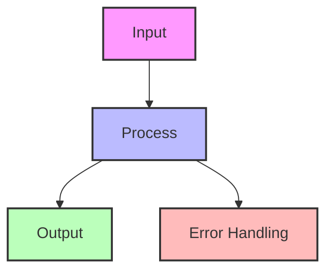

## Essential Question
## When to Use / When NOT to Use

### When to Use

| Scenario | Why It Fits | Alternative If Not |
|----------|-------------|-------------------|
| High availability required | Pattern provides resilience | Consider simpler approach |
| Scalability is critical | Handles load distribution | Monolithic might suffice |
| Distributed coordination needed | Manages complexity | Centralized coordination |

### When NOT to Use

| Scenario | Why to Avoid | Better Alternative |
|----------|--------------|-------------------|
| Simple applications | Unnecessary complexity | Direct implementation |
| Low traffic systems | Overhead not justified | Basic architecture |
| Limited resources | High operational cost | Simpler patterns |
**How do we coordinate distributed components effectively using state watch (change notification) pattern?**

# State Watch (Change Notification) Pattern

**Distributed mechanism for monitoring state changes and notifying interested parties in real-time**

> *"In distributed systems, the most important events are the ones you're not watching for—until you are."*

---

## Level 1: Intuition

### Core Concept

State Watch enables clients to register interest in specific state changes and receive notifications when those changes occur, eliminating the need for constant polling:

### Real-World Analogies

| Analogy | Watch Mechanism | Notification |
|---------|----------------|--------------|
| **News Alerts** | Subscribe to topics | Push notifications |
| **Stock Trading** | Watch price thresholds | Instant alerts |
| **Security Cameras** | Motion detection | Alarm triggers |
| **Email Filters** | Inbox rules | New mail notification |

### Basic Implementation

### ZooKeeper-Style Watches

### Watch Coalescing

---

## Level 4: Expert

### Production Implementation Patterns

#### Service Discovery via Watches

#### Watch vs Polling Trade-off

### Future Directions

1. **Predictive Watches**: ML-based prediction of which watches will fire
2. **Quantum State Observation**: Quantum-safe distributed state observation
3. **Edge Watch Networks**: Hierarchical watch networks for edge computing
4. **Blockchain Event Logs**: Immutable watch event history

---

## Quick Reference

### Watch Pattern Selection

| Use Case | Pattern | Rationale |
|----------|---------|-----------|
| **Config Management** | Persistent watch | Long-lived, infrequent changes |
| **Service Discovery** | Recursive watch | Monitor service tree |
| **Leader Election** | One-time watch | Single event matters |
| **Distributed Lock** | Ephemeral watch | Auto-cleanup critical |
| **Cache Invalidation** | Filtered watch | Only specific changes |

#
## Decision Matrix

### Quick Decision Table

| Factor | Low Complexity | Medium Complexity | High Complexity |
|--------|----------------|-------------------|-----------------|
| Team Size | < 5 developers | 5-20 developers | > 20 developers |
| Traffic | < 1K req/s | 1K-100K req/s | > 100K req/s |
| Data Volume | < 1GB | 1GB-1TB | > 1TB |
| **Recommendation** | ❌ Avoid | ⚠️ Consider | ✅ Implement |

## Implementation Checklist

- [ ] Choose watch type (one-time vs persistent)
- [ ] Define watch granularity (exact vs prefix/recursive)
- [ ] Implement connection management
- [ ] Handle watch event coalescing
- [ ] Add backpressure controls
- [ ] Plan for scale (watch proxies)
- [ ] Monitor watch overhead metrics
- [ ] Test disconnection scenarios
- [ ] Implement watch lease/timeout
- [ ] Document watch semantics

### Common Pitfalls

| Pitfall | Impact | Solution |
|---------|--------|----------|
| **Watch Storms** | System overload | Coalescing, rate limiting |
| **Leaked Watches** | Memory exhaustion | Automatic expiration |
| **Herd Effect** | Thundering herd | Randomized delays |
| **Watch Loops** | Infinite notifications | Loop detection |
| **Silent Failures** | Missed updates | Heartbeat verification |

---

## Related Patterns

- [Distributed Lock](distributed-lock.md) - Often uses watches for efficiency
- [Leader Election](leader-election.md) - Watches detect leader changes
- [Service Discovery](service-discovery.md) - Real-time service updates
- [Consensus](consensus.md) - Watch for consensus state changes
- [Event Sourcing](event-sourcing.md) - Alternative to state watching

---

*"In distributed systems, the observer affects the observed—design your watches accordingly."*

