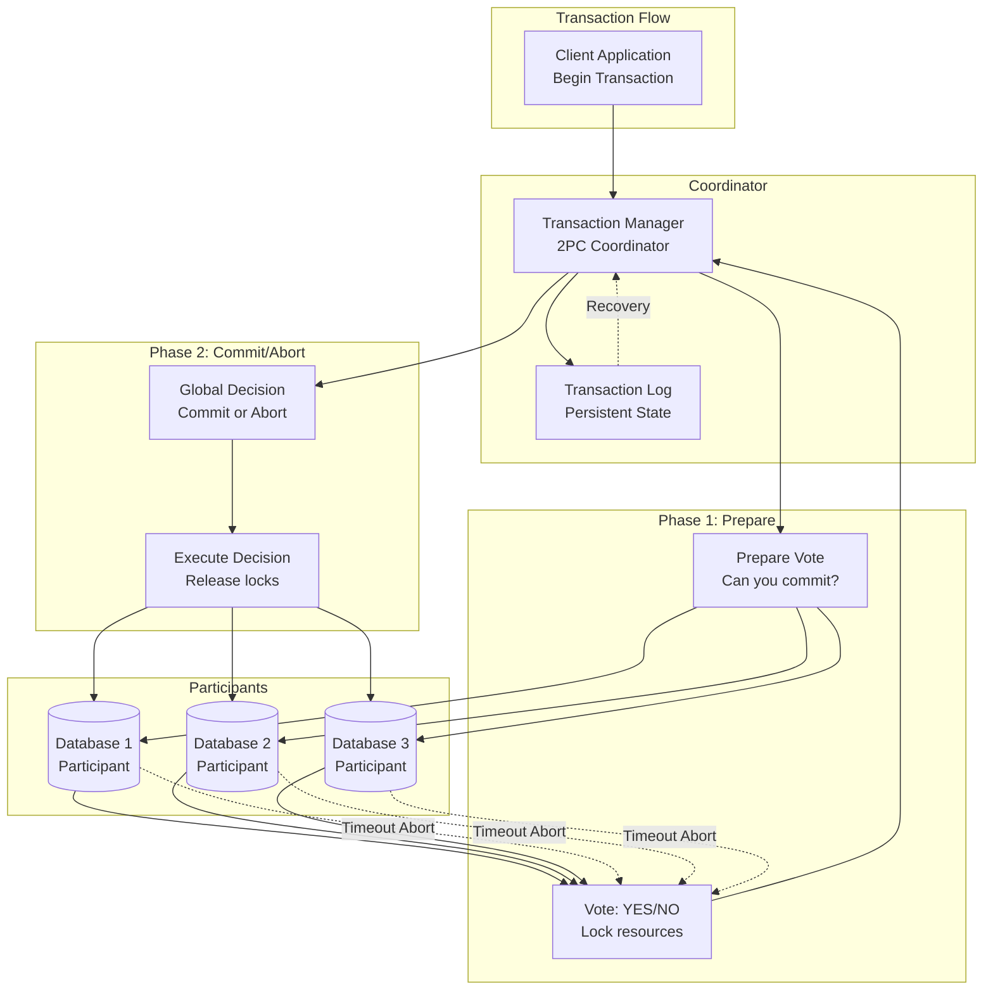

## The Complete Blueprint

Two-Phase Commit (2PC) is a distributed transaction coordination protocol that ensures atomic commits across multiple database systems, guaranteeing that all participants either commit or abort together to maintain ACID properties. This pattern addresses the fundamental challenge of distributed transactions: how to ensure consistency when an operation spans multiple independent systems that may fail independently. The protocol operates through a coordinator that manages two distinct phases: the prepare phase (where all participants vote on whether they can commit) and the commit phase (where the actual commit or abort happens based on unanimous agreement). The key insight is that by separating the voting phase from the action phase, 2PC can handle individual participant failures while maintaining consistency, though it suffers from blocking behavior when the coordinator fails.



### What You'll Master

- **Distributed transaction coordination**: Implement coordinators that reliably manage multi-database transactions with proper failure handling
- **Participant resource management**: Design systems that can prepare, vote, and execute transaction decisions while managing locks and timeouts
- **Recovery and failure handling**: Build robust recovery mechanisms that handle coordinator and participant failures without data corruption
- **Performance optimization**: Understand when to use 2PC versus alternatives like saga patterns based on consistency and availability requirements

# Two-Phase Commit (2PC)

!!! info "Pattern Overview"
    **Category**: coordination  
    **Complexity**: Medium  
    **Use Cases**: distributed transactions, data consistency, financial systems

## Problem

Maintaining ACID properties across multiple distributed systems requires coordination to ensure all participants either commit or abort together. Without proper coordination, partial failures can lead to inconsistent state.

## Solution

2PC uses a coordinator to manage a two-phase protocol: prepare phase (vote to commit) and commit phase (actual commit). All participants must agree before any commits, ensuring atomicity across distributed resources.

## Implementation

```python
## Example implementation
class TwoPhaseCommitCoordinator:
    def __init__(self):
        pass
    
    def execute(self):
        # Implementation details
        pass
```

## Trade-offs

**Pros:**
- Provides strong consistency guarantees
- Enables ACID transaction support
- Improves well-understood semantics

**Cons:**
- Increases blocking on coordinator failure
- Requires high latency overhead
- May impact poor scalability

## When to Use

- When you need financial transactions
- For systems that require strong consistency requirements
- In scenarios with small-scale distributed systems

## Related Patterns

- [Pattern 1](../related-pattern-1.md) - Complementary pattern
- [Pattern 2](../related-pattern-2.md) - Alternative approach
- [Pattern 3](../related-pattern-3.md) - Building block pattern

## References

- [External Resource 1](#)
- [External Resource 2](#)
- [Case Study Example](../../architects-handbook/case-studies/example.md)
