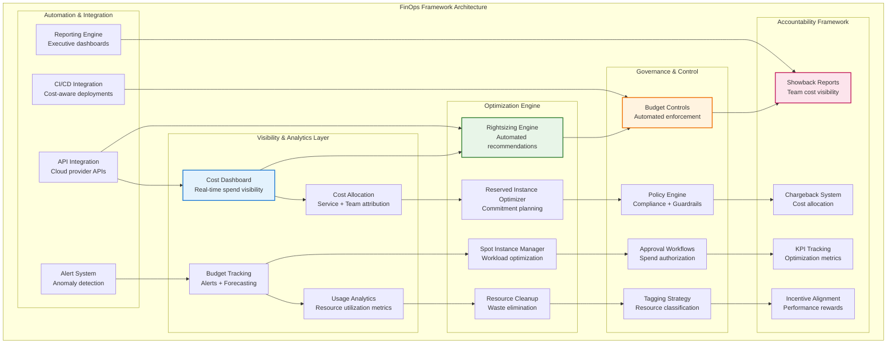

# FinOps

## The Complete Blueprint

FinOps (Financial Operations) transforms cloud cost management from reactive firefighting into proactive financial optimization through cultural practices, automated tools, and continuous accountability. This pattern establishes a comprehensive framework for managing cloud finances that combines engineering expertise with financial discipline, creating visibility into every dollar spent while enabling teams to make informed trade-offs between cost, performance, and features. Unlike traditional IT cost management, FinOps emphasizes real-time visibility, automated optimization, and shared responsibility across engineering, finance, and leadership teams to create a culture where cost optimization is embedded into daily operational practices.



### What You'll Master

By implementing FinOps, you'll achieve:

- **Dramatic Cost Savings**: Achieve 20-40% cost reduction through automated rightsizing, spot instance optimization, reserved instance planning, and waste elimination across your cloud infrastructure
- **Complete Financial Visibility**: Gain real-time insights into every dollar spent with detailed cost allocation, forecasting, and budget tracking that enables data-driven infrastructure decisions
- **Organizational Cost Accountability**: Establish showback and chargeback systems that make every team financially responsible for their infrastructure usage, driving natural cost optimization behaviors
- **Automated Optimization**: Deploy intelligent cost optimization engines that continuously rightsize resources, manage commitments, and eliminate waste without manual intervention
- **Executive Financial Control**: Provide leadership with comprehensive cost dashboards, forecasting models, and optimization ROI tracking that enables strategic infrastructure investment decisions

## Table of Contents

## Problem

Cloud costs can spiral out of control without proper governance. Teams lack visibility into spending, resources are over-provisioned, and there is no accountability for cost optimization.

## Solution

FinOps combines financial accountability with operational excellence. It provides cost visibility, optimization recommendations, budget controls, and cultural practices for cost-conscious engineering.

## Implementation

```python
## Example implementation
class FinOpsManager:
    def __init__(self):
        pass
    
    def execute(self):
        # Implementation details
        pass
```

## Trade-offs

**Pros:**
- Provides cost transparency
- Enables proactive optimization
- Improves financial accountability

**Cons:**
- Increases operational overhead
- Requires cultural change requirements
- May impact tooling investments

## When to Use

- When you need cloud-native organizations
- For systems that require cost optimization initiatives
- In scenarios with budget governance needs

## Related Patterns

- [Pattern 1](../related-pattern-1.md) - Complementary pattern
- [Pattern 2](../related-pattern-2.md) - Alternative approach
- [Pattern 3](../related-pattern-3.md) - Building block pattern

## References

- [External Resource 1](#)
- [External Resource 2](#)
- [Case Study Example](../../architects-handbook/case-studies/example.md)
