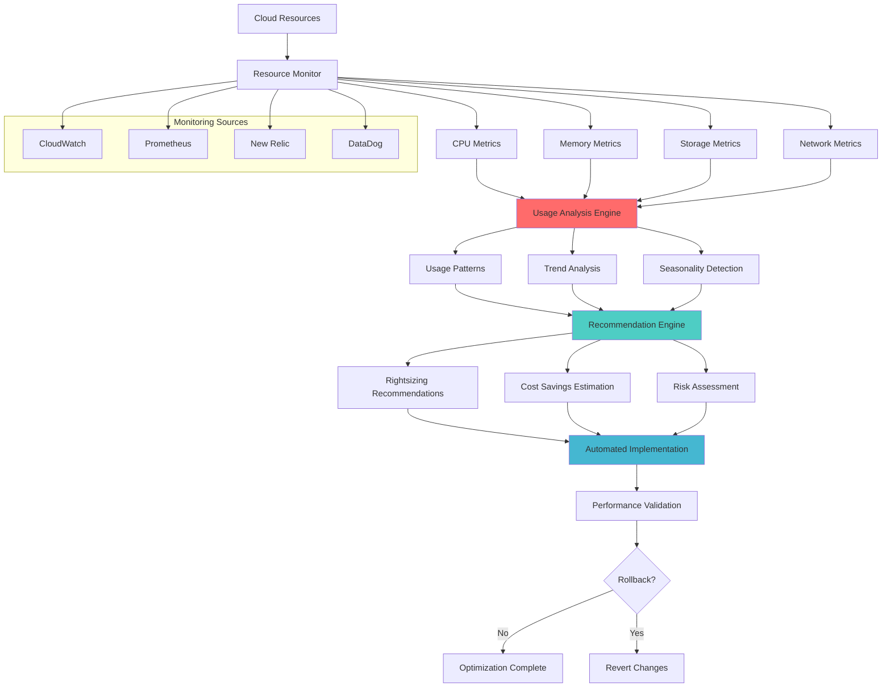

# Resource Rightsizing

## Problem Statement

Cloud resources are often over-provisioned due to uncertain demand, safety margins, and lack of visibility into actual usage patterns. This leads to significant cost waste - studies show 35-45% of cloud spend goes to unused or underutilized resources.

**Real-World Impact**: Capital One reduced their AWS costs by $100M+ through systematic rightsizing, achieving 40% cost reduction while improving performance through better resource matching.

## Solution Overview

Resource Rightsizing continuously analyzes resource utilization patterns and automatically optimizes resource allocation through:
- Real-time performance monitoring and analysis
- Automated recommendation generation
- Risk-assessed optimization implementation
- Continuous learning and adjustment
- Multi-dimensional optimization (CPU, memory, storage, network)



## Architecture Components

### 1. Monitoring and Data Collection
```yaml
Metrics Collection:
  Infrastructure Metrics:
    - CPU utilization (average, peak, percentiles)
    - Memory usage (used, available, swap)
    - Disk I/O (IOPS, throughput, queue depth)
    - Network I/O (bandwidth, packets, connections)
  
  Application Metrics:
    - Response times and latencies
    - Request rates and throughput
    - Error rates and success rates
    - Business metrics (transactions, users)
  
  Cost Metrics:
    - Resource costs (compute, storage, network)
    - Reserved instance utilization
    - Spot instance savings
    - Cost per unit of business value

Data Sources:
  - Cloud provider metrics (CloudWatch, Azure Monitor, GCP Monitoring)
  - Application Performance Monitoring (APM) tools
  - Custom application metrics
  - Business intelligence systems
```

### 2. Analysis Engine
```yaml
Analysis Capabilities:
  Statistical Analysis:
    - Time series analysis for trend identification
    - Seasonal decomposition for cyclical patterns
    - Anomaly detection for usage spikes
    - Correlation analysis between metrics
  
  Machine Learning:
    - Usage pattern clustering
    - Demand forecasting models
    - Recommendation scoring algorithms
    - Risk prediction models
  
  Performance Modeling:
    - Resource utilization curves
    - Performance threshold identification
    - Capacity headroom calculations
    - SLA compliance analysis
```

### 3. Recommendation System
```yaml
Recommendation Types:
  Vertical Scaling:
    - Instance type changes (CPU/memory ratio optimization)
    - Storage type optimization (SSD vs HDD)
    - Network performance adjustments
    - Specialized instance recommendations
  
  Horizontal Scaling:
    - Auto-scaling configuration optimization
    - Load distribution improvements
    - Service mesh optimization
    - Container resource limits
  
  Resource Consolidation:
    - Workload co-location opportunities
    - Resource pooling strategies
    - Multi-tenancy optimizations
    - Serverless migration recommendations
```

## Implementation Guide

### Phase 1: Monitoring Infrastructure (Weeks 1-2)

1. **CloudWatch Enhanced Monitoring**
```python
# enhanced_monitoring.py
import boto3
import time
from datetime import datetime, timedelta
from typing import Dict, List, Any
from dataclasses import dataclass
from concurrent.futures import ThreadPoolExecutor, as_completed

@dataclass
class ResourceMetrics:
    resource_id: str
    resource_type: str
    region: str
    metrics: Dict[str, float]
    timestamp: datetime
    tags: Dict[str, str]

class EnhancedResourceMonitor:
    def __init__(self, regions: List[str] = None):
        self.regions = regions or ['us-west-2', 'us-east-1']
        self.cloudwatch_clients = {
            region: boto3.client('cloudwatch', region_name=region)
            for region in self.regions
        }
        self.ec2_clients = {
            region: boto3.client('ec2', region_name=region)
            for region in self.regions
        }
        self.rds_clients = {
            region: boto3.client('rds', region_name=region)
            for region in self.regions
        }
    
    def collect_ec2_metrics(self, days: int = 14) -> List[ResourceMetrics]:
        """
        Collect comprehensive EC2 metrics for rightsizing analysis
        """
        all_metrics = []
        
        with ThreadPoolExecutor(max_workers=len(self.regions)) as executor:
            futures = {
                executor.submit(self._collect_region_ec2_metrics, region, days): region
                for region in self.regions
            }
            
            for future in as_completed(futures):
                region = futures[future]
                try:
                    region_metrics = future.result()
                    all_metrics.extend(region_metrics)
                except Exception as e:
                    print(f"Error collecting metrics for region {region}: {e}")
        
        return all_metrics
    
    def _collect_region_ec2_metrics(self, region: str, days: int) -> List[ResourceMetrics]:
        """
        Collect EC2 metrics for a specific region
        """
        ec2_client = self.ec2_clients[region]
        cloudwatch_client = self.cloudwatch_clients[region]
        
        # Get all running instances
        instances = self._get_running_instances(ec2_client)
        instance_metrics = []
        
        for instance in instances:
            try:
                metrics = self._get_instance_detailed_metrics(
                    cloudwatch_client, instance['InstanceId'], days
                )
                
                instance_metrics.append(ResourceMetrics(
                    resource_id=instance['InstanceId'],
                    resource_type='ec2-instance',
                    region=region,
                    metrics=metrics,
                    timestamp=datetime.utcnow(),
                    tags={tag['Key']: tag['Value'] for tag in instance.get('Tags', [])}
                ))
                
            except Exception as e:
                print(f"Error collecting metrics for instance {instance['InstanceId']}: {e}")
        
        return instance_metrics
    
    def _get_running_instances(self, ec2_client) -> List[Dict]:
        """
        Get all running EC2 instances
        """
        try:
            response = ec2_client.describe_instances(
                Filters=[
                    {'Name': 'instance-state-name', 'Values': ['running']}
                ]
            )
            
            instances = []
            for reservation in response['Reservations']:
                instances.extend(reservation['Instances'])
            
            return instances
            
        except Exception as e:
            print(f"Error getting running instances: {e}")
            return []
    
    def _get_instance_detailed_metrics(self, 
                                     cloudwatch_client, 
                                     instance_id: str, 
                                     days: int) -> Dict[str, float]:
        """
        Get detailed metrics for an EC2 instance
        """
        end_time = datetime.utcnow()
        start_time = end_time - timedelta(days=days)
        
        metrics_to_collect = {
            'CPUUtilization': {'statistic': 'Average', 'unit': 'Percent'},
            'CPUUtilization_Max': {'statistic': 'Maximum', 'unit': 'Percent'},
            'CPUUtilization_P95': {'statistic': 'p95', 'unit': 'Percent'},
            'NetworkIn': {'statistic': 'Average', 'unit': 'Bytes'},
            'NetworkOut': {'statistic': 'Average', 'unit': 'Bytes'},
            'NetworkPacketsIn': {'statistic': 'Average', 'unit': 'Count'},
            'NetworkPacketsOut': {'statistic': 'Average', 'unit': 'Count'},
            'DiskReadBytes': {'statistic': 'Average', 'unit': 'Bytes'},
            'DiskWriteBytes': {'statistic': 'Average', 'unit': 'Bytes'},
            'DiskReadOps': {'statistic': 'Average', 'unit': 'Count'},
            'DiskWriteOps': {'statistic': 'Average', 'unit': 'Count'}
        }
        
        collected_metrics = {}
        
        for metric_name, config in metrics_to_collect.items():
            try:
                # Handle percentile metrics differently
                base_metric = metric_name.split('_')[0]
                statistic = config['statistic']
                
                if statistic.startswith('p'):
                    # Extended statistic (percentile)
                    response = cloudwatch_client.get_metric_statistics(
                        Namespace='AWS/EC2',
                        MetricName=base_metric,
                        Dimensions=[
                            {'Name': 'InstanceId', 'Value': instance_id}
                        ],
                        StartTime=start_time,
                        EndTime=end_time,
                        Period=3600,  # 1 hour periods
                        ExtendedStatistics=[statistic]
                    )
                    
                    if response['Datapoints']:
                        values = [dp['ExtendedStatistics'][statistic] for dp in response['Datapoints']]
                        collected_metrics[metric_name] = sum(values) / len(values)
                    else:
                        collected_metrics[metric_name] = 0.0
                
                else:
                    # Standard statistic
                    response = cloudwatch_client.get_metric_statistics(
                        Namespace='AWS/EC2',
                        MetricName=base_metric,
                        Dimensions=[
                            {'Name': 'InstanceId', 'Value': instance_id}
                        ],
                        StartTime=start_time,
                        EndTime=end_time,
                        Period=3600,  # 1 hour periods
                        Statistics=[statistic],
                        Unit=config['unit']
                    )
                    
                    if response['Datapoints']:
                        values = [dp[statistic] for dp in response['Datapoints']]
                        collected_metrics[metric_name] = sum(values) / len(values)
                    else:
                        collected_metrics[metric_name] = 0.0
                        
            except Exception as e:
                print(f"Error collecting {metric_name} for {instance_id}: {e}")
                collected_metrics[metric_name] = 0.0
        
        # Get memory metrics if CloudWatch Agent is installed
        try:
            memory_response = cloudwatch_client.get_metric_statistics(
                Namespace='CWAgent',
                MetricName='mem_used_percent',
                Dimensions=[
                    {'Name': 'InstanceId', 'Value': instance_id}
                ],
                StartTime=start_time,
                EndTime=end_time,
                Period=3600,
                Statistics=['Average', 'Maximum']
            )
            
            if memory_response['Datapoints']:
                values = [dp['Average'] for dp in memory_response['Datapoints']]
                max_values = [dp['Maximum'] for dp in memory_response['Datapoints']]
                collected_metrics['MemoryUtilization'] = sum(values) / len(values)
                collected_metrics['MemoryUtilization_Max'] = max(max_values)
            
        except:
            # Memory metrics not available
            collected_metrics['MemoryUtilization'] = 0.0
            collected_metrics['MemoryUtilization_Max'] = 0.0
        
        return collected_metrics
    
    def export_metrics_to_s3(self, metrics: List[ResourceMetrics], bucket: str, key_prefix: str):
        """
        Export collected metrics to S3 for analysis
        """
        s3_client = boto3.client('s3')
        
        # Group metrics by date
        metrics_by_date = {}
        for metric in metrics:
            date_key = metric.timestamp.strftime('%Y-%m-%d')
            if date_key not in metrics_by_date:
                metrics_by_date[date_key] = []
            metrics_by_date[date_key].append(metric)
        
        # Export each date as separate file
        for date_key, date_metrics in metrics_by_date.items():
            try:
                # Convert to serializable format
                export_data = []
                for metric in date_metrics:
                    export_data.append({
                        'resource_id': metric.resource_id,
                        'resource_type': metric.resource_type,
                        'region': metric.region,
                        'metrics': metric.metrics,
                        'timestamp': metric.timestamp.isoformat(),
                        'tags': metric.tags
                    })
                
                # Upload to S3
                s3_key = f"{key_prefix}/date={date_key}/metrics.json"
                s3_client.put_object(
                    Bucket=bucket,
                    Key=s3_key,
                    Body=json.dumps(export_data, indent=2),
                    ContentType='application/json'
                )
                
                print(f"Exported {len(date_metrics)} metrics for {date_key} to s3:/{bucket}/{s3_key}")
                
            except Exception as e:
                print(f"Error exporting metrics for {date_key}: {e}")

# Usage example
if __name__ == "__main__":
    monitor = EnhancedResourceMonitor(['us-west-2', 'us-east-1'])
    
    print("Collecting EC2 metrics...")
    metrics = monitor.collect_ec2_metrics(days=14)
    
    print(f"Collected metrics for {len(metrics)} instances")
    
    # Show sample metrics
    for metric in metrics[:3]:
        print(f"\nInstance: {metric.resource_id} ({metric.region})")
        print(f"  CPU Avg: {metric.metrics.get('CPUUtilization', 0):.2f}%")
        print(f"  CPU Max: {metric.metrics.get('CPUUtilization_Max', 0):.2f}%")
        print(f"  Memory Avg: {metric.metrics.get('MemoryUtilization', 0):.2f}%")
        print(f"  Network In: {metric.metrics.get('NetworkIn', 0):.0f} bytes/hour")
    
    # Export to S3 for analysis
    # monitor.export_metrics_to_s3(metrics, 'my-metrics-bucket', 'rightsizing-data')
```

2. **Prometheus Integration**
```yaml
# prometheus-rightsizing-rules.yaml
groups:
  - name: rightsizing.rules
    rules:
    # CPU utilization rules
    - record: instance:cpu_utilization:rate5m
      expr: 100 - (avg by (instance) (rate(node_cpu_seconds_total{mode="idle"}[5m])) * 100)
    
    - record: instance:cpu_utilization:avg_over_time_14d
      expr: avg_over_time(instance:cpu_utilization:rate5m[14d])
    
    - record: instance:cpu_utilization:max_over_time_14d
      expr: max_over_time(instance:cpu_utilization:rate5m[14d])
    
    - record: instance:cpu_utilization:quantile_95_14d
      expr: quantile_over_time(0.95, instance:cpu_utilization:rate5m[14d])
    
    # Memory utilization rules
    - record: instance:memory_utilization:ratio
      expr: |
        (
          node_memory_MemTotal_bytes - node_memory_MemAvailable_bytes
        ) / node_memory_MemTotal_bytes * 100
    
    - record: instance:memory_utilization:avg_over_time_14d
      expr: avg_over_time(instance:memory_utilization:ratio[14d])
    
    - record: instance:memory_utilization:max_over_time_14d
      expr: max_over_time(instance:memory_utilization:ratio[14d])
    
    # Network utilization rules
    - record: instance:network_receive_bytes:rate5m
      expr: sum by (instance) (rate(node_network_receive_bytes_total{device!="lo"}[5m]))
    
    - record: instance:network_transmit_bytes:rate5m
      expr: sum by (instance) (rate(node_network_transmit_bytes_total{device!="lo"}[5m]))
    
    # Disk utilization rules
    - record: instance:disk_io_read_bytes:rate5m
      expr: sum by (instance) (rate(node_disk_read_bytes_total[5m]))
    
    - record: instance:disk_io_write_bytes:rate5m
      expr: sum by (instance) (rate(node_disk_written_bytes_total[5m]))
    
    # Rightsizing recommendation alerts
    - alert: CPUOverProvisioned
      expr: instance:cpu_utilization:quantile_95_14d < 20
      for: 1h
      labels:
        severity: info
        recommendation: downsize
      annotations:
        summary: "Instance {{ $labels.instance }} is over-provisioned (CPU)"
        description: "CPU utilization 95th percentile over 14 days is {{ $value }}%, suggesting downsizing opportunity"
    
    - alert: CPUUnderProvisioned
      expr: instance:cpu_utilization:quantile_95_14d > 80
      for: 30m
      labels:
        severity: warning
        recommendation: upsize
      annotations:
        summary: "Instance {{ $labels.instance }} may be under-provisioned (CPU)"
        description: "CPU utilization 95th percentile over 14 days is {{ $value }}%, consider upsizing"
    
    - alert: MemoryOverProvisioned
      expr: instance:memory_utilization:max_over_time_14d < 30
      for: 1h
      labels:
        severity: info
        recommendation: downsize
      annotations:
        summary: "Instance {{ $labels.instance }} is over-provisioned (Memory)"
        description: "Memory utilization maximum over 14 days is {{ $value }}%, suggesting downsizing opportunity"
    
    - alert: MemoryUnderProvisioned
      expr: instance:memory_utilization:max_over_time_14d > 85
      for: 30m
      labels:
        severity: warning
        recommendation: upsize
      annotations:
        summary: "Instance {{ $labels.instance }} may be under-provisioned (Memory)"
        description: "Memory utilization maximum over 14 days is {{ $value }}%, consider upsizing"
```

### Phase 2: Analysis and Recommendation Engine (Weeks 3-4)

1. **Rightsizing Analysis Engine**
```python
# rightsizing_analyzer.py
import pandas as pd
import numpy as np
from typing import Dict, List, Tuple, Optional
from dataclasses import dataclass
from sklearn.cluster import KMeans
from sklearn.preprocessing import StandardScaler
from datetime import datetime, timedelta
import json

@dataclass
class RightsizingRecommendation:
    resource_id: str
    current_instance_type: str
    recommended_instance_type: str
    confidence_score: float
    potential_savings: float
    potential_savings_percentage: float
    risk_assessment: str
    reasoning: List[str]
    metrics_analysis: Dict[str, any]
    implementation_priority: str

class RightsizingAnalyzer:
    def __init__(self):
        self.instance_specs = self._load_instance_specifications()
        self.pricing_data = self._load_pricing_data()
    
    def analyze_resources(self, metrics_data: List[Dict]) -> List[RightsizingRecommendation]:
        """
        Analyze resource metrics and generate rightsizing recommendations
        """
        recommendations = []
        
        # Convert metrics to DataFrame for analysis
        df = self._prepare_metrics_dataframe(metrics_data)
        
        for _, row in df.iterrows():
            try:
                recommendation = self._analyze_single_resource(row)
                if recommendation:
                    recommendations.append(recommendation)
            except Exception as e:
                print(f"Error analyzing resource {row.get('resource_id', 'unknown')}: {e}")
        
        # Sort by potential savings
        recommendations.sort(key=lambda x: x.potential_savings, reverse=True)
        
        return recommendations
    
    def _prepare_metrics_dataframe(self, metrics_data: List[Dict]) -> pd.DataFrame:
        """
        Convert metrics data to pandas DataFrame
        """
        flattened_data = []
        
        for metric in metrics_data:
            flat_row = {
                'resource_id': metric['resource_id'],
                'resource_type': metric['resource_type'],
                'region': metric['region'],
                'timestamp': metric['timestamp']
            }
            
            # Flatten metrics
            flat_row.update(metric['metrics'])
            
            # Add tags
            for key, value in metric.get('tags', {}).items():
                flat_row[f'tag_{key}'] = value
            
            flattened_data.append(flat_row)
        
        return pd.DataFrame(flattened_data)
    
    def _analyze_single_resource(self, resource_metrics: pd.Series) -> Optional[RightsizingRecommendation]:
        """
        Analyze a single resource and generate recommendation
        """
        resource_id = resource_metrics['resource_id']
        current_instance_type = resource_metrics.get('tag_InstanceType', 'unknown')
        
        if current_instance_type == 'unknown':
            return None
        
        # Get current instance specifications
        current_spec = self.instance_specs.get(current_instance_type)
        if not current_spec:
            return None
        
        # Analyze utilization patterns
        utilization_analysis = self._analyze_utilization_patterns(resource_metrics)
        
        # Find optimal instance type
        recommended_instance, confidence = self._find_optimal_instance_type(
            utilization_analysis, current_spec
        )
        
        if recommended_instance == current_instance_type:
            return None  # No change needed
        
        # Calculate cost savings
        current_cost = self._get_instance_cost(current_instance_type, resource_metrics['region'])
        recommended_cost = self._get_instance_cost(recommended_instance, resource_metrics['region'])
        
        if current_cost <= 0 or recommended_cost <= 0:
            return None
        
        potential_savings = current_cost - recommended_cost
        savings_percentage = (potential_savings / current_cost) * 100
        
        # Risk assessment
        risk_assessment = self._assess_risk(
            utilization_analysis, current_spec, self.instance_specs[recommended_instance]
        )
        
        # Generate reasoning
        reasoning = self._generate_reasoning(
            utilization_analysis, current_instance_type, recommended_instance
        )
        
        # Determine implementation priority
        priority = self._determine_priority(potential_savings, risk_assessment, confidence)
        
        return RightsizingRecommendation(
            resource_id=resource_id,
            current_instance_type=current_instance_type,
            recommended_instance_type=recommended_instance,
            confidence_score=confidence,
            potential_savings=potential_savings,
            potential_savings_percentage=savings_percentage,
            risk_assessment=risk_assessment,
            reasoning=reasoning,
            metrics_analysis=utilization_analysis,
            implementation_priority=priority
        )
    
    def _analyze_utilization_patterns(self, metrics: pd.Series) -> Dict[str, any]:
        """
        Analyze resource utilization patterns
        """
        cpu_avg = metrics.get('CPUUtilization', 0)
        cpu_max = metrics.get('CPUUtilization_Max', 0)
        cpu_p95 = metrics.get('CPUUtilization_P95', 0)
        
        memory_avg = metrics.get('MemoryUtilization', 0)
        memory_max = metrics.get('MemoryUtilization_Max', 0)
        
        network_in = metrics.get('NetworkIn', 0)
        network_out = metrics.get('NetworkOut', 0)
        
        disk_read = metrics.get('DiskReadBytes', 0)
        disk_write = metrics.get('DiskWriteBytes', 0)
        
        return {
            'cpu': {
                'average': cpu_avg,
                'maximum': cpu_max,
                'p95': cpu_p95,
                'utilization_category': self._categorize_utilization(cpu_p95)
            },
            'memory': {
                'average': memory_avg,
                'maximum': memory_max,
                'utilization_category': self._categorize_utilization(memory_max)
            },
            'network': {
                'total_bytes_per_hour': network_in + network_out,
                'intensity': 'low' if (network_in + network_out) < 1000000 else 'high'
            },
            'disk': {
                'total_bytes_per_hour': disk_read + disk_write,
                'intensity': 'low' if (disk_read + disk_write) < 10000000 else 'high'
            }
        }
    
    def _categorize_utilization(self, utilization: float) -> str:
        """
        Categorize utilization level
        """
        if utilization < 20:
            return 'very_low'
        elif utilization < 40:
            return 'low'
        elif utilization < 60:
            return 'moderate'
        elif utilization < 80:
            return 'high'
        else:
            return 'very_high'
    
    def _find_optimal_instance_type(self, 
                                   utilization: Dict, 
                                   current_spec: Dict) -> Tuple[str, float]:
        """
        Find optimal instance type based on utilization patterns
        """
        cpu_requirement = max(utilization['cpu']['p95'] * 1.2, 20)  # 20% headroom, min 20%
        memory_requirement = max(utilization['memory']['maximum'] * 1.1, 30)  # 10% headroom, min 30%
        
        # Network and disk requirements (simplified)
        network_requirement = 'high' if utilization['network']['intensity'] == 'high' else 'moderate'
        disk_requirement = 'high' if utilization['disk']['intensity'] == 'high' else 'moderate'
        
        best_instance = current_spec['instance_type']
        best_score = 0
        
        # Evaluate all instance types in the same family
        current_family = current_spec['family']
        
        for instance_type, spec in self.instance_specs.items():
            if spec['family'] != current_family:
                continue
            
            score = self._score_instance_fit(
                spec, cpu_requirement, memory_requirement, 
                network_requirement, disk_requirement
            )
            
            if score > best_score:
                best_instance = instance_type
                best_score = score
        
        # If no improvement in same family, check other families
        if best_instance == current_spec['instance_type']:
            for instance_type, spec in self.instance_specs.items():
                score = self._score_instance_fit(
                    spec, cpu_requirement, memory_requirement,
                    network_requirement, disk_requirement
                )
                
                if score > best_score:
                    best_instance = instance_type
                    best_score = score
        
        confidence = min(best_score / 100, 1.0)  # Normalize to 0-1
        return best_instance, confidence
    
    def _score_instance_fit(self, 
                           spec: Dict, 
                           cpu_req: float, 
                           memory_req: float,
                           network_req: str, 
                           disk_req: str) -> float:
        """
        Score how well an instance type fits requirements
        """
        score = 0
        
        # CPU score (prefer instances that meet requirement without too much overhead)
        cpu_ratio = spec['vcpu_equivalent'] * 100 / cpu_req  # Approximate CPU capacity
        if cpu_ratio >= 1.0 and cpu_ratio <= 2.0:  # Good fit
            score += 40
        elif cpu_ratio >= 0.8:  # Adequate
            score += 30
        elif cpu_ratio >= 2.0 and cpu_ratio <= 3.0:  # Over-provisioned but acceptable
            score += 20
        else:
            score += 0  # Poor fit
        
        # Memory score
        memory_gb_equivalent = spec['memory_gb'] * 100 / memory_req
        if memory_gb_equivalent >= 1.0 and memory_gb_equivalent <= 2.0:
            score += 40
        elif memory_gb_equivalent >= 0.8:
            score += 30
        elif memory_gb_equivalent >= 2.0 and memory_gb_equivalent <= 3.0:
            score += 20
        else:
            score += 0
        
        # Network performance score
        if network_req == 'high' and spec['network_performance'] in ['high', 'up_to_25_gigabit', '100_gigabit']:
            score += 10
        elif network_req == 'moderate' and spec['network_performance'] != 'low':
            score += 10
        
        # Storage performance score
        if disk_req == 'high' and spec.get('ebs_optimized', False):
            score += 10
        
        return score
    
    def _assess_risk(self, utilization: Dict, current_spec: Dict, new_spec: Dict) -> str:
        """
        Assess risk of changing instance type
        """
        risk_factors = []
        
        # CPU risk
        if utilization['cpu']['p95'] > 70 and new_spec['vcpu_equivalent'] < current_spec['vcpu_equivalent']:
            risk_factors.append('high_cpu_utilization_with_downgrade')
        
        # Memory risk
        if utilization['memory']['maximum'] > 80 and new_spec['memory_gb'] < current_spec['memory_gb']:
            risk_factors.append('high_memory_utilization_with_downgrade')
        
        # Network risk
        if (utilization['network']['intensity'] == 'high' and 
            new_spec['network_performance'] == 'low'):
            risk_factors.append('high_network_usage_with_low_performance')
        
        if not risk_factors:
            return 'low'
        elif len(risk_factors) == 1:
            return 'medium'
        else:
            return 'high'
    
    def _generate_reasoning(self, 
                          utilization: Dict, 
                          current_type: str, 
                          recommended_type: str) -> List[str]:
        """
        Generate human-readable reasoning for the recommendation
        """
        reasoning = []
        
        cpu_util = utilization['cpu']['p95']
        memory_util = utilization['memory']['maximum']
        
        if cpu_util < 30:
            reasoning.append(f"CPU utilization is low ({cpu_util:.1f}% at 95th percentile)")
        
        if memory_util < 40:
            reasoning.append(f"Memory utilization is low ({memory_util:.1f}% maximum)")
        
        current_spec = self.instance_specs.get(current_type, {})
        recommended_spec = self.instance_specs.get(recommended_type, {})
        
        if recommended_spec.get('vcpu_equivalent', 0) < current_spec.get('vcpu_equivalent', 0):
            reasoning.append("Recommended instance has fewer vCPUs but sufficient for workload")
        
        if recommended_spec.get('memory_gb', 0) < current_spec.get('memory_gb', 0):
            reasoning.append("Recommended instance has less memory but sufficient for workload")
        
        return reasoning
    
    def _determine_priority(self, savings: float, risk: str, confidence: float) -> str:
        """
        Determine implementation priority
        """
        if savings > 1000 and risk == 'low' and confidence > 0.8:
            return 'high'
        elif savings > 500 and risk in ['low', 'medium'] and confidence > 0.6:
            return 'medium'
        else:
            return 'low'
    
    def _get_instance_cost(self, instance_type: str, region: str) -> float:
        """
        Get hourly cost for instance type in region
        """
        # This would normally fetch from AWS Pricing API or cached pricing data
        return self.pricing_data.get(f"{region}:{instance_type}", 0.0)
    
    def _load_instance_specifications(self) -> Dict[str, Dict]:
        """
        Load instance specifications (normally from AWS API or cached data)
        """
        # Simplified example data
        return {
            'm5.large': {
                'instance_type': 'm5.large',
                'family': 'm5',
                'vcpu_equivalent': 2,
                'memory_gb': 8,
                'network_performance': 'up_to_10_gigabit',
                'ebs_optimized': True
            },
            'm5.xlarge': {
                'instance_type': 'm5.xlarge',
                'family': 'm5',
                'vcpu_equivalent': 4,
                'memory_gb': 16,
                'network_performance': 'up_to_10_gigabit',
                'ebs_optimized': True
            },
            'c5.large': {
                'instance_type': 'c5.large',
                'family': 'c5',
                'vcpu_equivalent': 2,
                'memory_gb': 4,
                'network_performance': 'up_to_10_gigabit',
                'ebs_optimized': True
            }
        }
    
    def _load_pricing_data(self) -> Dict[str, float]:
        """
        Load pricing data (normally from AWS Pricing API)
        """
        # Simplified example pricing (hourly rates)
        return {
            'us-west-2:m5.large': 0.096,
            'us-west-2:m5.xlarge': 0.192,
            'us-west-2:c5.large': 0.085,
            'us-east-1:m5.large': 0.096,
            'us-east-1:m5.xlarge': 0.192,
            'us-east-1:c5.large': 0.085
        }

# Usage example
if __name__ == "__main__":
    # Sample metrics data
    sample_metrics = [
        {
            'resource_id': 'i-1234567890abcdef0',
            'resource_type': 'ec2-instance',
            'region': 'us-west-2',
            'timestamp': '2024-01-01T12:00:00Z',
            'metrics': {
                'CPUUtilization': 15.5,
                'CPUUtilization_Max': 35.2,
                'CPUUtilization_P95': 25.8,
                'MemoryUtilization': 45.2,
                'MemoryUtilization_Max': 68.7,
                'NetworkIn': 5000000,
                'NetworkOut': 8000000,
                'DiskReadBytes': 2000000,
                'DiskWriteBytes': 3000000
            },
            'tags': {
                'InstanceType': 'm5.xlarge',
                'Environment': 'production',
                'Application': 'web-server'
            }
        }
    ]
    
    analyzer = RightsizingAnalyzer()
    recommendations = analyzer.analyze_resources(sample_metrics)
    
    for rec in recommendations:
        print(f"\nRecommendation for {rec.resource_id}:")
        print(f"  Current: {rec.current_instance_type}")
        print(f"  Recommended: {rec.recommended_instance_type}")
        print(f"  Potential savings: ${rec.potential_savings:.2f}/hour ({rec.potential_savings_percentage:.1f}%)")
        print(f"  Confidence: {rec.confidence_score:.2f}")
        print(f"  Risk: {rec.risk_assessment}")
        print(f"  Priority: {rec.implementation_priority}")
        print(f"  Reasoning: {', '.join(rec.reasoning)}")
```

## Real-World Examples

### Capital One Implementation
```yaml
Scale: 10,000+ instances across multiple regions
Components:
  - Custom rightsizing platform
  - ML-based usage prediction
  - Automated implementation pipeline
  - Cost tracking and attribution

Results:
  - $100M+ annual cost reduction
  - 40% improvement in resource utilization
  - 90% automation of rightsizing decisions
  - 15% performance improvement through better matching
```

### Lyft Implementation
```yaml
Scale: 5,000+ instances, microservices architecture
Components:
  - Kubernetes resource optimization
  - Historical performance analysis
  - Gradual rollout system
  - Cost impact tracking

Results:
  - 35% reduction in compute costs
  - 50% reduction in over-provisioning
  - <2% performance impact from optimizations
  - $20M+ annual savings
```

## Metrics and Success Criteria

### Optimization Metrics
```yaml
Resource Efficiency:
  - Average CPU utilization: 60-80%
  - Average memory utilization: 70-85%
  - Resource waste reduction: >40%
  - Right-sizing accuracy: >85%

Cost Metrics:
  - Cost reduction achieved: 25-50%
  - Cost per unit of work: 30-60% improvement
  - Wasted spend elimination: >80%
  - ROI on optimization efforts: >500%

Operational Metrics:
  - Recommendation accuracy: >90%
  - Implementation success rate: >95%
  - Time to implement: <24 hours
  - Rollback rate: <5%
```

### Performance Impact
```yaml
Application Performance:
  - Response time degradation: <5%
  - Throughput impact: <3%
  - Error rate increase: <1%
  - SLA compliance: >99%

System Reliability:
  - Availability impact: <0.1%
  - Failed optimizations: <5%
  - Recovery time: <15 minutes
  - Monitoring coverage: 100%
```

## Common Pitfalls and Solutions

### 1. Insufficient Historical Data
**Problem**: Making decisions based on limited data
**Solution**:
```yaml
Data Requirements:
  - Minimum 14 days of metrics
  - Include seasonal patterns (monthly/quarterly data)
  - Account for business cycle variations
  - Collect both peak and off-peak data

Data Quality:
  - Validate metric accuracy
  - Handle missing data points
  - Account for metric collection gaps
  - Use multiple data sources for validation
```

### 2. Ignoring Application-Specific Requirements
**Problem**: Performance degradation due to application constraints
**Solution**:
```yaml
Application Awareness:
  - Include application owners in optimization process
  - Understand performance requirements
  - Consider memory-intensive vs CPU-intensive workloads
  - Account for burst requirements

Testing Approach:
  - Start with non-critical workloads
  - Implement gradual rollouts
  - Monitor performance closely
  - Have rollback procedures ready
```

### 3. Over-Optimization
**Problem**: Reducing resources too aggressively
**Solution**:
```yaml
Conservative Approach:
  - Maintain adequate headroom (20-30%)
  - Consider growth projections
  - Account for traffic spikes
  - Implement monitoring alerts

Safety Measures:
  - Auto-scaling group integration
  - Performance monitoring
  - Automatic rollback triggers
  - Business impact assessment
```

## Related Patterns

- **Complementary**: [Spot Instance Management](spot-instance-management/) - Cost optimization through pricing
- **Complementary**: [Reserved Capacity Planning](reserved-capacity-planning/) - Long-term optimization
- **Building Block**: Auto Scaling for dynamic resource adjustment
- **Extension**: Multi-cloud resource optimization
- **Alternative**: Manual capacity planning (not scalable)

## Further Reading

- [AWS Well-Architected Cost Optimization](https:/docs.aws.amazon.com/wellarchitected/latest/cost-optimization-pillar/welcome.html/)
- [Google Cloud Rightsizing Recommendations](https:/cloud.google.com/compute/docs/instances/apply-sizing-recommendations/)
- [Azure Advisor Cost Recommendations](https:/docs.microsoft.com/en-us/azure/advisor/advisor-cost-recommendations/)
- [FinOps Foundation - Cloud Cost Optimization](https:/www.finops.org/introduction/what-is-finops/)
