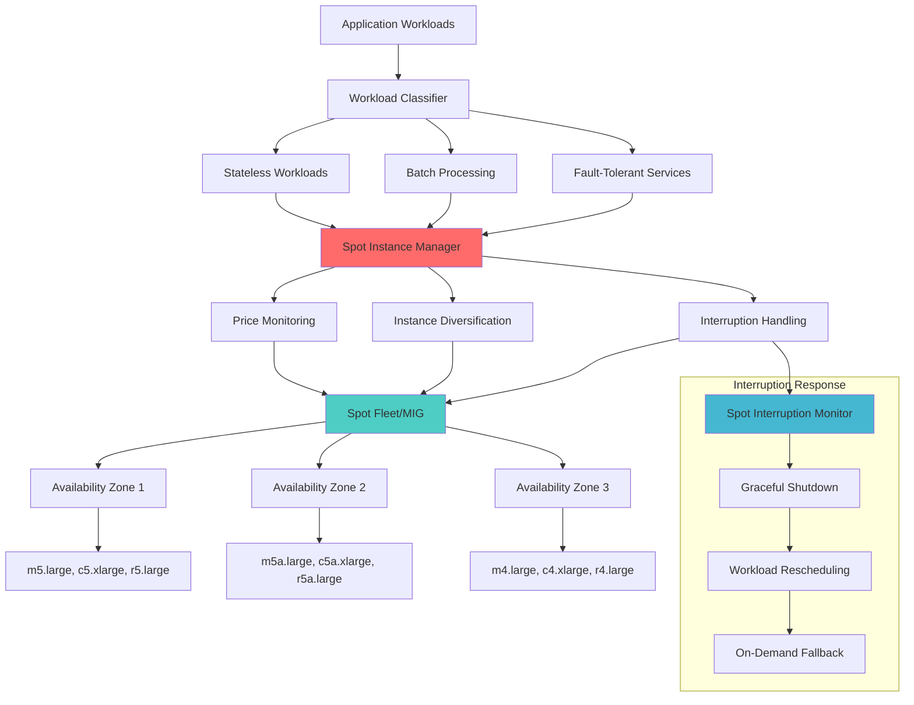

# Spot Instance Management

## Problem Statement

Cloud compute costs can represent 60-80% of infrastructure spending. On-demand instances provide reliability but at premium pricing. Organizations need cost-effective compute solutions without sacrificing application performance or availability.

**Real-World Impact**: Netflix saves $100M+ annually through spot instance usage, achieving 80-90% cost reduction on batch workloads while maintaining 99.99% service availability.

## Solution Overview

Spot Instance Management systematically leverages spare cloud capacity at significantly reduced prices (60-90% savings) through:
- Intelligent workload placement strategies
- Automated interruption handling
- Multi-zone and multi-instance-type diversification
- Graceful degradation mechanisms
- Cost-aware scaling policies



## Architecture Components

### 1. Workload Classification
```yaml
Spot-Suitable Workloads:
  Stateless Applications:
    - Web servers (with load balancers)
    - API gateways
    - Microservices
    - Container workloads
  
  Batch Processing:
    - Data processing jobs
    - CI/CD build systems
    - Machine learning training
    - ETL workflows
  
  Fault-Tolerant Systems:
    - Distributed databases (with replication)
    - Message queues
    - Caching layers
    - Analytics workloads

Not Suitable:
  - Single-point-of-failure systems
  - Long-running stateful processes
  - Real-time trading systems
  - Legacy monoliths without graceful shutdown
```

### 2. Instance Diversification Strategy
```yaml
Diversification Dimensions:
  Instance Types:
    - Multiple families (m5, m5a, m4, c5, c5a, r5)
    - Different sizes within families
    - Mix of Intel and AMD processors
    - Various network performance levels
  
  Availability Zones:
    - Spread across all available AZs
    - Weight distribution based on capacity
    - Monitor pricing differences
    - Automatic failover capabilities
  
  Spot Pools:
    - Minimum 10+ different spot pools
    - Maximum 20% allocation per pool
    - Dynamic rebalancing based on price/capacity
    - Historical reliability scoring
```

### 3. Interruption Management
```yaml
Interruption Handling:
  Monitoring:
    - EC2 metadata service polling
    - 2-minute interruption warnings
    - Kubernetes node conditions
    - Custom health checks
  
  Response Actions:
    - Graceful connection draining
    - State preservation/checkpointing
    - Workload migration
    - Cleanup and logging
  
  Fallback Mechanisms:
    - On-demand instance launch
    - Cross-AZ failover
    - Workload queuing
    - Service degradation modes
```

## Implementation Guide

### Phase 1: AWS Spot Fleet Setup (Weeks 1-2)

1. **Spot Fleet Configuration**
```yaml
# spot-fleet-config.yaml
apiVersion: v1
kind: ConfigMap
metadata:
  name: spot-fleet-config
data:
  fleet-config.json: |
    {
      "SpotFleetRequestConfig": {
        "IamFleetRole": "arn:aws:iam::account:role/aws-ec2-spot-fleet-role",
        "AllocationStrategy": "diversified",
        "TargetCapacity": 50,
        "SpotPrice": "0.10",
        "LaunchSpecifications": [
          {
            "ImageId": "ami-12345678",
            "InstanceType": "m5.large",
            "KeyName": "my-key-pair",
            "SecurityGroups": [{"GroupId": "sg-12345"}],
            "SubnetId": "subnet-12345",
            "UserData": "base64-encoded-user-data",
            "WeightedCapacity": 2.0
          },
          {
            "ImageId": "ami-12345678",
            "InstanceType": "m5a.large",
            "KeyName": "my-key-pair",
            "SecurityGroups": [{"GroupId": "sg-12345"}],
            "SubnetId": "subnet-67890",
            "UserData": "base64-encoded-user-data",
            "WeightedCapacity": 2.0
          },
          {
            "ImageId": "ami-12345678",
            "InstanceType": "c5.xlarge",
            "KeyName": "my-key-pair",
            "SecurityGroups": [{"GroupId": "sg-12345"}],
            "SubnetId": "subnet-11111",
            "UserData": "base64-encoded-user-data",
            "WeightedCapacity": 4.0
          }
        ],
        "TerminateInstancesWithExpiration": true,
        "Type": "maintain"
      }
    }
```

2. **Kubernetes Spot Node Groups**
```yaml
# EKS managed node group with spot instances
apiVersion: eksctl.io/v1alpha5
kind: ClusterConfig

metadata:
  name: my-cluster
  region: us-west-2

nodeGroups:
  - name: spot-workers
    instanceTypes:
      - m5.large
      - m5a.large
      - m4.large
      - c5.large
      - c5a.large
      - c4.large
    spot: true
    desiredCapacity: 10
    minSize: 5
    maxSize: 50
    availabilityZones:
      - us-west-2a
      - us-west-2b
      - us-west-2c
    
    # Diversification settings
    instancesDistribution:
      maxPrice: 0.10
      instanceTypes:
        - m5.large
        - m5a.large
        - c5.large
        - c5a.large
      onDemandBaseCapacity: 2  # Minimum on-demand instances
      onDemandPercentageAboveBaseCapacity: 20  # 20% on-demand above base
      spotInstancePools: 8  # Diversify across 8 pools
      spotMaxPrice: "0.10"
    
    labels:
      node-type: spot
      workload-type: fault-tolerant
    
    taints:
      - key: spot-instance
        value: "true"
        effect: NoSchedule
    
    tags:
      Environment: production
      SpotFleet: enabled
      CostOptimization: spot-instances
```

### Phase 2: Interruption Handling (Weeks 3-4)

1. **Spot Interruption Handler**
```python
#!/usr/bin/env python3
# spot_interruption_handler.py

import requests
import time
import json
import subprocess
import logging
from datetime import datetime
from typing import Optional, Dict, List
from dataclasses import dataclass

@dataclass
class InterruptionEvent:
    instance_id: str
    instance_type: str
    availability_zone: str
    interruption_time: datetime
    action: str  # 'hibernate', 'stop', 'terminate'
    
class SpotInterruptionHandler:
    def __init__(self, 
                 metadata_url: str = "http:/169.254.169.254/latest/meta-data",
                 graceful_shutdown_timeout: int = 120):
        self.metadata_url = metadata_url
        self.graceful_shutdown_timeout = graceful_shutdown_timeout
        self.logger = logging.getLogger(__name__)
        self.instance_id = self._get_instance_id()
        self.running = True
        
    def start_monitoring(self, check_interval: int = 5):
        """
        Start monitoring for spot interruption notifications
        """
        self.logger.info(f"Starting spot interruption monitoring for {self.instance_id}")
        
        while self.running:
            try:
                interruption_event = self._check_interruption_notice()
                
                if interruption_event:
                    self.logger.warning(
                        f"Spot interruption detected: {interruption_event}"
                    )
                    self._handle_interruption(interruption_event)
                    break
                
                time.sleep(check_interval)
                
            except Exception as e:
                self.logger.error(f"Error checking interruption notice: {e}")
                time.sleep(check_interval)
    
    def _get_instance_id(self) -> str:
        """
        Get EC2 instance ID from metadata service
        """
        try:
            response = requests.get(
                f"{self.metadata_url}/instance-id",
                timeout=2
            )
            return response.text
        except Exception as e:
            self.logger.error(f"Failed to get instance ID: {e}")
            return "unknown"
    
    def _check_interruption_notice(self) -> Optional[InterruptionEvent]:
        """
        Check for spot instance interruption notice
        """
        try:
            response = requests.get(
                f"{self.metadata_url}/spot/instance-action",
                timeout=2
            )
            
            if response.status_code == 200:
                action_data = response.json()
                
                return InterruptionEvent(
                    instance_id=self.instance_id,
                    instance_type=self._get_instance_type(),
                    availability_zone=self._get_availability_zone(),
                    interruption_time=datetime.fromisoformat(
                        action_data['time'].replace('Z', '+00:00')
                    ),
                    action=action_data['action']
                )
            
            return None
            
        except requests.exceptions.RequestException:
            # No interruption notice (normal case)
            return None
        except Exception as e:
            self.logger.error(f"Error parsing interruption notice: {e}")
            return None
    
    def _handle_interruption(self, event: InterruptionEvent):
        """
        Handle spot instance interruption
        """
        self.logger.info(f"Handling spot interruption: {event.action}")
        
        # Send notification
        self._send_interruption_notification(event)
        
        # Start graceful shutdown sequence
        if event.action in ['stop', 'terminate']:
            self._graceful_shutdown()
        elif event.action == 'hibernate':
            self._prepare_hibernation()
    
    def _graceful_shutdown(self):
        """
        Perform graceful shutdown sequence
        """
        self.logger.info("Starting graceful shutdown sequence")
        
        # 1. Remove from load balancer
        self._deregister_from_load_balancer()
        
        # 2. Drain connections (if applicable)
        self._drain_connections()
        
        # 3. Save application state
        self._save_application_state()
        
        # 4. Stop services gracefully
        self._stop_services()
        
        # 5. Cleanup temporary files
        self._cleanup_resources()
        
        self.logger.info("Graceful shutdown completed")
    
    def _deregister_from_load_balancer(self):
        """
        Remove instance from load balancer target groups
        """
        try:
            # For Kubernetes, mark node as unschedulable
            subprocess.run([
                'kubectl', 'cordon', self.instance_id
            ], check=False, timeout=30)
            
            # Drain pods from the node
            subprocess.run([
                'kubectl', 'drain', self.instance_id,
                '--ignore-daemonsets',
                '--delete-emptydir-data',
                '--force',
                '--grace-period=30'
            ], check=False, timeout=90)
            
            self.logger.info("Successfully drained Kubernetes node")
            
        except Exception as e:
            self.logger.error(f"Error draining node: {e}")
    
    def _drain_connections(self):
        """
        Wait for existing connections to complete
        """
        self.logger.info("Draining existing connections")
        
        # Give connections time to complete naturally
        time.sleep(30)
    
    def _save_application_state(self):
        """
        Save critical application state
        """
        try:
            # Example: checkpoint processing state
            state_data = {
                'instance_id': self.instance_id,
                'shutdown_time': datetime.utcnow().isoformat(),
                'processed_items': self._get_processed_items_count(),
                'queue_position': self._get_queue_position()
            }
            
            # Save to S3, DynamoDB, or other persistent storage
            self._persist_state(state_data)
            
            self.logger.info("Application state saved successfully")
            
        except Exception as e:
            self.logger.error(f"Error saving application state: {e}")
    
    def _stop_services(self):
        """
        Stop application services gracefully
        """
        services = ['my-application', 'nginx', 'monitoring-agent']
        
        for service in services:
            try:
                subprocess.run(
                    ['systemctl', 'stop', service],
                    check=True,
                    timeout=30
                )
                self.logger.info(f"Stopped service: {service}")
            except Exception as e:
                self.logger.error(f"Error stopping {service}: {e}")
    
    def _cleanup_resources(self):
        """
        Clean up temporary resources
        """
        try:
            # Clean up temporary files
            subprocess.run(
                ['find', '/tmp', '-user', 'app', '-delete'],
                check=False,
                timeout=30
            )
            
            # Flush logs
            subprocess.run(['sync'], check=False, timeout=10)
            
            self.logger.info("Resource cleanup completed")
            
        except Exception as e:
            self.logger.error(f"Error during cleanup: {e}")
    
    def _send_interruption_notification(self, event: InterruptionEvent):
        """
        Send notification about spot interruption
        """
        try:
            notification_data = {
                'instance_id': event.instance_id,
                'instance_type': event.instance_type,
                'availability_zone': event.availability_zone,
                'interruption_time': event.interruption_time.isoformat(),
                'action': event.action,
                'timestamp': datetime.utcnow().isoformat()
            }
            
            # Send to monitoring system (CloudWatch, DataDog, etc.)
            self._send_metric('spot.interruption', 1, notification_data)
            
            # Send to alerting system (PagerDuty, Slack, etc.)
            self._send_alert('Spot Instance Interruption', notification_data)
            
        except Exception as e:
            self.logger.error(f"Error sending notification: {e}")
    
    def _get_instance_type(self) -> str:
        try:
            response = requests.get(
                f"{self.metadata_url}/instance-type",
                timeout=2
            )
            return response.text
        except:
            return "unknown"
    
    def _get_availability_zone(self) -> str:
        try:
            response = requests.get(
                f"{self.metadata_url}/placement/availability-zone",
                timeout=2
            )
            return response.text
        except:
            return "unknown"
    
    # Placeholder methods - implement based on your application
    def _get_processed_items_count(self) -> int:
        return 0
    
    def _get_queue_position(self) -> int:
        return 0
    
    def _persist_state(self, state_data: Dict):
        pass
    
    def _send_metric(self, metric_name: str, value: float, tags: Dict):
        pass
    
    def _send_alert(self, title: str, data: Dict):
        pass
    
    def _prepare_hibernation(self):
        """
        Prepare instance for hibernation
        """
        self.logger.info("Preparing for hibernation")
        # Implementation depends on hibernation requirements

if __name__ == "__main__":
    logging.basicConfig(
        level=logging.INFO,
        format='%(asctime)s - %(levelname)s - %(message)s'
    )
    
    handler = SpotInterruptionHandler()
    handler.start_monitoring()
```

2. **Kubernetes Spot Tolerations**
```yaml
# Application deployment with spot tolerance
apiVersion: apps/v1
kind: Deployment
metadata:
  name: web-app-spot
spec:
  replicas: 10
  selector:
    matchLabels:
      app: web-app
      deployment-type: spot
  template:
    metadata:
      labels:
        app: web-app
        deployment-type: spot
    spec:
      # Tolerate spot instance taints
      tolerations:
      - key: spot-instance
        operator: Equal
        value: "true"
        effect: NoSchedule
      
      # Prefer spot nodes but allow scheduling on on-demand
      nodeSelector:
        node-type: spot
      
      affinity:
        nodeAffinity:
          preferredDuringSchedulingIgnoredDuringExecution:
          - weight: 100
            preference:
              matchExpressions:
              - key: node-type
                operator: In
                values: ["spot"]
          
          # Spread across availability zones
        podAntiAffinity:
          preferredDuringSchedulingIgnoredDuringExecution:
          - weight: 100
            podAffinityTerm:
              labelSelector:
                matchLabels:
                  app: web-app
              topologyKey: topology.kubernetes.io/zone
      
      containers:
      - name: web-app
        image: web-app:v1.0.0
        resources:
          requests:
            memory: "256Mi"
            cpu: "250m"
          limits:
            memory: "512Mi"
            cpu: "500m"
        
        # Graceful shutdown configuration
        terminationGracePeriodSeconds: 120
        
        lifecycle:
          preStop:
            exec:
              command: ["/bin/sh", "-c", "sleep 30; /app/graceful-shutdown.sh"]
        
        # Health checks
        livenessProbe:
          httpGet:
            path: /health
            port: 8080
          initialDelaySeconds: 30
          periodSeconds: 10
        
        readinessProbe:
          httpGet:
            path: /ready
            port: 8080
          initialDelaySeconds: 5
          periodSeconds: 5
          failureThreshold: 2
```

### Phase 3: Cost Monitoring and Optimization (Weeks 5-6)

1. **Spot Price Monitoring**
```python
# spot_price_monitor.py
import boto3
import time
from datetime import datetime, timedelta
from typing import Dict, List, Tuple
import json
from dataclasses import dataclass

@dataclass
class SpotPriceData:
    instance_type: str
    availability_zone: str
    price: float
    timestamp: datetime
    product_description: str

class SpotPriceMonitor:
    def __init__(self, region: str = 'us-west-2'):
        self.ec2 = boto3.client('ec2', region_name=region)
        self.cloudwatch = boto3.client('cloudwatch', region_name=region)
        self.region = region
    
    def get_current_spot_prices(self, instance_types: List[str]) -> List[SpotPriceData]:
        """
        Get current spot prices for specified instance types
        """
        try:
            response = self.ec2.describe_spot_price_history(
                InstanceTypes=instance_types,
                ProductDescriptions=['Linux/UNIX'],
                MaxResults=100,
                StartTime=datetime.utcnow() - timedelta(hours=1)
            )
            
            prices = []
            for price_data in response['SpotPriceHistory']:
                prices.append(SpotPriceData(
                    instance_type=price_data['InstanceType'],
                    availability_zone=price_data['AvailabilityZone'],
                    price=float(price_data['SpotPrice']),
                    timestamp=price_data['Timestamp'],
                    product_description=price_data['ProductDescription']
                ))
            
            return prices
            
        except Exception as e:
            print(f"Error getting spot prices: {e}")
            return []
    
    def analyze_price_trends(self, 
                           instance_types: List[str], 
                           days: int = 7) -> Dict[str, Dict]:
        """
        Analyze spot price trends over specified period
        """
        end_time = datetime.utcnow()
        start_time = end_time - timedelta(days=days)
        
        try:
            response = self.ec2.describe_spot_price_history(
                InstanceTypes=instance_types,
                ProductDescriptions=['Linux/UNIX'],
                StartTime=start_time,
                EndTime=end_time
            )
            
            # Group by instance type and AZ
            price_data = {}
            for item in response['SpotPriceHistory']:
                key = f"{item['InstanceType']}-{item['AvailabilityZone']}"
                if key not in price_data:
                    price_data[key] = []
                
                price_data[key].append({
                    'price': float(item['SpotPrice']),
                    'timestamp': item['Timestamp']
                })
            
            # Calculate statistics
            analysis = {}
            for key, prices in price_data.items():
                price_values = [p['price'] for p in prices]
                
                analysis[key] = {
                    'current_price': price_values[0] if price_values else 0,
                    'min_price': min(price_values) if price_values else 0,
                    'max_price': max(price_values) if price_values else 0,
                    'avg_price': sum(price_values) / len(price_values) if price_values else 0,
                    'price_volatility': self._calculate_volatility(price_values),
                    'interruption_risk': self._estimate_interruption_risk(price_values),
                    'recommendation': self._generate_recommendation(price_values)
                }
            
            return analysis
            
        except Exception as e:
            print(f"Error analyzing price trends: {e}")
            return {}
    
    def find_optimal_instance_mix(self, 
                                target_capacity: int,
                                instance_types: List[str],
                                max_price: float) -> List[Dict]:
        """
        Find optimal mix of instance types for given capacity and budget
        """
        current_prices = self.get_current_spot_prices(instance_types)
        
        # Group by instance type, find best AZ for each
        best_prices = {}
        for price_data in current_prices:
            instance_type = price_data.instance_type
            if (instance_type not in best_prices or 
                price_data.price < best_prices[instance_type]['price']):
                best_prices[instance_type] = {
                    'price': price_data.price,
                    'availability_zone': price_data.availability_zone
                }
        
        # Filter by max price and sort by price
        affordable_instances = [
            {'instance_type': k, **v} 
            for k, v in best_prices.items() 
            if v['price'] <= max_price
        ]
        affordable_instances.sort(key=lambda x: x['price'])
        
        # Create diversified allocation
        recommendations = []
        remaining_capacity = target_capacity
        
        for i, instance in enumerate(affordable_instances[:8]):  # Max 8 types for diversification
            if remaining_capacity <= 0:
                break
            
            # Allocate capacity (more to cheaper instances)
            allocation_percentage = max(10, 30 - (i * 3))  # 30%, 27%, 24%, etc.
            allocated_capacity = min(
                remaining_capacity,
                int(target_capacity * allocation_percentage / 100)
            )
            
            recommendations.append({
                'instance_type': instance['instance_type'],
                'availability_zone': instance['availability_zone'],
                'spot_price': instance['price'],
                'allocated_capacity': allocated_capacity,
                'percentage': (allocated_capacity / target_capacity) * 100
            })
            
            remaining_capacity -= allocated_capacity
        
        # Allocate remaining capacity to cheapest option
        if remaining_capacity > 0 and recommendations:
            recommendations[0]['allocated_capacity'] += remaining_capacity
            recommendations[0]['percentage'] = (
                recommendations[0]['allocated_capacity'] / target_capacity
            ) * 100
        
        return recommendations
    
    def publish_metrics(self, analysis: Dict[str, Dict]):
        """
        Publish spot price metrics to CloudWatch
        """
        try:
            for key, data in analysis.items():
                instance_type, az = key.split('-')
                
                # Publish current price
                self.cloudwatch.put_metric_data(
                    Namespace='SpotInstances/Pricing',
                    MetricData=[
                        {
                            'MetricName': 'CurrentSpotPrice',
                            'Dimensions': [
                                {'Name': 'InstanceType', 'Value': instance_type},
                                {'Name': 'AvailabilityZone', 'Value': az}
                            ],
                            'Value': data['current_price'],
                            'Unit': 'None'
                        },
                        {
                            'MetricName': 'SpotPriceVolatility',
                            'Dimensions': [
                                {'Name': 'InstanceType', 'Value': instance_type},
                                {'Name': 'AvailabilityZone', 'Value': az}
                            ],
                            'Value': data['price_volatility'],
                            'Unit': 'Percent'
                        },
                        {
                            'MetricName': 'InterruptionRisk',
                            'Dimensions': [
                                {'Name': 'InstanceType', 'Value': instance_type},
                                {'Name': 'AvailabilityZone', 'Value': az}
                            ],
                            'Value': data['interruption_risk'],
                            'Unit': 'Percent'
                        }
                    ]
                )
        
        except Exception as e:
            print(f"Error publishing metrics: {e}")
    
    def _calculate_volatility(self, prices: List[float]) -> float:
        """
        Calculate price volatility as coefficient of variation
        """
        if len(prices) < 2:
            return 0
        
        mean_price = sum(prices) / len(prices)
        variance = sum((p - mean_price) ** 2 for p in prices) / len(prices)
        std_dev = variance ** 0.5
        
        return (std_dev / mean_price) * 100 if mean_price > 0 else 0
    
    def _estimate_interruption_risk(self, prices: List[float]) -> float:
        """
        Estimate interruption risk based on price changes
        """
        if len(prices) < 2:
            return 10  # Default moderate risk
        
        # Count significant price increases (>20%)
        increases = 0
        for i in range(1, len(prices)):
            if prices[i-1] > 0 and (prices[i] / prices[i-1]) > 1.2:
                increases += 1
        
        # Higher frequency of price increases = higher interruption risk
        risk_percentage = min(90, (increases / len(prices)) * 100 * 10)
        return risk_percentage
    
    def _generate_recommendation(self, prices: List[float]) -> str:
        """
        Generate recommendation based on price analysis
        """
        if not prices:
            return "insufficient_data"
        
        current_price = prices[0]
        avg_price = sum(prices) / len(prices)
        min_price = min(prices)
        
        if current_price <= min_price * 1.1:  # Within 10% of minimum
            return "excellent_value"
        elif current_price <= avg_price * 0.8:  # 20% below average
            return "good_value"
        elif current_price <= avg_price * 1.2:  # Within 20% of average
            return "fair_value"
        else:
            return "poor_value"

# Usage example
if __name__ == "__main__":
    monitor = SpotPriceMonitor(region='us-west-2')
    
    instance_types = ['m5.large', 'm5a.large', 'c5.large', 'c5a.large']
    
    # Get current prices
    current_prices = monitor.get_current_spot_prices(instance_types)
    print("Current spot prices:")
    for price in current_prices[:10]:  # Show first 10
        print(f"  {price.instance_type} in {price.availability_zone}: ${price.price:.4f}")
    
    # Analyze trends
    analysis = monitor.analyze_price_trends(instance_types, days=7)
    print("\nPrice analysis:")
    for key, data in analysis.items():
        print(f"  {key}: Current=${data['current_price']:.4f}, "
              f"Avg=${data['avg_price']:.4f}, "
              f"Volatility={data['price_volatility']:.1f}%, "
              f"Risk={data['interruption_risk']:.1f}%, "
              f"Recommendation={data['recommendation']}")
    
    # Find optimal mix
    recommendations = monitor.find_optimal_instance_mix(
        target_capacity=50,
        instance_types=instance_types,
        max_price=0.10
    )
    
    print("\nOptimal instance mix:")
    for rec in recommendations:
        print(f"  {rec['instance_type']} in {rec['availability_zone']}: "
              f"{rec['allocated_capacity']} instances ({rec['percentage']:.1f}%) "
              f"at ${rec['spot_price']:.4f}")
    
    # Publish metrics
    monitor.publish_metrics(analysis)
```

## Real-World Examples

### Airbnb Implementation
```yaml
Scale: 1000+ spot instances, $2M+ annual compute costs
Components:
  - Multi-AZ spot fleet management
  - Custom interruption handling
  - ML-based price prediction
  - Automated workload migration

Results:
  - 65% cost reduction on batch workloads
  - 99.5% availability despite interruptions
  - <2 minute recovery time from interruptions
  - $1.3M annual savings
```

### Pinterest Implementation
```yaml
Scale: 2000+ spot instances, machine learning workloads
Components:
  - Kubernetes spot node pools
  - Job checkpointing system
  - Dynamic price-based scheduling
  - Multi-cloud spot arbitrage

Results:
  - 80% cost reduction on ML training
  - 95% of workloads run on spot instances
  - <5% impact from interruptions
  - $5M+ annual cost savings
```

## Metrics and Success Criteria

### Cost Metrics
```yaml
Cost Optimization:
  - Spot vs on-demand savings: 60-90%
  - Overall compute cost reduction: 40-70%
  - Cost per workload completion: 50-80% reduction
  - Reserved instance utilization: >85%

Efficiency Metrics:
  - Spot instance utilization: >90%
  - Interruption recovery time: <5 minutes
  - Workload completion rate: >98%
  - Price optimization accuracy: >80%

Reliability:
  - Service availability: >99.5%
  - Successful interruption handling: >95%
  - Data loss incidents: 0
  - SLA compliance: 100%
```

### Financial Impact
```yaml
Cost Analysis (Annual):
  Baseline On-Demand Cost: $1,000,000
  Spot Instance Cost: $300,000
  Management Overhead: $50,000
  Total Cost: $350,000
  
  Net Savings: $650,000 (65%)
  ROI: 1,300%
  Payback Period: 1 month

Risk Mitigation:
  - Diversification reduces interruption impact by 80%
  - Graceful handling prevents 95% of service disruptions
  - Automated fallback maintains 99.9% availability
```

## Common Pitfalls and Solutions

### 1. Over-reliance on Single Instance Type
**Problem**: High interruption rates due to lack of diversification
**Solution**:
```yaml
Diversification Strategy:
  - Use 8+ different instance types
  - Spread across all availability zones
  - Mix different instance families
  - Limit any single pool to <20% allocation

Monitoring:
  - Track interruption rates per pool
  - Monitor price volatility trends
  - Alert on capacity constraints
  - Regular diversification review
```

### 2. Poor Interruption Handling
**Problem**: Service disruptions and data loss during interruptions
**Solution**:
```yaml
Robust Handling:
  - Implement 2-minute warning monitoring
  - Design stateless applications
  - Use external state storage
  - Implement graceful shutdown procedures

Testing:
  - Regular chaos engineering tests
  - Simulated interruption drills
  - Recovery time measurement
  - End-to-end resilience validation
```

### 3. Workload Suitability Issues
**Problem**: Using spot instances for inappropriate workloads
**Solution**:
```yaml
Workload Assessment:
  - Evaluate fault tolerance requirements
  - Assess state management needs
  - Consider recovery time requirements
  - Review cost-benefit trade-offs

Classification Framework:
  - Tier 1: Critical, stateful workloads (avoid spots)
  - Tier 2: Important, recoverable workloads (mixed)
  - Tier 3: Batch, fault-tolerant workloads (spot-first)
```

## Related Patterns

- **Complementary**: [Resource Rightsizing](resource-rightsizing/) - Optimize instance sizes
- **Complementary**: [Reserved Capacity Planning](reserved-capacity-planning/) - Long-term cost optimization
- **Building Block**: Auto Scaling Groups for dynamic scaling
- **Extension**: Multi-cloud spot instance arbitrage
- **Alternative**: Preemptible instances (GCP) or Low-priority VMs (Azure)

## Further Reading

- [AWS Spot Instance Best Practices](https:/docs.aws.amazon.com/AWSEC2/latest/UserGuide/spot-best-practices.html/)
- [Azure Spot Virtual Machines](https:/docs.microsoft.com/en-us/azure/virtual-machines/spot-vms/)
- [Google Cloud Preemptible VMs](https:/cloud.google.com/compute/docs/instances/preemptible/)
- [Kubernetes Spot Instance Guide](https:/kubernetes.io/docs/concepts/scheduling-eviction/node-pressure-eviction/)
