# Bloom Filter Pattern

!!! success "🏆 Gold Standard Pattern"
    **Space-Efficient Set Membership** • Chrome, Cassandra, Medium proven
    
    The go-to pattern for space-efficient membership testing. Bloom filters provide massive memory savings for set operations, enabling systems to scale far beyond traditional approaches.
    
    **Key Success Metrics:**
    - Google Chrome: Protects 3B+ users from malicious URLs
    - Cassandra: 95%+ reduction in unnecessary disk reads
    - Medium: Efficient deduplication for content recommendations

**Space-efficient probabilistic set membership testing**

!!! abstract
 A Bloom filter trades perfect accuracy for massive space savings - it can tell you "definitely not in set" with 100% certainty, but "probably in set" with measurable uncertainty.

## Visual Overview

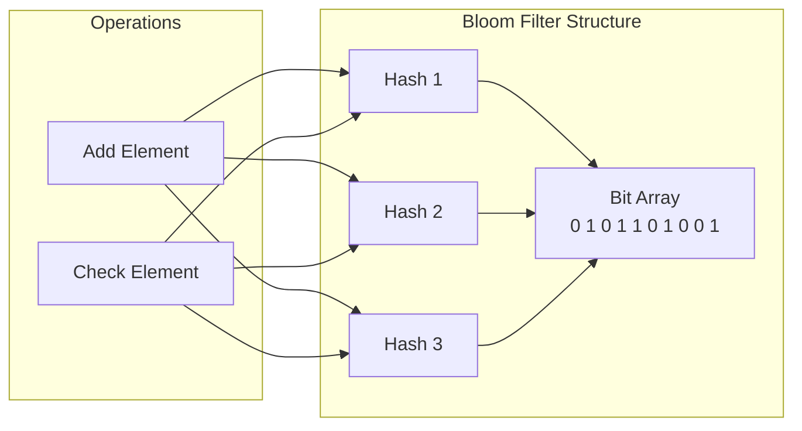

## How Bloom Filters Work

### Step-by-Step Visual Walkthrough

```mermaid
flowchart TB
 subgraph "1. Initial State"
 B1[0 0 0 0 0 0 0 0 0 0]
 end
 
 subgraph "2. Add 'apple'"
 A1[apple] --> H1A[h1: 2]
 A1 --> H2A[h2: 5]
 A1 --> H3A[h3: 7]
 B2[0 0 1 0 0 1 0 1 0 0]
 end
 
 subgraph "3. Add 'banana'"
 A2[banana] --> H1B[h1: 1]
 A2 --> H2B[h2: 5]
 A2 --> H3B[h3: 9]
 B3[0 1 1 0 0 1 0 1 0 1]
 end
 
 subgraph "4. Check 'cherry'"
 A3[cherry] --> H1C[h1: 2 ✓]
 A3 --> H2C[h2: 5 ✓]
 A3 --> H3C[h3: 8 ✗]
 Result[Not in set!]
 end
```

### Visual Representation of Operations

<div class="grid">
<div class="card">
<h4>🔵 Adding Elements</h4>

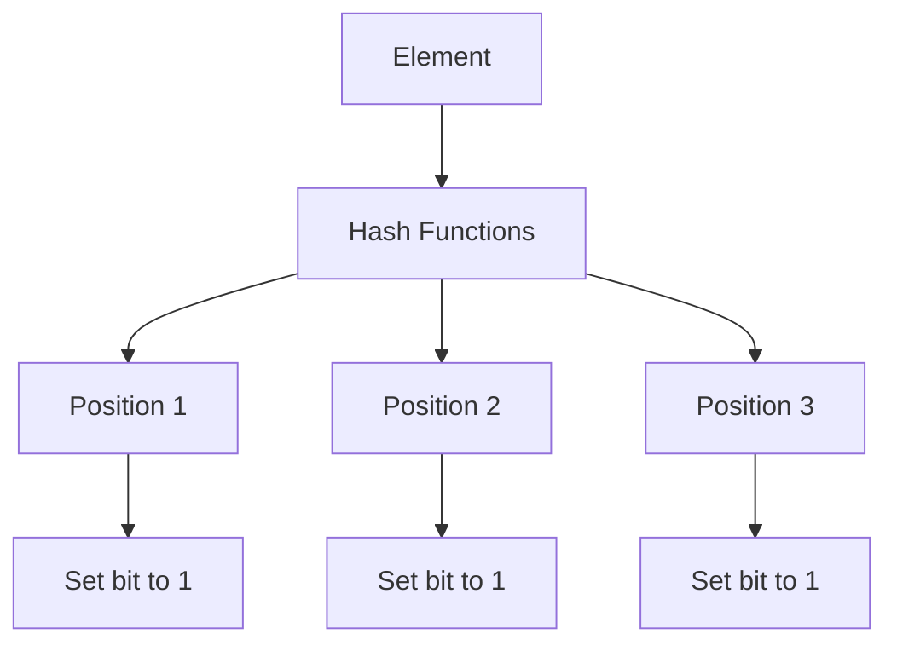

**Process:**
1. Apply k hash functions
2. Get k bit positions
3. Set all k bits to 1
4. Element is now "in" filter
</div>

<div class="card">
<h4>🔍 Checking Membership</h4>

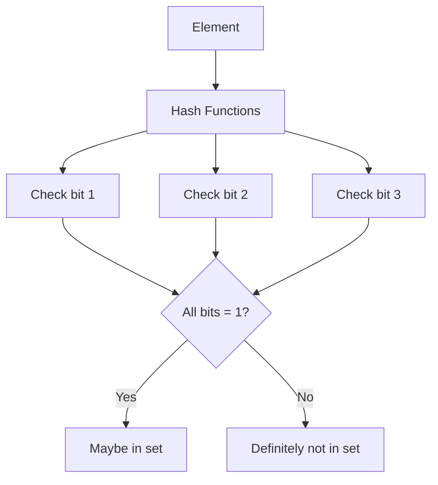

**Logic:**
- All bits = 1: Possibly in set
- Any bit = 0: Definitely not in set
- No false negatives guaranteed
</div>
</div>

## Performance Characteristics

### Space-Time Trade-offs Table

| Parameter | Symbol | Description | Typical Values |
|-----------|---------|-------------|----------------|
| **Bit array size** | m | Total bits in filter | 10K - 10M bits |
| **Hash functions** | k | Number of hash functions | 3 - 10 |
| **Elements** | n | Expected number of elements | Varies |
| **False positive rate** | p | Probability of false positive | 0.01 - 0.001 |


### Optimal Parameters Calculator

```mermaid
graph LR
 subgraph "Given Parameters"
 N[n = elements]
 P[p = target FP rate]
 end
 
 subgraph "Calculate Optimal"
 M[m = -n*ln(p)/(ln(2)²)]
 K[k = (m/n)*ln(2)]
 end
 
 N --> M
 P --> M
 M --> K
 N --> K
```

### False Positive Rate Visualization

!!! note "False Positive Rate by Filter Saturation"
| Fill Rate | k=3 | k=5 | k=7 | k=10 |
 |-----------|-----|-----|-----|------|
 | **10%** | 0.008 | 0.009 | 0.012 | 0.020 |
 | **25%** | 0.046 | 0.041 | 0.042 | 0.051 |
 | **50%** | 0.146 | 0.092 | 0.061 | 0.031 |
 | **75%** | 0.316 | 0.154 | 0.074 | 0.021 |
 | **90%** | 0.507 | 0.204 | 0.080 | 0.018 |

 *Lower is better. Notice how more hash functions help when filter is fuller.*

## Real-World Applications

### 1. Database Query Optimization

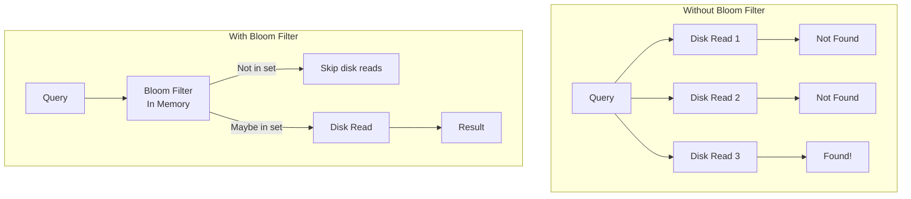

### 2. Distributed Cache Architecture

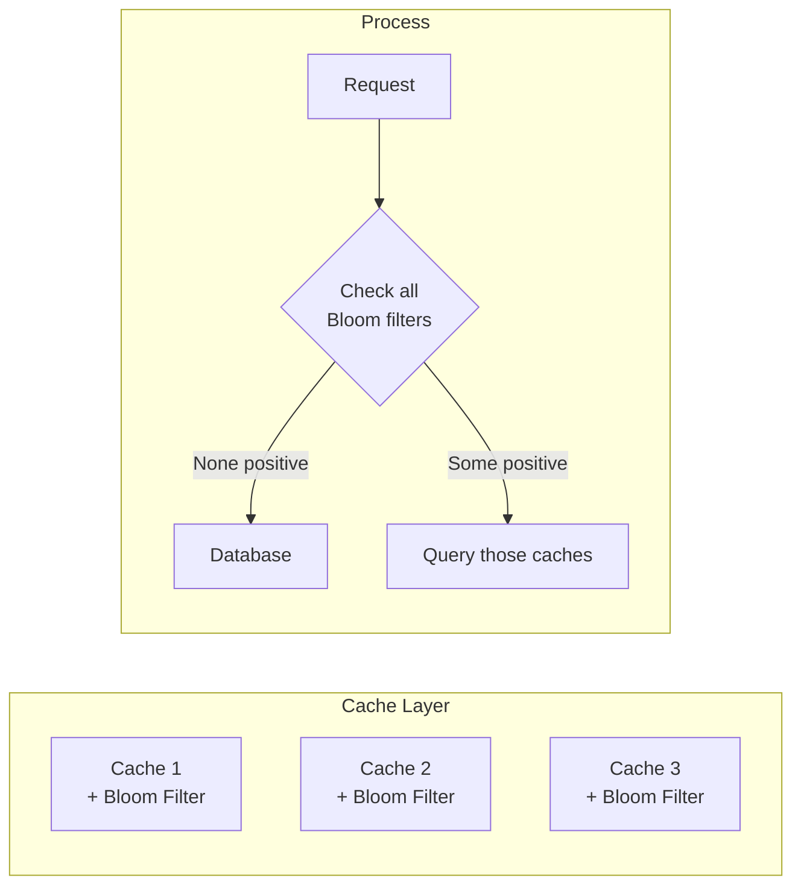

### Application Comparison Table

| Use Case | Items | FP Rate | Space Saved | Query Speedup |
|----------|-------|---------|-------------|---------------|
| **Web Crawler** | 1B URLs | 1% | 99.9% | 100x |
| **Spell Checker** | 500K words | 0.1% | 99% | 50x |
| **Database SSTable** | 10M keys | 1% | 98% | 10x |
| **CDN Cache** | 100M objects | 0.1% | 99.5% | 20x |
| **Malware Detection** | 50M hashes | 0.01% | 99.9% | 200x |


## Visual Decision Framework

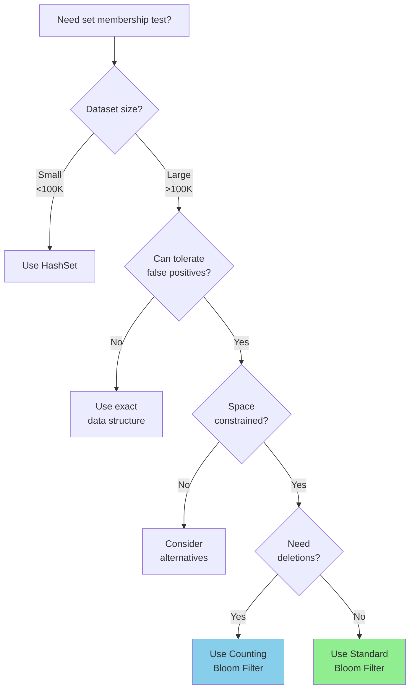

## Implementation Patterns

### Visual Hash Distribution

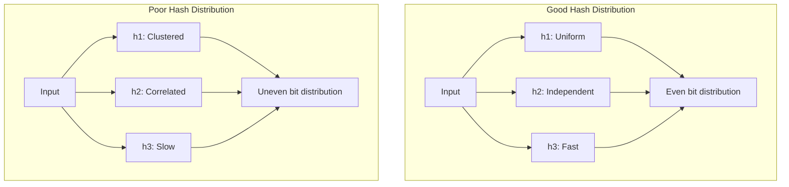

### Common Hash Function Choices

<div class="grid">
<div class="card">
<h4>🚀 MurmurHash3</h4>

- **Speed**: Very fast
- **Distribution**: Excellent
- **Use**: General purpose
- **Bits**: 32/64/128
</div>

<div class="card">
<h4>🔒 CityHash</h4>

- **Speed**: Fast
- **Distribution**: Very good
- **Use**: Strings
- **Bits**: 64/128
</div>

<div class="card">
<h4>⚡ xxHash</h4>

- **Speed**: Extremely fast
- **Distribution**: Good
- **Use**: Speed critical
- **Bits**: 32/64
</div>

<div class="card">
<h4>🎯 FarmHash</h4>

- **Speed**: Fast
- **Distribution**: Excellent
- **Use**: Modern systems
- **Bits**: 32/64/128
</div>
</div>

## Advanced Bloom Filter Variants

### Comparison of Bloom Filter Types

| Variant | Features | Space Overhead | Use Case |
|---------|----------|----------------|----------|
| **Standard Bloom** | Basic operations | 1x | General purpose |
| **Counting Bloom** | Supports deletion | 4-8x | Dynamic sets |
| **Scalable Bloom** | Grows dynamically | 1.2x | Unknown size |
| **Partitioned Bloom** | Cache-friendly | 1x | High performance |
| **Compressed Bloom** | Space optimized | 0.7x | Storage systems |
| **Spectral Bloom** | Frequency queries | 4-16x | Analytics |


### Visual Comparison: Standard vs Counting Bloom

```mermaid
graph LR
 subgraph "Standard Bloom Filter"
 SB[Bit Array: 0 1 0 1 1 0]
 SA[Add] --> SB
 SC[Check] --> SB
 SD[Delete ❌] -.-> SB
 end
 
 subgraph "Counting Bloom Filter"
 CB[Counter Array: 0 2 0 1 3 0]
 CA[Add: +1] --> CB
 CC[Check: >0] --> CB
 CD[Delete: -1] --> CB
 end
```

## Performance Optimization Strategies

### 1. Cache Line Optimization

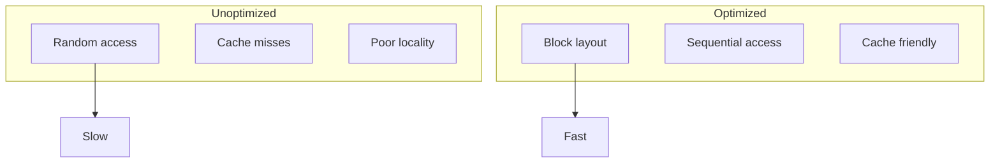

### 2. SIMD Acceleration

!!! info "Parallel Bit Checking with SIMD"
| Operation | Scalar | SIMD-128 | SIMD-256 | SIMD-512 |
 |-----------|--------|----------|----------|----------|
 | **Bits/cycle** | 1 | 128 | 256 | 512 |
 | **Speedup** | 1x | 8-16x | 16-32x | 32-64x |
 | **Use case** | Small filters | Medium | Large | Very large |


## Common Pitfalls and Solutions

### Visual Anti-patterns

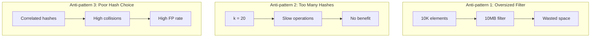

### Best Practices Table

| Scenario | Do | Don't | Why |
|----------|-------|--------|-----|
| **Hash Selection** | Use independent hash families | Use simple modulo | Reduces correlation |
| **Size Planning** | Oversize by 20-50% | Exact sizing | Maintains low FP rate |
| **Monitoring** | Track actual FP rate | Assume theoretical | Real-world differs |
| **Updates** | Rebuild periodically | Let it saturate | Maintains performance |


## Integration Patterns

### 1. Layered Filtering Architecture

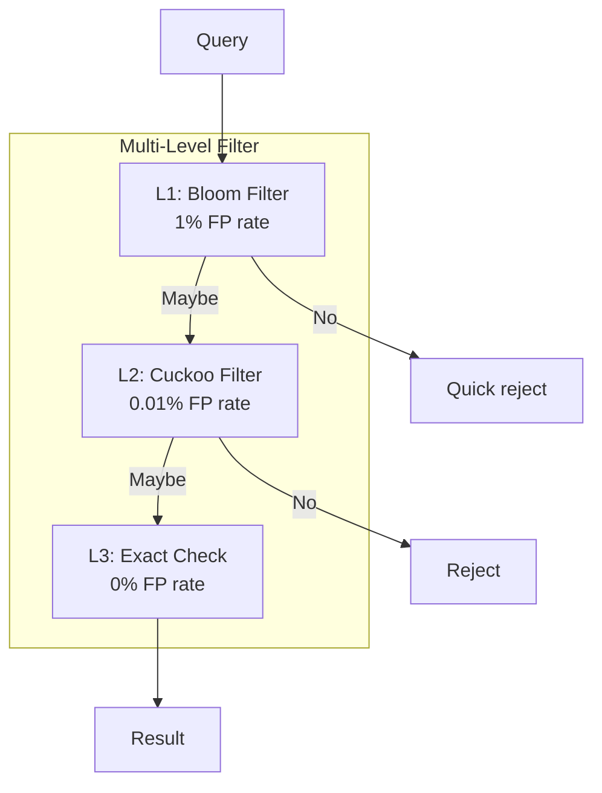

### 2. Distributed Bloom Filter

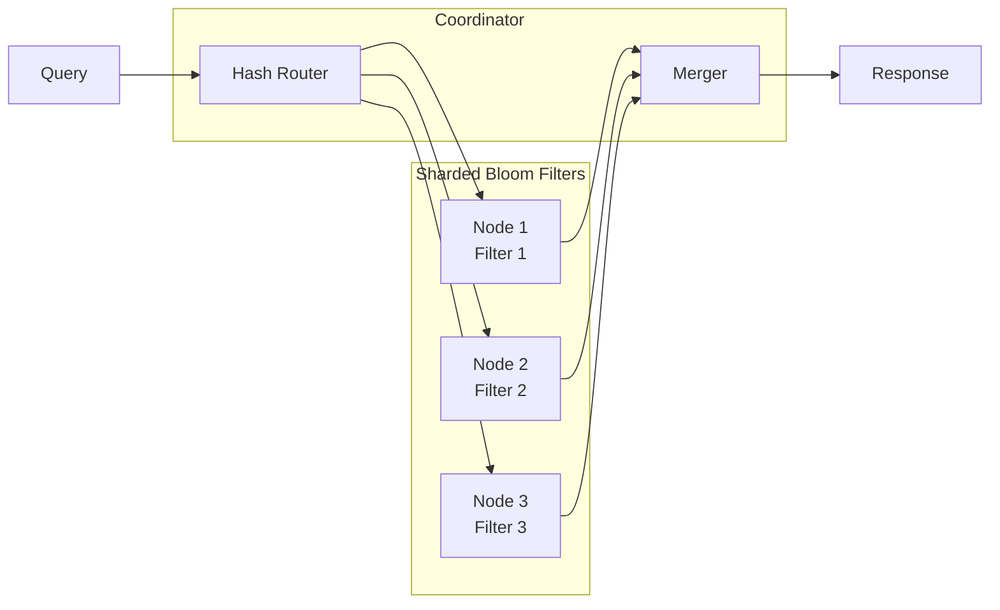

## Monitoring and Observability

### Key Metrics Dashboard

<div class="grid">
<div class="card">
<h4>📊 Saturation Rate</h4>

```
Current: 45%
Target: <50%
Action: OK
```

Formula: `bits_set / total_bits`
</div>

<div class="card">
<h4>📈 False Positive Rate</h4>

```
Theoretical: 1%
Actual: 1.2%
Deviation: +20%
```

Monitor actual vs expected
</div>

<div class="card">
<h4>⏱️ Operation Latency</h4>

```
Add: 0.1μs
Check: 0.08μs
p99: 0.3μs
```

Track percentiles
</div>

<div class="card">
<h4>💾 Memory Usage</h4>

```
Filter: 10MB
Overhead: 0.5MB
Total: 10.5MB
```

Include all structures
</div>
</div>

## Production Checklist

### Deployment Decision Matrix

| Factor | Low Impact | Medium Impact | High Impact |
|--------|------------|---------------|-------------|
| **Dataset Size** | <1M items | 1M-100M items | >100M items |
| **FP Tolerance** | >5% OK | 1-5% OK | <1% required |
| **Space Budget** | Generous | Moderate | Tight |
| **Query Rate** | <1K/sec | 1K-100K/sec | >100K/sec |
| **Recommendation** | Maybe overkill | Good fit | Essential |


### Visual Health Check

```mermaid
graph LR
 subgraph "Health Indicators"
 S[Saturation] --> ST{< 50%?}
 FP[FP Rate] --> FPT{< Target?}
 L[Latency] --> LT{< SLA?}
 M[Memory] --> MT{< Budget?}
 end
 
 ST -->|Yes| G1[✓]
 ST -->|No| R1[Rebuild]
 FPT -->|Yes| G2[✓]
 FPT -->|No| R2[Resize]
 LT -->|Yes| G3[✓]
 LT -->|No| R3[Optimize]
 MT -->|Yes| G4[✓]
 MT -->|No| R4[Compress]
 
 style G1 fill:#90EE90
 style G2 fill:#90EE90
 style G3 fill:#90EE90
 style G4 fill:#90EE90
 style R1 fill:#FFB6C1
 style R2 fill:#FFB6C1
 style R3 fill:#FFB6C1
 style R4 fill:#FFB6C1
```

## Visual Bloom Filter Calculator

### Interactive Parameter Selection

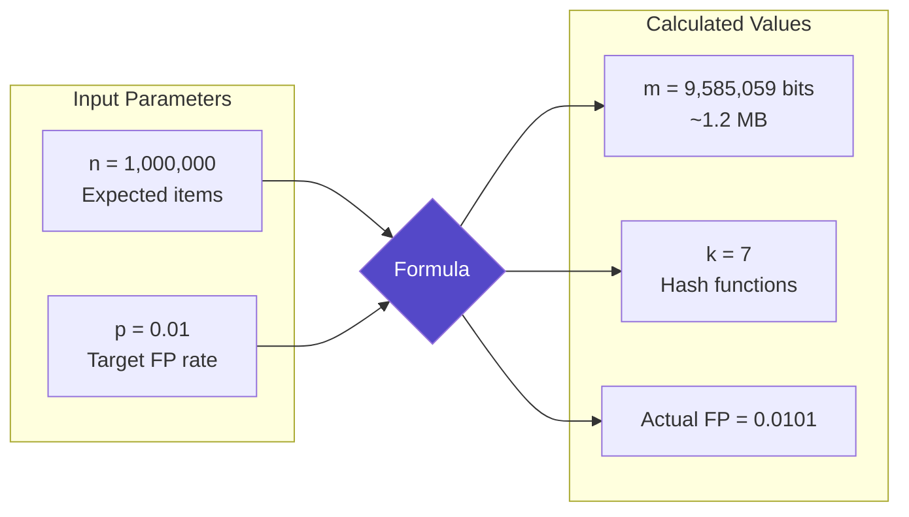

### Visual Size Comparison

!!! note "Space Savings Visualization"
| Data Structure | 1M URLs (avg 50 chars) | Space Used | Savings |
 |----------------|------------------------|------------|---------|
 | **HashSet** | 50MB + overhead | ~60MB | 0% |
 | **Sorted Array** | 50MB | 50MB | 17% |
 | **Bloom (1% FP)** | Formula-based | 1.2MB | 98% |
 | **Bloom (0.1% FP)** | Formula-based | 1.8MB | 97% |
 | **Bloom (0.01% FP)** | Formula-based | 2.4MB | 96% |

 ```mermaid
 graph LR
 subgraph "Visual Space Comparison"
 HS[HashSet
 ############ 60MB]
 BF1[Bloom 1%
 # 1.2MB]
 BF2[Bloom 0.1%
 ## 1.8MB]
 BF3[Bloom 0.01%
 ### 2.4MB]
 end
 ```

## Mathematical Foundation Visualized

### Probability Calculations

```mermaid
graph TD
 subgraph "False Positive Probability"
 Form[p ≈ (1 - e^(-kn/m))^k]
 Optimal[k_optimal = (m/n) × ln(2)]
 BitSet[Bits set ≈ m × (1 - e^(-kn/m))]
 end
 
 subgraph "Visual Probability Curve"
 Low[Low k: High FP]
 Opt[Optimal k: Minimum FP]
 High[High k: High FP]
 end
 
 Form --> Opt
 Low --> Opt
 Opt --> High
 
 style Opt fill:#4CAF50,color:#fff
```

### Saturation Visualization Over Time

```mermaid
graph LR
 subgraph "Filter Saturation Progress"
 T0[0% Full<br/>▱▱▱▱▱▱▱▱▱▱]
 T1[25% Full<br/>██▱▱▱▱▱▱▱▱]
 T2[50% Full<br/>█████▱▱▱▱▱]
 T3[75% Full<br/>███████▱▱▱]
 T4[90% Full<br/>█████████▱]
 end
 
 T0 -->|Add items| T1
 T1 -->|Add more| T2
 T2 -->|Add more| T3
 T3 -->|Add more| T4
 
 style T0 fill:#90EE90
 style T2 fill:#FFA500
 style T4 fill:#FF6B6B
```

## Summary

!!! abstract "🎯 When to Use Bloom Filters"

 **Perfect for:**
 - Avoiding expensive lookups (disk, network)
 - Large datasets with space constraints
 - Applications tolerant of false positives
 - Read-heavy workloads

 **Not suitable for:**
 - Need exact membership guarantees
 - Frequent deletions required
 - Small datasets (<10K items)
 - Cannot handle any false positives

## Visual Use Case Gallery

### Industry Applications Visualized

<div class="grid">
<div class="card">
<h4>🌐 Web Crawling</h4>

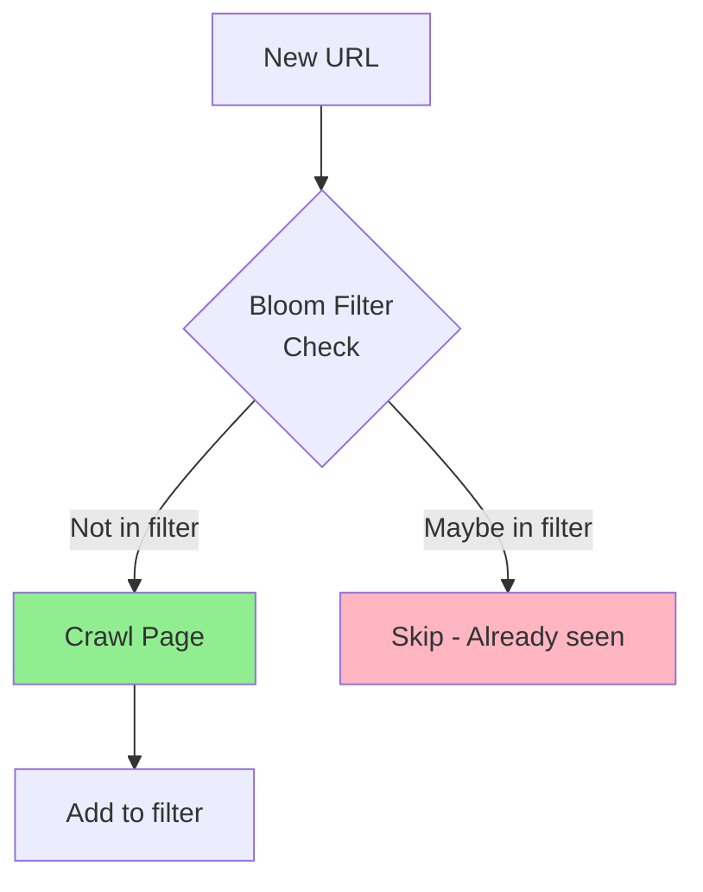

**Google:** 100B+ URLs tracked
</div>

<div class="card">
<h4>💾 Database Storage</h4>

```mermaid
graph TD
 Query[SELECT * WHERE key=X]
 SST1[SSTable 1<br/>+ Bloom]
 SST2[SSTable 2<br/>+ Bloom]
 SST3[SSTable 3<br/>+ Bloom]
 
 Query --> SST1
 Query --> SST2
 Query --> SST3
 
 SST1 -->|Not here| Skip1[✗]
 SST2 -->|Maybe here| Read[Read file]
 SST3 -->|Not here| Skip3[✗]
```

**Cassandra:** Skip 99% of SSTables
</div>

<div class="card">
<h4>🔒 Security Filtering</h4>

```mermaid
graph LR
 Hash[File Hash]
 MalwareDB{Malware<br/>Bloom Filter}
 Block[Block]
 Allow[Allow]
 DeepScan[Deep Scan]
 
 Hash --> MalwareDB
 MalwareDB -->|Not malware| Allow
 MalwareDB -->|Maybe malware| DeepScan
 
 style Allow fill:#90EE90
 style Block fill:#FF6B6B
```

**Chrome:** Safe browsing checks
</div>

<div class="card">
<h4>📧 Email Systems</h4>

```mermaid
graph TD
 Email[Incoming Email]
 Spam{Spam Filter<br/>Bloom}
 Inbox[Inbox]
 SpamFolder[Spam Folder]
 
 Email --> Spam
 Spam -->|Not spam| Inbox
 Spam -->|Maybe spam| SpamFolder
 
 style Inbox fill:#90EE90
 style SpamFolder fill:#FFA500
```

**Gmail:** Billions of spam signatures
</div>
</div>

## Related Patterns

- [Caching Strategies](caching-strategies.md) - Often used together
- [Rate Limiting](rate-limiting.md) - Similar space-time trade-offs
- [Vector Clocks](vector-clocks.md) - Another distributed data structure
- Merkle Trees (Coming Soon) - Verification structures
- [Count-Min Sketch](count-min-sketch.md) - Frequency estimation

## References

- Bloom, Burton H. (1970). "Space/time trade-offs in hash coding with allowable errors"
- [Redis Bloom Filter Module](https://redis.io/docs/stack/bloom/)
- [Google Bigtable Paper](https://research.google/pubs/pub27898/) - Uses Bloom filters
- [Apache Cassandra](https://cassandra.apache.org/) - SSTable Bloom filters
- [Cuckoo Filter Paper](https://www.cs.cmu.edu/~dga/papers/cuckoo-conext2014.pdf) - Better than Bloom