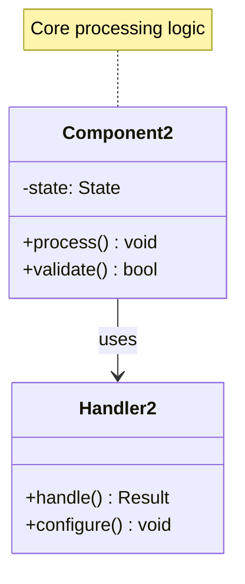

# Bloom Filter Pattern

!!! success "🏆 Gold Standard Pattern"
    **Space-Efficient Set Membership Champion** • Chrome, Cassandra, Medium proven at billion-scale
    
    The breakthrough pattern for space-efficient membership testing. Bloom filters provide massive memory savings for set operations, enabling systems to scale far beyond traditional approaches.
    
    **Key Success Metrics:**
    - Google Chrome: Protects 3B+ users from malicious URLs
    - Cassandra: 95%+ reduction in unnecessary disk reads
    - Medium: Efficient deduplication for content recommendations

## Essential Question

**How can we test set membership using minimal memory when false positives are acceptable?**

## When to Use / When NOT to Use

### ✅ Use When

| Scenario | Example | Impact |
|----------|---------|--------|
| Large-scale deduplication | Web crawler avoiding duplicate URLs | 99%+ space savings vs full URL storage |
| Cache pre-filtering | Database query optimization | Skip 95%+ unnecessary disk reads |
| Security screening | Malware hash checking | Instant rejection of clean files |
| Distributed membership | CDN cache location queries | Eliminate cross-region lookups |

### ❌ DON'T Use When

| Scenario | Why | Alternative |
|----------|-----|-------------|
| Zero false positives required | Mathematical impossibility | Exact hash table |
| Small datasets (<10K items) | Memory overhead not worth it | Simple hash set |
| Frequent deletions needed | Standard bloom filters can't delete | Counting bloom filter |
| Tight latency requirements | Hash computations add overhead | Pre-computed lookup table |

## Level 1: Intuition (5 min) {#intuition}

### The Story
Imagine a bouncer at an exclusive club with a simple rule: "If your name isn't on my list, you definitely can't enter. If it is on my list, you probably can enter, but I might need to double-check." The bouncer's list is tiny compared to all possible names, but it catches all the definite "no" cases instantly.

### Visual Metaphor

📄 View mermaid code (9 lines)

### Core Insight
> **Key Takeaway:** Trade perfect accuracy for massive space savings - know "definitely not" with certainty, "maybe yes" with probability.

### In One Sentence
Bloom filters use multiple hash functions to set bits in a compact array, enabling space-efficient membership testing with controlled false positive rates.

## Level 2: Foundation (10 min) {#foundation}

### The Problem Space

<h4>🚨 What Happens Without This Pattern</h4>

**Startup X, 2022**: Stored 100M user emails in a Redis hash set for duplicate detection, consuming 8GB RAM and crashing during traffic spikes.

**Impact**: $50K monthly infrastructure costs, frequent outages, 99% memory waste

### How It Works

#### Architecture Overview
#### Key Components

| Component | Purpose | Responsibility |
|-----------|---------|----------------|
| **Bit Array** | Store membership flags | Compact binary representation |
| **Hash Functions** | Map elements to positions | Uniform distribution across array |
| **Add Operation** | Set bits for new elements | Mark presence in multiple positions |
| **Query Operation** | Check membership status | Validate all required bits are set |

### Basic Example

📄 View implementation code

class BloomFilter:
    def __init__(self, size, hash_count):
        self.size = size
        self.hash_count = hash_count
        self.bit_array = [0] * size
    
    def add(self, item):
        for i in range(self.hash_count):
            index = hash(str(item) + str(i)) % self.size
            self.bit_array[index] = 1
    
    def contains(self, item):
        for i in range(self.hash_count):
            index = hash(str(item) + str(i)) % self.size
            if self.bit_array[index] == 0:
                return False  # Definitely not in set
        return True  # Maybe in set

## Level 3: Deep Dive (15 min) {#deep-dive}

### Implementation Details

#### State Management

📄 View mermaid code (7 lines)

#### Critical Design Decisions

| Decision | Options | Trade-off | Recommendation |
|----------|---------|-----------|----------------|
| **Hash Functions** | Independent vs Derived | Independent: Better distribution Derived: Faster computation | Use 2 independent, derive others |
| **Bit Array Size** | Conservative vs Optimal | Conservative: Lower FP rate Optimal: Space efficient | Size for 50% saturation at capacity |
| **Hash Count** | Few vs Many | Few: Faster ops, higher FP Many: Slower ops, lower FP | k = (m/n) × ln(2) |

### Common Pitfalls

<h4>⚠️ Avoid These Mistakes</h4>

1. **Using correlated hash functions**: Poor distribution leads to higher false positive rates → Use independent hash families
2. **Undersizing the filter**: Rapid saturation causes FP rate explosion → Plan for 2x expected capacity
3. **Ignoring saturation monitoring**: No visibility into performance degradation → Track fill rate continuously

### Production Considerations

#### Performance Characteristics

| Metric | Typical Range | Optimization Target |
|--------|---------------|-------------------|
| Add Operation | 0.1-1.0 μs | Minimize hash computation |
| Query Operation | 0.08-0.8 μs | Cache-friendly access patterns |
| Memory Usage | 8-12 bits per element | Maintain <50% saturation |
| False Positive Rate | 0.1%-5% | Match application tolerance |

## Level 4: Expert (20 min) {#expert}

### Advanced Techniques

#### Optimization Strategies

1. **SIMD Parallel Checking**
   - When to apply: High-throughput scenarios >1M queries/sec
   - Impact: 8-32x speedup for batch operations
   - Trade-off: Increased code complexity and CPU requirements

2. **Blocked Bloom Filters**
   - When to apply: Cache-sensitive applications
   - Impact: 3-5x better cache performance
   - Trade-off: Slightly higher false positive rate

### Scaling Considerations

### Monitoring & Observability

#### Key Metrics to Track

| Metric | Alert Threshold | Dashboard Panel |
|--------|----------------|-----------------|
| **Saturation Rate** | >50% | Gauge with traffic projection |
| **False Positive Rate** | 2x theoretical | Line chart with SLA bounds |
| **Query Latency** | p99 > 1ms | Histogram with percentiles |
| **Memory Usage** | >80% allocated | Resource utilization trend |

## Level 5: Mastery (30 min) {#mastery}

### Real-World Case Studies

#### Case Study 1: Apache Cassandra at Scale

<h4>💡 Production Insights from Cassandra</h4>

**Challenge**: Minimize disk I/O for non-existent key queries in LSM trees

**Implementation**: Per-SSTable bloom filters with 1% false positive rate

**Results**: 
- **Disk I/O Reduction**: 95% fewer unnecessary reads
- **Query Latency**: 50ms → 5ms for cache misses
- **Storage Efficiency**: 10MB bloom filter per 1GB SSTable

**Lessons Learned**: Bloom filters are essential for LSM-tree performance; FP rate tuning is critical for balancing space vs accuracy

### Pattern Evolution

#### Migration from Legacy

📄 View mermaid code (7 lines)

#### Future Directions

| Trend | Impact on Pattern | Adaptation Strategy |
|-------|------------------|-------------------|
| **Hardware Acceleration** | Custom silicon for hashing | Evaluate FPGA/ASIC implementations |
| **Quantum Computing** | Hash function vulnerabilities | Prepare quantum-resistant alternatives |
| **Edge Computing** | Ultra-low latency requirements | Optimize for specific hardware |

### Pattern Combinations

#### Works Well With

| Pattern | Combination Benefit | Integration Point |
|---------|-------------------|------------------|
| **Cuckoo Hashing** | Two-level filtering system | Bloom pre-filters cuckoo table |
| **Consistent Hashing** | Distributed bloom filters | Route queries to correct bloom shard |
| **Cache-Aside** | Prevent cache pollution | Filter queries before cache lookup |

## Quick Reference

### Decision Matrix

### Comparison with Alternatives

| Aspect | Bloom Filter | Cuckoo Filter | Hash Table | Sorted Array |
|--------|-------------|---------------|------------|--------------|
| **Space** | Excellent | Very Good | Poor | Good |
| **Speed** | Very Good | Excellent | Excellent | Good |
| **Accuracy** | Probabilistic | Probabilistic | Exact | Exact |
| **Deletions** | No | Yes | Yes | Complex |
| **Use Case** | Large pre-filtering | Dynamic sets | Exact membership | Static data |

### Implementation Checklist

**Pre-Implementation**
- [ ] Calculated optimal m, k parameters for expected load
- [ ] Validated false positive rate acceptable to application
- [ ] Planned monitoring strategy for saturation and performance
- [ ] Selected appropriate hash functions for data characteristics

**Implementation**
- [ ] Implemented core add/query operations
- [ ] Added saturation monitoring and alerting
- [ ] Built filter rebuild mechanism for saturation
- [ ] Performance tested with production data volumes

**Post-Implementation**
- [ ] Monitored actual vs theoretical false positive rates
- [ ] Documented operational procedures for filter management
- [ ] Trained team on bloom filter mathematics and limitations
- [ ] Established rebuild policies and procedures

### Related Resources

- :material-book-open-variant:{ .lg .middle } **Related Patterns**
    
    ---
    
    - [Cuckoo Hashing](../data-management/cuckoo-hashing.md) - Complementary probabilistic structure
    - [LSM Trees](../data-management/lsm-tree.md) - Common usage pattern
    - [Consistent Hashing](../data-management/consistent-hashing.md) - Distribution strategy

- :material-flask:{ .lg .middle } **Fundamental Laws**
    
    ---
    
    - [Law 4: Multi-dimensional Optimization](../../core-principles/laws/multidimensional-optimization.md) - Space-time trade-offs
    - [Law 5: Distributed Knowledge](../../core-principles/laws/distributed-knowledge.md) - Probabilistic information

- :material-pillar:{ .lg .middle } **Foundational Pillars**
    
    ---
    
    - [State Distribution](../../core-principles/pillars/state-distribution.md) - Efficient state representation
    - [Intelligence Distribution](../../core-principles/pillars/intelligence-distribution.md) - Smart pre-filtering

- :material-tools:{ .lg .middle } **Implementation Guides**
    
    ---
    
    - [Bloom Filter Calculator](../../architects-handbook/quantitative-analysis/bloom-calculator.md)
    - [Hash Function Selection](../../architects-handbook/implementation-playbooks/guides/hash-functions.md)
    - [Performance Testing](../../architects-handbook/implementation-playbooks/guides/bloom-testing.md)

