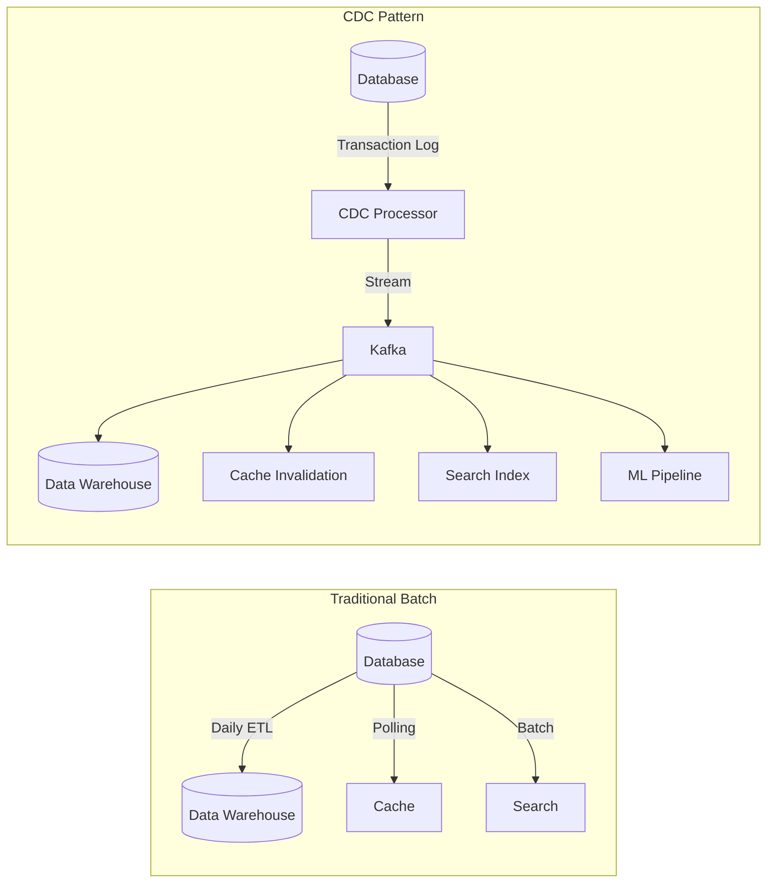
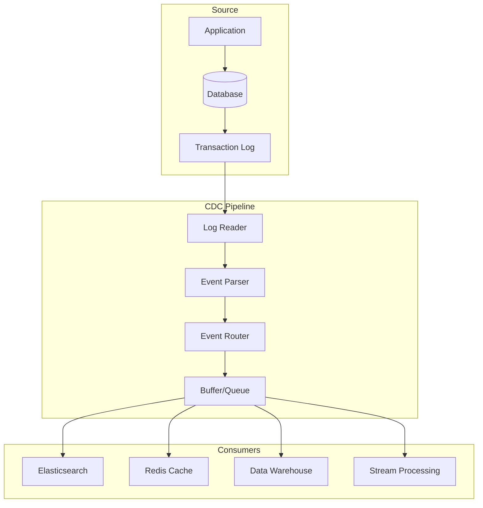
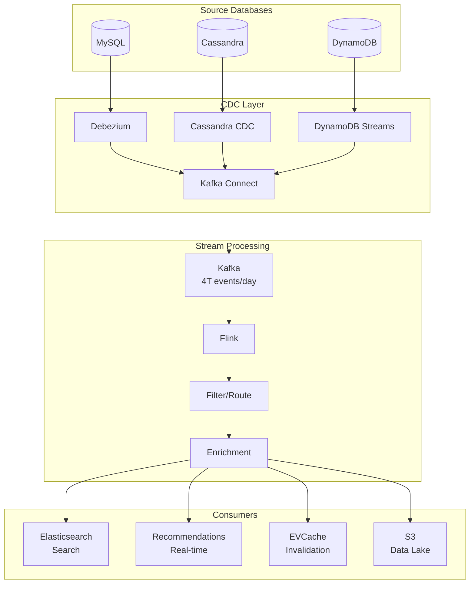
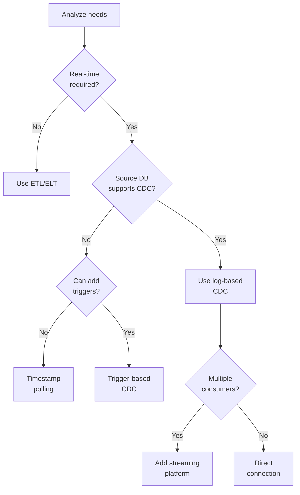

# Change Data Capture (CDC)

!!! success "🏆 Gold Standard Pattern"
    **Real-Time Data Synchronization** • Netflix, Airbnb, Uber proven
    
    The essential pattern for streaming database changes to downstream systems. CDC enables real-time data pipelines, cache invalidation, and cross-service synchronization with minimal latency.
    
    **Key Success Metrics:**
    - Netflix: 4 trillion events/day for personalization
    - Airbnb: 2B+ changes daily, sub-second latency
    - Uber: Petabyte-scale cross-region replication

## Essential Question

**How can we reliably capture every database change and stream it to multiple consumers without impacting source performance?**

## When to Use / When NOT to Use

### Use CDC When ✅

| Scenario | Why | Example |
|----------|-----|---------|
| **Real-time sync needed** | Millisecond propagation | Cache invalidation, search index updates |
| **Multiple consumers** | Decouple sources from sinks | Analytics, ML pipelines, audit logs |
| **Cross-service data sharing** | Avoid direct DB access | Microservices data distribution |
| **Event-driven architecture** | Database as event source | Order events trigger fulfillment |
| **Zero-downtime migrations** | Dual writes during cutover | Database migrations, re-platforming |

### DON'T Use When ❌

| Scenario | Why | Alternative |
|----------|-----|-------------|
| **Batch sufficient** | Real-time overhead unjustified | ETL/ELT pipelines |
| **Simple point queries** | Direct access simpler | API calls, read replicas |
| **Transactional consistency** | CDC is eventually consistent | Distributed transactions |
| **Small data volume** | Complexity not worth it | Direct replication |

## Level 1: Intuition (5 min)

### The Security Camera Analogy

<div class="axiom-box">
<h4>🔬 Law 5: Distributed Knowledge</h4>

CDC treats the database transaction log as the source of truth, turning state changes into an event stream that can be consumed by any system.

**Key Insight**: Every database write already creates a log entry. CDC just exposes this existing stream.
</div>

### Visual Architecture



## Level 2: Foundation (10 min)

### CDC Methods Comparison

| Method | How it Works | Pros | Cons | Use When |
|--------|--------------|------|------|----------|
| **Log-based** | Read transaction log | Low impact, reliable | DB-specific | Supported DBs |
| **Trigger-based** | Database triggers | Works anywhere | Performance impact | Legacy systems |
| **Query-based** | Poll with timestamps | Simple | Misses deletes, lag | Low volume |
| **Timestamp-based** | Track modified_at | Easy setup | Can miss updates | Audit not critical |

### Architecture Components



### Key Design Decisions

<div class="decision-box">
<h4>🎯 CDC Design Choices</h4>

**Delivery Guarantees**
- At-most-once: Accept data loss
- At-least-once: Handle duplicates
- Exactly-once: Complex but clean

**Data Format**
- Full row: Complete state
- Delta only: Just changes
- Before+After: Most flexible

**Schema Evolution**
- Backward compatible only
- Forward compatible
- Full compatibility
</div>

## Level 3: Deep Dive (15 min)

### Implementation Patterns

```python
# Log-based CDC implementation
class MySQLBinlogCDC:
    def __init__(self, connection_params, kafka_producer):
        self.mysql = mysql.connector.connect(**connection_params)
        self.stream = BinLogStreamReader(
            connection_settings=connection_params,
            server_id=100,
            blocking=True,
            resume_stream=True,
            only_events=[WriteRowsEvent, UpdateRowsEvent, DeleteRowsEvent]
        )
        self.producer = kafka_producer
    
    def process_events(self):
        for binlog_event in self.stream:
            # Convert binlog event to CDC event
            cdc_event = self.parse_event(binlog_event)
            
            # Add metadata
            cdc_event['timestamp'] = binlog_event.timestamp
            cdc_event['position'] = f"{self.stream.log_file}:{self.stream.log_pos}"
            cdc_event['operation'] = binlog_event.__class__.__name__
            
            # Send to Kafka
            self.producer.send(
                topic=f"cdc.{cdc_event['database']}.{cdc_event['table']}",
                key=cdc_event['primary_key'],
                value=json.dumps(cdc_event),
                headers=[('schema_version', cdc_event['schema_version'])]
            )
    
    def parse_event(self, event):
        if isinstance(event, WriteRowsEvent):
            return {
                'operation': 'INSERT',
                'after': event.rows[0]['values'],
                'table': event.table,
                'database': event.schema
            }
        elif isinstance(event, UpdateRowsEvent):
            return {
                'operation': 'UPDATE',
                'before': event.rows[0]['before_values'],
                'after': event.rows[0]['after_values'],
                'table': event.table,
                'database': event.schema
            }
        # Handle DELETE similarly
```

### CDC Event Format

```json
{
  "schema": {
    "type": "struct",
    "name": "order_change",
    "version": 1
  },
  "payload": {
    "before": {
      "order_id": 12345,
      "status": "pending",
      "total": 99.99
    },
    "after": {
      "order_id": 12345,
      "status": "confirmed",
      "total": 99.99
    },
    "source": {
      "database": "orders",
      "table": "orders",
      "server_id": 223344,
      "binlog_file": "mysql-bin.000003",
      "binlog_position": 154789,
      "timestamp": 1634567890
    },
    "op": "u",
    "ts_ms": 1634567890000
  }
}
```

### Common Patterns

| Pattern | Purpose | Implementation |
|---------|---------|----------------|
| **Outbox Pattern** | Transactional guarantees | Write events to outbox table |
| **Snapshot + CDC** | Initial load + streaming | Bulk load then stream changes |
| **Filter & Route** | Selective propagation | Topic/queue per table or pattern |
| **Transform** | Data enrichment | Stream processing on CDC events |

## Level 4: Expert (20 min)

### Advanced Techniques

```yaml
# Production CDC configuration
cdc_pipeline:
  source:
    type: mysql_binlog
    server_id: 10001
    binlog_position: "mysql-bin.000123:4567"
    
  processing:
    parallelism: 16
    buffer_size: 10000
    checkpoint_interval: 30s
    
  transformations:
    - type: filter
      include_tables: ["orders.*", "customers.*"]
      exclude_operations: ["TRUNCATE"]
      
    - type: enrich
      join_with: customer_cache
      fields: ["customer_name", "customer_tier"]
      
    - type: mask
      fields: ["ssn", "credit_card"]
      method: sha256
      
  sinks:
    - type: kafka
      topic_pattern: "cdc.${database}.${table}"
      compression: snappy
      batch_size: 1000
      
    - type: elasticsearch
      index_pattern: "${table}_${yyyy_MM}"
      document_id: "${primary_key}"
```

### Performance Optimization

| Optimization | Technique | Impact |
|--------------|-----------|--------|
| **Batching** | Group changes | 10x throughput |
| **Compression** | Snappy/LZ4 | 70% bandwidth reduction |
| **Partitioning** | By table/key | Linear scaling |
| **Filtering** | Early in pipeline | Reduce load |
| **Caching** | Recent positions | Fast recovery |

### Monitoring Metrics

```python
class CDCMonitoring:
    def __init__(self):
        self.metrics = {
            'lag_seconds': Gauge('cdc_lag_seconds'),
            'events_processed': Counter('cdc_events_total'),
            'errors': Counter('cdc_errors_total'),
            'throughput': Histogram('cdc_throughput_eps')
        }
    
    def track_lag(self, source_timestamp):
        lag = time.time() - source_timestamp
        self.metrics['lag_seconds'].set(lag)
        
        if lag > 60:  # 1 minute threshold
            alert("CDC lag exceeds threshold", lag=lag)
```

## Level 5: Mastery (30 min)

### Case Study: Netflix's CDC Pipeline



**Scale Achievements**:
- 4 trillion events/day
- Sub-second end-to-end latency
- 99.99% delivery guarantee
- Automatic schema evolution

### Economic Analysis

```python
def cdc_vs_batch_roi(
    daily_changes,
    data_freshness_value_per_hour,
    num_consumers
):
    # Batch approach
    batch_delay_hours = 12  # Twice daily
    batch_lost_value = batch_delay_hours * data_freshness_value_per_hour
    batch_infra_cost = 1000  # Simplified
    
    # CDC approach  
    cdc_delay_minutes = 1
    cdc_lost_value = (cdc_delay_minutes/60) * data_freshness_value_per_hour
    cdc_infra_cost = 3000  # Higher infrastructure
    
    # ROI calculation
    value_gain = batch_lost_value - cdc_lost_value
    cost_increase = cdc_infra_cost - batch_infra_cost
    
    return {
        'monthly_value_gain': value_gain * 30,
        'monthly_cost_increase': cost_increase,
        'roi_months': cost_increase / (value_gain * 30),
        'worth_it': value_gain > cost_increase
    }
```

## Quick Reference

### Decision Matrix



### Implementation Checklist ✓

- [ ] Choose CDC method based on source database
- [ ] Design event schema with versioning
- [ ] Set up initial snapshot process
- [ ] Implement position tracking for recovery
- [ ] Add monitoring for lag and errors
- [ ] Test schema evolution scenarios
- [ ] Plan for handling large transactions
- [ ] Document data lineage
- [ ] Set up alerting for failures
- [ ] Test disaster recovery

### Common Tools

| Database | CDC Tool | Method | Notes |
|----------|----------|--------|-------|
| **MySQL** | Debezium, Maxwell | Binlog | Most mature |
| **PostgreSQL** | Debezium, wal2json | WAL | Logical replication |
| **MongoDB** | Change Streams | Oplog | Built-in |
| **SQL Server** | Debezium, CT | Change Tracking | Enterprise features |
| **Oracle** | GoldenGate, XStream | Redo logs | Licensed |

## Related Patterns

### Core Combinations
- **[Event Sourcing](./event-sourcing.md)**: CDC provides the events
- **[Outbox Pattern](../patterns/outbox.md)**: Transactional CDC
- **[Saga Pattern](./saga.md)**: CDC triggers distributed transactions

### Supporting Patterns
- **[Stream Processing](../patterns/stream-processing.md)**: Process CDC events
- **[CQRS](./cqrs.md)**: CDC updates read models
- **[Cache Invalidation](../patterns/cache-invalidation.md)**: Real-time cache updates

### Alternatives
- **[Batch ETL](../patterns/etl.md)**: When real-time not needed
- **[Database Replication](../patterns/replication.md)**: Full database sync
- **[Polling](../patterns/polling.md)**: Simple but less efficient

## Further Reading

- [Debezium Documentation](https://debezium.io/documentation/)
- [Kafka Connect CDC](https://docs.confluent.io/kafka-connect/current/)
- [AWS DMS CDC](https://docs.aws.amazon.com/dms/latest/userguide/CHAP_CDC.html)
- [Change Data Capture Patterns](https://www.confluent.io/blog/cdc-and-streaming-analytics/)

### Case Studies
- [Netflix: DBLog Framework](https://netflixtechblog.com/dblog-a-generic-change-data-capture-framework-69351fb9099b)
- [Airbnb: SpinalTap](https://medium.com/airbnb-engineering/capturing-data-evolution-in-a-service-oriented-architecture-72f7c643ee6f)
- [Uber: Schemaless CDC](https://eng.uber.com/schemaless-rewrite/)