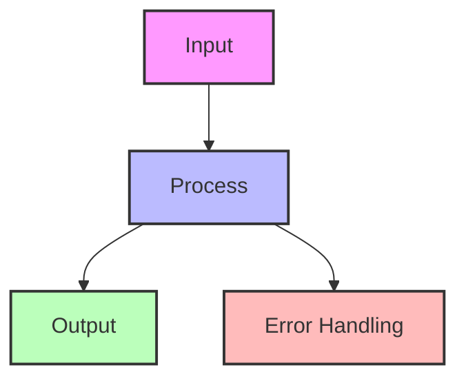

# Change Data Capture (CDC)

!!! success "🏆 Gold Standard Pattern"
    **Real-Time Data Synchronization** • Netflix, Airbnb, Uber proven
    
    The essential pattern for streaming database changes to downstream systems. CDC enables real-time data pipelines, cache invalidation, and cross-service synchronization with minimal latency.
    
    **Key Success Metrics:**
    - Netflix: 4 trillion events/day for personalization
    - Airbnb: 2B+ changes daily, sub-second latency
    - Uber: Petabyte-scale cross-region replication

## Essential Question

**How can we reliably capture every database change and stream it to multiple consumers without impacting source performance?**

## When to Use / When NOT to Use

### Use CDC When ✅

| Scenario | Why | Example |
|----------|-----|---------|
| **Real-time sync needed** | Millisecond propagation | Cache invalidation, search index updates |
| **Multiple consumers** | Decouple sources from sinks | Analytics, ML pipelines, audit logs |
| **Cross-service data sharing** | Avoid direct DB access | Microservices data distribution |
| **Event-driven architecture** | Database as event source | Order events trigger fulfillment |
| **Zero-downtime migrations** | Dual writes during cutover | Database migrations, re-platforming |

### DON'T Use When ❌

| Scenario | Why | Alternative |
|----------|-----|-------------|
| **Batch sufficient** | Real-time overhead unjustified | ETL/ELT pipelines |
| **Simple point queries** | Direct access simpler | API calls, read replicas |
| **Transactional consistency** | CDC is eventually consistent | Distributed transactions |
| **Small data volume** | Complexity not worth it | Direct replication |

## Level 1: Intuition (5 min)

### The Security Camera Analogy

<h4>🔬 Law 5: Distributed Knowledge</h4>

CDC treats the database transaction log as the source of truth, turning state changes into an event stream that can be consumed by any system.

**Key Insight**: Every database write already creates a log entry. CDC just exposes this existing stream.

### Visual Architecture

## Level 2: Foundation (10 min)

### CDC Methods Comparison

| Method | How it Works | Pros | Cons | Use When |
|--------|--------------|------|------|----------|
| **Log-based** | Read transaction log | Low impact, reliable | DB-specific | Supported DBs |
| **Trigger-based** | Database triggers | Works anywhere | Performance impact | Legacy systems |
| **Query-based** | Poll with timestamps | Simple | Misses deletes, lag | Low volume |
| **Timestamp-based** | Track modified_at | Easy setup | Can miss updates | Audit not critical |

### Architecture Components

### Key Design Decisions

<h4>🎯 CDC Design Choices</h4>

**Delivery Guarantees**
- At-most-once: Accept data loss
- At-least-once: Handle duplicates
- Exactly-once: Complex but clean

**Data Format**
- Full row: Complete state
- Delta only: Just changes
- Before+After: Most flexible

**Schema Evolution**
- Backward compatible only
- Forward compatible
- Full compatibility

## Level 3: Deep Dive (15 min)

### CDC Implementation Flow

### CDC Event Format

### Common Patterns

| Pattern | Purpose | Implementation |
|---------|---------|----------------|
| **Outbox Pattern** | Transactional guarantees | Write events to outbox table |
| **Snapshot + CDC** | Initial load + streaming | Bulk load then stream changes |
| **Filter & Route** | Selective propagation | Topic/queue per table or pattern |
| **Transform** | Data enrichment | Stream processing on CDC events |

## Level 4: Expert (20 min)

### CDC Pipeline Configuration

| Component | Configuration | Purpose |
|-----------|---------------|---------|
| **Source** | Binlog position tracking | Resume after failure |
| **Parallelism** | 16 threads | Scale throughput |
| **Filtering** | Table/operation patterns | Reduce noise |
| **Enrichment** | Join with cache | Add context |
| **Masking** | PII fields | Compliance |
| **Routing** | Topic per table | Organized consumption |

### Performance Optimization

| Optimization | Technique | Impact |
|--------------|-----------|--------|
| **Batching** | Group changes | 10x throughput |
| **Compression** | Snappy/LZ4 | 70% bandwidth reduction |
| **Partitioning** | By table/key | Linear scaling |
| **Filtering** | Early in pipeline | Reduce load |
| **Caching** | Recent positions | Fast recovery |

### Critical CDC Metrics

| Metric | Alert Threshold | Impact |
|--------|----------------|--------|
| **Replication lag** | > 60 seconds | Stale data |
| **Error rate** | > 0.1% | Data loss risk |
| **Throughput drop** | < 80% baseline | Bottleneck |
| **Queue depth** | > 100k events | Memory pressure |

## Level 5: Mastery (30 min)

### Case Study: Netflix's CDC Pipeline

**Scale Achievements**:
- 4 trillion events/day
- Sub-second end-to-end latency
- 99.99% delivery guarantee
- Automatic schema evolution

### Economic Analysis

## Quick Reference

### Decision Matrix

### Implementation Checklist ✓

- [ ] Choose CDC method based on source database
- [ ] Design event schema with versioning
- [ ] Set up initial snapshot process
- [ ] Implement position tracking for recovery
- [ ] Add monitoring for lag and errors
- [ ] Test schema evolution scenarios
- [ ] Plan for handling large transactions
- [ ] Document data lineage
- [ ] Set up alerting for failures
- [ ] Test disaster recovery

### Common Tools

| Database | CDC Tool | Method | Notes |
|----------|----------|--------|-------|
| **MySQL** | Debezium, Maxwell | Binlog | Most mature |
| **PostgreSQL** | Debezium, wal2json | WAL | Logical replication |
| **MongoDB** | Change Streams | Oplog | Built-in |
| **SQL Server** | Debezium, CT | Change Tracking | Enterprise features |
| **Oracle** | GoldenGate, XStream | Redo logs | Licensed |

## Related Patterns

### Core Combinations
- **[Event Sourcing](./event-sourcing.md)**: CDC provides the events
- **[Outbox Pattern](outbox.md)**: Transactional CDC
- **[Saga Pattern](./saga.md)**: CDC triggers distributed transactions

### Supporting Patterns
- **[Stream Processing](../../pattern-library/stream-processing.md)**: Process CDC events
- **[CQRS](./cqrs.md)**: CDC updates read models
- **[Cache Invalidation](../../pattern-library/etl.md)**: When real-time not needed
- **[Database Replication](../../pattern-library/polling.md)**: Simple but less efficient

## Further Reading

- [Debezium Documentation](https:/debezium.io/documentation/)
- [Kafka Connect CDC](https:/docs.confluent.io/kafka-connect/current/)
- [AWS DMS CDC](https:/docs.aws.amazon.com/dms/latest/userguide/CHAP_CDC.html/)
- [Change Data Capture Patterns](https:/www.confluent.io/blog/cdc-and-streaming-analytics/)

### Case Studies
- [Netflix: DBLog Framework](https:/netflixtechblog.com/dblog-a-generic-change-data-capture-framework-69351fb9099b/)
- [Airbnb: SpinalTap](https:/medium.com/airbnb-engineering/capturing-data-evolution-in-a-service-oriented-architecture-72f7c643ee6f/)
- [Uber: Schemaless CDC](https:/eng.uber.com/schemaless-rewrite/)

