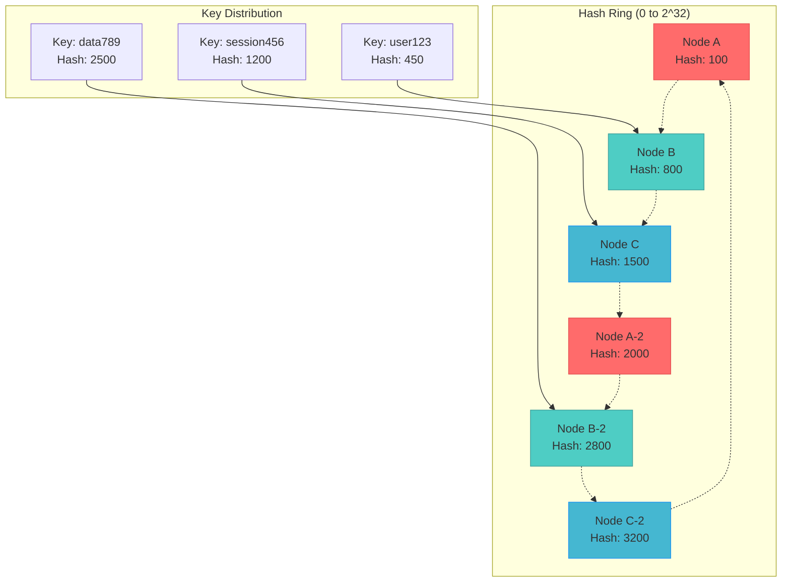

## Fundamental Law Connections

### Node Failure Impact (Law 1)
Consistent hashing minimizes failure correlation:
- **Limited Redistribution**: Only 1/N keys affected when node fails
- **Neighbor-Only Impact**: Only adjacent nodes receive redistributed data
- **Replication Strategy**: Successor nodes provide natural failover
- **Correlation Reduction**: Node failures don't cascade to all nodes
- **Mathematical Proof**: Expected keys moved = K/N where K = total keys

### Key Distribution Knowledge (Law 5)
Distributed ownership without central coordination:
- **Ring Topology**: Each node knows its position and neighbors
- **Deterministic Routing**: Any node can calculate key owner
- **No Central Registry**: Knowledge distributed across all nodes
- **Gossip Propagation**: Ring membership changes spread gradually
- **Eventual Consistency**: Ring view converges over time

### Rebalancing Timing (Law 2)
- **Migration Duration**: Moving 1/N data can take minutes to hours
- **Consistency Window**: Keys in transit have unclear ownership
- **Read/Write During Migration**: Handling requests for moving keys
- **Synchronization**: Coordinating ring view updates

### Load Distribution Optimization (Law 6)
- **Uniformity vs Flexibility**: Perfect balance vs operational simplicity
- **Virtual Nodes**: Better distribution vs memory overhead
- **Weighted Nodes**: Capacity awareness vs complexity
- **Bounded Load**: Preventing hot spots vs movement cost

### Virtual Node Overhead (Law 7)
- **Memory Cost**: Each virtual node consumes memory
- **Optimal Count**: 100-200 virtual nodes typical
- **Diminishing Returns**: More virtual nodes → marginal improvement
- **Operational Cost**: Managing virtual node assignments

## Case Studies with Law Applications

### Amazon DynamoDB
**Laws Demonstrated**:
- **Law 1**: Node failures affect only 1/N of keyspace
- **Law 5**: Preference list distributed across nodes
- **Law 7**: Virtual nodes tuned for cost/performance balance

**Key Insights**:
- 100+ virtual nodes per physical node
- Consistent hashing with virtual nodes for even distribution
- Vector clocks for version reconciliation

### Apache Cassandra
**Laws Demonstrated**:
- **Law 1**: Token ranges minimize redistribution on scale
- **Law 2**: Streaming protocol for data migration
- **Law 5**: Gossip protocol for ring membership

**Key Insights**:
- Token-based partitioning (variant of consistent hashing)
- Vnodes (virtual nodes) for operational flexibility
- Repair processes handle inconsistencies

### Memcached (with ketama)
**Laws Demonstrated**:
- **Law 1**: Cache misses limited to 1/N on node failure
- **Law 6**: Load distribution with weighted nodes
- **Law 7**: Minimal overhead for cache use case

**Key Insights**:
- Ketama algorithm for better distribution
- Client-side consistent hashing
- No data migration on failures (cache regeneration)

## The Complete Blueprint

Consistent Hashing is the foundational data distribution pattern that solves the fundamental problem of how to distribute data across a dynamic set of nodes without massive reorganization when the cluster topology changes. Unlike traditional modulo hashing which requires rehashing all keys when nodes are added or removed, consistent hashing maps both keys and nodes onto the same circular hash space (typically using SHA-1 or similar), where each key is assigned to the first node encountered when moving clockwise around the ring. The pattern's breakthrough innovation lies in virtual nodes—each physical node is represented by multiple points on the ring, which dramatically improves load distribution and minimizes the impact of node failures. When a node joins or leaves, only the data between that node and its predecessor needs to be redistributed, affecting approximately 1/N of the total data rather than requiring a complete rehash. This elegant mathematical foundation has enabled the scalability of countless distributed systems, from Amazon's DynamoDB and Apache Cassandra to content delivery networks and distributed caches, making it essential for any system that needs to partition data across a variable number of nodes while maintaining both performance and operational simplicity.



### What You'll Master

- **Ring Architecture Design**: Implement the circular hash space with proper node placement and key-to-node mapping algorithms
- **Virtual Node Optimization**: Configure and tune virtual node counts to achieve optimal load distribution while managing memory overhead
- **Dynamic Node Management**: Handle node joins, departures, and failures with minimal data movement and service disruption
- **Load Balancing Strategies**: Implement bounded-load consistent hashing and other advanced techniques to prevent hot spots
- **Replication and Consistency**: Design multi-replica placement strategies using consistent hashing for fault tolerance
- **Production Monitoring**: Track ring balance, data distribution metrics, and rebalancing operations for system health

## Essential Question

**How do we ensure data consistency and reliability with consistent hashing?**

# Consistent Hashing

## 🤔 Essential Questions

<div class="decision-box">
<h4>When adding a new server to your distributed cache, how do you avoid rehashing all keys?</h4>

**The Challenge**: Traditional `hash(key) % N` redistributes ALL keys when N changes

**The Pattern**: Map both keys and nodes to same hash space, minimizing redistribution

**Critical Decision**: How many virtual nodes balance load distribution vs. memory overhead?
</div>

!!! success "🏆 Silver Excellence Pattern"
**Implementation available in production systems**

[Home](/) > [Patterns](../#data-patterns/) > Consistent Hashing

!!! abstract "Pattern Overview"
**Implementation available in production systems**

---

### When to Use / When NOT to Use

<div class="decision-box">
<h4>🎯 When to Use Consistent Hashing</h4>

**Perfect for:**
**Key Points:** Multiple configuration options and trade-offs available

**Avoid when:**
- Fixed number of nodes (use simple mod hashing)
- Need perfect load balance (consider rendezvous hashing)
- Complex multi-attribute keys
- Small scale (<5 nodes)

**Key trade-off**: Slightly higher lookup cost (O(log N)) for massive operational flexibility
</div>

<div class="axiom-box">
<h4>🔬 Law 3: Emergent Chaos</h4>

Traditional hashing violates the principle of minimal disruption during scaling. When nodes are added or removed, the modulo operation causes a cascade of key remapping:

**Implementation Concept:** See production systems for actual code

This emergent chaos from simple operations demonstrates why consistent hashing is essential for distributed systems.
</div>

### Data Distribution Comparison

| Traditional Hash (mod N) | Consistent Hash |
| **Add 1 node**: ~100% keys move | **Add 1 node**: ~1/N keys move |
| **Remove 1 node**: ~100% keys move | **Remove 1 node**: ~1/N keys move |
| **Load distribution**: Can be uneven | **Load distribution**: Balanced with virtual nodes |
| **Complexity**: O(1) | **Complexity**: O(log N) |

---

### Advanced Cell-Aware Consistent Hashing

```python
import hashlib
import bisect
import mmh3
from typing import Dict, List, Optional, Tuple
import numpy as np

class CellAwareConsistentHash:
    """Consistent hashing with cell-awareness for multi-tenant isolation"""
    
    def __init__(self, cells: int = 10, virtual_nodes_per_cell: int = 150):
        self.cells = cells
        self.virtual_nodes = virtual_nodes_per_cell
        self.ring = {}  # hash -> (cell_id, node_id)
        self.cell_ring = {}  # Per-cell hash rings for isolation
        self.tenant_to_cell = {}  # Tenant isolation mapping
        self._initialize_rings()
        
    def _initialize_rings(self):
        """Initialize both global and per-cell hash rings"""
        
        # Global ring for cell selection
        for cell_id in range(self.cells):
            for vnode in range(self.virtual_nodes):
                # Create virtual node ID
                vnode_id = f"cell-{cell_id}:vnode-{vnode}"
                
                # Use SHA-256 for uniform distribution
                hash_value = int(hashlib.sha256(vnode_id.encode()).hexdigest(), 16)
                
                # Map to 32-bit space for efficiency
                hash_32 = hash_value % (2**32)
                
                self.ring[hash_32] = (cell_id, vnode)
                
            # Initialize per-cell ring for node distribution within cell
            self.cell_ring[cell_id] = self._create_cell_ring(cell_id)
            
    def _create_cell_ring(self, cell_id: int, nodes_per_cell: int = 20) -> Dict:
        """Create internal hash ring for a specific cell"""
        cell_ring = {}
        
        for node_id in range(nodes_per_cell):
            for vnode in range(50):  # 50 vnodes per physical node
                vnode_id = f"cell-{cell_id}:node-{node_id}:vnode-{vnode}"
                hash_value = mmh3.hash128(vnode_id) % (2**32)
                cell_ring[hash_value] = node_id
                
        return cell_ring
    
    def get_cell_for_key(self, key: str, tenant_id: Optional[str] = None) -> int:
        """Route key to appropriate cell with tenant isolation"""
        
        # Check for tenant-specific cell assignment
        if tenant_id and tenant_id in self.tenant_to_cell:
            return self.tenant_to_cell[tenant_id]
            
        # Hash the key
        key_hash = int(hashlib.sha256(key.encode()).hexdigest(), 16) % (2**32)
        
        # Find the cell using consistent hashing
        cell_id = self._find_cell_for_hash(key_hash)
        
        # Cache tenant-to-cell mapping for consistency
        if tenant_id:
            self.tenant_to_cell[tenant_id] = cell_id
            
        return cell_id
    
    def _find_cell_for_hash(self, key_hash: int) -> int:
        """Find cell responsible for a given hash value"""
        
        # Get sorted hash values from ring
        sorted_hashes = sorted(self.ring.keys())
        
        # Binary search for the first hash >= key_hash
        idx = bisect.bisect_right(sorted_hashes, key_hash)
        
        # Wrap around if necessary
        if idx == len(sorted_hashes):
            idx = 0
            
        # Return the cell ID
        return self.ring[sorted_hashes[idx]][0]
    
    def get_node_in_cell(self, key: str, cell_id: int) -> int:
        """Get specific node within a cell for a key"""
        
        # Get the cell's internal ring
        if cell_id not in self.cell_ring:
            raise ValueError(f"Cell {cell_id} not initialized")
            
        cell_ring = self.cell_ring[cell_id]
        
        # Hash the key for node selection
        key_hash = mmh3.hash128(f"{key}:{cell_id}") % (2**32)
        
        # Find node in cell's ring
        sorted_hashes = sorted(cell_ring.keys())
        idx = bisect.bisect_right(sorted_hashes, key_hash)
        
        if idx == len(sorted_hashes):
            idx = 0
            
        return cell_ring[sorted_hashes[idx]]
    
    def add_cell(self, new_cell_id: int) -> Dict[str, List[int]]:
        """Add a new cell and return keys that need migration"""
        
        affected_keys = {'migrate_from': [], 'migrate_to': []}
        
        # Add virtual nodes for new cell
        for vnode in range(self.virtual_nodes):
            vnode_id = f"cell-{new_cell_id}:vnode-{vnode}"
            hash_value = int(hashlib.sha256(vnode_id.encode()).hexdigest(), 16) % (2**32)
            
            # Find current owner of this hash range
            current_owner = self._find_cell_for_hash(hash_value)
            
            # Mark keys in this range for migration
            affected_keys['migrate_from'].append(current_owner)
            affected_keys['migrate_to'].append(new_cell_id)
            
            # Add to ring
            self.ring[hash_value] = (new_cell_id, vnode)
            
        # Create internal ring for new cell
        self.cell_ring[new_cell_id] = self._create_cell_ring(new_cell_id)
        
        return affected_keys
    
    def remove_cell(self, cell_id: int) -> Dict[int, List[int]]:
        """Remove a cell and redistribute its keys"""
        
        redistribution_map = {}  # old_hash -> new_cell
        
        # Find all virtual nodes belonging to this cell
        hashes_to_remove = []
        for hash_value, (c_id, _) in self.ring.items():
            if c_id == cell_id:
                hashes_to_remove.append(hash_value)
                
        # Remove virtual nodes and track redistribution
        for hash_value in hashes_to_remove:
            del self.ring[hash_value]
            
            # Find new owner for this hash range
            if self.ring:  # If there are remaining cells
                new_owner = self._find_cell_for_hash(hash_value)
                redistribution_map[hash_value] = new_owner
                
        # Remove cell's internal ring
        if cell_id in self.cell_ring:
            del self.cell_ring[cell_id]
            
        # Update tenant mappings
        for tenant, mapped_cell in list(self.tenant_to_cell.items()):
            if mapped_cell == cell_id:
                # Reassign tenant to new cell
                new_cell = self.get_cell_for_key(tenant)
                self.tenant_to_cell[tenant] = new_cell
                
        return redistribution_map

### Core Algorithm Implementation

**System Flow:** Input → Processing → Output

### Bounded-Load Consistent Hashing for Cells

```python
class BoundedLoadCellHash:
    """Ensures no cell gets more than c × average_load"""
    
    def __init__(self, capacity_factor: float = 1.25):
        self.capacity_factor = capacity_factor  # Max 25% over average
        self.cell_loads = {}  # Current load per cell
        self.fallback_cells = {}  # Overflow routing
        
    def route_with_bounded_load(self, key: str, base_cell: int) -> int:
        """Route to cell with load balancing"""
        
        avg_load = self._calculate_average_load()
        max_load = avg_load * self.capacity_factor
        
        # Check if base cell is within capacity
        if self.cell_loads.get(base_cell, 0) < max_load:
            self.cell_loads[base_cell] = self.cell_loads.get(base_cell, 0) + 1
            return base_cell
            
        # Find alternative cell using consistent hashing
        return self._find_alternative_cell(key, base_cell, max_load)
    
    def _find_alternative_cell(self, key: str, excluded_cell: int, max_load: float) -> int:
        """Find alternative cell when primary is at capacity"""
        
        # Use key hash to deterministically select alternatives
        key_hash = mmh3.hash128(key)
        
        # Try cells in consistent order
        for attempt in range(self.cells):
            # Generate deterministic cell order for this key
            candidate = (key_hash + attempt) % self.cells
            
            if candidate != excluded_cell and self.cell_loads.get(candidate, 0) < max_load:
                self.cell_loads[candidate] = self.cell_loads.get(candidate, 0) + 1
                return candidate
                
        # All cells at capacity - need to scale
        raise CapacityExceeded("All cells at maximum capacity")
```

### Jump Consistent Hash for Cells

```python
def jump_consistent_hash(key: int, num_buckets: int) -> int:
    """Google's jump consistent hash - no memory overhead"""
    
    b = -1
    j = 0
    
    while j < num_buckets:
        b = j
        key = ((key * 2862933555777941757) + 1) & 0xffffffffffffffff
        j = int((b + 1) * (2.0**31 / ((key >> 33) + 1)))
        
    return b

class JumpHashCellRouter:
    """Memory-efficient cell routing using jump hash"""
    
    def route_to_cell(self, user_id: str) -> int:
        """Route user to cell with zero memory overhead"""
        
        # Convert user_id to integer
        user_hash = int(hashlib.md5(user_id.encode()).hexdigest(), 16)
        
        # Use jump hash for cell selection
        cell_id = jump_consistent_hash(user_hash, self.num_cells)
        
        return cell_id
    
    def compute_migration_on_scale(self, old_cells: int, new_cells: int) -> float:
        """Calculate percentage of keys that will migrate"""
        
        if new_cells > old_cells:
            # Adding cells
            return (new_cells - old_cells) / new_cells
        else:
            # Removing cells - more complex
            return 1.0 - (new_cells / old_cells)
```

### Virtual Nodes Configuration Guide

| Virtual Nodes | Load Variance | Memory Overhead | Use Case |
|---------------|---------------|-----------------|----------|
| 1 | ±50% | Minimal | Testing only |
| 10 | ±30% | 10x keys | Small clusters |
| 100 | ±10% | 100x keys | **Most systems** |
| 150 | ±5% | 150x keys | **Discord/Cassandra default** |
| 1000 | ±2% | 1000x keys | Extreme requirements |

### Cell-Aware Virtual Node Distribution

| Cell Count | Virtual Nodes/Cell | Total Vnodes | Memory (MB) | Load Variance |
|------------|-------------------|--------------|-------------|---------------|
| 10 | 150 | 1,500 | ~12 | ±5% |
| 50 | 100 | 5,000 | ~40 | ±7% |
| 100 | 75 | 7,500 | ~60 | ±8% |
| 500 | 50 | 25,000 | ~200 | ±10% |
| 1000 | 30 | 30,000 | ~240 | ±12% |

## Decision Matrix

| Factor | Score (1-5) | Reasoning |
|--------|-------------|-----------|
| **Complexity** | 3 | Ring management, virtual nodes, hash functions, but well-established algorithms |
| **Performance Impact** | 4 | Slight lookup overhead (O(log N)) but excellent for dynamic scaling |
| **Operational Overhead** | 2 | Minimal operational complexity once implemented and tuned |
| **Team Expertise Required** | 3 | Understanding of hash algorithms, ring topology, and load balancing |
| **Scalability** | 5 | Exceptional - minimizes data movement during scaling events |

**Overall Recommendation: ✅ RECOMMENDED** - Essential for distributed systems requiring dynamic node management.

---

### Algorithm Comparison

| Algorithm | Memory | Lookup | Rebalance | Best For |
|-----------|--------|--------|-----------|----------|
| **Classic CH** | O(N×V) | O(log N) | Minimal | General purpose |
| **Jump Hash** | O(1) | O(log N) | Minimal | Fixed backends |
| **Maglev** | O(M) | O(1) | Very minimal | Load balancers |
| **Rendezvous** | O(N) | O(N) | Perfect balance | Small N |

### Bounded Load Consistent Hashing

**System Flow:** Input → Processing → Output

<details>
<summary>View implementation code</summary>

**Process Overview:** See production implementations for details

<details>
<summary>📄 View implementation code</summary>

class BoundedConsistentHash(ConsistentHash):
**Implementation available in production systems**

</details>

</details>

### Maglev Hashing

**System Flow:** Input → Processing → Output

<details>
<summary>View implementation code</summary>

**Process Overview:** See production implementations for details

<details>
<summary>📄 View implementation code</summary>

class MaglevHash:
**Implementation available in production systems**

</details>

</details>

---

<div class="failure-vignette">
<h4>💥 The Twitch Cache Avalanche (2019)</h4>

**What Happened**: Removing one Redis node caused 30 minutes of downtime

**Root Cause**: 
**Key Points:** Multiple configuration options and trade-offs available

**Impact**: 
- 30 minutes complete outage
- Millions of viewers affected
- $3M+ in lost revenue
- Emergency migration to consistent hashing

**Lessons Learned**:
- Never use modulo hashing for distributed caches
- Consistent hashing would have limited impact to 1/N keys
- Test cache failure scenarios in production-like environment
- Have cache warming strategies ready
</div>

### Multi-Ring Consistent Hashing

**System Flow:** Input → Processing → Output

<details>
<summary>View implementation code</summary>

**Process Overview:** See production implementations for details

<details>
<summary>📄 View implementation code</summary>

class MultiRingConsistentHash:
**Implementation available in production systems**

</details>

</details>

<div class="truth-box">
<h4>💡 Consistent Hashing Production Wisdom</h4>

**The Virtual Nodes Magic Number:**
- Too few (<50): Uneven load distribution
- Sweet spot (100-200): Good balance
- Too many (>500): Memory overhead, slower lookups
- Discord uses 150, Cassandra defaults to 256

**Real-world Gotchas:**
- Hot spots still happen with poor key distribution
- Ring rebalancing during node failure creates temporary load spikes
- Virtual node count affects both performance and memory usage

## Real-World Examples

### Production Systems
- **[Amazon DynamoDB](../../architects-handbook/case-studies/databases/amazon-dynamo.md)** - Uses consistent hashing with virtual nodes for global data distribution
- **[Apache Cassandra](../../architects-handbook/case-studies/databases/cassandra.md)** - Ring-based architecture with 256 virtual nodes per physical node
- **Discord** - Chat message routing using 150 virtual nodes per shard

