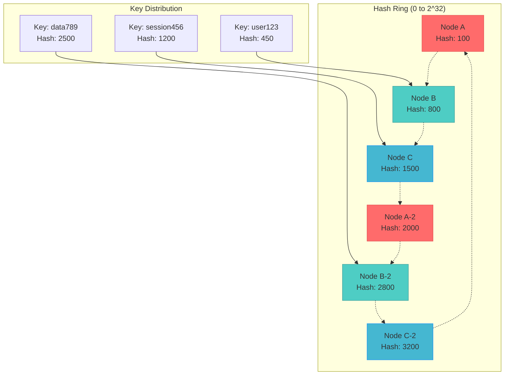

## The Complete Blueprint

Consistent Hashing is the foundational data distribution pattern that solves the fundamental problem of how to distribute data across a dynamic set of nodes without massive reorganization when the cluster topology changes. Unlike traditional modulo hashing which requires rehashing all keys when nodes are added or removed, consistent hashing maps both keys and nodes onto the same circular hash space (typically using SHA-1 or similar), where each key is assigned to the first node encountered when moving clockwise around the ring. The pattern's breakthrough innovation lies in virtual nodes—each physical node is represented by multiple points on the ring, which dramatically improves load distribution and minimizes the impact of node failures. When a node joins or leaves, only the data between that node and its predecessor needs to be redistributed, affecting approximately 1/N of the total data rather than requiring a complete rehash. This elegant mathematical foundation has enabled the scalability of countless distributed systems, from Amazon's DynamoDB and Apache Cassandra to content delivery networks and distributed caches, making it essential for any system that needs to partition data across a variable number of nodes while maintaining both performance and operational simplicity.

### What You'll Master

- **Ring Architecture Design**: Implement the circular hash space with proper node placement and key-to-node mapping algorithms
- **Virtual Node Optimization**: Configure and tune virtual node counts to achieve optimal load distribution while managing memory overhead
- **Dynamic Node Management**: Handle node joins, departures, and failures with minimal data movement and service disruption
- **Load Balancing Strategies**: Implement bounded-load consistent hashing and other advanced techniques to prevent hot spots
- **Replication and Consistency**: Design multi-replica placement strategies using consistent hashing for fault tolerance
- **Production Monitoring**: Track ring balance, data distribution metrics, and rebalancing operations for system health

## Essential Question

**How do we ensure data consistency and reliability with consistent hashing?**

# Consistent Hashing

## 🤔 Essential Questions

<h4>When adding a new server to your distributed cache, how do you avoid rehashing all keys?</h4>

**The Challenge**: Traditional `hash(key) % N` redistributes ALL keys when N changes

**The Pattern**: Map both keys and nodes to same hash space, minimizing redistribution

**Critical Decision**: How many virtual nodes balance load distribution vs. memory overhead?

!!! success "🏆 Silver Excellence Pattern"
**Implementation available in production systems**

[Home](/) > [Patterns](../#data-patterns/) > Consistent Hashing

!!! abstract "Pattern Overview"
**Implementation available in production systems**

---

### When to Use / When NOT to Use

<h4>🎯 When to Use Consistent Hashing</h4>

**Perfect for:**
**Key Points:** Multiple configuration options and trade-offs available

**Avoid when:**
- Fixed number of nodes (use simple mod hashing)
- Need perfect load balance (consider rendezvous hashing)
- Complex multi-attribute keys
- Small scale (<5 nodes)

**Key trade-off**: Slightly higher lookup cost (O(log N)) for massive operational flexibility

<h4>🔬 Law 3: Emergent Chaos</h4>

Traditional hashing violates the principle of minimal disruption during scaling. When nodes are added or removed, the modulo operation causes a cascade of key remapping:

**Implementation Concept:** See production systems for actual code

This emergent chaos from simple operations demonstrates why consistent hashing is essential for distributed systems.

### Data Distribution Comparison

| Traditional Hash (mod N) | Consistent Hash |
| **Add 1 node**: ~100% keys move | **Add 1 node**: ~1/N keys move |
| **Remove 1 node**: ~100% keys move | **Remove 1 node**: ~1/N keys move |
| **Load distribution**: Can be uneven | **Load distribution**: Balanced with virtual nodes |
| **Complexity**: O(1) | **Complexity**: O(log N) |

---

### Core Algorithm Implementation

**System Flow:** Input → Processing → Output

### Virtual Nodes Configuration Guide

| Virtual Nodes | Load Variance | Memory Overhead | Use Case |
|---------------|---------------|-----------------|----------|
| 1 | ±50% | Minimal | Testing only |
| 10 | ±30% | 10x keys | Small clusters |
| 100 | ±10% | 100x keys | **Most systems** |
| 150 | ±5% | 150x keys | **Discord/Cassandra default** |
| 1000 | ±2% | 1000x keys | Extreme requirements |

## Decision Matrix

| Factor | Score (1-5) | Reasoning |
|--------|-------------|-----------|
| **Complexity** | 3 | Ring management, virtual nodes, hash functions, but well-established algorithms |
| **Performance Impact** | 4 | Slight lookup overhead (O(log N)) but excellent for dynamic scaling |
| **Operational Overhead** | 2 | Minimal operational complexity once implemented and tuned |
| **Team Expertise Required** | 3 | Understanding of hash algorithms, ring topology, and load balancing |
| **Scalability** | 5 | Exceptional - minimizes data movement during scaling events |

**Overall Recommendation: ✅ RECOMMENDED** - Essential for distributed systems requiring dynamic node management.

---

### Algorithm Comparison

| Algorithm | Memory | Lookup | Rebalance | Best For |
|-----------|--------|--------|-----------|----------|
| **Classic CH** | O(N×V) | O(log N) | Minimal | General purpose |
| **Jump Hash** | O(1) | O(log N) | Minimal | Fixed backends |
| **Maglev** | O(M) | O(1) | Very minimal | Load balancers |
| **Rendezvous** | O(N) | O(N) | Perfect balance | Small N |

### Bounded Load Consistent Hashing

**System Flow:** Input → Processing → Output

View implementation code

**Process Overview:** See production implementations for details

📄 View implementation code

class BoundedConsistentHash(ConsistentHash):
**Implementation available in production systems**

### Maglev Hashing

**System Flow:** Input → Processing → Output

View implementation code

**Process Overview:** See production implementations for details

📄 View implementation code

class MaglevHash:
**Implementation available in production systems**

---

<h4>💥 The Twitch Cache Avalanche (2019)</h4>

**What Happened**: Removing one Redis node caused 30 minutes of downtime

**Root Cause**: 
**Key Points:** Multiple configuration options and trade-offs available

**Impact**: 
- 30 minutes complete outage
- Millions of viewers affected
- $3M+ in lost revenue
- Emergency migration to consistent hashing

**Lessons Learned**:
- Never use modulo hashing for distributed caches
- Consistent hashing would have limited impact to 1/N keys
- Test cache failure scenarios in production-like environment
- Have cache warming strategies ready

### Multi-Ring Consistent Hashing

**System Flow:** Input → Processing → Output

View implementation code

**Process Overview:** See production implementations for details

📄 View implementation code

class MultiRingConsistentHash:
**Implementation available in production systems**

<h4>💡 Consistent Hashing Production Wisdom</h4>

**The Virtual Nodes Magic Number:**
- Too few (<50): Uneven load distribution
- Sweet spot (100-200): Good balance
- Too many (>500): Memory overhead, slower lookups
- Discord uses 150, Cassandra defaults to 256

**Real-world Gotchas:**
- Hot spots still happen with poor key distribution
- Ring rebalancing during node failure creates temporary load spikes
- Virtual node count affects both performance and memory usage

## Real-World Examples

### Production Systems
- **[Amazon DynamoDB](../../architects-handbook/case-studies/databases/amazon-dynamo.md)** - Uses consistent hashing with virtual nodes for global data distribution
- **[Apache Cassandra](../../architects-handbook/case-studies/databases/cassandra.md)** - Ring-based architecture with 256 virtual nodes per physical node
- **Discord** - Chat message routing using 150 virtual nodes per shard

