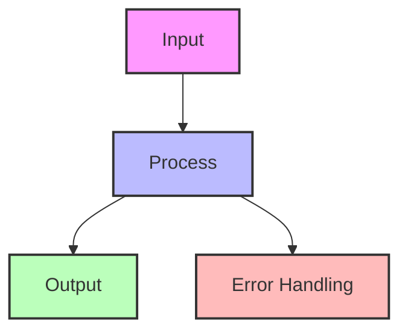
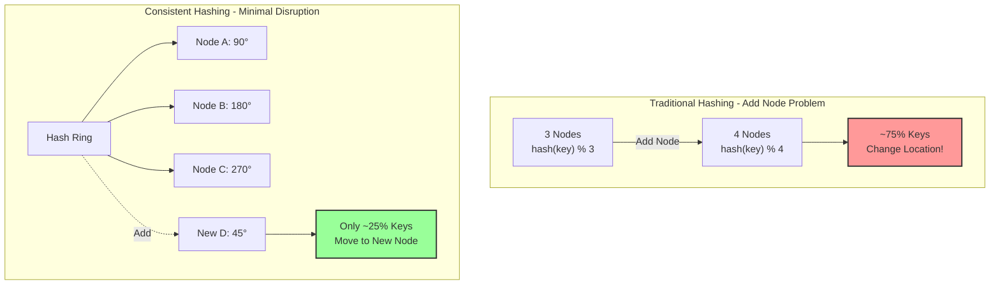
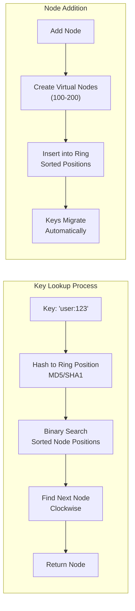
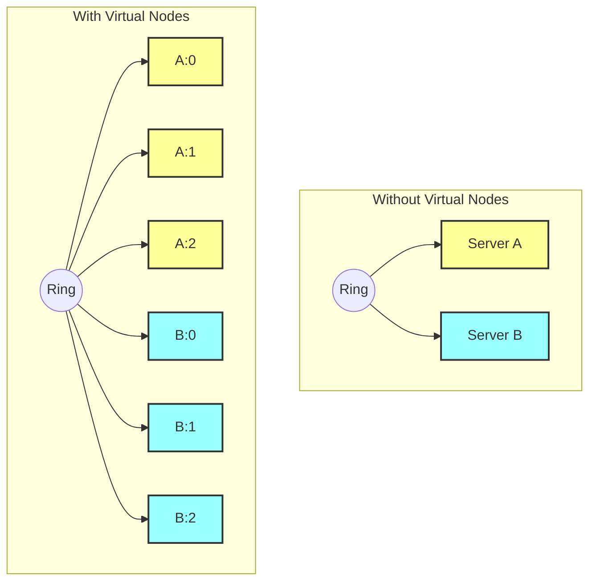
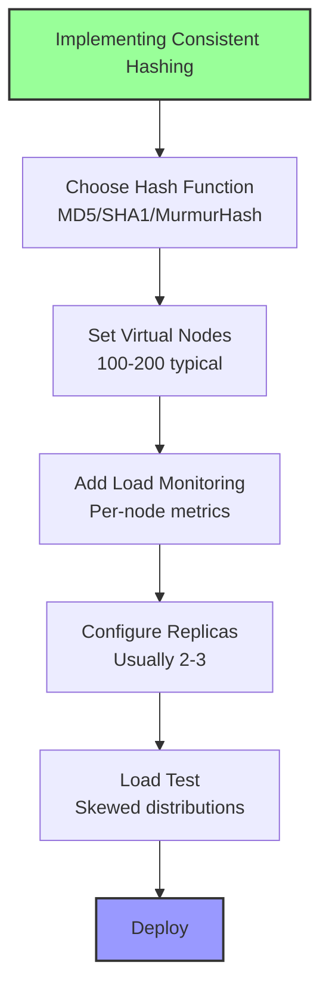
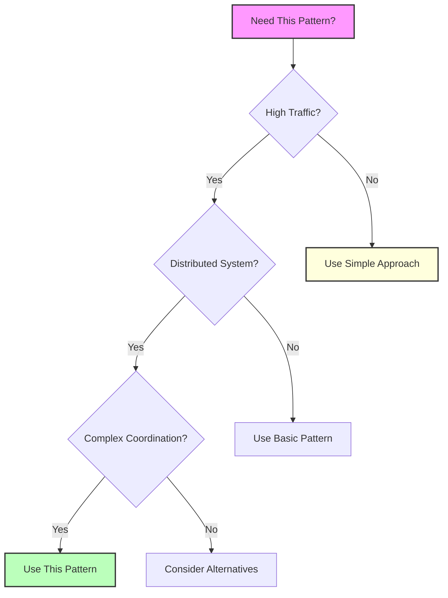

## Essential Question

**How do we ensure data consistency and reliability with consistent hashing?**


# Consistent Hashing

## 🤔 Essential Questions

<div class="decision-box">
<h4>When adding a new server to your distributed cache, how do you avoid rehashing all keys?</h4>

**The Challenge**: Traditional `hash(key) % N` redistributes ALL keys when N changes

**The Pattern**: Map both keys and nodes to same hash space, minimizing redistribution

**Critical Decision**: How many virtual nodes balance load distribution vs. memory overhead?
</div>

!!! success "🏆 Silver Excellence Pattern"
    **Elegant Data Distribution** • Powers Cassandra, DynamoDB, Discord
    
    Essential for any distributed system that needs to scale dynamically. Minimizes data movement during scaling operations.
    
    **Trade-offs**: 
    - ✅ Only ~1/N keys move when adding/removing nodes
    - ✅ Even load distribution with virtual nodes
    - ❌ O(log N) lookup vs O(1) for simple hashing
    - ❌ Memory overhead for virtual node mappings

[Home](/) > [Patterns](../patterns/) > [Data Patterns](../patterns/index.md#data-patterns) > Consistent Hashing

!!! abstract "Pattern Overview"
    **Problem**: Adding/removing nodes in traditional hashing requires rehashing all keys  
    **Solution**: Map both keys and nodes to same hash space, minimize key movement  
    **Trade-offs**: Small memory overhead for huge operational flexibility  
    **Used by**: Cassandra, DynamoDB, Memcached, Riak, Chord DHT

---

## Level 1: Intuition

### When to Use / When NOT to Use

<div class="decision-box">
<h4>🎯 When to Use Consistent Hashing</h4>

**Perfect for:**
- Distributed caches (Redis, Memcached clusters)
- Database sharding with dynamic nodes
- Load balancing with session affinity
- CDN node selection
- Distributed storage systems

**Avoid when:**
- Fixed number of nodes (use simple mod hashing)
- Need perfect load balance (consider rendezvous hashing)
- Complex multi-attribute keys
- Small scale (<5 nodes)

**Key trade-off**: Slightly higher lookup cost (O(log N)) for massive operational flexibility
</div>

<div class="axiom-box">
<h4>🔬 Law 3: Emergent Chaos</h4>

Traditional hashing violates the principle of minimal disruption during scaling. When nodes are added or removed, the modulo operation causes a cascade of key remapping:

```
hash(key) % 3 → hash(key) % 4 = Different node for most keys!
```

This emergent chaos from simple operations demonstrates why consistent hashing is essential for distributed systems.
</div>

### Data Distribution Comparison

| Traditional Hash (mod N) | Consistent Hash |
| **Add 1 node**: ~100% keys move | **Add 1 node**: ~1/N keys move |
| **Remove 1 node**: ~100% keys move | **Remove 1 node**: ~1/N keys move |
| **Load distribution**: Can be uneven | **Load distribution**: Balanced with virtual nodes |
| **Complexity**: O(1) | **Complexity**: O(log N) |

```
Traditional Hashing Problem:
Node 0: hash(key) % 3 = 0
Node 1: hash(key) % 3 = 1  
Node 2: hash(key) % 3 = 2

Add Node 3:
Node 0: hash(key) % 4 = 0  ← Most keys
Node 1: hash(key) % 4 = 1  ← change their
Node 2: hash(key) % 4 = 2  ← destination!
Node 3: hash(key) % 4 = 3

Consistent Hashing Solution:
Only ~25% of keys move to the new node
```

### Data Flow Visualization



<details>
<summary>View implementation code</summary>



</details>

---

## Level 2: Foundation

### Visual Algorithm Flow



### Core Algorithm Implementation


<details>
<summary>View implementation code</summary>

```python
import hashlib
import bisect
from typing import List, Optional, Dict

class ConsistentHash:
    """Basic consistent hashing implementation"""
    
    def __init__(self, nodes: List[str] = None, virtual_nodes: int = 150):
        self.nodes = {}  # node -> hash positions
        self.ring = {}   # hash -> node
        self.sorted_keys = []  # sorted hash values
        self.virtual_nodes = virtual_nodes
        
        if nodes:
            for node in nodes:
                self.add_node(node)
    
    def _hash(self, key: str) -> int:
        """Generate hash for a key"""
        return int(hashlib.md5(key.encode()).hexdigest(), 16)
    
    def add_node(self, node: str):
        """Add node with virtual nodes to the ring"""
        self.nodes[node] = []
        
        # Add virtual nodes
        for i in range(self.virtual_nodes):
            virtual_key = f"{node}:{i}"
            hash_value = self._hash(virtual_key)
            
            self.nodes[node].append(hash_value)
            self.ring[hash_value] = node
            bisect.insort(self.sorted_keys, hash_value)
    
    def remove_node(self, node: str):
        """Remove node and all its virtual nodes"""
        if node not in self.nodes:
            return
        
        # Remove all virtual nodes
        for hash_value in self.nodes[node]:
            del self.ring[hash_value]
            index = bisect.bisect_left(self.sorted_keys, hash_value)
            del self.sorted_keys[index]
        
        del self.nodes[node]
    
    def get_node(self, key: str) -> Optional[str]:
        """Get node responsible for a key"""
        if not self.ring:
            return None
        
        hash_value = self._hash(key)
        
        # Find first node clockwise from hash
        index = bisect.bisect(self.sorted_keys, hash_value)
        if index == len(self.sorted_keys):
            index = 0
        
        return self.ring[self.sorted_keys[index]]
    
    def get_nodes(self, key: str, count: int = 3) -> List[str]:
        """Get N nodes for replication"""
        if not self.ring:
            return []
        
        hash_value = self._hash(key)
        index = bisect.bisect(self.sorted_keys, hash_value)
        
        nodes = []
        seen = set()
        
        # Walk clockwise to find N unique nodes
        for i in range(len(self.sorted_keys)):
            pos = (index + i) % len(self.sorted_keys)
            node = self.ring[self.sorted_keys[pos]]
            
            if node not in seen:
                nodes.append(node)
                seen.add(node)
                
                if len(nodes) == count:
                    break
        
        return nodes

# Example usage
ch = ConsistentHash(['server1', 'server2', 'server3'])

# Add some data
print(ch.get_node('user:123'))  # server2
print(ch.get_node('order:456'))  # server1
print(ch.get_nodes('session:789', count=2))  # ['server3', 'server1']

# Add a new server
ch.add_node('server4')
print(ch.get_node('user:123'))  # Might change
print(ch.get_node('order:456'))  # Might stay same
```

</details>

### Virtual Nodes Impact


<details>
<summary>View implementation code</summary>



</details>

### Virtual Nodes Configuration Guide

| Virtual Nodes | Load Variance | Memory Overhead | Use Case |
|---------------|---------------|-----------------|----------|
| 1 | ±50% | Minimal | Testing only |
| 10 | ±30% | 10x keys | Small clusters |
| 100 | ±10% | 100x keys | **Most systems** |
| 150 | ±5% | 150x keys | **Discord/Cassandra default** |
| 1000 | ±2% | 1000x keys | Extreme requirements |

---

## Level 3: Advanced Techniques

### Algorithm Comparison

| Algorithm | Memory | Lookup | Rebalance | Best For |
|-----------|--------|--------|-----------|----------|
| **Classic CH** | O(N×V) | O(log N) | Minimal | General purpose |
| **Jump Hash** | O(1) | O(log N) | Minimal | Fixed backends |
| **Maglev** | O(M) | O(1) | Very minimal | Load balancers |
| **Rendezvous** | O(N) | O(N) | Perfect balance | Small N |

### Jump Consistent Hash

```python
def jump_consistent_hash(key: int, num_buckets: int) -> int:
    """
    Google's Jump Consistent Hash
    - No memory overhead
    - Consistent remapping
    - O(ln n) time
    """
    b = -1
    j = 0
    
    while j < num_buckets:
        b = j
        key = ((key * 2862933555777941757) + 1) & 0xffffffffffffffff
        j = int((b + 1) * (2**31 / ((key >> 33) + 1)))
    
    return b
```

### Bounded Load Consistent Hashing


<details>
<summary>View implementation code</summary>

```python
class BoundedConsistentHash(ConsistentHash):
    """Consistent hashing with bounded loads"""
    
    def __init__(self, nodes: List[str], load_factor: float = 1.25):
        super().__init__(nodes)
        self.load_factor = load_factor
        self.load_tracker = {node: 0 for node in nodes}
        self.capacity = {}
        self._update_capacity()
    
    def _update_capacity(self):
        """Update capacity based on current nodes"""
        if not self.nodes:
            return
        
        avg_load = 1.0 / len(self.nodes)
        max_load = avg_load * self.load_factor
        
        for node in self.nodes:
            self.capacity[node] = max_load
    
    def get_node_bounded(self, key: str) -> Optional[str]:
        """Get node with load bounds"""
        candidates = self.get_nodes(key, count=len(self.nodes))
        
        for node in candidates:
            current_load = self.load_tracker[node]
            if current_load < self.capacity[node]:
                self.load_tracker[node] = current_load + (1.0 / len(self.nodes))
                return node
        
        # All nodes at capacity, return least loaded
        return min(self.load_tracker.items(), key=lambda x: x[1])[0]
```

</details>

### Maglev Hashing


<details>
<summary>View implementation code</summary>

```python
class MaglevHash:
    """Google's Maglev consistent hash for load balancers"""
    
    def __init__(self, backends: List[str], table_size: int = 65537):
        self.backends = backends
        self.table_size = table_size
        self.lookup_table = self._build_lookup_table()
    
    def _hash_1(self, backend: str) -> int:
        return hash(backend + "_offset") % self.table_size
    
    def _hash_2(self, backend: str) -> int:
        h = hash(backend + "_skip") % self.table_size
        return h if h != 0 else 1
    
    def _build_lookup_table(self) -> List[int]:
        lookup = [-1] * self.table_size
        
        # Build permutation for each backend
        permutations = []
        for i, backend in enumerate(self.backends):
            offset = self._hash_1(backend)
            skip = self._hash_2(backend)
            
            permutation = []
            for j in range(self.table_size):
                permutation.append((offset + j * skip) % self.table_size)
            
            permutations.append(permutation)
        
        # Fill lookup table
        next_pos = [0] * len(self.backends)
        
        for n in range(self.table_size):
            for i in range(len(self.backends)):
                c = permutations[i][next_pos[i]]
                
                while lookup[c] != -1:
                    next_pos[i] += 1
                    c = permutations[i][next_pos[i]]
                
                lookup[c] = i
                next_pos[i] += 1
                break
        
        return lookup
    
    def get_backend(self, key: str) -> str:
        hash_value = hash(key) % self.table_size
        backend_index = self.lookup_table[hash_value]
        return self.backends[backend_index]
```

</details>

---

## Level 4: Production Patterns

<div class="failure-vignette">
<h4>💥 The Twitch Cache Avalanche (2019)</h4>

**What Happened**: Removing one Redis node caused 30 minutes of downtime

**Root Cause**: 
- Used simple modulo hashing: `key.hash() % num_nodes`
- When one node failed, rehashed ALL keys
- 100% cache misses flooded the database
- Database couldn't handle 1000x normal load
- Cascading failure across entire platform

**Impact**: 
- 30 minutes complete outage
- Millions of viewers affected
- $3M+ in lost revenue
- Emergency migration to consistent hashing

**Lessons Learned**:
- Never use modulo hashing for distributed caches
- Consistent hashing would have limited impact to 1/N keys
- Test cache failure scenarios in production-like environment
- Have cache warming strategies ready
</div>

### Multi-Ring Consistent Hashing


<details>
<summary>View implementation code</summary>

```python
class MultiRingConsistentHash:
    """
    Multiple rings for different data types/priorities
    Used by: Cassandra for different keyspaces
    """
    
    def __init__(self):
        self.rings = {}
        self.default_ring = 'default'
        self.rings[self.default_ring] = ConsistentHash()
    
    def create_ring(self, ring_name: str, nodes: List[str], 
                    virtual_nodes: int = 150):
        """Create a new hash ring"""
        self.rings[ring_name] = ConsistentHash(nodes, virtual_nodes)
    
    def get_node(self, key: str, ring_name: str = None) -> Optional[str]:
        """Get node from specific ring"""
        ring = self.rings.get(ring_name or self.default_ring)
        return ring.get_node(key) if ring else None
    
    def migrate_between_rings(self, key: str, from_ring: str, to_ring: str):
        """Migrate key between rings"""
        old_node = self.get_node(key, from_ring)
        new_node = self.get_node(key, to_ring)
        
        return {
            'key': key,
            'from': {'ring': from_ring, 'node': old_node},
            'to': {'ring': to_ring, 'node': new_node},
            'action': 'migrate' if old_node != new_node else 'no-op'
        }
```

</details>

<div class="truth-box">
<h4>💡 Consistent Hashing Production Wisdom</h4>

**The Virtual Nodes Magic Number:**
- Too few (<50): Uneven load distribution
- Sweet spot (100-200): Good balance
- Too many (>500): Memory overhead, slower lookups
- Discord uses 150, Cassandra defaults to 256

**Real-world Gotchas:**
1. **Hash function matters**: Use crypto hashes (MD5/SHA) not CRC32
2. **Replicas need different positions**: Don't just increment hash
3. **Monitor ring balance**: One hot node can kill performance
4. **Bounded loads**: Implement Google's consistent hashing with bounded loads

**Performance Reality:**
- Lookup: O(log N) with binary search on sorted ring
- Add/Remove node: O(K/N) keys migrate on average
- Memory: O(N × V) where V is virtual nodes

> "We thought consistent hashing was overkill for our 10-node cluster. Then we grew to 100 nodes and spent 6 months migrating." - Pinterest Engineering
</div>

### Token-Aware Routing


<details>
<summary>View implementation code</summary>

```python
class TokenAwareRouter:
    """
    Token-aware routing for database clients
    Used by: Cassandra drivers
    """
    
    def __init__(self, cluster_metadata):
        self.token_map = {}
        self.replicas = {}
        self._build_token_map(cluster_metadata)
    
    def _build_token_map(self, metadata):
        """Build token ownership map"""
        for node in metadata['nodes']:
            for token_range in node['token_ranges']:
                self.token_map[token_range] = node['address']
                
                # Track replicas
                if token_range not in self.replicas:
                    self.replicas[token_range] = []
                self.replicas[token_range].extend(node['replicas'])
    
    def get_coordinator(self, partition_key: str) -> str:
        """Get coordinator node for partition key"""
        token = self._hash_to_token(partition_key)
        
        # Find owning token range
        for token_range, node in self.token_map.items():
            if self._token_in_range(token, token_range):
                return node
        
        raise ValueError(f"No node found for token {token}")
    
    def get_replicas(self, partition_key: str) -> List[str]:
        """Get all replica nodes"""
        token = self._hash_to_token(partition_key)
        
        for token_range, replicas in self.replicas.items():
            if self._token_in_range(token, token_range):
                return replicas
        
        return []
```

</details>

---

## Level 5: Real-World Applications

### Case Study: Distributed Cache


<details>
<summary>View implementation code</summary>

```python
class DistributedCache:
    """Production-ready distributed cache with consistent hashing"""
    
    def __init__(self, cache_nodes: List[str]):
        self.ch = ConsistentHash(cache_nodes, virtual_nodes=200)
        self.connections = {}
        self.stats = defaultdict(lambda: {'hits': 0, 'misses': 0})
        
        # Initialize connections
        for node in cache_nodes:
            self.connections[node] = self._create_connection(node)
    
    async def get(self, key: str) -> Optional[Any]:
        """Get value with automatic node selection"""
        nodes = self.ch.get_nodes(key, count=2)  # Primary + backup
        
        # Try primary node first
        primary = nodes[0]
        try:
            value = await self._get_from_node(primary, key)
            if value is not None:
                self.stats[primary]['hits'] += 1
                return value
            else:
                self.stats[primary]['misses'] += 1
        except Exception as e:
            logger.error(f"Primary node {primary} failed: {e}")
        
        # Fallback to backup
        if len(nodes) > 1:
            backup = nodes[1]
            try:
                value = await self._get_from_node(backup, key)
                if value is not None:
                    # Repair primary
                    await self._set_on_node(primary, key, value)
                return value
            except Exception as e:
                logger.error(f"Backup node {backup} failed: {e}")
        
        return None
    
    async def set(self, key: str, value: Any, ttl: int = 3600):
        """Set value with replication"""
        nodes = self.ch.get_nodes(key, count=2)
        
        # Write to all replica nodes
        tasks = []
        for node in nodes:
            task = self._set_on_node(node, key, value, ttl)
            tasks.append(task)
        
        results = await asyncio.gather(*tasks, return_exceptions=True)
        
        # Check if at least one write succeeded
        success_count = sum(1 for r in results if not isinstance(r, Exception))
        if success_count == 0:
            raise Exception("All cache writes failed")
        
        return success_count
    
    def rebalance(self, new_node: str):
        """Add new node and rebalance"""
        # Get keys that will move
        affected_keys = self._get_affected_keys(new_node)
        
        # Add node to ring
        self.ch.add_node(new_node)
        self.connections[new_node] = self._create_connection(new_node)
        
        # Migrate affected keys
        for key in affected_keys:
            old_nodes = self.ch.get_nodes(key, count=2)
            # Migration happens lazily on next access
        
        return len(affected_keys)
```

</details>

### Production Deployment Checklist



---

## Common Pitfalls & Solutions

| Pitfall | Impact | Solution |
|---------|--------|----------|
| **Too few virtual nodes** | Uneven load distribution | Use 100-200 virtual nodes |
| **Hash collisions** | Node overload | Use cryptographic hash |
| **No monitoring** | Hidden hotspots | Track per-node metrics |
| **Synchronous rebalancing** | Service disruption | Lazy/background migration |

---


## Decision Matrix



### Quick Decision Table

| Factor | Low Complexity | Medium Complexity | High Complexity |
|--------|----------------|-------------------|-----------------|
| Team Size | < 5 developers | 5-20 developers | > 20 developers |
| Traffic | < 1K req/s | 1K-100K req/s | > 100K req/s |
| Data Volume | < 1GB | 1GB-1TB | > 1TB |
| **Recommendation** | ❌ Avoid | ⚠️ Consider | ✅ Implement |

## Implementation Checklist

- [ ] Choose hash function (MD5, SHA-1, MurmurHash)
- [ ] Determine virtual nodes count (100-200 typical)
- [ ] Implement node addition/removal
- [ ] Add replication support (N replicas)
- [ ] Build monitoring for load distribution
- [ ] Plan rebalancing strategy
- [ ] Test with production-like data distribution
- [ ] Benchmark lookup performance
- [ ] Document node management procedures

---

## Related Patterns

### Core Concepts
- [Sharding](../pattern-library/scaling/sharding.md) - Uses consistent hashing for distribution
- [Load Balancing](../pattern-library/scaling/load-balancing.md) - Consistent hashing for sticky sessions
- [Distributed Caching](../pattern-library/scaling/caching-strategies.md) - Key distribution strategy

### Case Studies
- [Cassandra Architecture](case-studies/cassandra) - Token ring implementation
- [DynamoDB Internals](case-studies/amazon-dynamo) - Virtual nodes in practice
- [Memcached Scaling](case-studies/memcached) - Cache node distribution

---

## 🎓 Key Takeaways

1. **Consistent hashing minimizes disruption** when scaling
2. **Virtual nodes ensure even distribution** across physical nodes
3. **O(log N) lookup is fast enough** for most use cases
4. **Multiple algorithms exist** - choose based on constraints
5. **Monitor load distribution** to detect imbalances early

---

*"In distributed systems, the only constant is change. Consistent hashing makes change manageable."*