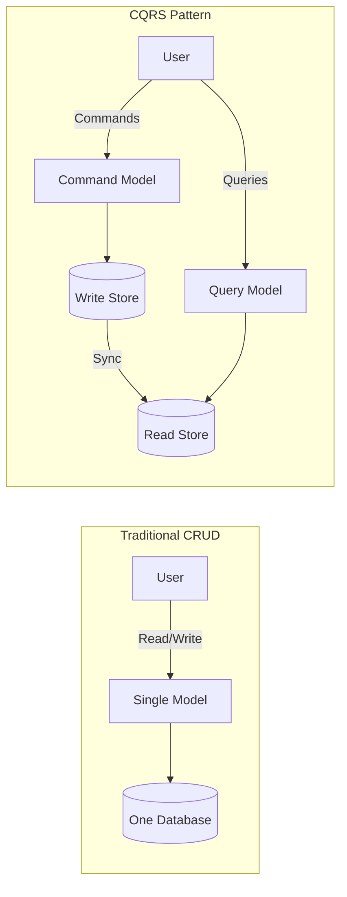
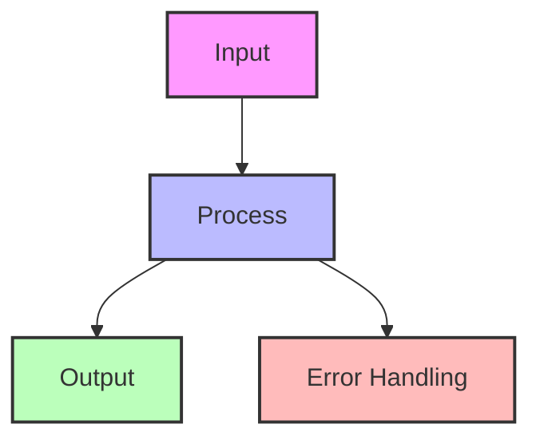
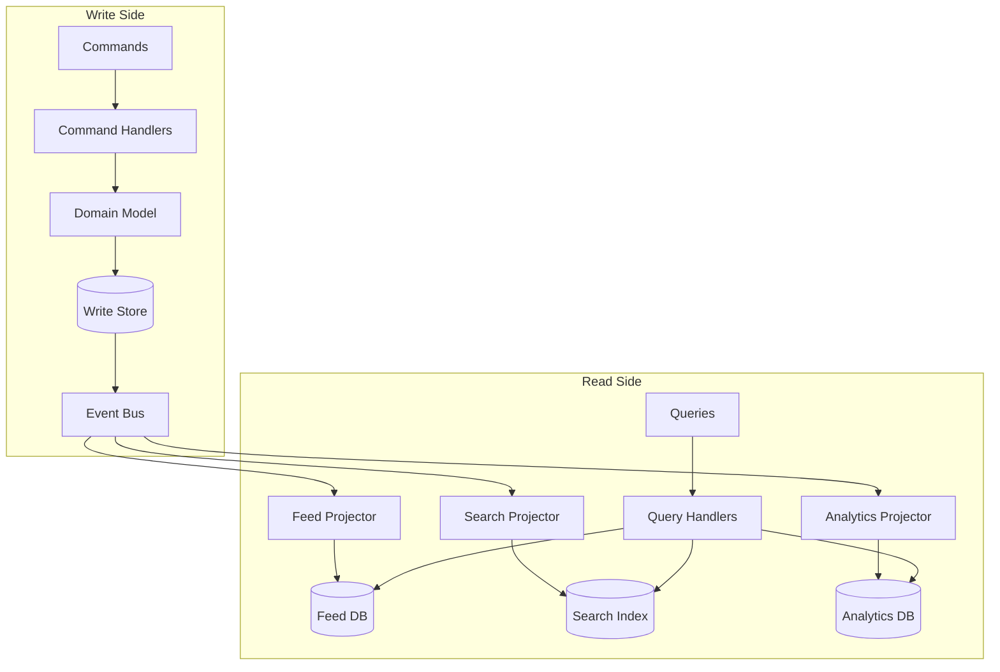
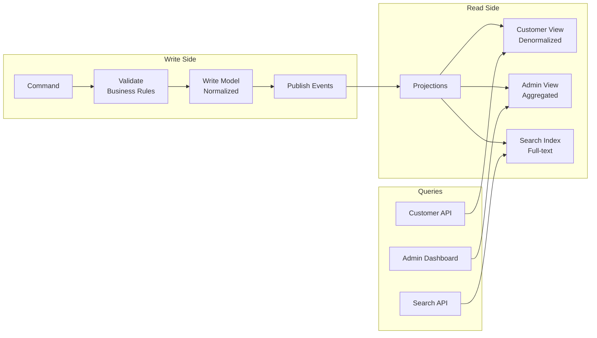
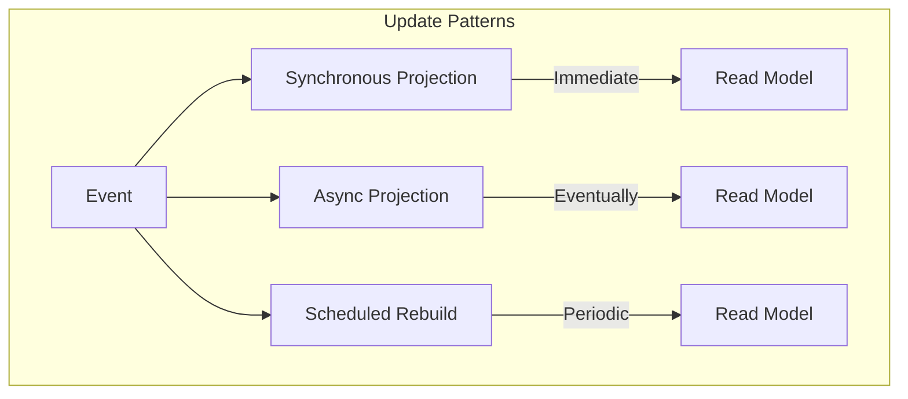
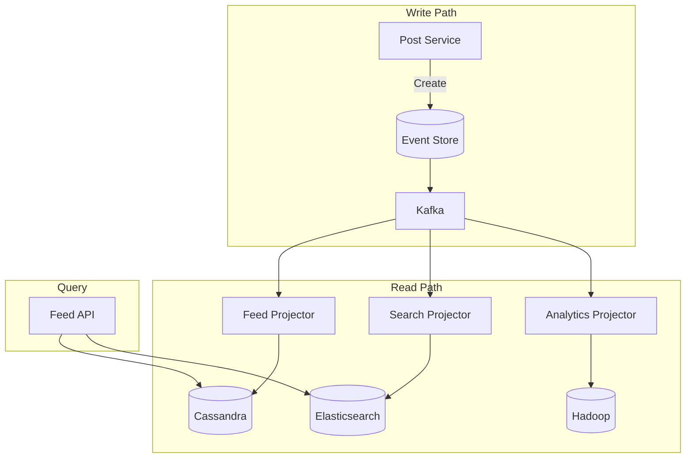
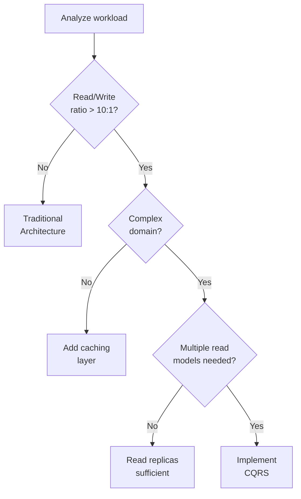

---
best-for:
- Systems with asymmetric read/write patterns (10:1 or higher)
- Complex domains requiring different models
- Applications needing multiple read representations
- High-performance query requirements
category: data-management
current_relevance: mainstream
description: Architectural pattern separating read and write operations to optimize
  performance and scalability
essential_question: How do we ensure data consistency and reliability with cqrs (command
  query responsibility segregation)?
excellence_tier: silver
introduced: 2010-06
pattern_status: recommended
tagline: Master cqrs (command query responsibility segregation) for distributed systems
  success
title: CQRS (Command Query Responsibility Segregation)
trade-offs:
  cons:
  - Eventual consistency complexity
  - Infrastructure overhead
  - Synchronization challenges
  - Increased operational complexity
  pros:
  - Independent scaling of reads and writes
  - Optimized data models for each use case
  - Natural fit with event sourcing
  - Simplified complex domain logic
---


# CQRS (Command Query Responsibility Segregation)

!!! info "🥈 Silver Tier Pattern"
    **Read/Write Optimization Champion** • LinkedIn, Uber, Netflix at billion-event scale
    
    CQRS is essential for systems with asymmetric read/write patterns and complex domain logic. It enables independent scaling and optimization of commands and queries.
    
    **Key Success Metrics:**
    - LinkedIn: 1B+ daily feed updates
    - Uber: 20M+ trips with real-time tracking
    - Netflix: Billions of events processed

## Essential Question

**How can we optimize both complex writes and high-performance reads when they need completely different data models?**

**CQRS vs Event Sourcing**: These patterns are often confused but serve different purposes:
- **CQRS**: Separates read and write models for performance (can use any storage)
- **Event Sourcing**: Stores state as event history (can use single model)
- **Together**: Event sourcing naturally provides the events that CQRS uses to build read models

## When to Use / When NOT to Use

### Use CQRS When ✅

| Scenario | Why | Example |
|----------|-----|---------|
| **Read/write ratio > 10:1** | Different scaling needs | Social media feeds, product catalogs |
| **Complex domain logic** | Separate concerns cleanly | Financial trading, healthcare |
| **Multiple read models needed** | Different views of same data | Admin vs customer views |
| **Performance critical** | Optimize independently | Real-time dashboards |
| **Event sourcing used** | Natural combination | Audit systems |

### DON'T Use When ❌

| Scenario | Why | Alternative |
|----------|-----|-------------|
| **Simple CRUD** | Unnecessary complexity | Traditional architecture |
| **Small teams (< 3)** | Too much overhead | Monolithic approach |
| **Low traffic** | No scaling benefit | Simple database |
| **Strong consistency required** | CQRS is eventually consistent | ACID transactions |

## Level 1: Intuition (5 min)

### The Restaurant Kitchen Analogy

<div class="axiom-box">
<h4>🔬 Law 4: Multidimensional Trade-offs</h4>

CQRS embodies that you cannot optimize for all dimensions simultaneously. Traditional CRUD tries to use the same model for both complex writes and high-performance reads.

**Key Insight**: Commands and queries have different consistency, performance, and scalability requirements. Separating them allows independent optimization.
</div>

### Visual Architecture



## Level 2: Foundation (10 min)

### CQRS Architecture



<details>
<summary>View implementation code</summary>



</details>

### Key Components

| Component | Purpose | Example Tech |
|-----------|---------|--------------|
| **Command Model** | Business logic, validation | Domain objects |
| **Query Model** | Optimized for reads | Denormalized views |
| **Projections** | Transform events to views | Stream processors |
| **Event Bus** | Connect write to read | Kafka, RabbitMQ |

### Trade-off Comparison

| Aspect | Traditional CRUD | CQRS |
|--------|------------------|------|
| **Complexity** | Simple | Higher |
| **Consistency** | Strong | Eventual |
| **Performance** | Compromised | Optimized |
| **Scalability** | Limited | Independent |
| **Flexibility** | Single model | Multiple models |

## Level 3: Deep Dive (15 min)

### CQRS Data Flow



### Model Comparison

| Aspect | Write Model | Read Model |
|--------|-------------|------------|
| **Structure** | Normalized, 3NF | Denormalized |
| **Optimization** | Business logic | Query performance |
| **Consistency** | ACID | Eventually consistent |
| **Storage** | Relational DB | NoSQL, Search, Cache |
| **Updates** | Through commands | Through projections |

### Synchronization Strategies

<div class="decision-box">
<h4>🎯 Read Model Update Strategies</h4>

**Synchronous Updates**
- Write waits for read model update
- Strong consistency
- Higher latency

**Asynchronous Updates**
- Write completes immediately
- Eventual consistency
- Better performance

**Hybrid Approach**
- Critical reads: synchronous
- Analytics: asynchronous
</div>

### Common Patterns



## Level 4: Expert (20 min)

### Advanced Techniques

| Technique | Use Case | Implementation |
|-----------|----------|----------------|
| **Snapshot Views** | Complex aggregations | Periodic materialization |
| **Live Projections** | Real-time updates | Stream processing |
| **Retroactive Events** | Fix historical data | Event replay |
| **Multi-Version Models** | A/B testing | Parallel projections |

### Performance Optimization

| Component | Technique | Impact |
|-----------|-----------|--------|
| **Write batching** | Queue commands | 10x throughput |
| **Projection parallelism** | Multiple workers | Linear scaling |
| **Read caching** | Redis layer | <10ms latency |
| **Smart indexing** | Covering indexes | 100x query speed |

### Common Pitfalls

| Pitfall | Impact | Solution |
|---------|--------|----------|
| **Projection lag** | Stale reads | Monitor + SLAs |
| **Event ordering** | Incorrect state | Sequence numbers |
| **Model drift** | Inconsistency | Regular validation |
| **Complex queries** | Poor performance | Better projections |

## Level 5: Mastery (30 min)

### Case Study: LinkedIn Feed Architecture


<details>
<summary>View implementation code</summary>



</details>

**Scale Metrics**:
- 1B+ feed updates daily
- 100ms P99 read latency
- Multiple projection types
- Geographic distribution

### Economic Analysis


<details>
<summary>View implementation code</summary>

```python
def cqrs_roi_calculator(
    daily_reads, 
    daily_writes,
    avg_query_complexity
):
    """Calculate ROI for CQRS implementation"""
    
    read_write_ratio = daily_reads / daily_writes
    
    # Traditional approach costs
    traditional_db_size = daily_writes * 365 * 1.5  # Normalized
    traditional_query_cost = avg_query_complexity * daily_reads
    
    # CQRS approach costs
    write_db_size = daily_writes * 365  # Optimized
    read_db_size = daily_writes * 365 * 2  # Denormalized
    cqrs_query_cost = daily_reads * 0.1  # 10x faster queries
    
    return {
        'worth_it': read_write_ratio > 10,
        'performance_gain': traditional_query_cost / cqrs_query_cost,
        'complexity_increase': 2.5  # Rough estimate
    }
```

</details>

## Quick Reference

### Decision Matrix



### Implementation Checklist ✓

- [ ] Identify command vs query operations
- [ ] Design command model (business logic)
- [ ] Design query models (denormalized)
- [ ] Choose synchronization strategy
- [ ] Implement projection handlers
- [ ] Set up monitoring for lag
- [ ] Plan for eventual consistency
- [ ] Test failure scenarios
- [ ] Document model mappings

### Configuration Template


<details>
<summary>View implementation code</summary>

```yaml
cqrs:
  command_side:
    database: postgresql
    validation: strict
    event_store: true
    
  query_side:
    databases:
      - type: elasticsearch  # Full-text search
      - type: redis         # Hot data
      - type: mongodb       # Flexible queries
    
  synchronization:
    method: event_driven
    bus: kafka
    guarantees: at_least_once
    max_lag_seconds: 5
    
  monitoring:
    track_lag: true
    alert_threshold_ms: 1000
```

</details>

## Related Patterns

### Natural Combinations
- **[Event Sourcing](./event-sourcing.md)**: Perfect partner for CQRS
- **[Saga Pattern](./saga.md)**: Commands trigger sagas
- **[Event-Driven Architecture](../communication/event-driven.md)**: Connect write to read

### Supporting Patterns
- **[Materialized View](../patterns/materialized-view.md)**: Read model implementation
- **[Cache-Aside](../patterns/cache-aside.md)**: Speed up queries
- **[Database per Service](../patterns/database-per-service.md)**: Isolate models

### Alternatives
- **[Read Replicas](../patterns/read-replicas.md)**: Simpler scaling
- **[Caching](../patterns/caching.md)**: Less complexity
- **[API Composition](../patterns/api-composition.md)**: Query federation

## Further Reading

- [CQRS - Martin Fowler](https://martinfowler.com/bliki/CQRS.html)
- [CQRS Journey - Microsoft](https://docs.microsoft.com/en-us/previous-versions/msp-n-p/jj554200)
- [Greg Young on CQRS](https://cqrs.files.wordpress.com/2010/11/cqrs_documents.pdf)

### Tools & Frameworks
- **Axon Framework** (Java): CQRS + Event Sourcing
- **Eventuate** (Multiple languages): CQRS/ES platform
- **Commanded** (Elixir): CQRS/ES for Elixir
- **Lagom** (Scala/Java): Microservices with CQRS