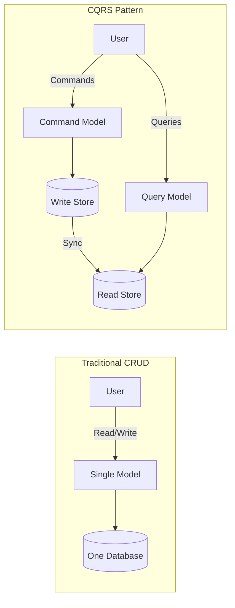
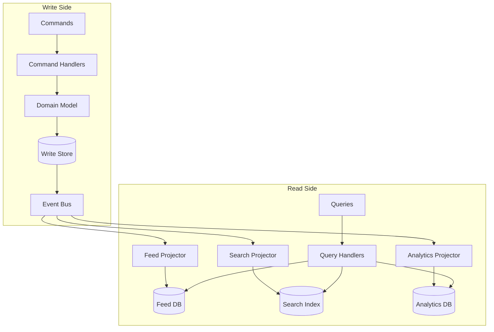
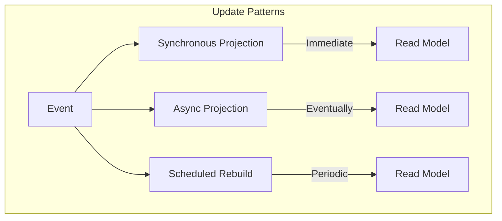
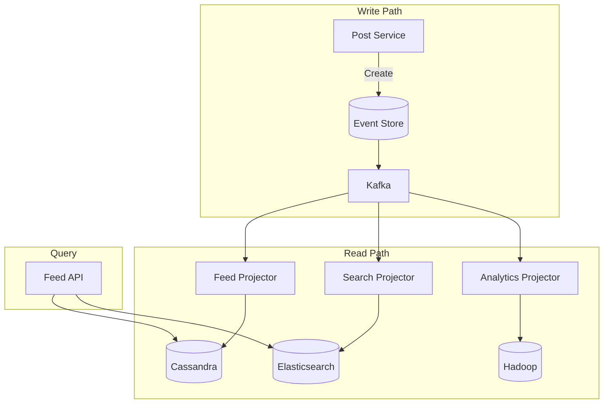
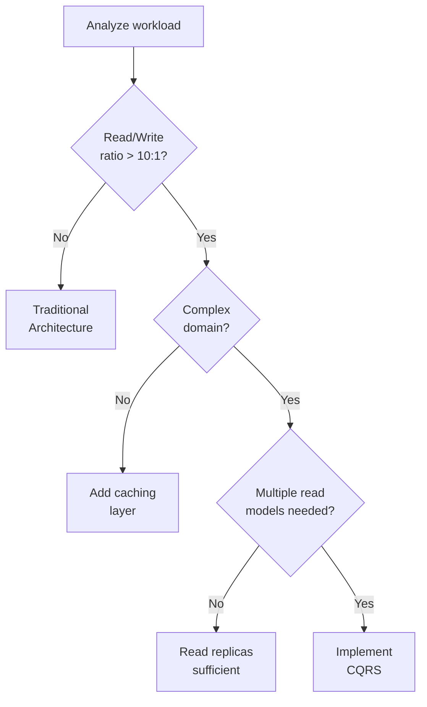

# CQRS (Command Query Responsibility Segregation)

!!! info "🥈 Silver Tier Pattern"
    **Read/Write Optimization Champion** • LinkedIn, Uber, Netflix at billion-event scale
    
    CQRS is essential for systems with asymmetric read/write patterns and complex domain logic. It enables independent scaling and optimization of commands and queries.
    
    **Key Success Metrics:**
    - LinkedIn: 1B+ daily feed updates
    - Uber: 20M+ trips with real-time tracking
    - Netflix: Billions of events processed

## Essential Question

**How can we optimize both complex writes and high-performance reads when they need completely different data models?**

## When to Use / When NOT to Use

### Use CQRS When ✅

| Scenario | Why | Example |
|----------|-----|---------|
| **Read/write ratio > 10:1** | Different scaling needs | Social media feeds, product catalogs |
| **Complex domain logic** | Separate concerns cleanly | Financial trading, healthcare |
| **Multiple read models needed** | Different views of same data | Admin vs customer views |
| **Performance critical** | Optimize independently | Real-time dashboards |
| **Event sourcing used** | Natural combination | Audit systems |

### DON'T Use When ❌

| Scenario | Why | Alternative |
|----------|-----|-------------|
| **Simple CRUD** | Unnecessary complexity | Traditional architecture |
| **Small teams (< 3)** | Too much overhead | Monolithic approach |
| **Low traffic** | No scaling benefit | Simple database |
| **Strong consistency required** | CQRS is eventually consistent | ACID transactions |

## Level 1: Intuition (5 min)

### The Restaurant Kitchen Analogy

<div class="axiom-box">
<h4>🔬 Law 4: Multidimensional Trade-offs</h4>

CQRS embodies that you cannot optimize for all dimensions simultaneously. Traditional CRUD tries to use the same model for both complex writes and high-performance reads.

**Key Insight**: Commands and queries have different consistency, performance, and scalability requirements. Separating them allows independent optimization.
</div>

### Visual Architecture



## Level 2: Foundation (10 min)

### CQRS Architecture



### Key Components

| Component | Purpose | Example Tech |
|-----------|---------|--------------|
| **Command Model** | Business logic, validation | Domain objects |
| **Query Model** | Optimized for reads | Denormalized views |
| **Projections** | Transform events to views | Stream processors |
| **Event Bus** | Connect write to read | Kafka, RabbitMQ |

### Trade-off Comparison

| Aspect | Traditional CRUD | CQRS |
|--------|------------------|------|
| **Complexity** | Simple | Higher |
| **Consistency** | Strong | Eventual |
| **Performance** | Compromised | Optimized |
| **Scalability** | Limited | Independent |
| **Flexibility** | Single model | Multiple models |

## Level 3: Deep Dive (15 min)

### Implementation Example

```python
# Command side - optimized for business logic
class CreateOrderCommand:
    def __init__(self, customer_id, items):
        self.customer_id = customer_id
        self.items = items

class OrderCommandHandler:
    def handle(self, command: CreateOrderCommand):
        # Complex business logic
        order = Order()
        order.validate_customer(command.customer_id)
        order.check_inventory(command.items)
        order.calculate_pricing()
        order.apply_discounts()
        
        # Save to write store
        self.repository.save(order)
        
        # Publish events
        events = order.get_uncommitted_events()
        self.event_bus.publish_batch(events)

# Query side - optimized for performance
class OrderSummaryProjection:
    """Denormalized read model for fast queries"""
    
    def handle_order_created(self, event):
        # Create denormalized view
        summary = {
            'order_id': event.order_id,
            'customer_name': event.customer_name,  # Denormalized
            'total_amount': event.total_amount,
            'item_count': len(event.items),
            'status': 'pending',
            'created_at': event.timestamp
        }
        self.read_db.order_summaries.insert(summary)
    
    def handle_order_shipped(self, event):
        # Update read model
        self.read_db.order_summaries.update(
            {'order_id': event.order_id},
            {'$set': {'status': 'shipped', 'shipped_at': event.timestamp}}
        )

# Query handler - simple and fast
class OrderQueryHandler:
    def get_customer_orders(self, customer_id):
        # Direct query on optimized read model
        return self.read_db.order_summaries.find({
            'customer_id': customer_id
        }).sort('created_at', -1)
```

### Synchronization Strategies

<div class="decision-box">
<h4>🎯 Read Model Update Strategies</h4>

**Synchronous Updates**
- Write waits for read model update
- Strong consistency
- Higher latency

**Asynchronous Updates**
- Write completes immediately
- Eventual consistency
- Better performance

**Hybrid Approach**
- Critical reads: synchronous
- Analytics: asynchronous
</div>

### Common Patterns



## Level 4: Expert (20 min)

### Advanced Techniques

| Technique | Use Case | Implementation |
|-----------|----------|----------------|
| **Snapshot Views** | Complex aggregations | Periodic materialization |
| **Live Projections** | Real-time updates | Stream processing |
| **Retroactive Events** | Fix historical data | Event replay |
| **Multi-Version Models** | A/B testing | Parallel projections |

### Performance Patterns

```yaml
# Production optimization strategies
optimizations:
  write_side:
    batch_size: 1000
    async_validation: true
    command_queue: true
    
  read_side:
    projection_parallelism: 8
    cache_layer: redis
    index_strategy: covering
    
  synchronization:
    strategy: "eventual"
    max_lag_ms: 1000
    consistency_check: true
```

### Common Pitfalls

| Pitfall | Impact | Solution |
|---------|--------|----------|
| **Projection lag** | Stale reads | Monitor + SLAs |
| **Event ordering** | Incorrect state | Sequence numbers |
| **Model drift** | Inconsistency | Regular validation |
| **Complex queries** | Poor performance | Better projections |

## Level 5: Mastery (30 min)

### Case Study: LinkedIn Feed Architecture



**Scale Metrics**:
- 1B+ feed updates daily
- 100ms P99 read latency
- Multiple projection types
- Geographic distribution

### Economic Analysis

```python
def cqrs_roi_calculator(
    daily_reads, 
    daily_writes,
    avg_query_complexity
):
    """Calculate ROI for CQRS implementation"""
    
    read_write_ratio = daily_reads / daily_writes
    
    # Traditional approach costs
    traditional_db_size = daily_writes * 365 * 1.5  # Normalized
    traditional_query_cost = avg_query_complexity * daily_reads
    
    # CQRS approach costs
    write_db_size = daily_writes * 365  # Optimized
    read_db_size = daily_writes * 365 * 2  # Denormalized
    cqrs_query_cost = daily_reads * 0.1  # 10x faster queries
    
    return {
        'worth_it': read_write_ratio > 10,
        'performance_gain': traditional_query_cost / cqrs_query_cost,
        'complexity_increase': 2.5  # Rough estimate
    }
```

## Quick Reference

### Decision Matrix



### Implementation Checklist ✓

- [ ] Identify command vs query operations
- [ ] Design command model (business logic)
- [ ] Design query models (denormalized)
- [ ] Choose synchronization strategy
- [ ] Implement projection handlers
- [ ] Set up monitoring for lag
- [ ] Plan for eventual consistency
- [ ] Test failure scenarios
- [ ] Document model mappings

### Configuration Template

```yaml
cqrs:
  command_side:
    database: postgresql
    validation: strict
    event_store: true
    
  query_side:
    databases:
      - type: elasticsearch  # Full-text search
      - type: redis         # Hot data
      - type: mongodb       # Flexible queries
    
  synchronization:
    method: event_driven
    bus: kafka
    guarantees: at_least_once
    max_lag_seconds: 5
    
  monitoring:
    track_lag: true
    alert_threshold_ms: 1000
```

## Related Patterns

### Natural Combinations
- **[Event Sourcing](./event-sourcing.md)**: Perfect partner for CQRS
- **[Saga Pattern](./saga.md)**: Commands trigger sagas
- **[Event-Driven Architecture](../communication/event-driven.md)**: Connect write to read

### Supporting Patterns
- **[Materialized View](../patterns/materialized-view.md)**: Read model implementation
- **[Cache-Aside](../patterns/cache-aside.md)**: Speed up queries
- **[Database per Service](../patterns/database-per-service.md)**: Isolate models

### Alternatives
- **[Read Replicas](../patterns/read-replicas.md)**: Simpler scaling
- **[Caching](../patterns/caching.md)**: Less complexity
- **[API Composition](../patterns/api-composition.md)**: Query federation

## Further Reading

- [CQRS - Martin Fowler](https://martinfowler.com/bliki/CQRS.html)
- [CQRS Journey - Microsoft](https://docs.microsoft.com/en-us/previous-versions/msp-n-p/jj554200)
- [Greg Young on CQRS](https://cqrs.files.wordpress.com/2010/11/cqrs_documents.pdf)

### Tools & Frameworks
- **Axon Framework** (Java): CQRS + Event Sourcing
- **Eventuate** (Multiple languages): CQRS/ES platform
- **Commanded** (Elixir): CQRS/ES for Elixir
- **Lagom** (Scala/Java): Microservices with CQRS