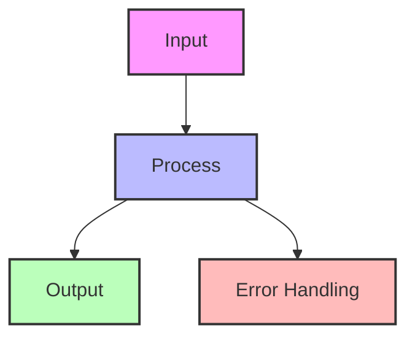

# CQRS (Command Query Responsibility Segregation)

!!! info "🥈 Silver Tier Pattern"
    **Read/Write Optimization Champion** • LinkedIn, Uber, Netflix at billion-event scale
    
    CQRS is essential for systems with asymmetric read/write patterns and complex domain logic. It enables independent scaling and optimization of commands and queries.
    
    **Key Success Metrics:**
    - LinkedIn: 1B+ daily feed updates
    - Uber: 20M+ trips with real-time tracking
    - Netflix: Billions of events processed

## Essential Question

**How can we optimize both complex writes and high-performance reads when they need completely different data models?**

**CQRS vs Event Sourcing**: These patterns are often confused but serve different purposes:
- **CQRS**: Separates read and write models for performance (can use any storage)
- **Event Sourcing**: Stores state as event history (can use single model)
- **Together**: Event sourcing naturally provides the events that CQRS uses to build read models

## When to Use / When NOT to Use

### Use CQRS When ✅

| Scenario | Why | Example |
|----------|-----|---------|
| **Read/write ratio > 10:1** | Different scaling needs | Social media feeds, product catalogs |
| **Complex domain logic** | Separate concerns cleanly | Financial trading, healthcare |
| **Multiple read models needed** | Different views of same data | Admin vs customer views |
| **Performance critical** | Optimize independently | Real-time dashboards |
| **Event sourcing used** | Natural combination | Audit systems |

### DON'T Use When ❌

| Scenario | Why | Alternative |
|----------|-----|-------------|
| **Simple CRUD** | Unnecessary complexity | Traditional architecture |
| **Small teams (< 3)** | Too much overhead | Monolithic approach |
| **Low traffic** | No scaling benefit | Simple database |
| **Strong consistency required** | CQRS is eventually consistent | ACID transactions |

## Level 1: Intuition (5 min)

### The Restaurant Kitchen Analogy

<h4>🔬 Law 4: Multidimensional Trade-offs</h4>

CQRS embodies that you cannot optimize for all dimensions simultaneously. Traditional CRUD tries to use the same model for both complex writes and high-performance reads.

**Key Insight**: Commands and queries have different consistency, performance, and scalability requirements. Separating them allows independent optimization.

### Visual Architecture

## Level 2: Foundation (10 min)

### CQRS Architecture

### Key Components

| Component | Purpose | Example Tech |
|-----------|---------|--------------|
| **Command Model** | Business logic, validation | Domain objects |
| **Query Model** | Optimized for reads | Denormalized views |
| **Projections** | Transform events to views | Stream processors |
| **Event Bus** | Connect write to read | Kafka, RabbitMQ |

### Trade-off Comparison

| Aspect | Traditional CRUD | CQRS |
|--------|------------------|------|
| **Complexity** | Simple | Higher |
| **Consistency** | Strong | Eventual |
| **Performance** | Compromised | Optimized |
| **Scalability** | Limited | Independent |
| **Flexibility** | Single model | Multiple models |

## Level 3: Deep Dive (15 min)

### CQRS Data Flow

### Model Comparison

| Aspect | Write Model | Read Model |
|--------|-------------|------------|
| **Structure** | Normalized, 3NF | Denormalized |
| **Optimization** | Business logic | Query performance |
| **Consistency** | ACID | Eventually consistent |
| **Storage** | Relational DB | NoSQL, Search, Cache |
| **Updates** | Through commands | Through projections |

### Synchronization Strategies

<h4>🎯 Read Model Update Strategies</h4>

**Synchronous Updates**
- Write waits for read model update
- Strong consistency
- Higher latency

**Asynchronous Updates**
- Write completes immediately
- Eventual consistency
- Better performance

**Hybrid Approach**
- Critical reads: synchronous
- Analytics: asynchronous

### Common Patterns

**Scale Metrics**:
- 1B+ feed updates daily
- 100ms P99 read latency
- Multiple projection types
- Geographic distribution

### Economic Analysis

## Quick Reference

### Decision Matrix

## Related Laws

- [Law: Asynchronous Reality](../../core-principles/laws/asynchronous-reality/)

## Related Patterns

### Natural Combinations
- **[Event Sourcing](./event-sourcing.md)**: Perfect partner for CQRS
- **[Saga Pattern](./saga.md)**: Commands trigger sagas
- **[Event-Driven Architecture](../communication/event-driven.md)**: Connect write to read

### Supporting Patterns
- **[Materialized View](../pattern-library/data-management/materialized-view.md)**: Read model implementation
- **[Cache-Aside](../pattern-library/scaling/caching-strategies.md.md)**: Speed up queries
- **[Database per Service](../pattern-library/database-per-service.md)**: Isolate models

### Alternatives
- **[Read Replicas](../pattern-library/read-replicas.md)**: Simpler scaling
- **[Caching](../pattern-library/scaling/caching-strategies.md)**: Less complexity
- **[API Composition](../pattern-library/api-composition.md)**: Query federation

## Further Reading

- [CQRS - Martin Fowler](https://martinfowler.com/bliki/CQRS.html)
- [CQRS Journey - Microsoft](https://docs.microsoft.com/en-us/previous-versions/msp-n-p/jj554200)
- [Greg Young on CQRS](https://cqrs.files.wordpress.com/2010/11/cqrs_documents.pdf)

### Tools & Frameworks
- **Axon Framework** (Java): CQRS + Event Sourcing
- **Eventuate** (Multiple languages): CQRS/ES platform
- **Commanded** (Elixir): CQRS/ES for Elixir
- **Lagom** (Scala/Java): Microservices with CQRS

