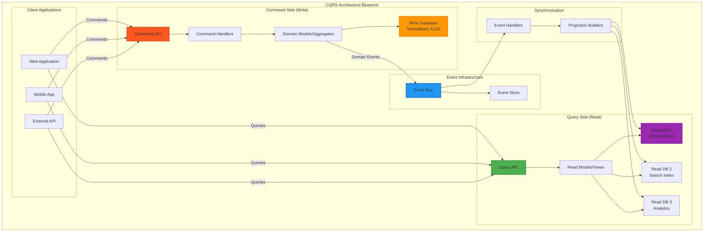

# CQRS Pattern

## The Complete Blueprint

Command Query Responsibility Segregation (CQRS) is an architectural pattern that separates read and write operations into distinct models, optimizing each for their specific concerns. Instead of using a single data model for both reading and writing, CQRS uses separate command models (optimized for writes, business logic, and consistency) and query models (optimized for reads, denormalized for fast queries). This separation enables independent scaling, different consistency requirements, and specialized optimization for each operation type.

### What You'll Master

- **Command-Query Separation**: Design systems with clear boundaries between write operations (commands) and read operations (queries)
- **Independent Scaling**: Scale read and write sides independently based on different load patterns and performance requirements
- **Optimized Data Models**: Create write models focused on business rules and read models optimized for specific query patterns
- **Event-Driven Synchronization**: Implement reliable mechanisms to keep read models eventually consistent with write models
- **Polyglot Persistence**: Use different databases optimized for writes vs reads (SQL for writes, NoSQL for reads, search engines for full-text)
- **Complex Query Optimization**: Build sophisticated read models that support complex reporting, analytics, and search requirements

CQRS pattern separates read and write models

## See Also

- [Eventual Consistency](/pattern-library/data-management/eventual-consistency)
- [Event Streaming](/pattern-library/architecture/event-streaming)
- [Rate Limiting Pattern](/pattern-library/scaling/rate-limiting)
