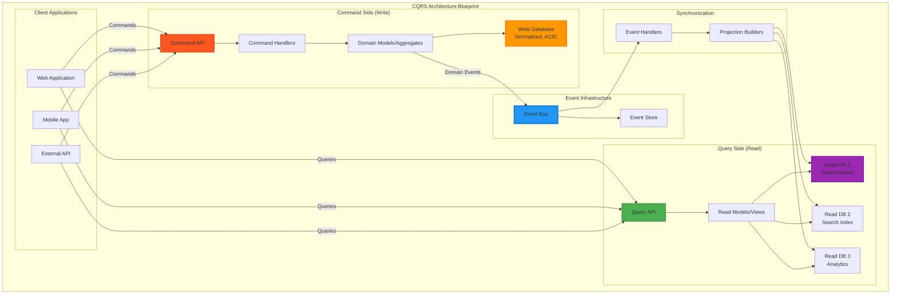

# CQRS Pattern

## Fundamental Law Connections

### Cognitive Separation (Law 3)
CQRS reduces cognitive load through separation of concerns:
- **Write Mental Model**: Focus on business rules and consistency
- **Read Mental Model**: Focus on query optimization and views
- **Developer Specialization**: Different teams can own read vs write
- **Debugging Simplification**: Issues isolated to one side
- **Trade-off**: Initial learning curve for the pattern itself

### Knowledge Optimization (Law 5)
Different knowledge representations for different purposes:
- **Write Model**: Normalized, domain-focused, consistency-oriented
- **Read Models**: Denormalized, query-optimized, performance-oriented
- **Multiple Projections**: Same data in different shapes for different queries
- **Event Stream**: Knowledge transfer from write to read side
- **Schema Evolution**: Read and write can evolve independently

### Eventual Consistency Timing (Law 2)
- **Projection Lag**: Read models trail write models by seconds to minutes
- **Synchronization Delays**: Event processing and projection building time
- **Consistency Windows**: Users may see stale data temporarily
- **Ordering Challenges**: Events must be processed in correct order

### Dual Optimization (Law 6)
- **Write Optimization**: ACID transactions, normalized data, business rules
- **Read Optimization**: Denormalized views, caching, indexes
- **Storage Trade-offs**: Duplication for performance
- **Consistency vs Performance**: Choose per operation type

### Infrastructure Costs (Law 7)
- **Dual Databases**: Separate write and read stores
- **Event Infrastructure**: Message bus, event store costs
- **Synchronization Overhead**: Projection builders and handlers
- **Operational Complexity**: More moving parts to manage
- **ROI**: Cost justified by scalability and performance gains

## Case Studies with Law Applications

### Amazon Product Catalog
**Laws Demonstrated**:
- **Law 3**: Separate teams for catalog updates vs search
- **Law 5**: Multiple read models (search, recommendations, browse)
- **Law 7**: 3x infrastructure cost for 100x read performance

**Key Insights**:
- Write model handles vendor updates
- Read models optimized for customer queries
- ElasticSearch for search, DynamoDB for browsing
- 5-second eventual consistency acceptable

### Banking Transaction System
**Laws Demonstrated**:
- **Law 2**: Real-time balance vs statement generation timing
- **Law 5**: Transaction log (write) vs account views (read)
- **Law 6**: Consistency for writes, performance for reads

**Key Insights**:
- Write side ensures ACID for transactions
- Read side provides various account views
- Regulatory reports as specialized projections
- Event sourcing naturally fits CQRS

### LinkedIn Feed Generation
**Laws Demonstrated**:
- **Law 3**: Content creation vs feed consumption separation
- **Law 5**: Posts (write) vs personalized feeds (read)
- **Law 7**: Massive read infrastructure for billions of feed views

**Key Insights**:
- Write model handles post creation
- Multiple read models for different feed algorithms
- Pre-computed feeds for active users
- Eventually consistent feeds acceptable

## The Complete Blueprint

Command Query Responsibility Segregation (CQRS) is an architectural pattern that separates read and write operations into distinct models, optimizing each for their specific concerns. Instead of using a single data model for both reading and writing, CQRS uses separate command models (optimized for writes, business logic, and consistency) and query models (optimized for reads, denormalized for fast queries). This separation enables independent scaling, different consistency requirements, and specialized optimization for each operation type.

### What You'll Master

- **Command-Query Separation**: Design systems with clear boundaries between write operations (commands) and read operations (queries)
- **Independent Scaling**: Scale read and write sides independently based on different load patterns and performance requirements
- **Optimized Data Models**: Create write models focused on business rules and read models optimized for specific query patterns
- **Event-Driven Synchronization**: Implement reliable mechanisms to keep read models eventually consistent with write models
- **Polyglot Persistence**: Use different databases optimized for writes vs reads (SQL for writes, NoSQL for reads, search engines for full-text)
- **Complex Query Optimization**: Build sophisticated read models that support complex reporting, analytics, and search requirements

CQRS pattern separates read and write models

## See Also

- [Eventual Consistency](/pattern-library/data-management/eventual-consistency)
- [Event Streaming](/pattern-library/architecture/event-streaming)
- [Rate Limiting Pattern](/pattern-library/scaling/rate-limiting)
