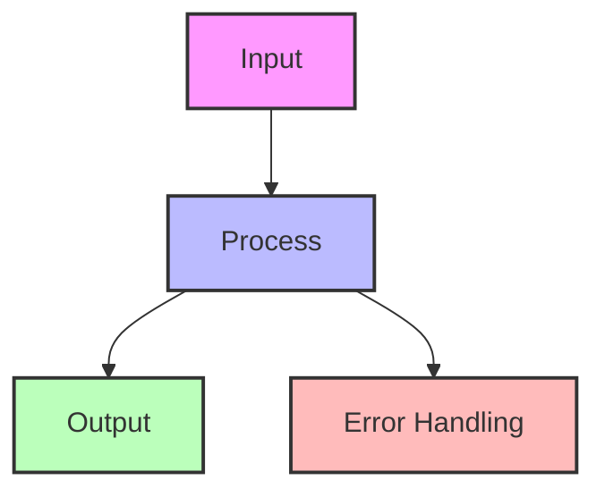
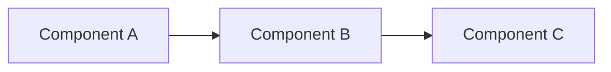

## Essential Question
## When to Use / When NOT to Use

### When to Use

| Scenario | Why It Fits | Alternative If Not |
|----------|-------------|-------------------|
| High availability required | Pattern provides resilience | Consider simpler approach |
| Scalability is critical | Handles load distribution | Monolithic might suffice |
| Distributed coordination needed | Manages complexity | Centralized coordination |

### When NOT to Use

| Scenario | Why to Avoid | Better Alternative |
|----------|--------------|-------------------|
| Simple applications | Unnecessary complexity | Direct implementation |
| Low traffic systems | Overhead not justified | Basic architecture |
| Limited resources | High operational cost | Simpler patterns |
**How do we ensure data consistency and reliability with crdt (conflict-free replicated data types)?**


# CRDT (Conflict-free Replicated Data Types)

!!! success "🏆 Gold Standard Pattern"
    **Automatic Conflict Resolution** • Figma, Riak, Redis proven
    
    The breakthrough pattern for conflict-free collaboration. CRDTs enable real-time collaborative applications and geo-distributed databases by mathematically guaranteeing convergence without coordination.
    
    **Key Success Metrics:**
    - Figma: Powers real-time design collaboration for millions
    - Riak: Petabyte-scale with automatic conflict resolution
    - Redis CRDT: Active-active replication across continents

**Automatic conflict resolution for distributed data**

!!! abstract "The CRDT Convergence Theorem"
 <p>CRDTs guarantee that all replicas will eventually converge to the same state without requiring coordination, as long as all updates are eventually delivered to all replicas. This property, called Strong Eventual Consistency (SEC), is stronger than regular eventual consistency.</p>

## CRDT Properties at a Glance

| Property | Guarantee | Benefit |
|----------|-----------|----------|
| **Convergence** | All replicas reach same state | No divergence |
| **Coordination-free** | No consensus/locking | High availability |
| **Always writable** | Accept updates anytime | No blocking |
| **Partition tolerant** | Works during splits | Network resilience |
| **Auto conflict resolution** | Mathematical merge | No manual intervention |

## Visual CRDT Type Hierarchy


## CRDT Types and Convergence

### State-based CRDTs (CvRDT)

### State vs Operation vs Delta CRDTs

| Type | Mechanism | Network Cost | Delivery Requirement |
|------|-----------|--------------|---------------------|
| **State-based (CvRDT)** | Send full state | O(state size) | Idempotent |
| **Operation-based (CmRDT)** | Send operations | O(op size) | Exactly-once, causal |
| **Delta-based (δ-CRDT)** | Send state changes | O(delta size) | Idempotent |

#### Join Semilattice Structure




### Operation-based CRDTs (CmRDT)

#### How Operation-based CRDTs Work

## Detailed CRDT Type Implementations

### 1. G-Counter (Grow-only Counter)

#### Visual Representation


### G-Counter Implementation Pattern


**Key insight**: Each node tracks all node counts; merge takes maximum per node.

### 2. PN-Counter (Positive-Negative Counter)

#### Visual Representation

### PN-Counter = Two G-Counters

| Component | Purpose | Operation |
|-----------|---------|----------|  
| **P-Counter** | Track increments | `increment()` → P.add |
| **N-Counter** | Track decrements | `decrement()` → N.add |
| **Value** | Current count | P.value() - N.value() |
| **Merge** | Combine states | P.merge(), N.merge() |

### 3. OR-Set (Observed-Remove Set)

#### Convergence Visualization

### OR-Set Mechanics

**Key**: Unique IDs allow concurrent add/remove of same element without conflicts.

### 4. LWW-Register (Last-Write-Wins Register)

#### Conflict Resolution Visualization

### LWW-Register Conflict Resolution

| Scenario | Resolution Rule | Example |
|----------|----------------|----------|
| **Different timestamps** | Higher timestamp wins | T2 > T1 → use T2 value |
| **Same timestamp** | Node ID breaks tie | T1 = T2 → compare node IDs |
| **Clock skew** | Still deterministic | Works despite time drift |


### Handling Network Partitions


### Join Semilattice Requirements

| Property | Definition | Example (Set Union) |
|----------|------------|--------------------|
| **Commutativity** | `a ⊔ b = b ⊔ a` | `{1,2} ∪ {3} = {3} ∪ {1,2}` |
| **Associativity** | `(a ⊔ b) ⊔ c = a ⊔ (b ⊔ c)` | `({1} ∪ {2}) ∪ {3} = {1} ∪ ({2} ∪ {3})` |
| **Idempotence** | `a ⊔ a = a` | `{1,2} ∪ {1,2} = {1,2}` |


## Real-World Applications

### 1. Collaborative Text Editing

#### RGA (Replicated Growing Array) Structure

### Real-World CRDT Applications

| Use Case | CRDT Type | Companies | Scale |
|----------|-----------|-----------|-------|
| **Collaborative Editing** | RGA/Treedoc | Figma, Google Docs | Millions concurrent |
| **Shopping Cart** | OR-Set + PN-Counter | Amazon, Riak | Global scale |
| **User Presence** | LWW-Register | Discord, Slack | Real-time updates |
| **Like Counters** | G-Counter | Twitter, Facebook | Billions/day |
| **Distributed Cache** | LWW-Map | Redis CRDT | Multi-region |
| **Session Storage** | OR-Set | Cloudflare | Edge computing |

### CRDT Design Patterns

| Pattern | Composition | Use Case |
|---------|-------------|----------|  
| **Composed CRDT** | Multiple basic CRDTs | Shopping cart (OR-Set + PN-Counter) |
| **Embedded CRDT** | CRDT inside CRDT | Map of Counters |
| **Causal CRDT** | Add happens-before | Message ordering |
| **Pure Op-Based** | No state transfer | Low bandwidth |
| **Delta-State** | Incremental sync | Large datasets |
| **Merkle-CRDT** | Efficient sync | Minimize transfers |

## Performance Characteristics

### CRDT Performance Profile

| CRDT Type | Space | Update | Merge | Query | Garbage Collection |
|-----------|-------|--------|-------|-------|-------------------|
| **G-Counter** | O(n) nodes | O(1) | O(n) | O(n) | Not needed |
| **PN-Counter** | O(n) nodes | O(1) | O(n) | O(n) | Not needed |
| **OR-Set** | O(m×u) elem×ids | O(1) | O(m) | O(1) | Critical (tombstones) |
| **LWW-Register** | O(1) | O(1) | O(1) | O(1) | Not needed |
| **RGA** | O(m) positions | O(m) | O(m) | O(1) | Optional |


### Bandwidth Usage Patterns

## Level 1: Intuition (5 minutes)

*Start your journey with relatable analogies*

### The Elevator Pitch
[Pattern explanation in simple terms]

### Real-World Analogy
[Everyday comparison that explains the concept]

## Level 2: Foundation (10 minutes)

*Build core understanding*

### Core Concepts
- Key principle 1
- Key principle 2
- Key principle 3

### Basic Example


## Level 3: Deep Dive (15 minutes)

*Understand implementation details*

### How It Really Works
[Technical implementation details]

### Common Patterns
[Typical usage patterns]

## Level 4: Expert (20 minutes)

*Master advanced techniques*

### Advanced Configurations
[Complex scenarios and optimizations]

### Performance Tuning
[Optimization strategies]

## Level 5: Mastery (30 minutes)

*Apply in production*

### Real-World Case Studies
[Production examples from major companies]

### Lessons from the Trenches
[Common pitfalls and solutions]


## Decision Matrix

### Quick Decision Table

| Factor | Low Complexity | Medium Complexity | High Complexity |
|--------|----------------|-------------------|-----------------|
| Team Size | < 5 developers | 5-20 developers | > 20 developers |
| Traffic | < 1K req/s | 1K-100K req/s | > 100K req/s |
| Data Volume | < 1GB | 1GB-1TB | > 1TB |
| **Recommendation** | ❌ Avoid | ⚠️ Consider | ✅ Implement |

## Implementation Best Practices

### 1. Choosing the Right CRDT


### Garbage Collection Strategies

| Strategy | Mechanism | Pros | Cons |
|----------|-----------|------|------|
| **Timeout-based** | Remove after TTL | Simple | Unsafe if delayed |
| **Version Vector** | Track causal history | Safe | Memory overhead |
| **Consensus GC** | Agree on cutoff | Very safe | Coordination required |
| **Hybrid** | Local + periodic consensus | Balanced | Complex |
| **Bloom Filter** | Probabilistic tracking | Space efficient | False positives |

### Optimization Techniques

| Technique | Purpose | Trade-off |
|-----------|---------|-----------|  
| **Batching** | Reduce sync frequency | Latency vs efficiency |
| **Compression** | Reduce state size | CPU vs bandwidth |
| **Hierarchical** | Local + global CRDTs | Complexity vs scale |
| **Lazy propagation** | Delay non-critical updates | Consistency lag |
| **State pruning** | Remove old history | Safety vs space |
| **Delta compression** | Send only changes | Requires reliable delivery |

## Trade-offs and Limitations

### CRDT vs Other Consistency Models

| Aspect | CRDTs | Consensus (Raft/Paxos) | Last-Write-Wins | Vector Clocks |
|--------|-------|------------------------|-----------------|---------------|
| **Availability** | Always available | Requires majority | Always available | Always available |
| **Partition Tolerance** | Full tolerance | Majority partition | Full tolerance | Full tolerance |
| **Consistency** | Eventual (SEC) | Strong | Eventual | Causal |
| **Conflict Resolution** | Automatic | N/A (prevents conflicts) | Data loss possible | Manual required |
| **Latency** | Low (local ops) | High (coordination) | Low | Low |
| **Complexity** | Medium | High | Low | Medium |
| **Memory Overhead** | Can be high | Low | Low | Medium |


### CRDT Limitations Matrix

| Limitation | Why | Alternative |
|------------|-----|-------------|
| **No strong consistency** | Eventually consistent only | Use consensus (Raft/Paxos) |
| **No global invariants** | Can't enforce constraints | Use transactions |
| **Memory growth** | Metadata accumulates | Implement GC carefully |
| **Complex to reason about** | Non-intuitive behavior | Extensive testing needed |
| **Limited operations** | Not all ops have CRDT | Design around available types |
| **Network overhead** | State/metadata transfer | Use delta-CRDTs |

<div class="truth-box">
<h4>💡 CRDT Production Insights</h4>

**The 10-100-1000 Rule:**
- 10KB: Typical CRDT metadata per object
- 100x: Metadata growth vs. raw data
- 1000ms: Maximum anti-entropy interval

**Metadata Growth Reality:**
```
Simple counter: 100 bytes
OR-Set (1K items): 50KB
RGA (10K char doc): 500KB
Without GC: 10MB+ after a year!
```

**Real-World Patterns:**
- 90% of CRDT bugs are in garbage collection
- Tombstones account for 60% of storage
- Clock skew causes 25% of "convergence" issues
- Most apps only need 2-3 CRDT types

**Production Wisdom:**
> "CRDTs are like mechanical watches - beautiful engineering, but a digital watch tells time just fine. Use the simplest solution that works."

**Economic Reality:**
- CRDT library: 6-12 months to build correctly
- Metadata storage: 10-100x raw data cost
- Network bandwidth: 5-10x increase
- Bug fix cost: $500K+ per correctness issue

**The Three Laws of CRDTs:**
1. **Convergence is not correctness** - Can converge to wrong state
2. **Metadata grows forever** - Plan garbage collection day 1
3. **Simpler is better** - LWW solves 80% of use cases
</div>

## Related Patterns

- [Eventual Consistency](eventual-consistency.md) - The consistency model CRDTs provide
- [Vector Clocks](vector-clocks.md) - Used in some CRDT implementations
- Gossip Protocol (Coming Soon) - Common dissemination method
- Anti-Entropy (Coming Soon) - Synchronization mechanism

## References

1. "Conflict-free Replicated Data Types" - Shapiro et al.
2. "A Comprehensive Study of CRDTs" - Shapiro, Preguiça, Baquero, Zawirski
3. "Delta State Replicated Data Types" - Almeida, Shoker, Baquero
4. "Efficient State-based CRDTs by Delta-Mutation" - Riak implementation

---

*Next: [Vector Clocks](vector-clocks.md) - Understanding causality in distributed systems*

