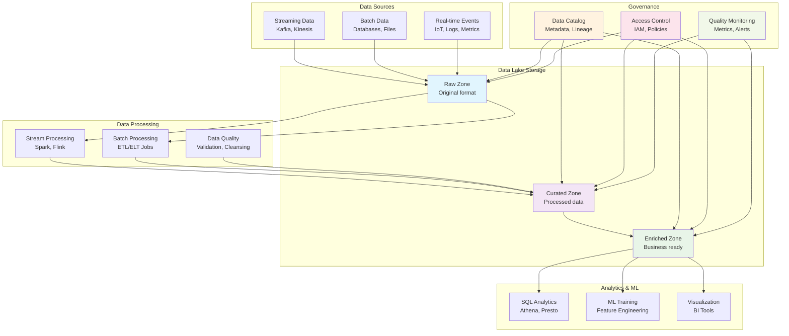
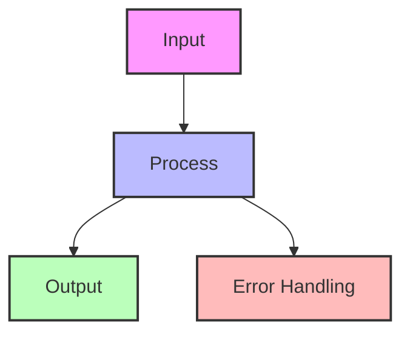

## The Complete Blueprint

The Data Lake pattern establishes a centralized repository that stores vast amounts of raw data in its native format, enabling flexible analysis and machine learning at scale. Unlike traditional data warehouses that require structured, pre-processed data, data lakes embrace schema-on-read philosophy, allowing organizations to store structured, semi-structured, and unstructured data together in cost-effective cloud storage. This approach supports exploratory data analysis, advanced analytics, and machine learning workflows by providing data scientists and analysts access to comprehensive historical data without the constraints of predefined schemas.

### What You'll Master

- **Multi-zone architecture** for progressive data refinement from raw ingestion to business-ready datasets
- **Schema-on-read processing** that enables flexible data exploration without upfront structure definitions  
- **Integrated governance frameworks** including metadata catalogs, data lineage, and automated quality monitoring
- **Cost-effective storage strategies** using tiered storage classes and lifecycle policies for petabyte-scale data
- **Processing engine integration** with Spark, Presto, and specialized ML frameworks for diverse analytical workloads
- **Security and compliance patterns** for data access control, encryption, and regulatory requirement adherence

## Essential Question
## When to Use / When NOT to Use

### When to Use

| Scenario | Why It Fits | Alternative If Not |
|----------|-------------|-------------------|
| High availability required | Pattern provides resilience | Consider simpler approach |
| Scalability is critical | Handles load distribution | Monolithic might suffice |
| Distributed coordination needed | Manages complexity | Centralized coordination |

### When NOT to Use

| Scenario | Why to Avoid | Better Alternative |
|----------|--------------|-------------------|
| Simple applications | Unnecessary complexity | Direct implementation |
| Low traffic systems | Overhead not justified | Basic architecture |
| Limited resources | High operational cost | Simpler patterns |
**How do we ensure data consistency and reliability with data lake pattern?**

# Data Lake Pattern

!!! warning "🥉 Bronze Pattern"
    **Use with Caution** • Evolving to Data Mesh architectures
    
    Data Lakes often become "data swamps" without proper governance. Modern architectures are moving toward domain-oriented data mesh patterns for better ownership and quality.
    
    **Migration Path**: Consider Data Mesh for new implementations

**Store everything now, figure out value later**

## Visual Architecture

## Data Lake vs Data Warehouse vs Data Mesh

| Aspect | Data Lake | Data Warehouse | Data Mesh |
|--------|-----------|----------------|-----------|
| **Data Format** | All formats (raw) | Structured only | Domain-specific |
| **Schema** | Schema-on-read | Schema-on-write | Schema by domain |
| **Processing** | ELT | ETL | Domain pipelines |
| **Cost** | Low storage | High compute | Distributed |
| **Agility** | High | Low | Very high |
| **Governance** | Challenging | Centralized | Federated |
| **Users** | Data scientists | Business analysts | Domain teams |

## Zone Architecture

## Common Pitfalls

<h4>💥 The Data Swamp Problem</h4>

**What Happens**: 
- No metadata or cataloging
- Unknown data quality
- Duplicate data everywhere
- No one knows what's in the lake

**Result**: $10M+ invested, 90% of data never used

**Prevention**:
- Mandatory metadata on ingestion
- Data quality scores
- Automated cataloging
- Regular cleanup policies

## Technology Stack Comparison

| Component | AWS | Azure | GCP | Open Source |
|-----------|-----|-------|-----|-------------|
| **Storage** | S3 | ADLS Gen2 | GCS | HDFS/MinIO |
| **Catalog** | Glue | Purview | Data Catalog | Apache Atlas |
| **Processing** | EMR | Databricks | Dataproc | Spark |
| **Query** | Athena | Synapse | BigQuery | Presto/Trino |
| **Governance** | Lake Formation | Purview | Dataplex | Apache Ranger |

## Decision Matrix

| Factor | Score (1-5) | Reasoning |
|--------|-------------|-----------|
| **Complexity** | 5 | Data governance, cataloging, multi-format support, lifecycle management |
| **Performance Impact** | 3 | Good for batch analytics, poor for real-time; query performance varies |
| **Operational Overhead** | 5 | Data governance, quality monitoring, catalog maintenance, access control |
| **Team Expertise Required** | 4 | Data engineering, governance frameworks, query optimization, security |
| **Scalability** | 4 | Excellent storage scaling, but query performance can degrade without partitioning |

**Overall Recommendation: ⚠️ USE WITH CAUTION** - Consider Data Mesh or modern data platform architectures for new implementations.

## Decision Framework

## Level 4: Expert (20 min) {#expert}

### Advanced Techniques

#### Optimization Strategies

1. **Lakehouse Architecture**
   - When to apply: Need both flexibility and reliability
   - Impact: 10x query performance improvement over traditional lakes
   - Trade-off: Higher complexity but better governance

2. **Domain-Oriented Data Products**
   - When to apply: Large organizations with multiple teams
   - Impact: 5x faster time-to-insight with better data quality
   - Trade-off: Requires organizational change and tooling investment

### Scaling Considerations

### Monitoring & Observability

#### Key Metrics to Track

| Metric | Alert Threshold | Dashboard Panel |
|--------|-----------------|------------------|
| Data Quality Score | <80% | Quality trend over time by domain |
| Storage Growth Rate | >20% monthly | Cost projection and utilization |
| Query Success Rate | <90% | Error types and frequency |
| Time to Value | >90 days | From ingestion to first business use |

## Level 5: Mastery (30 min) {#mastery}

### Real-World Case Studies

#### Case Study 1: Uber's Evolution from Data Lake to Data Mesh

<h4>💡 Production Insights from Uber</h4>

**Challenge**: 100PB data lake became unmanageable - 70% of data was never used, data quality issues plagued ML models, and teams couldn't find relevant datasets

**Implementation**: Evolved to domain-specific data products with:
- Rides domain: Trip data, driver analytics
- Eats domain: Restaurant and delivery metrics  
- Marketplace domain: Supply-demand matching data

**Results**: 
- **Data Quality**: Improved from 60% to 95% usable data
- **Time to Insight**: Reduced from 6 months to 2 weeks
- **Cost Optimization**: 40% reduction in storage costs through better lifecycle management

**Lessons Learned**: Domain ownership is crucial - teams that own the data care about its quality and relevance

### Pattern Evolution

#### Migration from Data Lake to Modern Architecture

### Comparison with Alternatives

| Aspect | Data Lake | Data Lakehouse | Data Mesh |
|--------|-----------|----------------|-----------|
| Governance | 🔴 Poor | ✅ Strong | ✅ Federated |
| Performance | 🔴 Slow | ✅ Fast | 🟡 Variable |
| Flexibility | ✅ High | 🟡 Medium | ✅ Domain-specific |
| Complexity | 🟡 Medium | 🔴 High | 🔴 Very High |
| When to use | Legacy only | Analytics-heavy | Large organizations |

#
## Level 1: Intuition (5 minutes)

*Start your journey with relatable analogies*

### The Elevator Pitch
[Pattern explanation in simple terms]

### Real-World Analogy
[Everyday comparison that explains the concept]

## Level 2: Foundation (10 minutes)

*Build core understanding*

### Core Concepts
- Key principle 1
- Key principle 2
- Key principle 3

### Basic Example

## Level 3: Deep Dive (15 minutes)

*Understand implementation details*

### How It Really Works
[Technical implementation details]

### Common Patterns
[Typical usage patterns]

## Level 4: Expert (20 minutes)

*Master advanced techniques*

### Advanced Configurations
[Complex scenarios and optimizations]

### Performance Tuning
[Optimization strategies]

## Level 5: Mastery (30 minutes)

*Apply in production*

### Real-World Case Studies
[Production examples from major companies]

### Lessons from the Trenches
[Common pitfalls and solutions]

## Implementation Checklist

**Pre-Implementation**
- [ ] **Strong justification required** - Consider modern alternatives first
- [ ] Data governance framework established
- [ ] Clear domain boundaries and ownership defined
- [ ] Storage lifecycle and cost management planned

**Implementation** 
- [ ] Proper data cataloging and metadata management
- [ ] Access controls and data lineage tracking
- [ ] Automated data quality monitoring
- [ ] Performance optimization (columnar formats, partitioning)

**Post-Implementation**
- [ ] Regular data quality audits (target: >90% usable data)
- [ ] Storage cost optimization and lifecycle policies
- [ ] Migration planning to modern alternatives
- [ ] User feedback and value measurement

### Related Resources

- :material-book-open-variant:{ .lg .middle } **Modern Alternatives**
    
    ---
    
    - <!-- TODO: Add Data Mesh Architecture from Architects Handbook --> - Domain-oriented data ownership
    - <!-- TODO: Add Lakehouse Pattern from Architects Handbook --> - Best of lakes and warehouses
    - <!-- TODO: Add Feature Store from Architects Handbook --> - ML-focused data management

- :material-flask:{ .lg .middle } **Fundamental Laws**
    
    ---
    
    - [Law 4: Multidimensional Optimization](../../core-principles/laws/multidimensional-optimization.md) - Flexibility vs governance trade-offs
    - [Law 7: Economic Reality](../../core-principles/laws/economic-reality.md) - Cost of poor data governance

- :material-pillar:{ .lg .middle } **Foundational Pillars**
    
    ---
    
    - [State Distribution](../../core-principles/pillars/state-distribution.md) - Distributed data management
    - [Intelligence Distribution](../../core-principles/pillars/intelligence-distribution.md) - Analytics and ML patterns

- :material-tools:{ .lg .middle } **Migration Guides**
    
    ---
    
    - <!-- TODO: Add Data Lake to Mesh Migration from Architects Handbook -->
    - <!-- TODO: Add Lakehouse Implementation from Architects Handbook -->
    - <!-- TODO: Add Governance Framework Setup from Architects Handbook -->

---

*Next: <!-- TODO: Add Data Mesh from Architects Handbook --> - Modern domain-oriented data architecture*

