# Data Lake Pattern

!!! warning "🥉 Bronze Pattern"
    **Use with Caution** • Evolving to Data Mesh architectures
    
    Data Lakes often become "data swamps" without proper governance. Modern architectures are moving toward domain-oriented data mesh patterns for better ownership and quality.
    
    **Migration Path**: Consider Data Mesh for new implementations

**Store everything now, figure out value later**

## Visual Architecture

## Data Lake vs Data Warehouse vs Data Mesh

| Aspect | Data Lake | Data Warehouse | Data Mesh |
|--------|-----------|----------------|-----------|
| **Data Format** | All formats (raw) | Structured only | Domain-specific |
| **Schema** | Schema-on-read | Schema-on-write | Schema by domain |
| **Processing** | ELT | ETL | Domain pipelines |
| **Cost** | Low storage | High compute | Distributed |
| **Agility** | High | Low | Very high |
| **Governance** | Challenging | Centralized | Federated |
| **Users** | Data scientists | Business analysts | Domain teams |

## Zone Architecture

## Common Pitfalls

<h4>💥 The Data Swamp Problem</h4>

**What Happens**: 
- No metadata or cataloging
- Unknown data quality
- Duplicate data everywhere
- No one knows what's in the lake

**Result**: $10M+ invested, 90% of data never used

**Prevention**:
- Mandatory metadata on ingestion
- Data quality scores
- Automated cataloging
- Regular cleanup policies

## Technology Stack Comparison

| Component | AWS | Azure | GCP | Open Source |
|-----------|-----|-------|-----|-------------|
| **Storage** | S3 | ADLS Gen2 | GCS | HDFS/MinIO |
| **Catalog** | Glue | Purview | Data Catalog | Apache Atlas |
| **Processing** | EMR | Databricks | Dataproc | Spark |
| **Query** | Athena | Synapse | BigQuery | Presto/Trino |
| **Governance** | Lake Formation | Purview | Dataplex | Apache Ranger |

## Decision Framework

## Level 4: Expert (20 min) {#expert}

### Advanced Techniques

#### Optimization Strategies

1. **Lakehouse Architecture**
   - When to apply: Need both flexibility and reliability
   - Impact: 10x query performance improvement over traditional lakes
   - Trade-off: Higher complexity but better governance

2. **Domain-Oriented Data Products**
   - When to apply: Large organizations with multiple teams
   - Impact: 5x faster time-to-insight with better data quality
   - Trade-off: Requires organizational change and tooling investment

### Scaling Considerations

### Monitoring & Observability

#### Key Metrics to Track

| Metric | Alert Threshold | Dashboard Panel |
|--------|-----------------|------------------|
| Data Quality Score | <80% | Quality trend over time by domain |
| Storage Growth Rate | >20% monthly | Cost projection and utilization |
| Query Success Rate | <90% | Error types and frequency |
| Time to Value | >90 days | From ingestion to first business use |

## Level 5: Mastery (30 min) {#mastery}

### Real-World Case Studies

#### Case Study 1: Uber's Evolution from Data Lake to Data Mesh

<h4>💡 Production Insights from Uber</h4>

**Challenge**: 100PB data lake became unmanageable - 70% of data was never used, data quality issues plagued ML models, and teams couldn't find relevant datasets

**Implementation**: Evolved to domain-specific data products with:
- Rides domain: Trip data, driver analytics
- Eats domain: Restaurant and delivery metrics  
- Marketplace domain: Supply-demand matching data

**Results**: 
- **Data Quality**: Improved from 60% to 95% usable data
- **Time to Insight**: Reduced from 6 months to 2 weeks
- **Cost Optimization**: 40% reduction in storage costs through better lifecycle management

**Lessons Learned**: Domain ownership is crucial - teams that own the data care about its quality and relevance

### Pattern Evolution

#### Migration from Data Lake to Modern Architecture

#### Future Directions

| Trend | Impact on Pattern | Adaptation Strategy |
|-------|------------------|-------------------|
| Real-time Analytics | Batch processing becomes insufficient | Stream-first architectures with CDC |
| AI/ML Democratization | Need for feature stores and model governance | ML-native data platforms |
| Data Privacy Regulations | Compliance complexity in centralized lakes | Privacy-by-design in federated systems |

### Pattern Combinations

#### Works Well With

| Pattern | Combination Benefit | Integration Point |
|---------|-------------------|------------------|
| **Event Sourcing** | Real-time data updates | Event streams feed lake zones |
| **CQRS** | Separate read/write models | Lake serves as read model source |
| **Microservices** | Domain-aligned data boundaries | Each service contributes domain data |

## Quick Reference

### Decision Matrix

```mermaid
graph TD
    A[Need Big Data Storage?] --> B{Strong Governance Available?}
    B -->|No| C[❌ Avoid Data Lake]
    B -->|Yes| D{Real-time Requirements?}
    
    D -->|Yes| E[Consider Stream Processing]
    D -->|No| F{New Project?}
    
    F -->|Yes| G[Use Data Mesh/Lakehouse]
    F -->|No| H[Existing Lake Migration]
    
    C --> I[Use Purpose-Built DBs]
    E --> J[Event-Driven Architecture] 
    G --> K[Domain Data Products]
    H --> L[Gradual Domain Migration]
    
    classDef recommended fill:#81c784,stroke:#388e3c,stroke-width:2px
    classDef caution fill:#ffb74d,stroke:#f57c00,stroke-width:2px
    classDef avoid fill:#f44336,stroke:#d32f2f,stroke-width:2px
    
    class K,L recommended
    class J caution
    class C,I avoid
```

### Comparison with Alternatives

| Aspect | Data Lake | Data Lakehouse | Data Mesh |
|--------|-----------|----------------|-----------|
| Governance | 🔴 Poor | ✅ Strong | ✅ Federated |
| Performance | 🔴 Slow | ✅ Fast | 🟡 Variable |
| Flexibility | ✅ High | 🟡 Medium | ✅ Domain-specific |
| Complexity | 🟡 Medium | 🔴 High | 🔴 Very High |
| When to use | Legacy only | Analytics-heavy | Large organizations |

### Implementation Checklist

**Pre-Implementation**
- [ ] **Strong justification required** - Consider modern alternatives first
- [ ] Data governance framework established
- [ ] Clear domain boundaries and ownership defined
- [ ] Storage lifecycle and cost management planned

**Implementation** 
- [ ] Proper data cataloging and metadata management
- [ ] Access controls and data lineage tracking
- [ ] Automated data quality monitoring
- [ ] Performance optimization (columnar formats, partitioning)

**Post-Implementation**
- [ ] Regular data quality audits (target: >90% usable data)
- [ ] Storage cost optimization and lifecycle policies
- [ ] Migration planning to modern alternatives
- [ ] User feedback and value measurement

### Related Resources

- :material-book-open-variant:{ .lg .middle } **Modern Alternatives**
    
    ---
    
    - [Data Mesh Architecture](../../excellence/guides/data-mesh-patterns.md) - Domain-oriented data ownership
    - [Lakehouse Pattern](../../excellence/guides/lakehouse-architecture.md) - Best of lakes and warehouses
    - [Feature Store](../../excellence/guides/feature-store-design.md) - ML-focused data management

- :material-flask:{ .lg .middle } **Fundamental Laws**
    
    ---
    
    - [Law 4: Multidimensional Optimization](../../part1-axioms/law4-tradeoffs/) - Flexibility vs governance trade-offs
    - [Law 7: Economic Reality](../../part1-axioms/law7-economics/) - Cost of poor data governance

- :material-pillar:{ .lg .middle } **Foundational Pillars**
    
    ---
    
    - [State Distribution](../../part2-pillars/state/) - Distributed data management
    - [Intelligence Distribution](../../part2-pillars/intelligence/) - Analytics and ML patterns

- :material-tools:{ .lg .middle } **Migration Guides**
    
    ---
    
    - [Data Lake to Mesh Migration](../../excellence/migrations/data-lake-to-mesh.md)
    - [Lakehouse Implementation](../../excellence/migrations/lake-to-lakehouse.md)
    - [Governance Framework Setup](../../excellence/guides/data-governance.md)

---

*Next: [Data Mesh](../../excellence/guides/data-mesh-patterns.md) - Modern domain-oriented data architecture*