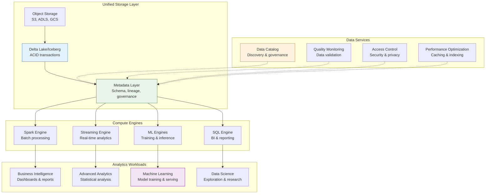

# Data Lakehouse

!!! info "🥇 Gold Tier Pattern"
    **Unified Analytics Architecture** • Essential for modern data-driven organizations
    
    The data lakehouse architecture has emerged as the next evolution of data platforms, combining the best aspects of data lakes and data warehouses. Critical for organizations requiring both traditional BI and advanced analytics/ML capabilities.
    
    **Best For:** Large enterprises, data-driven companies, organizations with diverse analytics needs, ML-intensive applications

## Essential Question

**How do we unify data lake flexibility with data warehouse performance for comprehensive analytics and ML at scale?**

## When to Use / When NOT to Use

### ✅ Use When

| Scenario | Example | Impact |
|----------|---------|--------|
| Diverse data types | Structured, semi-structured, unstructured | Single platform for all data analytics |
| Mixed workloads | BI dashboards + ML training | Unified architecture eliminates data silos |
| Real-time + batch | Streaming analytics + historical analysis | Consistent results across time horizons |
| Large data volumes | Multi-petabyte datasets | Cost-effective storage with warehouse performance |
| ML at scale | Model training on historical data | Direct access to raw data for feature engineering |

### ❌ DON'T Use When

| Scenario | Why | Alternative |
|----------|-----|-------------|
| Simple BI needs | Complexity overhead | Traditional data warehouse |
| Small data volumes | < 10TB total | Cloud data warehouse services |
| Single workload type | Only BI or only batch processing | Specialized solutions (Snowflake, BigQuery) |
| Limited technical expertise | Requires advanced data engineering | Managed analytics services |
| Strict consistency needs | Eventual consistency challenges | Traditional RDBMS or data warehouse |

## Level 1: Intuition (5 min) {#intuition}

### The Story

A data lakehouse is like a modern hybrid library-research facility. Traditional libraries (data warehouses) have organized books in specific sections with excellent search capabilities but limited flexibility for new types of content. Storage warehouses (data lakes) can hold any type of material but finding and using specific items is difficult. A lakehouse combines both: it stores everything like a warehouse but organizes and indexes content like a library, allowing both casual browsing and detailed research with the same high-performance access.

### Visual Metaphor



## Level 2: Foundation (10 min) {#foundation}

### Basic Lakehouse Implementation

```python
# Data Lakehouse implementation with Delta Lake and Spark
from pyspark.sql import SparkSession
from delta.tables import *
import pyspark.sql.functions as F
from pyspark.sql.types import *
from typing import Dict, List, Any, Optional
import logging

class DataLakehouse:
    """Core data lakehouse implementation"""
    
    def __init__(self, storage_path: str, catalog_name: str = "lakehouse"):
        # Initialize Spark with Delta Lake
        self.spark = SparkSession.builder \
            .appName("DataLakehouse") \
            .config("spark.sql.extensions", "io.delta.sql.DeltaSparkSessionExtension") \
            .config("spark.sql.catalog.spark_catalog", "org.apache.spark.sql.delta.catalog.DeltaCatalog") \
            .config("spark.sql.adaptive.enabled", "true") \
            .config("spark.sql.adaptive.coalescePartitions.enabled", "true") \
            .getOrCreate()
        
        self.storage_path = storage_path
        self.catalog_name = catalog_name
        
        # Initialize logging
        logging.basicConfig(level=logging.INFO)
        self.logger = logging.getLogger(__name__)
        
        # Create catalog structure
        self._initialize_catalog()
    
    def create_table(self, table_name: str, schema: StructType, 
                    partition_columns: List[str] = None,
                    table_properties: Dict[str, str] = None) -> None:
        """Create a Delta table with schema and partitioning"""
        
        table_path = f"{self.storage_path}/{table_name}"
        
        # Default table properties for lakehouse optimization
        default_properties = {
            'delta.autoOptimize.optimizeWrite': 'true',
            'delta.autoOptimize.autoCompact': 'true',
            'delta.enableChangeDataFeed': 'true',
            'delta.retention.days': '30'
        }
        
        if table_properties:
            default_properties.update(table_properties)
        
        # Create empty DataFrame with schema
        empty_df = self.spark.createDataFrame([], schema)
        
        # Write as Delta table
        writer = empty_df.write.format("delta")
        
        if partition_columns:
            writer = writer.partitionBy(*partition_columns)
        
        # Apply table properties
        for key, value in default_properties.items():
            writer = writer.option(key, value)
        
        writer.save(table_path)
        
        # Register in catalog
        self.spark.sql(f"""
            CREATE TABLE IF NOT EXISTS {self.catalog_name}.{table_name}
            USING DELTA
            LOCATION '{table_path}'
        """)
        
        self.logger.info(f"Created table {table_name} at {table_path}")
    
    def upsert_data(self, table_name: str, new_data_df, 
                   merge_condition: str, update_columns: List[str] = None) -> Dict[str, int]:
        """Perform upsert (merge) operation on Delta table"""
        
        table_path = f"{self.storage_path}/{table_name}"
        delta_table = DeltaTable.forPath(self.spark, table_path)
        
        # Default to update all columns if not specified
        if not update_columns:
            update_columns = new_data_df.columns
        
        # Create update expressions
        update_expr = {col: f"new_data.{col}" for col in update_columns}
        insert_expr = {col: f"new_data.{col}" for col in new_data_df.columns}
        
        # Perform merge
        merge_result = delta_table.alias("existing") \
            .merge(new_data_df.alias("new_data"), merge_condition) \
            .whenMatchedUpdate(set=update_expr) \
            .whenNotMatchedInsert(values=insert_expr) \
            .execute()
        
        self.logger.info(f"Upsert completed for {table_name}")
        return merge_result
    
    def time_travel_query(self, table_name: str, version: int = None, 
                         timestamp: str = None) -> Any:
        """Query historical version of table"""
        
        table_path = f"{self.storage_path}/{table_name}"
        
        if version is not None:
            df = self.spark.read.format("delta").option("versionAsOf", version).load(table_path)
            self.logger.info(f"Reading {table_name} at version {version}")
        elif timestamp is not None:
            df = self.spark.read.format("delta").option("timestampAsOf", timestamp).load(table_path)
            self.logger.info(f"Reading {table_name} at timestamp {timestamp}")
        else:
            df = self.spark.read.format("delta").load(table_path)
            self.logger.info(f"Reading current version of {table_name}")
        
        return df
    
    def optimize_table(self, table_name: str, z_order_columns: List[str] = None) -> None:
        """Optimize table with compaction and Z-ordering"""
        
        table_path = f"{self.storage_path}/{table_name}"
        
        if z_order_columns:
            # Z-order optimization for better query performance
            self.spark.sql(f"""
                OPTIMIZE delta.`{table_path}`
                ZORDER BY ({', '.join(z_order_columns)})
            """)
            self.logger.info(f"Optimized {table_name} with Z-order on {z_order_columns}")
        else:
            # Basic compaction
            self.spark.sql(f"OPTIMIZE delta.`{table_path}`")
            self.logger.info(f"Optimized {table_name} with compaction")
    
    def create_streaming_table(self, table_name: str, source_stream, 
                              checkpoint_path: str) -> None:
        """Create streaming table for real-time data ingestion"""
        
        table_path = f"{self.storage_path}/{table_name}"
        
        # Start streaming write to Delta table
        streaming_query = source_stream.writeStream \
            .format("delta") \
            .outputMode("append") \
            .option("checkpointLocation", checkpoint_path) \
            .option("mergeSchema", "true") \
            .trigger(processingTime='10 seconds') \
            .start(table_path)
        
        self.logger.info(f"Started streaming ingestion to {table_name}")
        return streaming_query
    
    def create_feature_store_table(self, table_name: str, 
                                  primary_keys: List[str],
                                  timestamp_column: str = "timestamp") -> None:
        """Create optimized table for feature store workloads"""
        
        # Feature store specific optimizations
        table_properties = {
            'delta.autoOptimize.optimizeWrite': 'true',
            'delta.autoOptimize.autoCompact': 'true',
            'delta.enableChangeDataFeed': 'true',
            'delta.feature.allowColumnDefaults': 'enabled',
            'delta.retention.days': '365'  # Longer retention for ML features
        }
        
        # Create table with time-based partitioning
        schema = StructType([
            StructField("feature_timestamp", TimestampType(), False),
            StructField("entity_id", StringType(), False),
        ])
        
        self.create_table(
            table_name, 
            schema, 
            partition_columns=["date(feature_timestamp)"],
            table_properties=table_properties
        )
        
        # Create additional indexes for feature lookup performance
        self.optimize_table(table_name, primary_keys + [timestamp_column])
    
    def vacuum_table(self, table_name: str, retention_hours: int = 168) -> None:
        """Clean up old table files"""
        
        table_path = f"{self.storage_path}/{table_name}"
        
        self.spark.sql(f"""
            VACUUM delta.`{table_path}` RETAIN {retention_hours} HOURS
        """)
        
        self.logger.info(f"Vacuumed {table_name} with {retention_hours}h retention")
    
    def get_table_history(self, table_name: str, limit: int = 10) -> Any:
        """Get table change history"""
        
        table_path = f"{self.storage_path}/{table_name}"
        
        return self.spark.sql(f"""
            DESCRIBE HISTORY delta.`{table_path}` LIMIT {limit}
        """)
    
    def create_data_quality_check(self, table_name: str, 
                                quality_rules: List[str]) -> Dict[str, Any]:
        """Run data quality checks on table"""
        
        df = self.spark.read.format("delta").table(f"{self.catalog_name}.{table_name}")
        
        quality_results = {
            'table': table_name,
            'total_rows': df.count(),
            'checks': []
        }
        
        for rule in quality_rules:
            try:
                # Execute quality rule as SQL expression
                check_result = df.filter(rule).count()
                quality_results['checks'].append({
                    'rule': rule,
                    'violations': check_result,
                    'passed': check_result == 0
                })
            except Exception as e:
                quality_results['checks'].append({
                    'rule': rule,
                    'error': str(e),
                    'passed': False
                })
        
        return quality_results
    
    def _initialize_catalog(self):
        """Initialize lakehouse catalog structure"""
        
        # Create database/schema
        self.spark.sql(f"CREATE DATABASE IF NOT EXISTS {self.catalog_name}")
        self.spark.sql(f"USE {self.catalog_name}")
        
        self.logger.info(f"Initialized catalog: {self.catalog_name}")

class LakehouseGovernance:
    """Data governance layer for lakehouse"""
    
    def __init__(self, lakehouse: DataLakehouse):
        self.lakehouse = lakehouse
        self.governance_catalog = {}
        
    def register_data_asset(self, table_name: str, metadata: Dict[str, Any]):
        """Register table with governance metadata"""
        
        self.governance_catalog[table_name] = {
            'owner': metadata.get('owner'),
            'description': metadata.get('description'),
            'sensitivity': metadata.get('sensitivity', 'public'),
            'retention_policy': metadata.get('retention_days', 365),
            'quality_rules': metadata.get('quality_rules', []),
            'lineage': metadata.get('upstream_sources', []),
            'created_at': metadata.get('created_at'),
            'tags': metadata.get('tags', [])
        }
        
    def apply_data_classification(self, table_name: str, 
                                classification: str) -> None:
        """Apply data classification for compliance"""
        
        if table_name in self.governance_catalog:
            self.governance_catalog[table_name]['classification'] = classification
            
            # Apply appropriate security policies based on classification
            if classification in ['PII', 'confidential']:
                self._enable_column_level_security(table_name)
                
    def _enable_column_level_security(self, table_name: str):
        """Enable fine-grained access control"""
        
        # In production, integrate with access control systems
        self.lakehouse.logger.info(f"Enabled column-level security for {table_name}")

# Usage example
def main():
    # Initialize lakehouse
    lakehouse = DataLakehouse(
        storage_path="s3:/my-lakehouse-bucket/data",
        catalog_name="analytics"
    )
    
    # Create user events table
    events_schema = StructType([
        StructField("user_id", StringType(), False),
        StructField("event_type", StringType(), False),
        StructField("timestamp", TimestampType(), False),
        StructField("properties", MapType(StringType(), StringType()), True),
        StructField("session_id", StringType(), True)
    ])
    
    lakehouse.create_table(
        "user_events",
        events_schema,
        partition_columns=["date(timestamp)"]
    )
    
    # Set up governance
    governance = LakehouseGovernance(lakehouse)
    governance.register_data_asset("user_events", {
        'owner': 'data-team@company.com',
        'description': 'User interaction events for analytics',
        'sensitivity': 'internal',
        'quality_rules': ['user_id IS NOT NULL', 'timestamp IS NOT NULL'],
        'tags': ['analytics', 'user-behavior']
    })
    
    print("Lakehouse initialized successfully")

if __name__ == "__main__":
    main()
```

## Quick Reference

### Implementation Checklist

**Storage Foundation**
- [ ] Set up cloud object storage (S3, ADLS, GCS)
- [ ] Deploy table format (Delta Lake, Apache Iceberg, Apache Hudi)
- [ ] Configure metadata management and schema registry
- [ ] Set up data catalog for discovery and governance

**Compute & Processing**
- [ ] Deploy unified analytics engine (Spark, Databricks, EMR)
- [ ] Set up streaming processing capabilities
- [ ] Configure ML training and inference infrastructure
- [ ] Implement query optimization and caching

**Governance & Security**
- [ ] Implement data classification and lineage tracking
- [ ] Set up fine-grained access controls
- [ ] Configure data quality monitoring
- [ ] Plan compliance and audit procedures

### Related Resources

<div class="grid cards" markdown>

- :material-book-open-variant:{ .lg .middle } **Related Patterns**
    
    ---
    
    - [Feature Store](../ml-infrastructure/feature-store.md) - ML feature management
    - [Stream Processing](stream-processing.md) - Real-time data processing
    - [Event Streaming](../architecture/event-streaming.md) - Real-time data ingestion

- :material-flask:{ .lg .middle } **Fundamental Laws**
    
    ---
    
    - [Distributed Knowledge](../../core-principles/laws/distributed-knowledge.md) - Unified data access
    - [Economic Reality](../../core-principles/laws/economic-reality.md) - Cost optimization strategies

</div>

---