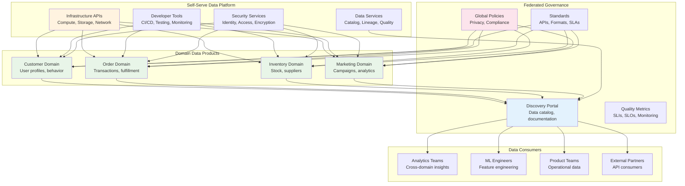

## The Complete Blueprint

The Data Mesh pattern fundamentally reimagines data architecture by treating data as a distributed product owned by domain teams rather than managed by centralized data platforms. This socio-technical approach combines domain-driven design principles with modern data infrastructure to create a scalable, decentralized data ecosystem. Each domain team becomes responsible for their data products' quality, discoverability, and lifecycle management, while a self-serve data platform provides the underlying infrastructure and governance capabilities. This architecture eliminates bottlenecks, improves data quality through domain expertise, and enables organizations to scale data capabilities alongside business growth.



### What You'll Master

- **Domain-driven data ownership** with clear boundaries, responsibilities, and accountability for data product quality
- **Self-serve data platform architecture** providing infrastructure APIs, developer tools, and automated governance capabilities
- **Federated governance models** balancing domain autonomy with organizational standards and compliance requirements
- **Data product thinking** including APIs, SLAs, documentation, and customer-focused data service design
- **Organizational transformation strategies** for transitioning from centralized to decentralized data architectures
- **Cross-domain data discovery** and consumption patterns enabling analytics and ML across business domains

# Data Mesh

!!! info "Pattern Overview"
    **Category**: data-management  
    **Complexity**: Medium  
    **Use Cases**: large organizations, domain-driven data, data governance

## Problem

Traditional centralized data platforms become bottlenecks in large organizations. They struggle with diverse domain needs, create single points of failure, and cannot scale with organizational growth.

## Solution

Data mesh treats data as a product owned by domain teams. It provides decentralized data architecture with domain ownership, self-serve data infrastructure, federated governance, and product thinking.

## Implementation

```python
## Example implementation
class DataMeshPlatform:
    def __init__(self):
        pass
    
    def execute(self):
        # Implementation details
        pass
```

## Trade-offs

**Pros:**
- Provides domain autonomy
- Enables organizational scalability
- Improves reduced bottlenecks

**Cons:**
- Increases governance complexity
- Requires duplication of efforts
- May impact skill requirements

## When to Use

- When you need large organizations
- For systems that require multiple business domains
- In scenarios with complex data requirements

## Related Patterns

- <!-- TODO: Add actual pattern link --> - Complementary pattern
- <!-- TODO: Add actual pattern link --> - Alternative approach
- <!-- TODO: Add actual pattern link --> - Building block pattern

## References

- [External Resource 1](#)
- [External Resource 2](#)
- <!-- TODO: Add Case Study Example -->
