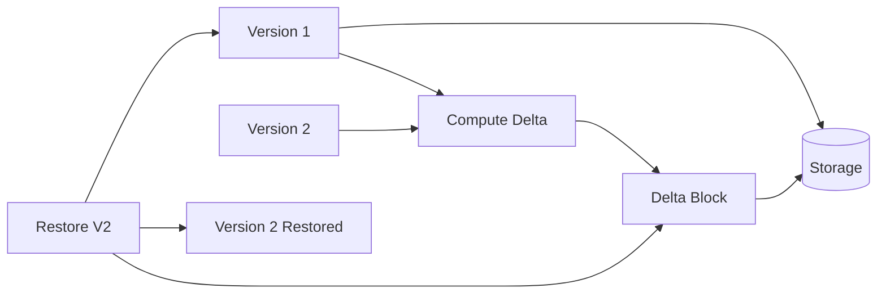

---
best-for:
- Backup and archival systems
- Cloud storage providers reducing costs
- Message queues preventing duplicate processing
category: data-management
current_relevance: mainstream
description: Eliminate duplicate data through content-based identification and storage
  optimization
difficulty: intermediate
essential_question: How do we ensure data consistency and reliability with deduplication?
excellence_tier: silver
introduced: 2008-01
last-updated: 2025-01-26
pattern_status: use-with-expertise
prerequisites:
- hashing
- content-addressing
- distributed-systems
reading-time: 30 min
status: complete
tagline: Master deduplication for distributed systems success
title: Deduplication
trade-offs:
  cons:
  - CPU overhead for fingerprinting/hashing
  - Complex garbage collection and reference counting
  - Potential for hash collisions requiring verification
  pros:
  - Significant storage savings (often 10-100x)
  - Reduced network bandwidth for transfers
  - Improved cache efficiency
type: pattern
when-not-to-use: Real-time systems with strict latency requirements, small datasets,
  when duplicates are rare
when-to-use: Storage systems, backup solutions, message processing, data pipelines
  with duplicate data
---

## Essential Question

**How do we ensure data consistency and reliability with deduplication?**

# Deduplication

!!! warning "🥈 Silver Tier Pattern"
    **Massive storage savings with processing overhead** • Use when duplicate data is common and storage costs matter
    
    Deduplication can reduce storage by 90%+ in backup systems but requires CPU for hashing, complex reference tracking, and careful handling of hash collisions. Best suited for write-once, read-many workloads where storage efficiency outweighs processing costs.

## When to Use / When NOT to Use

### When to Use

| Scenario | Why It Fits | Alternative If Not |
|----------|-------------|-------------------|
| High availability required | Pattern provides resilience | Consider simpler approach |
| Scalability is critical | Handles load distribution | Monolithic might suffice |
| Distributed coordination needed | Manages complexity | Centralized coordination |

### When NOT to Use

| Scenario | Why to Avoid | Better Alternative |
|----------|--------------|-------------------|
| Simple applications | Unnecessary complexity | Direct implementation |
| Low traffic systems | Overhead not justified | Basic architecture |
| Limited resources | High operational cost | Simpler patterns |

## Overview

Deduplication identifies and eliminates redundant copies of data, storing each unique piece only once. This pattern is crucial for efficient storage systems, backup solutions, and message processing pipelines.

## Core Concepts

### Deduplication Strategies

| Strategy | Granularity | Dedup Ratio | CPU Cost | Use Case |
|----------|-------------|-------------|----------|----------|
| **File-Level** | Entire files | Low | Minimal | Simple backups |
| **Fixed-Block** | Fixed chunks | Medium | Low | Block storage |
| **Variable-Block** | Content-defined | High | Medium | Efficient storage |
| **Byte-Level** | Individual bytes | Maximum | Very High | Specialized |

### Content Fingerprinting

## Level 1: Intuition (5 minutes)

*Start your journey with relatable analogies*

### The Elevator Pitch
[Pattern explanation in simple terms]

### Real-World Analogy
[Everyday comparison that explains the concept]

## Level 2: Foundation (10 minutes)

*Build core understanding*

### Core Concepts
- Key principle 1
- Key principle 2
- Key principle 3

### Basic Example

## Level 3: Deep Dive (15 minutes)

*Understand implementation details*

### How It Really Works
[Technical implementation details]

### Common Patterns
[Typical usage patterns]

## Level 4: Expert (20 minutes)

*Master advanced techniques*

### Advanced Configurations
[Complex scenarios and optimizations]

### Performance Tuning
[Optimization strategies]

## Level 5: Mastery (30 minutes)

*Apply in production*

### Real-World Case Studies
[Production examples from major companies]

### Lessons from the Trenches
[Common pitfalls and solutions]

## Decision Matrix

### Quick Decision Table

| Factor | Low Complexity | Medium Complexity | High Complexity |
|--------|----------------|-------------------|-----------------|
| Team Size | < 5 developers | 5-20 developers | > 20 developers |
| Traffic | < 1K req/s | 1K-100K req/s | > 100K req/s |
| Data Volume | < 1GB | 1GB-1TB | > 1TB |
| **Recommendation** | ❌ Avoid | ⚠️ Consider | ✅ Implement |

## Implementation Patterns

### Inline vs Post-Process Deduplication

| Approach | When Dedup Occurs | Pros | Cons |
|----------|-------------------|------|------|
| **Inline** | During write | Immediate savings | Higher write latency |
| **Post-Process** | After write | Fast writes | Temporary 2x storage |
| **Near-line** | Shortly after | Balanced | Complex scheduling |

### Reference Management

## Deduplication Algorithms

### Content-Defined Chunking (CDC)

**Rabin Fingerprinting Example**:
- Average chunk size: 8KB
- Min chunk: 2KB
- Max chunk: 64KB
- Boundary when: `hash & 0x1FFF == 0x1FFF`

### Delta Compression

📄 View mermaid code (10 lines)

## Performance Optimization

### Deduplication Index

### Sampling Strategies

| Strategy | Description | Dedup Ratio | Performance |
|----------|-------------|-------------|-------------|
| **Full** | Check every block | 100% | Slowest |
| **Sampling** | Check subset | 85-95% | Faster |
| **Similarity** | Group similar | 90-98% | Balanced |
| **Sketch-based** | MinHash/SimHash | 80-90% | Fastest |

## Real-World Implementations

### Storage Systems

### Message Deduplication

## Common Pitfalls

!!! danger "Anti-Patterns"
    - **Weak hashes**: MD5 for security-critical dedup
    - **No verification**: Trusting hashes without collision handling
    - **Unbounded index**: Memory exhaustion from fingerprint index
    - **Aggressive dedup**: CPU overhead exceeds storage savings

## Design Decisions

### Choosing Deduplication Strategy

#
## Level 1: Intuition (5 minutes)

*Start your journey with relatable analogies*

### The Elevator Pitch
[Pattern explanation in simple terms]

### Real-World Analogy
[Everyday comparison that explains the concept]

## Level 2: Foundation (10 minutes)

*Build core understanding*

### Core Concepts
- Key principle 1
- Key principle 2
- Key principle 3

### Basic Example

## Level 3: Deep Dive (15 minutes)

*Understand implementation details*

### How It Really Works
[Technical implementation details]

### Common Patterns
[Typical usage patterns]

## Level 4: Expert (20 minutes)

*Master advanced techniques*

### Advanced Configurations
[Complex scenarios and optimizations]

### Performance Tuning
[Optimization strategies]

## Level 5: Mastery (30 minutes)

*Apply in production*

### Real-World Case Studies
[Production examples from major companies]

### Lessons from the Trenches
[Common pitfalls and solutions]

## Decision Matrix

### Quick Decision Table

| Factor | Low Complexity | Medium Complexity | High Complexity |
|--------|----------------|-------------------|-----------------|
| Team Size | < 5 developers | 5-20 developers | > 20 developers |
| Traffic | < 1K req/s | 1K-100K req/s | > 100K req/s |
| Data Volume | < 1GB | 1GB-1TB | > 1TB |
| **Recommendation** | ❌ Avoid | ⚠️ Consider | ✅ Implement |

## Implementation Checklist

- [ ] Choose appropriate hash algorithm (security vs speed)
- [ ] Design chunk size strategy (fixed vs variable)
- [ ] Implement reference counting or GC
- [ ] Build efficient fingerprint index
- [ ] Add collision detection/handling
- [ ] Plan for index scaling
- [ ] Monitor dedup ratio and CPU usage
- [ ] Handle hash collisions gracefully
- [ ] Implement data verification
- [ ] Design backup/restore with dedup

## Monitoring and Metrics

| Metric | Description | Target |
|--------|-------------|--------|
| **Dedup Ratio** | (Original / Stored) Size | > 5:1 |
| **Hash Time** | Time per MB hashed | < 10ms |
| **Index Lookups** | Lookups per second | > 100K |
| **Collision Rate** | Hash collisions found | < 0.001% |
| **GC Overhead** | Time spent in GC | < 5% |

## Related Patterns
- [Content-Addressed Storage](patterns/cas)
- [Caching Strategies](patterns/caching-strategies)

## References
- [Google Drive Case Study](case-studies/google-drive)

