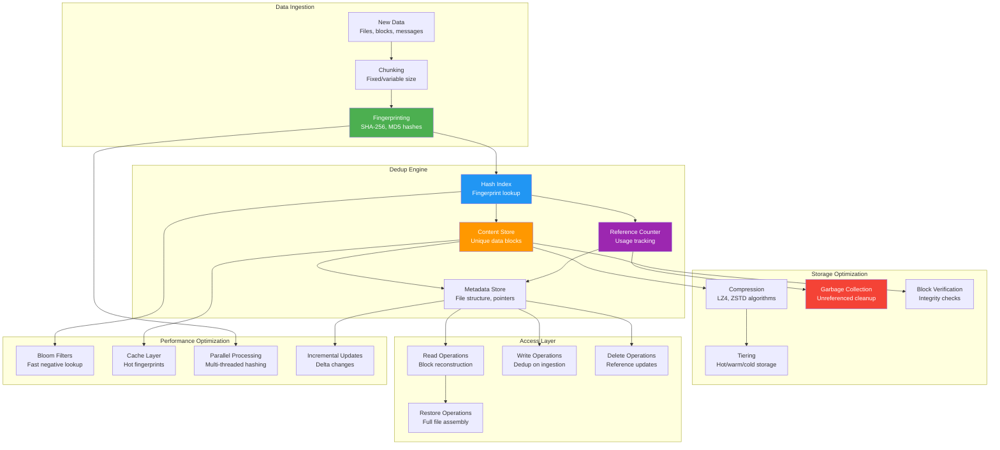
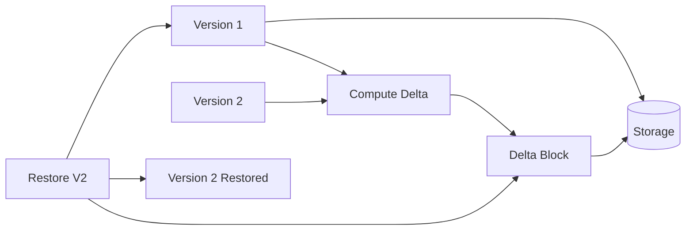

## The Complete Blueprint

The Deduplication pattern eliminates redundant data storage by identifying and removing duplicate content through cryptographic hashing and content-addressable storage techniques. This pattern is essential for systems handling large volumes of potentially duplicate data, such as backup systems, cloud storage platforms, and data pipelines. Deduplication works by computing fingerprints (typically SHA-256 hashes) of data blocks or files, storing only unique content, and maintaining reference counts for shared data. The approach can achieve dramatic storage savings—often 10-100x reduction—while requiring careful management of hash collisions, garbage collection, and performance trade-offs between CPU overhead and storage efficiency.

### What You'll Master

- **Content-addressable storage** using cryptographic hashing for unique data identification and retrieval
- **Chunking strategies** including fixed-size, variable-size, and sliding-window approaches for optimal deduplication ratios
- **Hash collision handling** with verification mechanisms and fallback strategies for data integrity
- **Reference counting and garbage collection** for automated cleanup of unreferenced data blocks
- **Performance optimization** using Bloom filters, caching, and parallel processing for high-throughput systems
- **Storage tiering integration** combining deduplication with hot/warm/cold storage policies for cost efficiency

## Essential Question

**How do we ensure data consistency and reliability with deduplication?**

# Deduplication

!!! warning "🥈 Silver Tier Pattern"
    **Massive storage savings with processing overhead** • Use when duplicate data is common and storage costs matter
    
    Deduplication can reduce storage by 90%+ in backup systems but requires CPU for hashing, complex reference tracking, and careful handling of hash collisions. Best suited for write-once, read-many workloads where storage efficiency outweighs processing costs.

## When to Use / When NOT to Use

### When to Use

| Scenario | Why It Fits | Alternative If Not |
|----------|-------------|-------------------|
| High availability required | Pattern provides resilience | Consider simpler approach |
| Scalability is critical | Handles load distribution | Monolithic might suffice |
| Distributed coordination needed | Manages complexity | Centralized coordination |

### When NOT to Use

| Scenario | Why to Avoid | Better Alternative |
|----------|--------------|-------------------|
| Simple applications | Unnecessary complexity | Direct implementation |
| Low traffic systems | Overhead not justified | Basic architecture |
| Limited resources | High operational cost | Simpler patterns |

## Overview

Deduplication identifies and eliminates redundant copies of data, storing each unique piece only once. This pattern is crucial for efficient storage systems, backup solutions, and message processing pipelines.

## Core Concepts

### Deduplication Strategies

| Strategy | Granularity | Dedup Ratio | CPU Cost | Use Case |
|----------|-------------|-------------|----------|----------|
| **File-Level** | Entire files | Low | Minimal | Simple backups |
| **Fixed-Block** | Fixed chunks | Medium | Low | Block storage |
| **Variable-Block** | Content-defined | High | Medium | Efficient storage |
| **Byte-Level** | Individual bytes | Maximum | Very High | Specialized |

### Content Fingerprinting

## Level 1: Intuition (5 minutes)

*Start your journey with relatable analogies*

### The Elevator Pitch
[Pattern explanation in simple terms]

### Real-World Analogy
[Everyday comparison that explains the concept]

## Level 2: Foundation (10 minutes)

*Build core understanding*

### Core Concepts
- Key principle 1
- Key principle 2
- Key principle 3

### Basic Example

## Level 3: Deep Dive (15 minutes)

*Understand implementation details*

### How It Really Works
[Technical implementation details]

### Common Patterns
[Typical usage patterns]

## Level 4: Expert (20 minutes)

*Master advanced techniques*

### Advanced Configurations
[Complex scenarios and optimizations]

### Performance Tuning
[Optimization strategies]

## Level 5: Mastery (30 minutes)

*Apply in production*

### Real-World Case Studies
[Production examples from major companies]

### Lessons from the Trenches
[Common pitfalls and solutions]

## Decision Matrix

### Quick Decision Table

| Factor | Low Complexity | Medium Complexity | High Complexity |
|--------|----------------|-------------------|-----------------|
| Team Size | < 5 developers | 5-20 developers | > 20 developers |
| Traffic | < 1K req/s | 1K-100K req/s | > 100K req/s |
| Data Volume | < 1GB | 1GB-1TB | > 1TB |
| **Recommendation** | ❌ Avoid | ⚠️ Consider | ✅ Implement |

## Implementation Patterns

### Inline vs Post-Process Deduplication

| Approach | When Dedup Occurs | Pros | Cons |
|----------|-------------------|------|------|
| **Inline** | During write | Immediate savings | Higher write latency |
| **Post-Process** | After write | Fast writes | Temporary 2x storage |
| **Near-line** | Shortly after | Balanced | Complex scheduling |

### Reference Management

## Deduplication Algorithms

### Content-Defined Chunking (CDC)

**Rabin Fingerprinting Example**:
- Average chunk size: 8KB
- Min chunk: 2KB
- Max chunk: 64KB
- Boundary when: `hash & 0x1FFF == 0x1FFF`

### Delta Compression

📄 View mermaid code (10 lines)

## Performance Optimization

### Deduplication Index

### Sampling Strategies

| Strategy | Description | Dedup Ratio | Performance |
|----------|-------------|-------------|-------------|
| **Full** | Check every block | 100% | Slowest |
| **Sampling** | Check subset | 85-95% | Faster |
| **Similarity** | Group similar | 90-98% | Balanced |
| **Sketch-based** | MinHash/SimHash | 80-90% | Fastest |

## Real-World Implementations

### Storage Systems

### Message Deduplication

## Common Pitfalls

!!! danger "Anti-Patterns"
    - **Weak hashes**: MD5 for security-critical dedup
    - **No verification**: Trusting hashes without collision handling
    - **Unbounded index**: Memory exhaustion from fingerprint index
    - **Aggressive dedup**: CPU overhead exceeds storage savings

## Design Decisions

### Choosing Deduplication Strategy

#
## Level 1: Intuition (5 minutes)

*Start your journey with relatable analogies*

### The Elevator Pitch
[Pattern explanation in simple terms]

### Real-World Analogy
[Everyday comparison that explains the concept]

## Level 2: Foundation (10 minutes)

*Build core understanding*

### Core Concepts
- Key principle 1
- Key principle 2
- Key principle 3

### Basic Example

## Level 3: Deep Dive (15 minutes)

*Understand implementation details*

### How It Really Works
[Technical implementation details]

### Common Patterns
[Typical usage patterns]

## Level 4: Expert (20 minutes)

*Master advanced techniques*

### Advanced Configurations
[Complex scenarios and optimizations]

### Performance Tuning
[Optimization strategies]

## Level 5: Mastery (30 minutes)

*Apply in production*

### Real-World Case Studies
[Production examples from major companies]

### Lessons from the Trenches
[Common pitfalls and solutions]

## Decision Matrix

### Quick Decision Table

| Factor | Low Complexity | Medium Complexity | High Complexity |
|--------|----------------|-------------------|-----------------|
| Team Size | < 5 developers | 5-20 developers | > 20 developers |
| Traffic | < 1K req/s | 1K-100K req/s | > 100K req/s |
| Data Volume | < 1GB | 1GB-1TB | > 1TB |
| **Recommendation** | ❌ Avoid | ⚠️ Consider | ✅ Implement |

## Implementation Checklist

- [ ] Choose appropriate hash algorithm (security vs speed)
- [ ] Design chunk size strategy (fixed vs variable)
- [ ] Implement reference counting or GC
- [ ] Build efficient fingerprint index
- [ ] Add collision detection/handling
- [ ] Plan for index scaling
- [ ] Monitor dedup ratio and CPU usage
- [ ] Handle hash collisions gracefully
- [ ] Implement data verification
- [ ] Design backup/restore with dedup

## Monitoring and Metrics

| Metric | Description | Target |
|--------|-------------|--------|
| **Dedup Ratio** | (Original / Stored) Size | > 5:1 |
| **Hash Time** | Time per MB hashed | < 10ms |
| **Index Lookups** | Lookups per second | > 100K |
| **Collision Rate** | Hash collisions found | < 0.001% |
| **GC Overhead** | Time spent in GC | < 5% |

## Related Patterns
- [Content-Addressed Storage](pattern-library/cas.md)
- [Caching Strategies](pattern-library/caching-strategies.md)

## References
- <!-- TODO: Add Google Drive Case Study -->

