# Delta Sync Pattern

!!! warning "🥈 Silver Tier Pattern"
    **Bandwidth-Efficient but Complex** • Use when sync efficiency matters
    
    Delta sync saves bandwidth by transmitting only changes, but requires sophisticated change tracking and conflict resolution. Consider full sync for smaller datasets or simpler requirements.

**Send only what changed, not everything**

## Visual Architecture

```mermaid
graph TB
    subgraph "Client State"
        C1[Version 1<br/>A B C]
        C2[Version 2<br/>A B' C D]
        CD[Delta<br/>B→B', +D]
    end
    
    subgraph "Server State"
        S1[Version 1<br/>A B C]
        S2[Version 2<br/>A B' C D]
    end
    
    subgraph "Sync Process"
        Track[Track Changes]
        Compute[Compute Delta]
        Send[Send Delta Only]
        Apply[Apply Changes]
    end
    
    C1 --> Track
    Track --> C2
    C2 --> Compute
    Compute --> CD
    CD --> Send
    Send --> Apply
    Apply --> S2
    
    style CD fill:#90EE90
    style Send fill:#87CEEB
```

## Delta Sync vs Full Sync

| Aspect | Delta Sync | Full Sync |
|--------|------------|-----------|
| **Data Sent** | Only changes | Entire dataset |
| **Bandwidth** | Low (KB-MB) | High (GB+) |
| **Complexity** | High | Low |
| **Conflict Resolution** | Required | Replace all |
| **State Tracking** | Required | Not needed |
| **Best For** | Large datasets | Small datasets |

## Implementation Strategies

## Conflict Resolution Strategies

<h4>🎯 Choosing Conflict Resolution</h4>

## Common Implementation Patterns

### 1. Version Vector Approach

### 2. Operational Transform (OT)

| Operation | Client A | Client B | Result After OT |
|-----------|----------|----------|-----------------|
| Insert "X" at 0 | "X" + "ABC" | "ABC" + "Y" | "XABCY" |
| Delete at 1 | "A_C" | "AB_" | "A_" |
| Replace at 0 | "X" replaces "A" | "Y" at end | "XBC" + "Y" |

## Performance Comparison

<h4>📊 Real-World Performance Gains</h4>

| Scenario | Full Sync | Delta Sync | Improvement |
|----------|-----------|------------|-------------|
| 1GB file, 1MB change | 1GB transfer | 1MB transfer | 99.9% reduction |
| 1M records, 100 changed | 50MB transfer | 50KB transfer | 99.9% reduction |
| Mobile app daily sync | 10MB | 100KB | 99% reduction |
| Database replication | 1TB/day | 10GB/day | 99% reduction |

**Dropbox Case Study**: Average file has 4MB, average change is 40KB = 99% bandwidth saved

## Implementation Checklist

- [ ] Choose change tracking method (timestamp, checksum, version)
- [ ] Implement delta computation algorithm
- [ ] Design conflict detection mechanism
- [ ] Build conflict resolution strategy
- [ ] Add compression for delta payload
- [ ] Handle offline queue for changes
- [ ] Implement retry with exponential backoff
- [ ] Monitor sync lag and conflicts
- [ ] Test with concurrent modifications
- [ ] Plan for full sync fallback

## Common Pitfalls

<h4>💥 The Phantom Conflict Problem</h4>

**What Happened**: Two users edit different parts of same document
**Problem**: System detects false conflict due to coarse tracking
**Result**: Users forced to manually resolve non-existent conflicts
**Solution**: Field-level or character-level change tracking

## When to Use Full Sync Instead

## Related Patterns

- [Event Sourcing](event-sourcing.md) - Store all changes as events
- [CRDT](crdt.md) - Conflict-free replicated data types
- [Vector Clocks](logical-clocks.md) - Track causality for changes
- [Write-Ahead Log](wal.md) - Durably record changes
- [Merkle Trees](merkle-trees.md) - Efficient change detection