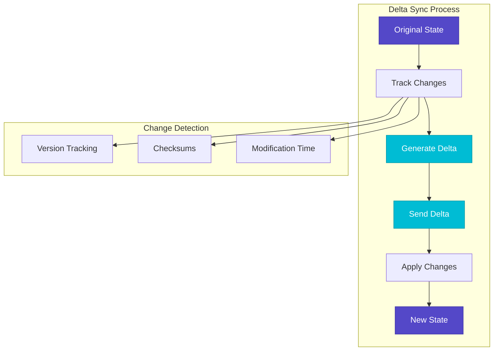
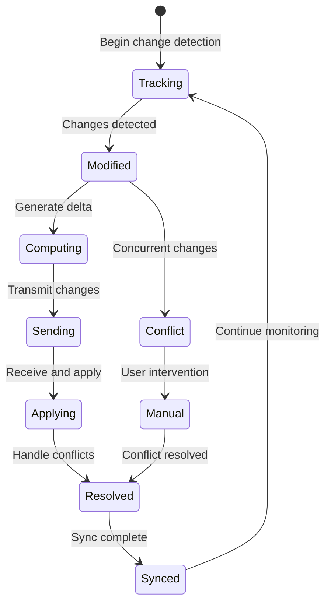
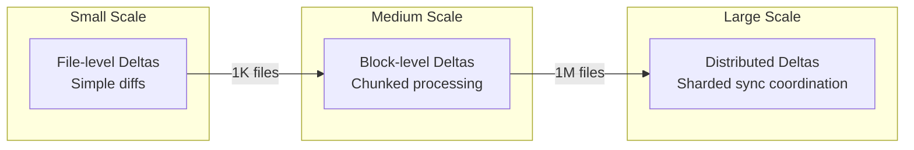
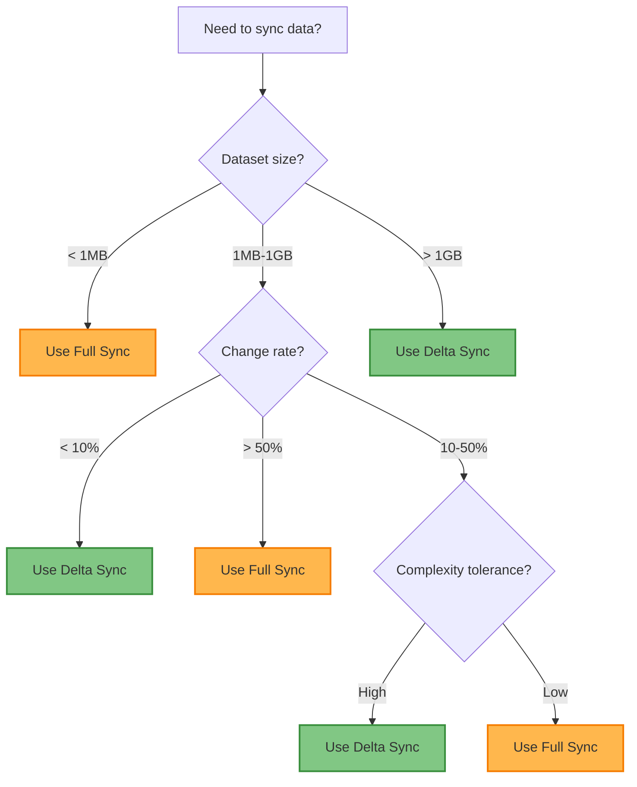

# Delta Sync Pattern

!!! info "🥈 Silver Tier Pattern"
    **Bandwidth Optimization Specialist** • Essential for large-scale file and data sync
    
    Delta sync excels when bandwidth is limited and datasets are large with small change rates. Requires sophisticated change tracking but delivers massive efficiency gains.
    
    **Best For:** File sync systems, mobile apps, database replication with large datasets

## Essential Question

**How can we synchronize large datasets efficiently by sending only what changed?**

## When to Use / When NOT to Use

### ✅ Use When

| Scenario | Example | Impact |
|----------|---------|--------|
| Large files with small changes | 1GB document, 1MB edit | 99.9% bandwidth reduction |
| Mobile app data sync | Offline-first apps | 90%+ faster sync over cellular |
| Database replication | Multi-GB databases | 95%+ reduction in network traffic |
| Version control systems | Code repositories | Track only file changes |

### ❌ DON'T Use When

| Scenario | Why | Alternative |
|----------|-----|-------------|
| Small datasets (<1MB) | Overhead exceeds benefits | Full synchronization |
| High change frequency (>50%) | Most data changes anyway | Streaming updates |
| Simple conflict resolution needs | Delta sync adds complexity | Last-write-wins sync |
| Real-time requirements | Change tracking adds latency | Event streaming |

## Level 1: Intuition (5 min) {#intuition}

### The Story
Imagine mailing a 500-page manuscript to your editor. If you change just one paragraph, would you mail the entire manuscript again? Delta sync is like sending only the page that changed, with a note saying "replace page 247."

### Visual Metaphor


### Core Insight
> **Key Takeaway:** Send only differences, not entire datasets - massive bandwidth savings with controlled complexity increase.

### In One Sentence
Delta sync minimizes data transfer by identifying, transmitting, and applying only the changes between dataset versions.

## Level 2: Foundation (10 min) {#foundation}

### The Problem Space

<div class="failure-vignette">
<h4>🚨 What Happens Without This Pattern</h4>

**Mobile App Co, 2021**: Used full sync for 10MB user profiles, causing 500MB daily data usage per user and angry customers with data overages.

**Impact**: 90% user churn on mobile networks, $2M lost revenue, app store rating dropped to 2.3
</div>

### How It Works

#### Architecture Overview


#### Key Components

| Component | Purpose | Responsibility |
|-----------|---------|----------------|
| **Change Tracker** | Detect modifications | Monitor state differences |
| **Delta Generator** | Compute minimal changes | Create efficient change representation |
| **Conflict Resolver** | Handle concurrent changes | Merge or choose between conflicting edits |
| **Version Manager** | Track state versions | Maintain consistency across sync operations |

### Basic Example

```python
class DeltaSync:
    def __init__(self):
        self.versions = {}
        self.data = {}
    
    def generate_delta(self, old_version, new_data):
        old_data = self.versions.get(old_version, {})
        delta = {}
        
        # Find additions and modifications
        for key, value in new_data.items():
            if key not in old_data or old_data[key] != value:
                delta[key] = value
        
        # Find deletions
        for key in old_data:
            if key not in new_data:
                delta[key] = None  # Deletion marker
        
        return delta
    
    def apply_delta(self, current_data, delta):
        for key, value in delta.items():
            if value is None:
                current_data.pop(key, None)  # Delete
            else:
                current_data[key] = value  # Add/Update
        return current_data
```

## Level 3: Deep Dive (15 min) {#deep-dive}

### Implementation Details

#### State Management


#### Critical Design Decisions

| Decision | Options | Trade-off | Recommendation |
|----------|---------|-----------|----------------|
| **Change Granularity** | File vs Field vs Character | File: Simple, large deltas<br>Character: Complex, tiny deltas | Field-level for structured data |
| **Conflict Resolution** | Auto vs Manual | Auto: Fast, may lose data<br>Manual: Accurate, user burden | Domain-specific auto rules |
| **Storage Strategy** | Full snapshots vs Delta chains | Snapshots: Storage heavy<br>Chains: Computation heavy | Periodic snapshots + short chains |

### Common Pitfalls

<div class="decision-box">
<h4>⚠️ Avoid These Mistakes</h4>

1. **Delta chain explosion**: Storing infinite deltas without snapshots → Periodic full snapshots to reset chains
2. **False conflict detection**: Poor granularity causes unnecessary conflicts → Use appropriate tracking granularity
3. **Unbounded delta size**: Large changes create oversized deltas → Fallback to full sync when delta exceeds threshold
</div>

### Production Considerations

#### Performance Characteristics

| Metric | Typical Range | Optimization Target |
|--------|---------------|-------------------|
| Delta Generation | 10-100ms | Minimize change detection overhead |
| Network Transfer | 1-99% of full sync | Maximize compression effectiveness |
| Conflict Resolution | <1% of operations | Reduce false positive conflicts |
| Storage Overhead | 10-50% additional | Balance snapshots vs delta chains |

## Level 4: Expert (20 min) {#expert}

### Advanced Techniques

#### Optimization Strategies

1. **Binary Delta Compression**
   - When to apply: Large binary files with localized changes
   - Impact: 99%+ reduction in transfer size for incremental changes  
   - Trade-off: CPU overhead for diff computation

2. **Operational Transform (OT)**
   - When to apply: Real-time collaborative editing
   - Impact: Automatic conflict resolution for concurrent edits
   - Trade-off: Complex algorithm implementation and debugging

### Scaling Considerations



### Monitoring & Observability

#### Key Metrics to Track

| Metric | Alert Threshold | Dashboard Panel |
|--------|----------------|-----------------|
| **Delta Size Ratio** | >30% of full sync | Line chart showing efficiency trend |
| **Conflict Rate** | >5% of sync operations | Histogram of conflict types |
| **Sync Latency** | p95 > 2x baseline | Percentile distribution |
| **Bandwidth Savings** | <70% reduction | Savings percentage over time |

## Level 5: Mastery (30 min) {#mastery}

### Real-World Case Studies

#### Case Study 1: Dropbox Block Sync

<div class="truth-box">
<h4>💡 Production Insights from Dropbox</h4>

**Challenge**: Sync large files efficiently across millions of users

**Implementation**: 4MB block-level delta sync with rolling hash

**Results**: 
- **Bandwidth Reduction**: 99%+ for typical document edits
- **Sync Speed**: 10x faster than full file transfer
- **User Experience**: Seamless offline-to-online transitions

**Lessons Learned**: Block-level granularity optimal for files; rolling hash enables efficient block boundary detection
</div>

### Pattern Evolution

#### Migration from Legacy


#### Future Directions

| Trend | Impact on Pattern | Adaptation Strategy |
|-------|------------------|-------------------|
| **AI-Powered Prediction** | Predict likely changes | Pre-compute deltas for common operations |
| **Edge Computing** | Distributed sync nodes | Implement hierarchical delta propagation |
| **5G Networks** | Higher bandwidth available | Adjust delta/full sync thresholds |

### Pattern Combinations

#### Works Well With

| Pattern | Combination Benefit | Integration Point |
|---------|-------------------|------------------|
| **CRDT** | Automatic conflict resolution | Delta operations on CRDT structures |
| **Event Sourcing** | Natural delta representation | Events as atomic deltas |
| **Write-Ahead Log** | Durable change tracking | WAL entries as delta source |

## Quick Reference

### Decision Matrix



### Comparison with Alternatives

| Aspect | Delta Sync | Full Sync | Event Stream | CRDT Sync |
|--------|------------|-----------|--------------|-----------|
| **Bandwidth** | Excellent | Poor | Good | Excellent |
| **Complexity** | High | Low | Medium | High |
| **Conflict Resolution** | Manual/Rules | Replace All | Event Order | Automatic |
| **Offline Support** | Excellent | Poor | Limited | Excellent |
| **Use Case** | File sync | Small data | Real-time | Collaborative |

### Implementation Checklist

**Pre-Implementation**
- [ ] Analyzed change patterns in target dataset
- [ ] Calculated bandwidth savings potential (>70% recommended)
- [ ] Designed conflict resolution strategy for domain
- [ ] Selected appropriate change detection granularity

**Implementation**
- [ ] Built change tracking infrastructure
- [ ] Implemented delta generation and application
- [ ] Added compression to delta payload
- [ ] Created fallback to full sync for large deltas

**Post-Implementation**
- [ ] Monitored actual bandwidth savings vs predictions
- [ ] Analyzed conflict rates and resolution effectiveness
- [ ] Optimized delta chain length and snapshot frequency
- [ ] Documented operational procedures for sync failures

### Related Resources

<div class="grid cards" markdown>

- :material-book-open-variant:{ .lg .middle } **Related Patterns**
    
    ---
    
    - [Event Sourcing](../data-management/event-sourcing.md) - Natural delta representation
    - [CRDT](../data-management/crdt.md) - Conflict-free synchronization  
    - [Write-Ahead Log](../data-management/write-ahead-log.md) - Change tracking

- :material-flask:{ .lg .middle } **Fundamental Laws**
    
    ---
    
    - [Law 2: Asynchronous Reality](../../part1-axioms/law2-asynchrony/) - Handling async updates
    - [Law 4: Multi-dimensional Optimization](../../part1-axioms/law4-optimization/) - Bandwidth vs complexity

- :material-pillar:{ .lg .middle } **Foundational Pillars**
    
    ---
    
    - [State Distribution](../../part2-pillars/state/) - Efficient state synchronization
    - [Truth Distribution](../../part2-pillars/truth/) - Consistency across replicas

- :material-tools:{ .lg .middle } **Implementation Guides**
    
    ---
    
    - [Delta Compression Guide](../../excellence/guides/delta-compression.md)
    - [Conflict Resolution Strategies](../../excellence/guides/conflict-resolution.md)
    - [Sync Performance Testing](../../excellence/guides/sync-testing.md)

</div>