---
best-for:
- Large-scale data that exceeds single node capacity
- Systems requiring 99.99%+ availability
- Global applications needing data locality
category: data-management
current_relevance: mainstream
description: Patterns and techniques for storing and managing data across multiple
  nodes in distributed systems
difficulty: intermediate
essential_question: How do we ensure data consistency and reliability with distributed
  storage?
excellence_tier: silver
introduced: 2003-10
last-updated: 2025-01-23
pattern_status: use-with-expertise
prerequisites:
- consistency-models
- replication
- partitioning
reading-time: 45 min
status: complete
tagline: Master distributed storage for distributed systems success
title: Distributed Storage
trade-offs:
  cons:
  - Complex consistency and coordination challenges
  - Higher operational overhead and costs
  - Network partitions and split-brain scenarios
  pros:
  - Horizontal scalability beyond single-node limits
  - High availability through replication
  - Geographic distribution for locality
type: pattern
when-not-to-use: When data fits on single node and downtime is acceptable
when-to-use: When data exceeds single node capacity or requires high availability
  and fault tolerance
---

## Essential Question

**How do we ensure data consistency and reliability with distributed storage?**

# Distributed Storage

## 🤔 Essential Questions

<h4>How do you store petabytes of data reliably when any single machine can fail?</h4>

**The Challenge**: Single machines have limited capacity and are single points of failure

**The Pattern**: Distribute data across many machines with replication and coordination

**Critical Decision**: How to balance consistency, availability, and partition tolerance?

!!! warning "🥈 Silver Tier Pattern"
    **Infinite scale with infinite complexity** • Use when single-node limits are truly exceeded
    
    Distributed storage enables petabyte-scale systems but brings CAP theorem trade-offs, complex failure modes, and significant operational overhead.
    
    **Trade-offs**:
    - ✅ Scale beyond any single machine
    - ✅ Survive multiple failures
    - ❌ Complex consistency guarantees
    - ❌ Network partition handling

[Home](/) > [Patterns](../patterns/) > [Data Patterns](../patterns/index.md#data-patterns) > Distributed Storage

## When to Use / When NOT to Use

<h4>🎯 Decision Guide</h4>

**Perfect for:**
- Data exceeding single machine capacity (>10TB)
- Global applications needing data locality
- Systems requiring 99.99%+ availability
- Write-heavy workloads needing horizontal scaling
- Cost-effective cold storage at scale

**Avoid when:**
- Data fits on a single machine (<1TB)
- Strong consistency is critical
- Simple master-slave replication suffices
- Operational complexity exceeds team capability
- Cost of distribution exceeds benefits

**Key trade-off**: Massive scale and availability vs. consistency guarantees and operational complexity

## Level 1: Core Concepts

### Storage Architecture Comparison

| Architecture | Consistency | Scalability | Complexity | Use Case |
|-------------|-------------|-------------|------------|----------|
| **Single Node** | Strong | None | Simple | Small apps |
| **Master-Slave** | Strong | Read only | Medium | Read-heavy |
| **Sharded** | Varies | High | High | Large datasets |
| **Distributed** | Eventual | Infinite | Very High | Global scale |

### Data Distribution Flow

View implementation code

## Level 2: Distribution Strategies

### Partitioning Methods

### Replication Strategies

| Strategy | Consistency | Performance | Complexity | When to Use |
|----------|-------------|-------------|------------|-------------|
| **Primary-Backup** | Strong | Good reads | Simple | Small clusters |
| **Chain Replication** | Strong | Balanced | Medium | Ordered data |
| **Quorum** | Tunable | Tunable | Medium | Flexible needs |
| **Erasure Coding** | Eventual | Space efficient | High | Cold storage |

## Level 3: Implementation Patterns

### Quorum-Based Storage

```mermaid
flowchart LR
    subgraph "Write Quorum (W=2)"
        W[Write Request] --> W1[Node 1 ✓]
        W --> W2[Node 2 ✓]
        W --> W3[Node 3 ✗]
        W1 --> WS[Success]
        W2 --> WS
    end
    
    subgraph "Read Quorum (R=2)"
        R[Read Request] --> R1[Node 1: v2]
        R --> R2[Node 2: v2]
        R --> R3[Node 3: v1]
        R1 --> RR[Return v2]
        R2 --> RR
        RR --> RRepair[Repair Node 3]
    end
```

### Consistency Levels

| Level | Write | Read | Latency | Consistency | Use Case |
|-------|-------|------|---------|-------------|----------|
| **ONE** | 1 node | 1 node | Lowest | Weak | Logs, metrics |
| **QUORUM** | N/2+1 | N/2+1 | Medium | Strong | User data |
| **ALL** | N nodes | N nodes | Highest | Strongest | Critical data |
| **LOCAL_ONE** | 1 in DC | 1 in DC | Low | DC-local | Multi-DC |

### Storage Efficiency Comparison

## Level 4: Real-World Systems

### System Architecture Comparison

| System | Distribution | Consistency | Scale | Best For |
|--------|-------------|-------------|-------|----------|
| **HDFS** | Block-based | Strong | PB | Analytics |
| **Cassandra** | Ring/Tokens | Eventual | PB | Time-series |
| **S3** | Object | Eventual | EB | Objects |
| **Ceph** | CRUSH map | Strong | PB | Block/Object/File |
| **GlusterFS** | DHT | Strong | PB | POSIX files |

### Failure Scenarios

## Level 5: Production Considerations

### Operational Checklist

### Cost Analysis

| Factor | 3x Replication | Erasure Coding | Trade-off |
|--------|----------------|----------------|-----------|
| **Storage Cost** | 300% overhead | 50% overhead | EC wins |
| **CPU Cost** | Low | High (encode/decode) | Replication wins |
| **Network Cost** | 3x writes | 1.5x writes | EC wins |
| **Rebuild Cost** | Read 1 replica | Read 6+ nodes | Replication wins |
| **Access Latency** | Direct read | Decode required | Replication wins |

### Monitoring Dashboard

```mermaid
graph LR
    subgraph "Health Metrics"
        Nodes[Active Nodes: 47/50]
        Space[Used Space: 78%]
        Repl[Under-replicated: 2.1%]
    end
    
    subgraph "Performance"
        Read[Read Latency: 12ms p99]
        Write[Write Latency: 45ms p99]
        Through[Throughput: 1.2GB/s]
    end
    
    subgraph "Alerts"
        DiskAlert[❗ Node23: 92% full]
        RepAlert[❗ 1,234 blocks under-replicated]
    end
```

## Common Pitfalls

| Pitfall | Impact | Solution |
|---------|--------|----------|
| **Hotspots** | Node overload | Better key distribution |
| **Cascading failures** | Total outage | Circuit breakers, backpressure |
| **Split brain** | Data loss | Proper quorum configuration |
| **Replication storms** | Network saturation | Rate limit re-replication |
| **Zombie data** | Wasted space | Garbage collection process |

## Level 1: Intuition (5 minutes)

*Start your journey with relatable analogies*

### The Elevator Pitch
[Pattern explanation in simple terms]

### Real-World Analogy
[Everyday comparison that explains the concept]

## Level 2: Foundation (10 minutes)

*Build core understanding*

### Core Concepts
- Key principle 1
- Key principle 2
- Key principle 3

### Basic Example

## Level 3: Deep Dive (15 minutes)

*Understand implementation details*

### How It Really Works
[Technical implementation details]

### Common Patterns
[Typical usage patterns]

## Level 4: Expert (20 minutes)

*Master advanced techniques*

### Advanced Configurations
[Complex scenarios and optimizations]

### Performance Tuning
[Optimization strategies]

## Level 5: Mastery (30 minutes)

*Apply in production*

### Real-World Case Studies
[Production examples from major companies]

### Lessons from the Trenches
[Common pitfalls and solutions]

## Decision Matrix

### Quick Decision Table

| Factor | Low Complexity | Medium Complexity | High Complexity |
|--------|----------------|-------------------|-----------------|
| Team Size | < 5 developers | 5-20 developers | > 20 developers |
| Traffic | < 1K req/s | 1K-100K req/s | > 100K req/s |
| Data Volume | < 1GB | 1GB-1TB | > 1TB |
| **Recommendation** | ❌ Avoid | ⚠️ Consider | ✅ Implement |

## Implementation Decision Tree

## 🎓 Key Takeaways

1. **CAP theorem is unavoidable** - Choose your trade-offs wisely
2. **Replication ≠ Backup** - Different failures need different solutions
3. **Monitor everything** - You can't fix what you can't see
4. **Plan for failure** - Hardware fails, networks partition, software has bugs
5. **Start simple** - Don't use distributed storage until you need it

## Related Patterns

- [Consistent Hashing](consistent-hashing.md) - Distribute data evenly
- [Eventual Consistency](eventual-consistency.md) - Consistency models
- [CRDT](crdt.md) - Conflict-free data types
- [Sharding](../scaling/sharding.md) - Partition strategies
- [Leader-Follower](../coordination/leader-follower.md) - Replication patterns

---

*Next: [Eventual Consistency](eventual-consistency.md) - Managing consistency in distributed systems*