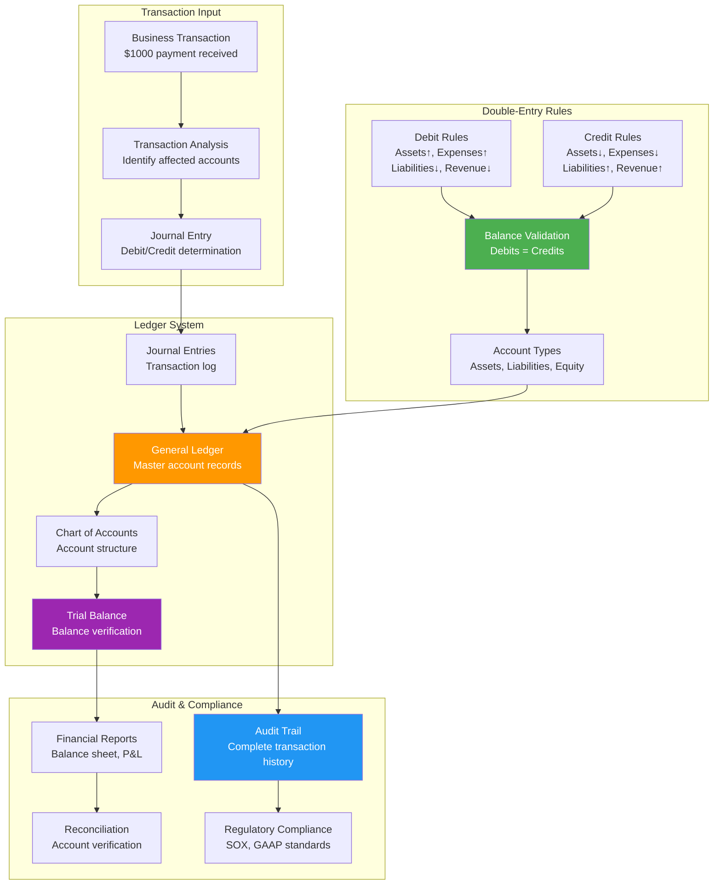

## The Complete Blueprint

The Double-Entry Ledger pattern implements financial transaction recording where every transaction affects at least two accounts with equal and opposite entries (debits and credits), ensuring mathematical balance and complete audit trails. This centuries-old accounting principle provides absolute accuracy, error detection, and regulatory compliance by maintaining the fundamental equation: Assets = Liabilities + Equity. In modern distributed systems, this pattern extends beyond traditional accounting to maintain consistency in any system requiring immutable transaction records, balance verification, and comprehensive audit capabilities—from cryptocurrency blockchains to digital payment platforms.



### What You'll Master

- **Double-entry principles** with debits and credits maintaining mathematical balance across all transactions
- **Chart of accounts design** organizing accounts by type (assets, liabilities, equity, revenue, expenses) for financial reporting
- **Journal entry creation** recording transactions with proper debit/credit allocation and supporting documentation
- **Trial balance verification** ensuring mathematical accuracy and detecting posting errors through balance validation
- **Audit trail maintenance** providing immutable transaction history for compliance and forensic analysis
- **Financial reporting** generating balance sheets, income statements, and cash flow statements from ledger data

# Double-Entry Ledger

!!! info "Pattern Overview"
    **Category**: data-management  
    **Complexity**: Medium  
    **Use Cases**: financial systems, accounting, audit compliance

## Problem

Financial systems require absolute accuracy and auditability. Simple account balance tracking cannot provide the accountability, error detection, and compliance needed for financial operations.

## Solution

Double-entry bookkeeping records every transaction as both a debit and credit, ensuring books always balance. This provides error detection, complete audit trails, and regulatory compliance.

## Implementation

```python
## Example implementation
class DoubleEntryLedger:
    def __init__(self):
        pass
    
    def execute(self):
        # Implementation details
        pass
```

## Trade-offs

**Pros:**
- Provides mathematical accuracy
- Enables complete audit trails
- Improves error detection

**Cons:**
- Increases storage overhead
- Requires complexity
- May impact transaction validation

## When to Use

- When you need financial systems
- For systems that require payment processing
- In scenarios with accounting systems

## Related Patterns

- [Pattern 1](../related-pattern-1.md) - Complementary pattern
- [Pattern 2](../related-pattern-2.md) - Alternative approach
- [Pattern 3](../related-pattern-3.md) - Building block pattern

## References

- [External Resource 1](#)
- [External Resource 2](#)
- [Case Study Example](../../architects-handbook/case-studies/example.md)
