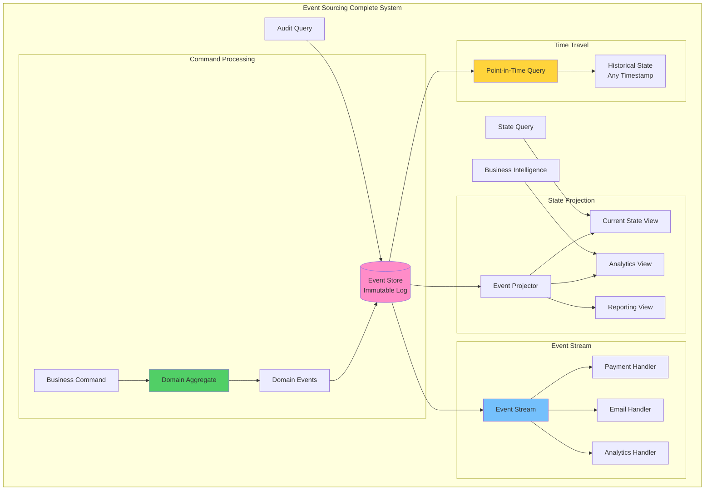

## Fundamental Law Connections

### Temporal Ordering (Law 2)
Event sourcing deeply depends on time and ordering:
- **Event Sequence Criticality**: Order determines final state
- **Clock Synchronization**: Distributed events need consistent timestamps
- **Replay Performance**: Rebuilding state from events takes time
- **Eventual Consistency**: Projections lag behind event writes
- **Snapshot Timing**: When to create snapshots for performance

### Immutable Knowledge (Law 5)
Events represent distributed knowledge:
- **Source of Truth**: Event log is the authoritative record
- **Knowledge Distribution**: Events propagate to multiple projections
- **Schema Evolution**: Event versions preserve historical knowledge
- **Audit Trail**: Complete knowledge of all changes
- **Event Replay**: Reconstruct knowledge at any point in time

### Cognitive Model Shift (Law 3)
- **Event Thinking**: Developers must think in events not state
- **Debugging Complexity**: Following event chains through time
- **Projection Logic**: Mental mapping from events to views
- **Business Language**: Events should match domain language

### Storage Economics (Law 7)
- **Infinite Growth**: Event store grows forever without pruning
- **Snapshot Trade-offs**: Storage vs replay computation costs
- **Retention Policies**: Compliance vs cost optimization
- **Compression Strategies**: Reducing storage footprint
- **Archive Tiers**: Hot/warm/cold storage economics

## Case Studies with Law Applications

### Git Version Control
**Laws Demonstrated**:
- **Law 2**: Commits ordered by parent references and timestamps
- **Law 5**: Complete history preserved as immutable commits
- **Law 7**: Repository size grows with history

**Key Insights**:
- Snapshots (packfiles) optimize replay performance
- Distributed nature requires merge conflict resolution
- Garbage collection for unreferenced objects

### Financial Ledgers
**Laws Demonstrated**:
- **Law 2**: Transaction ordering critical for balance calculation
- **Law 5**: Immutable audit trail required by regulation
- **Law 3**: Accountants naturally think in transactions (events)

**Key Insights**:
- Double-entry bookkeeping is natural event sourcing
- Regulatory compliance requires permanent retention
- Reconciliation through event replay

### Netflix Viewing History
**Laws Demonstrated**:
- **Law 5**: Every play event stored for recommendations
- **Law 7**: Billions of events require tiered storage
- **Law 2**: Event time vs processing time challenges

**Key Insights**:
- Events feed multiple ML models
- User timeline reconstruction for debugging
- Compression and archival strategies critical

## The Complete Blueprint

Event Sourcing fundamentally transforms how we think about data persistence by storing not the current state of entities, but rather the complete sequence of domain events that led to that state, creating an immutable audit trail that enables precise reconstruction of any point-in-time view of the system. This pattern treats events as the source of truth, capturing every change as an immutable fact - whether it's a user registration, order placement, payment processing, or inventory adjustment - and derives current state by replaying these events through projection functions. The approach provides unprecedented auditability since every change is permanently recorded with full context, enables temporal queries to answer questions like "what did our inventory look like last Tuesday," supports easy debugging by replaying events to reproduce issues, and naturally facilitates event-driven architectures where other services can subscribe to the event stream for real-time integration. Event sourcing excels in domains requiring strong audit trails like financial systems, healthcare records, legal compliance, and any scenario where understanding the "why" and "when" of changes is as important as the current state, though it requires careful consideration of event schema evolution and snapshot strategies for performance optimization.

### What You'll Master

!!! success "By understanding Event Sourcing, you'll be able to:"
    - **Achieve complete auditability** - Track every change with full context and timestamps
    - **Enable time travel queries** - Reconstruct system state at any point in history
    - **Build event-driven architectures** - Integrate systems through event streams naturally
    - **Simplify debugging** - Replay events to reproduce and understand issues
    - **Support regulatory compliance** - Maintain immutable audit trails for legal requirements
    - **Facilitate business intelligence** - Analyze patterns and trends from historical events

# Event Sourcing Pattern

Event sourcing pattern for audit and replay

## See Also

- [Eventual Consistency](/pattern-library/data-management/eventual-consistency)
- [Event Streaming](/pattern-library/architecture/event-streaming)
- [Rate Limiting Pattern](/pattern-library/scaling/rate-limiting)
