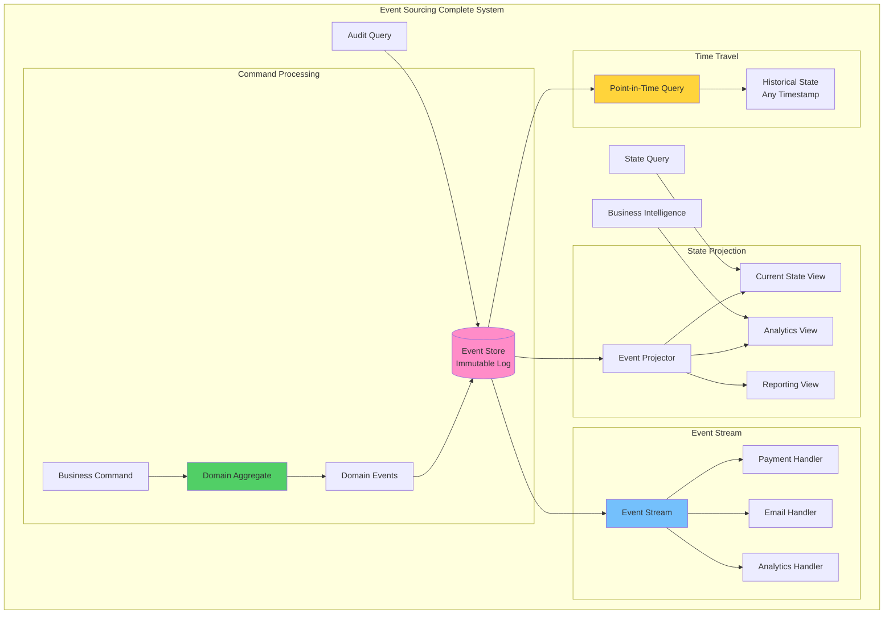

## The Complete Blueprint

Event Sourcing fundamentally transforms how we think about data persistence by storing not the current state of entities, but rather the complete sequence of domain events that led to that state, creating an immutable audit trail that enables precise reconstruction of any point-in-time view of the system. This pattern treats events as the source of truth, capturing every change as an immutable fact - whether it's a user registration, order placement, payment processing, or inventory adjustment - and derives current state by replaying these events through projection functions. The approach provides unprecedented auditability since every change is permanently recorded with full context, enables temporal queries to answer questions like "what did our inventory look like last Tuesday," supports easy debugging by replaying events to reproduce issues, and naturally facilitates event-driven architectures where other services can subscribe to the event stream for real-time integration. Event sourcing excels in domains requiring strong audit trails like financial systems, healthcare records, legal compliance, and any scenario where understanding the "why" and "when" of changes is as important as the current state, though it requires careful consideration of event schema evolution and snapshot strategies for performance optimization.

### What You'll Master

!!! success "By understanding Event Sourcing, you'll be able to:"
    - **Achieve complete auditability** - Track every change with full context and timestamps
    - **Enable time travel queries** - Reconstruct system state at any point in history
    - **Build event-driven architectures** - Integrate systems through event streams naturally
    - **Simplify debugging** - Replay events to reproduce and understand issues
    - **Support regulatory compliance** - Maintain immutable audit trails for legal requirements
    - **Facilitate business intelligence** - Analyze patterns and trends from historical events

# Event Sourcing Pattern

Event sourcing pattern for audit and replay

## See Also

- [Eventual Consistency](/pattern-library/data-management/eventual-consistency)
- [Event Streaming](/pattern-library/architecture/event-streaming)
- [Rate Limiting Pattern](/pattern-library/scaling/rate-limiting)
