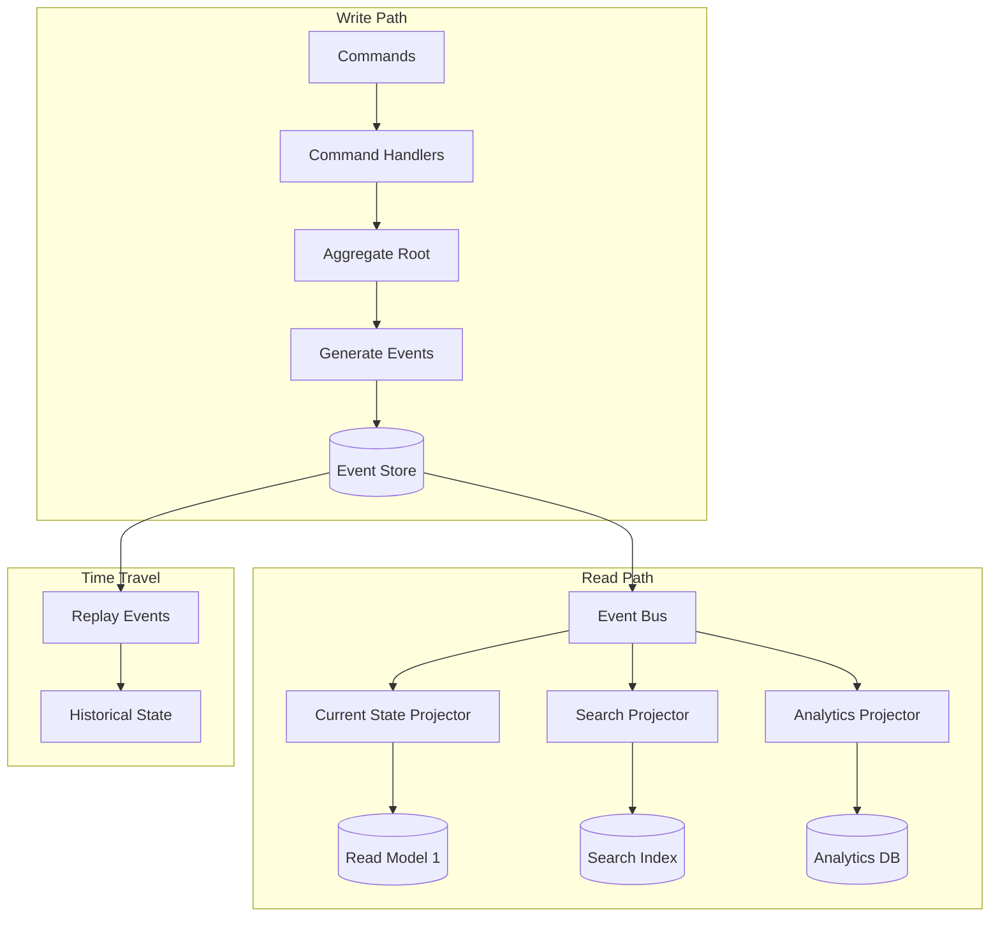
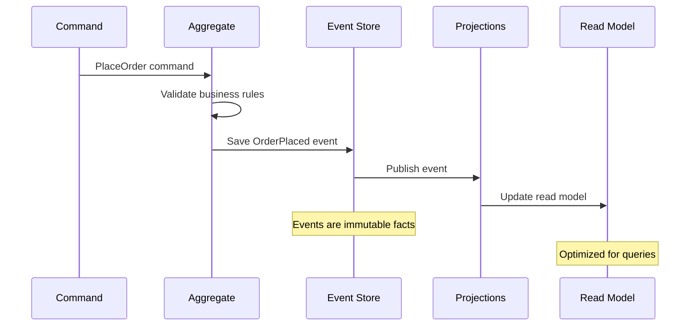
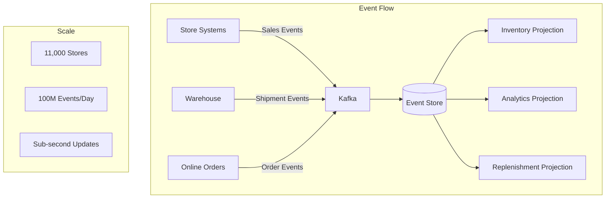
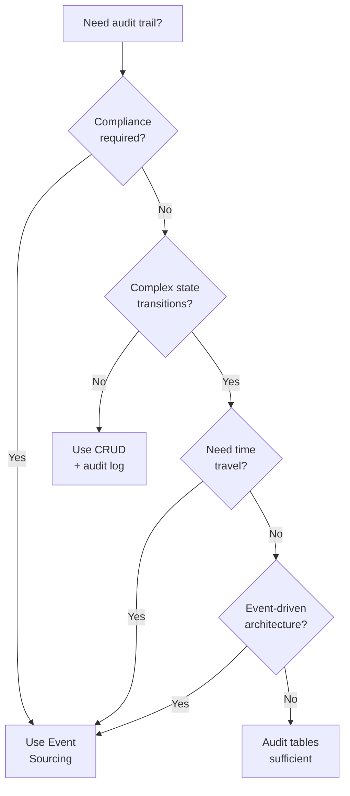

# Event Sourcing

!!! success "🏆 Gold Standard Pattern"
    **Audit Trail & Time Travel Champion** • PayPal, Walmart, Financial Systems
    
    Event sourcing is critical for systems requiring complete audit trails, regulatory compliance, and the ability to reconstruct state at any point in time. Essential for financial and e-commerce systems.
    
    **Key Success Metrics:**
    - PayPal: 350M+ accounts with full history
    - Walmart: 100M+ daily orders tracked
    - Banking: Trillions in compliant transactions

## Essential Question

**How can we preserve the complete history of all changes while maintaining fast access to current state?**

The genius of event sourcing: Instead of storing just current state (balance = $100), we store the sequence of events that led there (opened, deposited $150, withdrew $50). This enables time travel, audit trails, and debugging capabilities impossible with traditional CRUD.

## When to Use / When NOT to Use

### Use Event Sourcing When ✅

| Scenario | Why | Example |
|----------|-----|---------|
| **Audit trail required** | Complete history by design | Financial transactions, healthcare records |
| **Complex domain with many state changes** | Natural fit for events | Order lifecycle, user journey tracking |
| **Time-travel debugging needed** | Replay to any point | Production issue investigation |
| **Compliance regulations** | Immutable audit log | GDPR, SOX, HIPAA compliance |
| **Event-driven architecture** | Events are first-class | Microservices communication |
| **High-frequency writes** | Append-only is fast | Trading systems, IoT telemetry |

### DON'T Use When ❌

| Scenario | Why | Alternative |
|----------|-----|-------------|
| **Simple CRUD operations** | Overhead not justified | Traditional database |
| **Storage cost constraints** | Unbounded growth | Compressed logging, snapshots |
| **Real-time aggregations** | Projection lag | Materialized views, OLAP |
| **Small development team** | Steep learning curve | Simpler architecture |
| **Immediate consistency required** | Projections are async | ACID transactions |

## Level 1: Intuition (5 min)

### The Banking Ledger Analogy

<div class="axiom-box">
<h4>🔬 Law 5: Distributed Knowledge (Epistemology)</h4>

Event sourcing embraces that "truth" is not a single state but a sequence of events. Each event is a fact that happened at a specific time.

**Key Insight**: The event log IS the source of truth, not the current state. State is ephemeral; events are eternal.
</div>

### Visual Architecture

```mermaid
graph LR
    subgraph "Traditional CRUD"
        U1[User] -->|UPDATE| DB1[(Current State)]
        DB1 -->|Lost| H1[History ❌]
    end
    
    subgraph "Event Sourcing"
        U2[User] -->|Command| ES[Event Store]
        ES -->|Append| EL[(Event Log)]
        EL -->|Project| CS[(Current State)]
        EL -->|Replay| HS[(Any Point in Time)]
    end
```



### Core Concept

**Bank Account Example**:
- Traditional: Balance = $100 (how did we get here?)
- Event Sourcing: 
  - Opened: +$0
  - Deposited: +$150
  - Withdrew: -$50
  - Current: $100 (with complete history)

## Level 2: Foundation (10 min)

### Event Sourcing Architecture



### Key Components

| Component | Purpose | Implementation |
|-----------|---------|----------------|
| **Event Store** | Immutable event log | Kafka, EventStore, PostgreSQL |
| **Aggregate** | Business logic + validation | Domain model |
| **Projections** | Read-optimized views | Denormalized tables |
| **Snapshots** | Performance optimization | Periodic state capture |
| **Event Bus** | Event distribution | Kafka, RabbitMQ |

### Trade-off Analysis

| Aspect | Benefit | Cost |
|--------|---------|------|
| **Auditability** | Complete change history | Unbounded storage growth |
| **Debugging** | Time travel capability | Query complexity |
| **Flexibility** | Multiple projections | Eventual consistency |
| **Performance** | Fast writes (append-only) | Slower reads (projection lag) |

## Level 3: Deep Dive (15 min)

### Event Design Principles

<div class="decision-box">
<h4>🎯 Event Design Rules</h4>

1. **Events are facts** - Past tense (OrderPlaced, not PlaceOrder)
2. **Events are immutable** - Never modify, only append
3. **Events are domain-focused** - Business language, not technical
4. **Events are self-contained** - Include all necessary data
5. **Events are versioned** - Schema evolution support
</div>

### Event Flow Architecture



### Event Design Pattern

```mermaid
graph TB
    subgraph "Event Structure"
        E[Event] --> M[Metadata]
        E --> P[Payload]
        
        M --> ID[Event ID]
        M --> TS[Timestamp]
        M --> V[Version]
        M --> T[Type]
        
        P --> D[Domain Data]
        P --> B[Before State]
        P --> A[After State]
    end
    
    subgraph "Example: OrderPlaced"
        OP[OrderPlaced Event] --> OM[order_id: 12345<br/>customer_id: 789<br/>total: $99.99<br/>items: [...]]
    end
```

### Projection Update Strategies

| Strategy | Consistency | Performance | Use Case |
|----------|-------------|-------------|----------|
| **Synchronous** | Strong | Slower writes | Critical views |
| **Asynchronous** | Eventual | Fast writes | Analytics, search |
| **Scheduled** | Delayed | Batch efficiency | Reports, summaries |
| **On-demand** | Lazy | No overhead | Rarely accessed data |

### Snapshot Strategy


## Level 4: Expert (20 min)

### Event Versioning Strategies

| Strategy | When to Use | Implementation |
|----------|-------------|----------------|
| **Weak Schema** | Minor additions | Add optional fields |
| **Upcasting** | Compatible changes | Transform old to new |
| **Multiple Versions** | Breaking changes | Support both versions |
| **Event Migration** | Major refactoring | Replay with transformation |

### Performance Optimization Matrix

| Component | Optimization | Impact | Trade-off |
|-----------|--------------|--------|-----------|
| **Snapshots** | Every 100 events | 10x faster replay | Storage overhead |
| **Projections** | Parallel processing | 4x throughput | Complexity |
| **Partitioning** | By aggregate ID | Linear scaling | Cross-aggregate queries |
| **Archival** | Old events to S3 | 90% cost reduction | Retrieval latency |

### Common Pitfalls

| Pitfall | Impact | Solution |
|---------|--------|----------|
| **Event granularity** | Too fine = noise, too coarse = loss | Domain-driven design |
| **Projection lag** | Stale read models | SLA monitoring + alerts |
| **Event ordering** | Out-of-order processing | Sequence numbers + buffering |
| **Schema evolution** | Breaking changes | Versioning strategy |

## Level 5: Mastery (30 min)

### Case Study: Walmart's Inventory System



**Implementation Details**:
- Partitioned by store + SKU
- 30-day hot storage, S3 archival
- Real-time inventory accuracy
- Replay for reconciliation

### Economic Analysis

```python
def event_sourcing_roi(events_per_day, retention_years, team_size):
    """Calculate ROI for event sourcing implementation"""
    
    # Storage costs
    event_size_kb = 1
    daily_storage_gb = (events_per_day * event_size_kb) / 1_000_000
    yearly_storage_tb = (daily_storage_gb * 365) / 1000
    storage_cost = yearly_storage_tb * retention_years * 50  # $50/TB/year
    
    # Benefits
    audit_compliance_savings = 100_000  # Avoid manual audit
    debugging_time_savings = team_size * 20 * 2000  # 20 hrs/year @ $100/hr
    
    return {
        'yearly_cost': storage_cost,
        'yearly_savings': audit_compliance_savings + debugging_time_savings,
        'break_even': events_per_day > 10_000
    }
```

## Quick Reference

### Decision Matrix



### Implementation Checklist ✓

- [ ] Define event schema with versioning
- [ ] Implement event store with ordering guarantees
- [ ] Design aggregate boundaries
- [ ] Create projection update strategies
- [ ] Set up snapshot mechanism
- [ ] Plan storage retention and archival
- [ ] Implement replay capabilities
- [ ] Monitor projection lag
- [ ] Test concurrency scenarios
- [ ] Document event catalog

### Configuration Template

```yaml
event_sourcing:
  event_store:
    type: "kafka"  # or eventstore, postgres
    retention: "7 years"
    partitions: 100
    replication: 3
  
  snapshots:
    enabled: true
    frequency: 100
    storage: "s3"
  
  projections:
    async: true
    consistency: "eventual"
    lag_sla_ms: 1000
  
  monitoring:
    track_event_types: true
    measure_projection_lag: true
    alert_on_replay_failure: true
```

## Related Patterns

### Core Combinations
- **[CQRS](./cqrs.md)**: Natural companion for separate read/write models
- **[Saga Pattern](./saga.md)**: Event sourcing provides saga state
- **[Event-Driven Architecture](../communication/event-driven.md)**: Foundation for event flow

### Supporting Patterns
- **[Snapshot](../patterns/snapshot.md)**: Performance optimization
- **[Memento](../patterns/memento.md)**: State reconstruction
- **[Message Store](../patterns/message-store.md)**: Event persistence

### Alternative Approaches
- **[Change Data Capture](./cdc.md)**: Database-level event capture
- **[Audit Log](../patterns/audit-log.md)**: Simpler alternative
- **[Write-Ahead Log](./wal.md)**: Similar append-only concept

## Further Reading

- [Event Sourcing - Martin Fowler](https://martinfowler.com/eaaDev/EventSourcing.html)
- [CQRS Journey - Microsoft](https://docs.microsoft.com/en-us/previous-versions/msp-n-p/jj554200)
- [EventStore Documentation](https://eventstore.com/docs/)
- [Kafka Event Sourcing](https://kafka.apache.org/documentation/streams/)

### Tools & Libraries
- **Event Stores**: EventStore, Axon Server, Kafka
- **Frameworks**: Axon (Java), Eventide (Ruby), Commanded (Elixir)
- **Databases**: PostgreSQL with JSONB, MongoDB