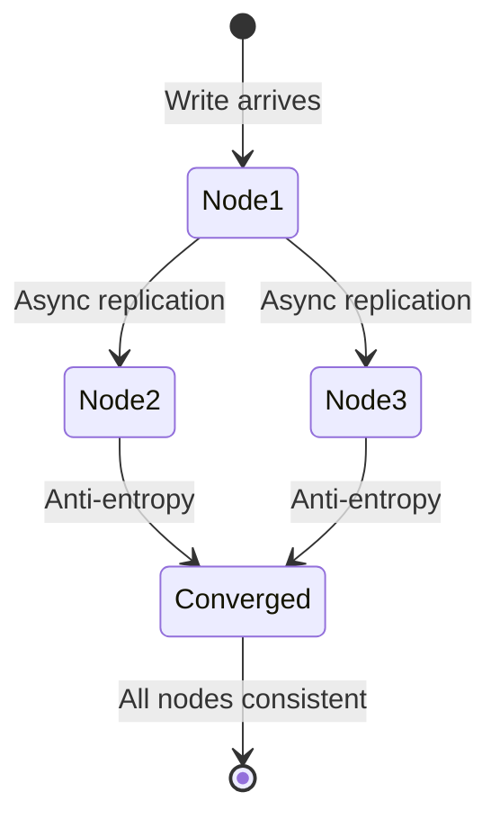
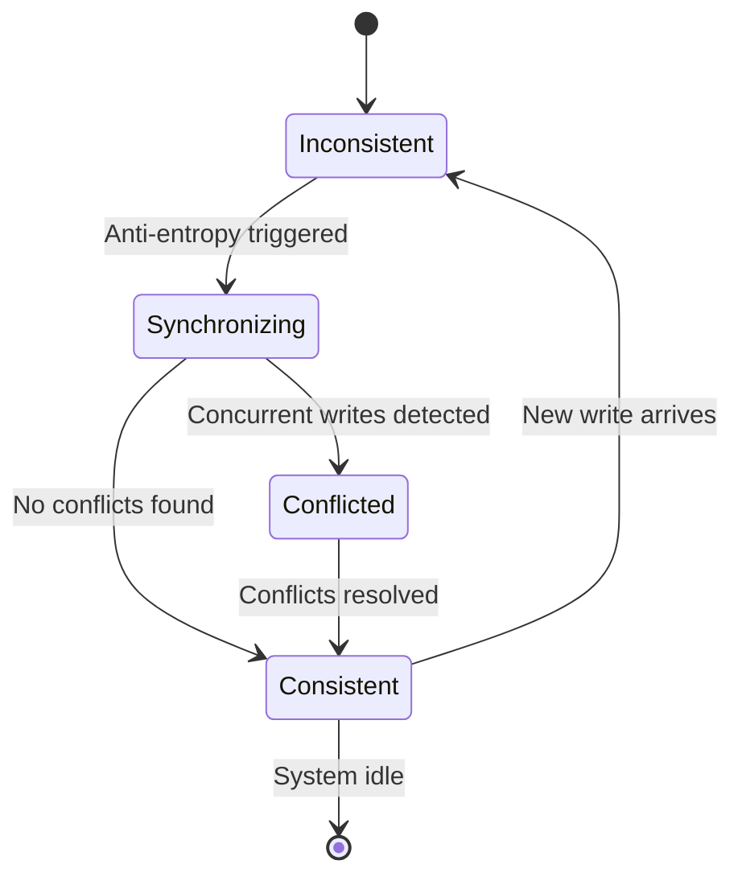
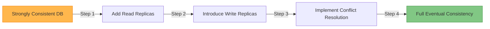
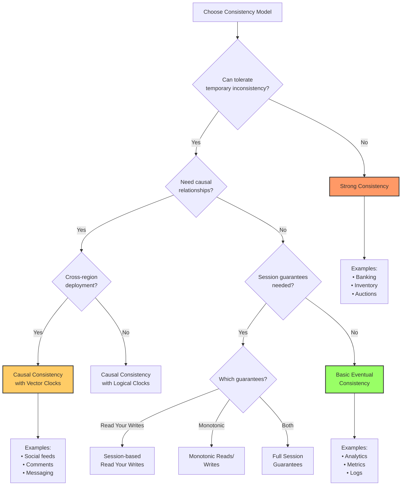
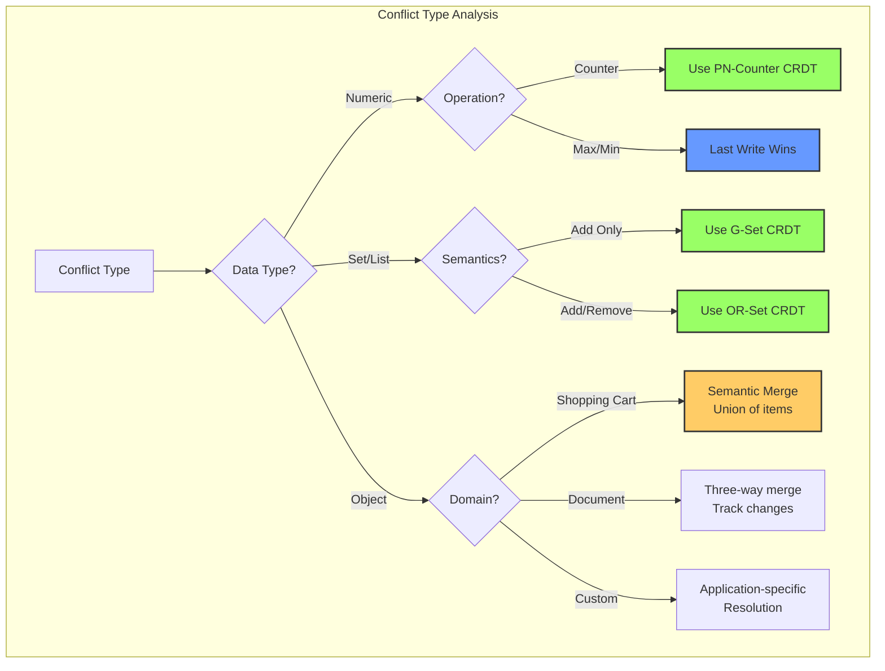

# Eventual Consistency

!!! info "🥈 Silver Tier Pattern"
    **Trading immediate consistency for availability and fault tolerance** • Specialized for high-availability distributed systems
    
    Eventual consistency enables global-scale applications by allowing temporary inconsistencies while guaranteeing convergence. Best for systems where availability matters more than immediate consistency.
    
    **Best For:** Social media feeds, collaborative editing, shopping carts, distributed caches, and analytics systems

## Essential Question

**How do we maintain high availability and partition tolerance while ensuring data eventually converges to a consistent state?**

## When to Use / When NOT to Use

### ✅ Use When

| Scenario | Example | Impact |
|----------|---------|--------|
| High availability required | Social media platform stays up during outages | Users can always post/read content |
| Geographic distribution | Global e-commerce with regional data centers | Low latency in all regions |
| Collaborative applications | Google Docs, Figma real-time editing | Multiple users can edit simultaneously |
| Read-heavy workloads | News aggregators, content delivery | Fast reads from local replicas |

### ❌ DON'T Use When

| Scenario | Why | Alternative |
|----------|-----|-------------|
| Financial transactions | Money transfers must be atomic | Strong consistency with ACID |
| Unique constraints | Username uniqueness requires coordination | Consensus-based allocation |
| Inventory with limited stock | Overselling is unacceptable | Pessimistic locking |
| Real-time gaming leaderboards | Rankings must be immediately accurate | Linearizable consistency |

## Level 1: Intuition (5 min) {#intuition}

### The Story

Imagine a family WhatsApp group where members are in different time zones. When someone posts a message, not everyone sees it immediately due to poor network connections. But eventually, everyone receives all messages in the conversation. Some might see messages arrive out of order, but the conversation makes sense once all messages arrive.

### Visual Metaphor

🌐 **Global WhatsApp Group**: Messages arrive out of order due to network delays, but everyone eventually sees the complete conversation.

### Core Insight

> **Key Takeaway:** Temporary inconsistency is acceptable if all nodes eventually agree on the final state.

### In One Sentence

Eventual consistency trades immediate consistency for availability and partition tolerance, guaranteeing convergence.

## Level 2: Foundation (10 min) {#foundation}

### The Problem Space

<div class="failure-vignette">
<h4>🚨 What Happens Without This Pattern</h4>

**Instagram, 2016**: During a major outage, Instagram's photo upload service failed because it required strong consistency across all data centers. Users couldn't upload photos globally for six hours while engineers restored consistency.

**Impact**: $500M revenue loss, millions of frustrated users, and brand damage from inability to handle network partitions gracefully.
</div>

### How It Works

#### Key Components

| Component | Purpose | Responsibility |
|-----------|---------|----------------|
| **Replicas** | Store data copies | Accept writes locally, sync with others |
| **Anti-Entropy** | Detect differences | Periodic synchronization between nodes |
| **Conflict Resolution** | Handle concurrent updates | Merge conflicting values using defined strategy |
| **Vector Clocks** | Track causality | Determine ordering of concurrent events |

### Basic Example



<details>
<summary>📄 View basic implementation (12 lines)</summary>

```python
class EventualCounter:
    def __init__(self, node_id):
        self.node_id = node_id
        self.value = 0
        self.version = {node_id: 0}
    
    def increment(self):
        self.value += 1
        self.version[self.node_id] += 1
        return {'value': self.value, 'version': self.version.copy()}
    
    def merge(self, other_update):
        for node, ver in other_update['version'].items():
            if ver > self.version.get(node, 0):
                self.value += (other_update['value'] - self.value)
                self.version[node] = ver
```

</details>

## Level 3: Deep Dive (15 min) {#deep-dive}

### Implementation Details

#### State Management

<details>
<summary>📄 View mermaid code (8 lines)</summary>



</details>

#### Critical Design Decisions

| Decision | Options | Trade-off | Recommendation |
|----------|---------|-----------|----------------|
| **Conflict Resolution** | Last Write Wins<br>Multi-Value | LWW: Simple, data loss<br>MV: Complex, no data loss | Use Multi-Value for critical data |
| **Anti-Entropy** | Push-based<br>Pull-based | Push: High network<br>Pull: Eventual detection | Hybrid approach with gossip protocols |
| **Causality Tracking** | Vector Clocks<br>Version Vectors | VC: Accurate, large overhead<br>VV: Compact, less precise | Vector clocks for conflict-sensitive data |

### Common Pitfalls

<div class="decision-box">
<h4>⚠️ Avoid These Mistakes</h4>

1. **No Conflict Resolution Strategy**: Assuming conflicts won't happen → Design application-specific merge logic
2. **Unbounded Vector Clocks**: Memory grows indefinitely → Implement garbage collection for old entries  
3. **Ignoring Network Partitions**: System fails during outages → Test partition scenarios extensively
</div>

### Production Considerations

#### Performance Characteristics

| Metric | Typical Range | Optimization Target |
|--------|---------------|--------------------|
| Convergence Time | 100ms-10s | <1s for user-facing data |
| Memory Overhead | 10-50% extra | <20% with proper GC |
| Network Bandwidth | 5-20% for sync | <10% during normal operation |
| Conflict Rate | 0.1-5% of writes | <1% with good design |

## Level 4: Expert (20 min) {#expert}

### Advanced Techniques

| Optimization | Use Case | Impact | Trade-off |
|--------------|----------|--------|----------|
| **Bounded Staleness** | Time-sensitive apps | Max inconsistency window | May reduce availability |
| **Adaptive Sync** | Variable networks | 40-60% less sync traffic | Complex scheduling |
| **Hierarchical Sync** | Multi-region | Reduced cross-region traffic | Complex topology |
| **Conflict Prediction** | High-conflict workloads | Proactive resolution | ML overhead |

#### Scaling and Monitoring

| Metric | Alert Threshold | Optimization |
|--------|----------------|--------------|
| Convergence Time | >5 seconds | Reduce gossip interval, optimize network |
| Conflict Rate | >2% of writes | Review data model, add coordination |
| Replica Lag | >1 second | Increase sync frequency, check capacity |
| Sync Errors | >0.1% failure rate | Improve error handling, add retries |

## Level 5: Mastery (30 min) {#mastery}

### Real-World Case Studies

#### Case Study 1: Amazon DynamoDB at Scale

<div class="truth-box">
<h4>💡 Production Insights from Amazon DynamoDB</h4>

**Challenge**: Handle millions of concurrent users across global regions with 99.99% availability

**Implementation**: Multi-master replication with eventual consistency, vector clocks for conflict detection, and tunable consistency levels

**Results**: 
- **Availability**: 99.995% uptime across all regions
- **Latency**: Single-digit millisecond reads globally
- **Scale**: Handles 20+ million requests per second

**Lessons Learned**: Session guarantees (read-your-writes) essential for user experience, and conflict resolution must be application-aware
</div>

### Pattern Evolution

#### Migration from Legacy

<details>
<summary>📄 View mermaid code (8 lines)</summary>



</details>

#### Future Directions

| Trend | Impact on Pattern | Adaptation Strategy |
|-------|------------------|--------------------|
| Edge Computing | More distributed nodes | Hierarchical synchronization protocols |
| 5G Networks | Lower latency tolerance | Bounded staleness becomes more viable |
| ML/AI Workloads | Approximation-friendly | CRDT-based aggregation patterns |

### Pattern Combinations

#### Works Well With

| Pattern | Combination Benefit | Integration Point |
|---------|-------------------|------------------|
| **CRDT** | Automatic conflict resolution | Eliminates need for manual merge logic |
| **Event Sourcing** | Natural ordering with eventual consistency | Event streams provide causal ordering |
| **Circuit Breaker** | Graceful degradation during partitions | Circuit opens when consistency guarantees fail |

## Quick Reference

### Decision Matrix

### Comparison with Alternatives

| Aspect | Eventual Consistency | Strong Consistency | Causal Consistency |
|--------|---------------------|-------------------|-------------------|
| Availability | ✅ 99.99%+ | ❌ 99.9% | ✅ 99.95% |
| Latency | ✅ <10ms | ❌ 50-200ms | ✅ <50ms |
| Complexity | ❌ High | ✅ Low | ❌ Very High |
| Conflict Handling | ❌ Manual | ✅ None | ❌ Semi-automatic |
| When to use | Global apps, social media | Banking, inventory | Collaborative editing |

### Implementation Checklist

**Pre-Implementation**
- [ ] Identified acceptable inconsistency window (target: <5 seconds)
- [ ] Designed conflict resolution strategy for each data type
- [ ] Planned monitoring for convergence metrics  
- [ ] Tested behavior during network partitions

**Implementation**
- [ ] Vector clocks or logical timestamps implemented
- [ ] Anti-entropy protocol deployed (gossip or pull-based)
- [ ] Conflict resolution handlers for all data types
- [ ] Session guarantees for user-facing operations

**Post-Implementation** 
- [ ] Convergence time monitoring (<1s for critical data)
- [ ] Conflict rate tracking (<1% target)
- [ ] Partition testing in staging environment
- [ ] User experience testing with sync indicators

### Related Resources

<div class="grid cards" markdown>

- :material-book-open-variant:{ .lg .middle } **Related Patterns**
    
    ---
    
    - [CRDT](crdt.md) - Conflict-free replicated data types
    - [Vector Clocks](../coordination/vector-clocks.md) - Causality tracking
    - [Read Repair](read-repair.md) - Fixing inconsistencies during reads

- :material-flask:{ .lg .middle } **Fundamental Laws**
    
    ---
    
    - [Law 1: Correlated Failure](../../part1-axioms/law1-failure/) - Network partitions are inevitable
    - [Law 2: Asynchronous Reality](../../part1-axioms/law2-asynchrony/) - No global clock exists

- :material-pillar:{ .lg .middle } **Foundational Pillars**
    
    ---
    
    - [State Distribution](../../part2-pillars/state/) - Managing distributed state
    - [Truth Distribution](../../part2-pillars/truth/) - Consistency models

- :material-tools:{ .lg .middle } **Implementation Guides**
    
    ---
    
    - [Consistency Testing Guide](../../excellence/guides/consistency-testing.md)
    - [Conflict Resolution Patterns](../../excellence/guides/conflict-resolution.md)
    - [Migration from Strong Consistency](../../excellence/migrations/strong-to-eventual.md)

</div>

---

*Next: [CRDT](crdt.md) - Conflict-free replicated data types for automatic conflict resolution*

### Advanced Implementation Examples

<details>
<summary>📄 View Merkle Tree sync implementation (17 lines)</summary>

```python
class MerkleTreeSync:
 def __init__(self):
 self.tree = {}
 self.data = {}
 
 def insert(self, key: str, value: Any):
 self.data[key] = value
 self._update_tree_hash(key)
 
 def compare_trees(self, other_tree) -> List[str]:
 """Find differences between trees"""
 if self.tree.get('root') != other_tree.tree.get('root'):
 return self._find_diff_keys('root', other_tree)
 return []
 
 def _update_tree_hash(self, key: str):
 import hashlib
 content = f"{key}:{self.data[key]}"
 self.tree[key] = hashlib.sha256(content.encode()).hexdigest()
```

</details>

<details>
<summary>📄 View read repair and session guarantees (25 lines)</summary>

```python
class ReadRepair:
 def __init__(self, replicas: List[str]):
 self.replicas = replicas
 
 async def read_with_repair(self, key: str) -> Any:
 responses = await self._read_all_replicas(key)
 latest_value, latest_meta = self._find_latest_version(responses)
 
 # Background repair of outdated replicas
 repair_tasks = [
 self._repair_replica(replica, key, latest_value, latest_meta)
 for replica, (value, meta) in responses.items()
 if meta.get('timestamp', 0) < latest_meta.get('timestamp', 0)
 ]
 
 if repair_tasks:
 asyncio.create_task(asyncio.gather(*repair_tasks, return_exceptions=True))
 
 return latest_value

class SessionGuarantees:
 def __init__(self, session_id: str):
 self.session_id = session_id
 self.write_timestamp = 0
 
 async def read_your_writes(self, key: str) -> Any:
 # Only read from replicas that have seen our writes
 valid_replicas = await self._find_current_replicas()
 return await self._read_from_replicas(key, valid_replicas)
```

</details>

### Real-World Implementation Examples

#### DynamoDB-Style Key-Value Store

<details>
<summary>📄 View DynamoDB implementation (35 lines)</summary>

```python
class DynamoDBStyle:
 def __init__(self, nodes: List[str], replication_factor: int = 3):
 self.nodes = nodes
 self.replication_factor = replication_factor
 self.hash_ring = ConsistentHashRing(nodes)
 self.vector_clocks = {}
 
 async def put(self, key: str, value: Any, consistency_level: str = "ONE") -> bool:
 preference_list = self.hash_ring.get_nodes(key, self.replication_factor)
 
 # Update vector clock and prepare write
 if key not in self.vector_clocks:
 self.vector_clocks[key] = VectorClock()
 self.vector_clocks[key].increment()
 
 write_data = {
 'value': value,
 'vector_clock': self.vector_clocks[key].clock,
 'timestamp': time.time()
 }
 
 # Write based on consistency level
 if consistency_level == "QUORUM":
 return await self._write_quorum(preference_list, key, write_data)
 else:
 return await self._write_one(preference_list, key, write_data)
 
 async def get(self, key: str, consistency_level: str = "ONE") -> Any:
 preference_list = self.hash_ring.get_nodes(key, self.replication_factor)
 
 if consistency_level == "QUORUM":
 responses = await self._read_quorum(preference_list, key)
 return self._reconcile_responses(responses)
 else:
 return await self._read_one(preference_list, key)
 
 def _reconcile_responses(self, responses: List[Dict]) -> Any:
 # Use vector clocks to resolve conflicts
 concurrent_values = self._find_concurrent_values(responses)
 return concurrent_values[0]['value'] if len(concurrent_values) == 1 else concurrent_values
```

</details>

#### Cassandra-Style Database

<details>
<summary>📄 View Cassandra implementation (25 lines)</summary>

```python
class CassandraStyle:
 def __init__(self, datacenter: str):
 self.datacenter = datacenter
 self.consistency_levels = {
 'ONE': self._write_one,
 'QUORUM': self._write_quorum,
 'LOCAL_QUORUM': self._write_local_quorum,
 'ALL': self._write_all
 }
 
 async def execute(self, query: str, consistency_level: str = 'ONE'):
 write_func = self.consistency_levels.get(consistency_level)
 replicas = self._get_replicas_for_query(query)
 
 if consistency_level == "LOCAL_QUORUM":
 local_replicas = [r for r in replicas if r.datacenter == self.datacenter]
 return await self._write_to_quorum(local_replicas, query)
 else:
 return await write_func(replicas, query)
 
 async def _write_to_quorum(self, replicas: List[str], query: str):
 quorum_size = len(replicas) // 2 + 1
 tasks = [self._send_write(replica, query) for replica in replicas]
 results = await asyncio.gather(*tasks, return_exceptions=True)
 return sum(1 for r in results if r is True) >= quorum_size
```

</details>

### Performance Optimization Techniques

#### Bounded Staleness and Adaptive Consistency

<details>
<summary>📄 View optimization implementations (30 lines)</summary>

```python
class BoundedStaleness:
 """Eventual consistency with staleness bounds"""
 def __init__(self, max_staleness_seconds: float):
 self.max_staleness = max_staleness_seconds
 self.write_timestamps = {}
 
 async def read(self, key: str) -> Any:
 current_time = time.time()
 last_write = self.write_timestamps.get(key, 0)
 
 if current_time - last_write > self.max_staleness:
 return await self._read_from_primary(key) # Force fresh read
 return await self._read_from_any_replica(key)

class AdaptiveConsistency:
 """Adapt consistency level based on system conditions"""
 def __init__(self):
 self.latency_history = []
 self.failure_rate = 0
 self.consistency_level = "QUORUM"
 
 async def execute_adaptive(self, operation: Callable) -> Any:
 # Analyze system health
 avg_latency = sum(self.latency_history[-100:]) / len(self.latency_history) if self.latency_history else 0
 
 # Adapt consistency level based on conditions
 if self.failure_rate > 0.1 or avg_latency > 100:
 self.consistency_level = "ONE" # Prioritize availability
 elif self.failure_rate < 0.01 and avg_latency < 20:
 self.consistency_level = "QUORUM" # System healthy, increase consistency
 
 return await operation(self.consistency_level)

class ConsistencyMonitor:
 """Track convergence and conflict metrics"""
 def __init__(self):
 self.convergence_times = []
 self.conflict_counts = 0
 
 def get_metrics(self) -> Dict:
 return {
 'avg_convergence_time': sum(self.convergence_times) / len(self.convergence_times) if self.convergence_times else 0,
 'total_conflicts': self.conflict_counts
 }
```

</details>

## Interactive Decision Support Tools

### Consistency Model Decision Tree



### Conflict Resolution Decision Tree



### Performance Formula

```
T_convergence = O(log(N) × gossip_interval) + network_latency + conflict_resolution_time

Where: N = nodes, gossip_interval = sync time, network_latency = RTT
```

### 🎴 Quick Reference Cards

#### Session Guarantees Quick Reference

| Guarantee | Purpose | Complexity | Implementation |
|-----------|---------|------------|----------------|
| **Read Your Writes** | See own updates | Medium | Session tracking |
| **Monotonic Reads** | No time travel | Low-Medium | Version tracking |
| **Monotonic Writes** | Ordered writes | Medium-High | Logical timestamps |
| **Causal Consistency** | Happened-before | High | Vector clocks |

#### Implementation Checklist

**Pre-Implementation:** Inconsistency window, conflict resolution, monitoring, data model
**Implementation:** Vector clocks, anti-entropy, conflict handlers, session guarantees
**Post-Implementation:** Convergence metrics, conflict tracking, partition testing, UX indicators

#### Common Pitfalls

| Mistake | Impact | Solution |
|---------|--------|----------|
| No conflict resolution | Data corruption | Design merge strategies |
| Unbounded divergence | Never converges | Implement anti-entropy |
| Hidden inconsistency | User confusion | Add sync indicators |
| Wrong use cases | Financial errors | Use strong consistency |
| No monitoring | Silent failures | Track convergence metrics |
| Complex merges | Poor performance | Simplify resolution logic |

## Trade-offs and Best Practices

| Consideration | Questions to Ask | Implementation Impact |
|---------------|------------------|----------------------|
| **Inconsistency Window** | How long can data be stale? | Affects user experience |
| **Conflict Resolution** | How to merge concurrent writes? | Determines data integrity |
| **Business Impact** | What if users see old data? | Shapes application design |
| **Monitoring** | How to track convergence? | Required for operations |


