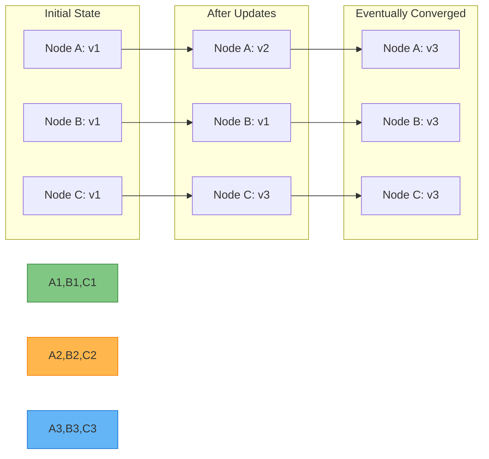
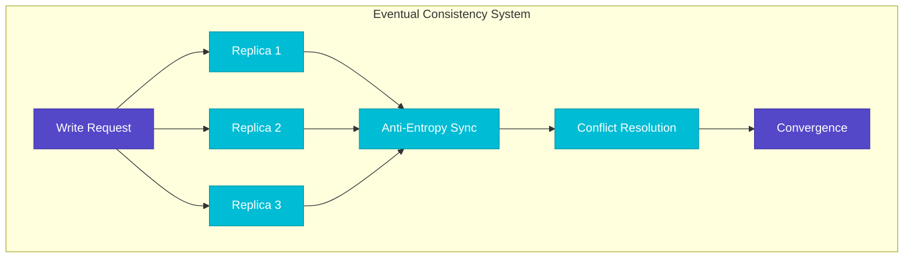
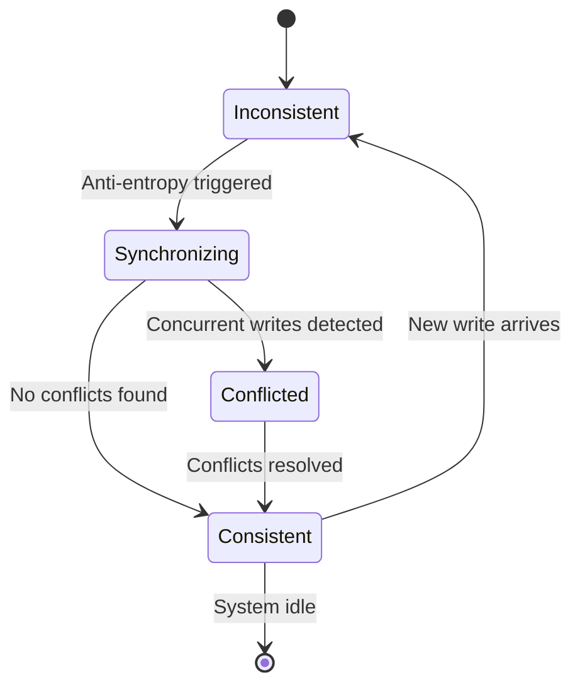
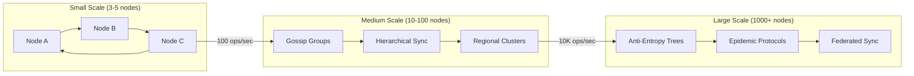
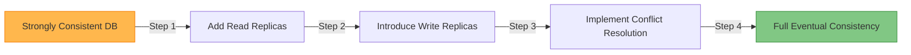
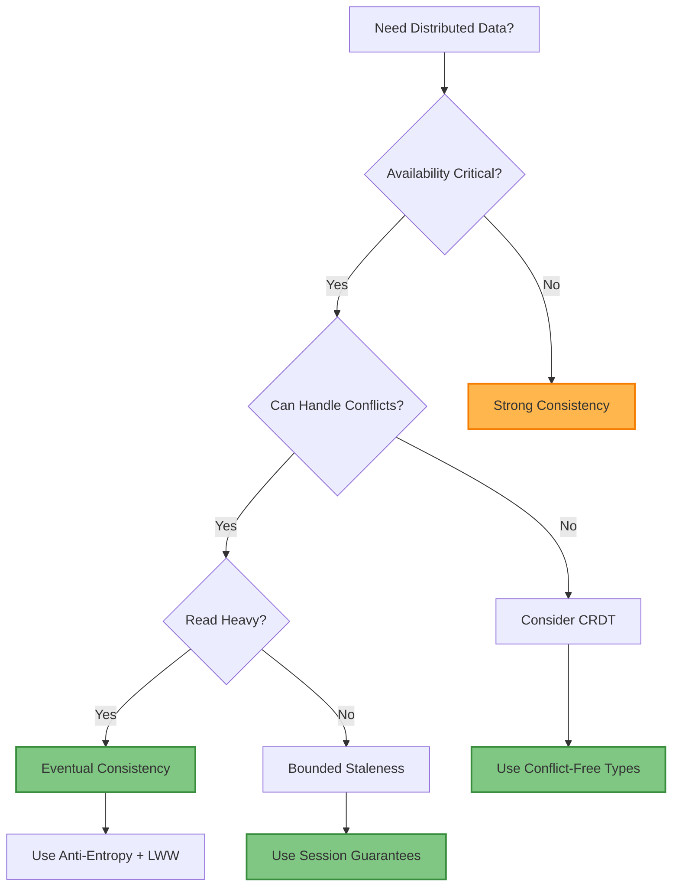
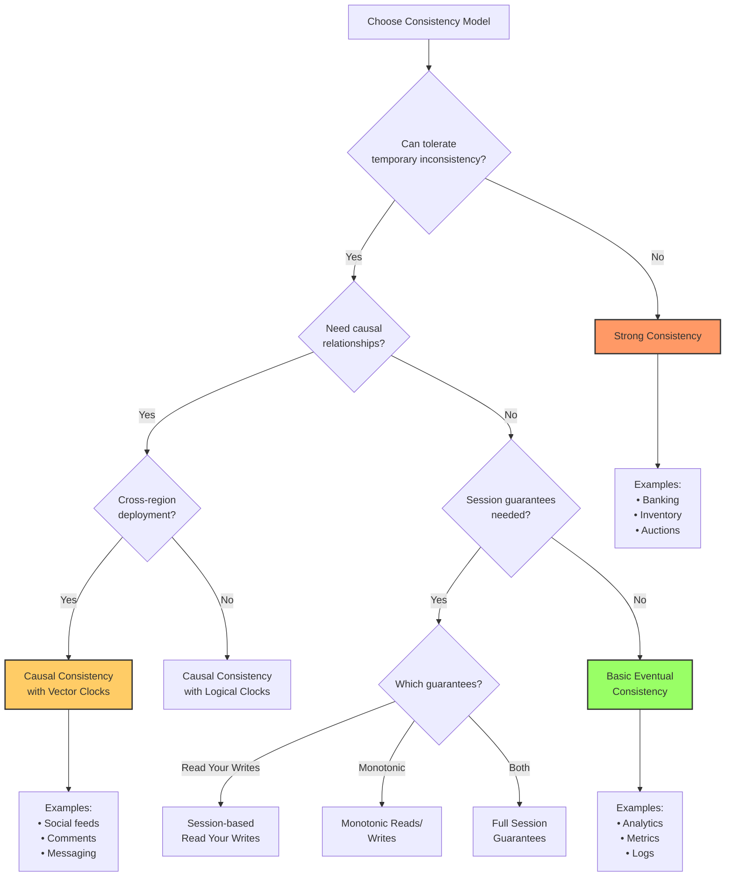
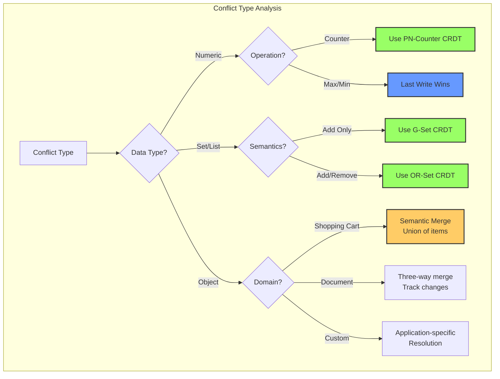

# Eventual Consistency

!!! info "🥈 Silver Tier Pattern"
    **Trading immediate consistency for availability and fault tolerance** • Specialized for high-availability distributed systems
    
    Eventual consistency enables global-scale applications by allowing temporary inconsistencies while guaranteeing convergence. Best for systems where availability matters more than immediate consistency.
    
    **Best For:** Social media feeds, collaborative editing, shopping carts, distributed caches, and analytics systems

## Essential Question

**How do we maintain high availability and partition tolerance while ensuring data eventually converges to a consistent state?**

## When to Use / When NOT to Use

### ✅ Use When

| Scenario | Example | Impact |
|----------|---------|--------|
| High availability required | Social media platform stays up during outages | Users can always post/read content |
| Geographic distribution | Global e-commerce with regional data centers | Low latency in all regions |
| Collaborative applications | Google Docs, Figma real-time editing | Multiple users can edit simultaneously |
| Read-heavy workloads | News aggregators, content delivery | Fast reads from local replicas |

### ❌ DON'T Use When

| Scenario | Why | Alternative |
|----------|-----|-------------|
| Financial transactions | Money transfers must be atomic | Strong consistency with ACID |
| Unique constraints | Username uniqueness requires coordination | Consensus-based allocation |
| Inventory with limited stock | Overselling is unacceptable | Pessimistic locking |
| Real-time gaming leaderboards | Rankings must be immediately accurate | Linearizable consistency |

## Level 1: Intuition (5 min) {#intuition}

### The Story

Imagine a family WhatsApp group where members are in different time zones. When someone posts a message, not everyone sees it immediately due to poor network connections. But eventually, everyone receives all messages in the conversation. Some might see messages arrive out of order, but the conversation makes sense once all messages arrive.

### Visual Metaphor



### Core Insight

> **Key Takeaway:** Temporary inconsistency is acceptable if all nodes eventually agree on the final state.

### In One Sentence

Eventual consistency allows distributed systems to remain available during network partitions by accepting temporary inconsistencies while guaranteeing that all replicas will converge to the same state.

## Level 2: Foundation (10 min) {#foundation}

### The Problem Space

<div class="failure-vignette">
<h4>🚨 What Happens Without This Pattern</h4>

**Instagram, 2016**: During a major outage, Instagram's photo upload service failed because it required strong consistency across all data centers. Users couldn't upload photos globally for six hours while engineers restored consistency.

**Impact**: $500M revenue loss, millions of frustrated users, and brand damage from inability to handle network partitions gracefully.
</div>

### How It Works



#### Key Components

| Component | Purpose | Responsibility |
|-----------|---------|----------------|
| **Replicas** | Store data copies | Accept writes locally, sync with others |
| **Anti-Entropy** | Detect differences | Periodic synchronization between nodes |
| **Conflict Resolution** | Handle concurrent updates | Merge conflicting values using defined strategy |
| **Vector Clocks** | Track causality | Determine ordering of concurrent events |

### Basic Example

```python
# Minimal eventually consistent counter
class EventualCounter:
    def __init__(self, node_id):
        self.node_id = node_id
        self.value = 0
        self.version = {node_id: 0}
    
    def increment(self):
        self.value += 1
        self.version[self.node_id] += 1
        return {'value': self.value, 'version': self.version.copy()}
    
    def merge(self, other_update):
        # Merge with another node's update
        for node, ver in other_update['version'].items():
            if ver > self.version.get(node, 0):
                self.value += (other_update['value'] - self.value)
                self.version[node] = ver
```

## Level 3: Deep Dive (15 min) {#deep-dive}

### Implementation Details

#### State Management



#### Critical Design Decisions

| Decision | Options | Trade-off | Recommendation |
|----------|---------|-----------|----------------|
| **Conflict Resolution** | Last Write Wins<br>Multi-Value | LWW: Simple, data loss<br>MV: Complex, no data loss | Use Multi-Value for critical data |
| **Anti-Entropy** | Push-based<br>Pull-based | Push: High network<br>Pull: Eventual detection | Hybrid approach with gossip protocols |
| **Causality Tracking** | Vector Clocks<br>Version Vectors | VC: Accurate, large overhead<br>VV: Compact, less precise | Vector clocks for conflict-sensitive data |

### Common Pitfalls

<div class="decision-box">
<h4>⚠️ Avoid These Mistakes</h4>

1. **No Conflict Resolution Strategy**: Assuming conflicts won't happen → Design application-specific merge logic
2. **Unbounded Vector Clocks**: Memory grows indefinitely → Implement garbage collection for old entries  
3. **Ignoring Network Partitions**: System fails during outages → Test partition scenarios extensively
</div>

### Production Considerations

#### Performance Characteristics

| Metric | Typical Range | Optimization Target |
|--------|---------------|--------------------|
| Convergence Time | 100ms-10s | <1s for user-facing data |
| Memory Overhead | 10-50% extra | <20% with proper GC |
| Network Bandwidth | 5-20% for sync | <10% during normal operation |
| Conflict Rate | 0.1-5% of writes | <1% with good design |

## Level 4: Expert (20 min) {#expert}

### Advanced Techniques

#### Optimization Strategies

1. **Bounded Staleness**
   - When to apply: Time-sensitive applications needing freshness guarantees
   - Impact: Reduces maximum inconsistency window to acceptable bounds
   - Trade-off: May sacrifice availability during high partition periods

2. **Adaptive Synchronization**
   - When to apply: Variable network conditions and workload patterns
   - Impact: 40-60% reduction in unnecessary sync traffic
   - Trade-off: Added complexity in sync scheduling logic

### Scaling Considerations



### Monitoring & Observability

#### Key Metrics to Track

| Metric | Alert Threshold | Dashboard Panel |
|--------|----------------|------------------|
| Convergence Time | >5 seconds | Time series with P95/P99 percentiles |
| Conflict Rate | >2% of writes | Bar chart by operation type |
| Replica Lag | >1 second | Heatmap across nodes |
| Sync Errors | >0.1% failure rate | Error log aggregation with root cause |

## Level 5: Mastery (30 min) {#mastery}

### Real-World Case Studies

#### Case Study 1: Amazon DynamoDB at Scale

<div class="truth-box">
<h4>💡 Production Insights from Amazon DynamoDB</h4>

**Challenge**: Handle millions of concurrent users across global regions with 99.99% availability

**Implementation**: Multi-master replication with eventual consistency, vector clocks for conflict detection, and tunable consistency levels

**Results**: 
- **Availability**: 99.995% uptime across all regions
- **Latency**: Single-digit millisecond reads globally
- **Scale**: Handles 20+ million requests per second

**Lessons Learned**: Session guarantees (read-your-writes) essential for user experience, and conflict resolution must be application-aware
</div>

### Pattern Evolution

#### Migration from Legacy



#### Future Directions

| Trend | Impact on Pattern | Adaptation Strategy |
|-------|------------------|--------------------|
| Edge Computing | More distributed nodes | Hierarchical synchronization protocols |
| 5G Networks | Lower latency tolerance | Bounded staleness becomes more viable |
| ML/AI Workloads | Approximation-friendly | CRDT-based aggregation patterns |

### Pattern Combinations

#### Works Well With

| Pattern | Combination Benefit | Integration Point |
|---------|-------------------|------------------|
| **CRDT** | Automatic conflict resolution | Eliminates need for manual merge logic |
| **Event Sourcing** | Natural ordering with eventual consistency | Event streams provide causal ordering |
| **Circuit Breaker** | Graceful degradation during partitions | Circuit opens when consistency guarantees fail |

## Quick Reference

### Decision Matrix



### Comparison with Alternatives

| Aspect | Eventual Consistency | Strong Consistency | Causal Consistency |
|--------|---------------------|-------------------|-------------------|
| Availability | ✅ 99.99%+ | ❌ 99.9% | ✅ 99.95% |
| Latency | ✅ <10ms | ❌ 50-200ms | ✅ <50ms |
| Complexity | ❌ High | ✅ Low | ❌ Very High |
| Conflict Handling | ❌ Manual | ✅ None | ❌ Semi-automatic |
| When to use | Global apps, social media | Banking, inventory | Collaborative editing |

### Implementation Checklist

**Pre-Implementation**
- [ ] Identified acceptable inconsistency window (target: <5 seconds)
- [ ] Designed conflict resolution strategy for each data type
- [ ] Planned monitoring for convergence metrics  
- [ ] Tested behavior during network partitions

**Implementation**
- [ ] Vector clocks or logical timestamps implemented
- [ ] Anti-entropy protocol deployed (gossip or pull-based)
- [ ] Conflict resolution handlers for all data types
- [ ] Session guarantees for user-facing operations

**Post-Implementation** 
- [ ] Convergence time monitoring (<1s for critical data)
- [ ] Conflict rate tracking (<1% target)
- [ ] Partition testing in staging environment
- [ ] User experience testing with sync indicators

### Related Resources

<div class="grid cards" markdown>

- :material-book-open-variant:{ .lg .middle } **Related Patterns**
    
    ---
    
    - [CRDT](crdt.md) - Conflict-free replicated data types
    - [Vector Clocks](../coordination/vector-clocks.md) - Causality tracking
    - [Read Repair](read-repair.md) - Fixing inconsistencies during reads

- :material-flask:{ .lg .middle } **Fundamental Laws**
    
    ---
    
    - [Law 1: Correlated Failure](../../part1-axioms/law1-failure/) - Network partitions are inevitable
    - [Law 2: Asynchronous Reality](../../part1-axioms/law2-asynchrony/) - No global clock exists

- :material-pillar:{ .lg .middle } **Foundational Pillars**
    
    ---
    
    - [State Distribution](../../part2-pillars/state/) - Managing distributed state
    - [Truth Distribution](../../part2-pillars/truth/) - Consistency models

- :material-tools:{ .lg .middle } **Implementation Guides**
    
    ---
    
    - [Consistency Testing Guide](../../excellence/guides/consistency-testing.md)
    - [Conflict Resolution Patterns](../../excellence/guides/conflict-resolution.md)
    - [Migration from Strong Consistency](../../excellence/migrations/strong-to-eventual.md)

</div>

---

*Next: [CRDT](crdt.md) - Conflict-free replicated data types for automatic conflict resolution*

# Merkle tree for efficient synchronization
class MerkleTree:
 """Merkle tree for efficient data comparison"""
 
 def __init__(self):
 self.tree = {}
 self.data = {}
 
 def insert(self, key: str, value: Any):
 """Insert key-value pair and update tree"""
 self.data[key] = value
 self._update_tree(key)
 
 def _update_tree(self, key: str):
 """Update merkle tree hashes"""
# Compute leaf hash
 leaf_hash = self._hash_node(key, self.data[key])
 
# Update parent hashes up to root
 path = self._get_path(key)
 current_hash = leaf_hash
 
 for i in range(len(path)):
 node_key = '/'.join(path[:i+1])
 self.tree[node_key] = current_hash
 
# Combine with sibling if exists
 sibling_key = self._get_sibling(node_key)
 if sibling_key in self.tree:
 combined = self._hash_combine(current_hash, self.tree[sibling_key])
 current_hash = combined
 
 def compare_with(self, other_tree: 'MerkleTree') -> List[str]:
 """Compare with another tree and find differences"""
 differences = []
 
# Start from root
 if self.tree.get('root') != other_tree.tree.get('root'):
# Trees differ, traverse to find differences
 differences = self._find_differences('root', other_tree)
 
 return differences
 
 def _find_differences(self, node: str, other_tree: 'MerkleTree') -> List[str]:
 """Recursively find differing keys"""
 if node not in self.tree:
 return []
 
 if self.tree[node] == other_tree.tree.get(node):
 return [] # Subtrees are identical
 
# Check if leaf node
 if self._is_leaf(node):
 return [node]
 
# Recurse on children
 differences = []
 left_child = self._get_left_child(node)
 right_child = self._get_right_child(node)
 
 differences.extend(self._find_differences(left_child, other_tree))
 differences.extend(self._find_differences(right_child, other_tree))
 
 return differences
 
 def _hash_node(self, key: str, value: Any) -> str:
 """Hash a node"""
 import hashlib
 content = f"{key}:{value}"
 return hashlib.sha256(content.encode()).hexdigest()
 
 def _hash_combine(self, hash1: str, hash2: str) -> str:
 """Combine two hashes"""
 import hashlib
 combined = f"{hash1}{hash2}"
 return hashlib.sha256(combined.encode()).hexdigest()
```

### 2. Read Repair

Detect and fix inconsistencies during read operations:

```python
class ReadRepair:
 """Read repair for eventual consistency"""
 
 def __init__(self, replicas: List[str], quorum_size: int):
 self.replicas = replicas
 self.quorum_size = quorum_size
 
 async def read_with_repair(self, key: str) -> Any:
 """Read value and repair inconsistencies"""
 
# Read from all replicas
 responses = await self._read_from_replicas(key)
 
# Find the most recent value
 latest_value, latest_metadata = self._find_latest(responses)
 
# Repair out-of-date replicas
 repair_tasks = []
 for replica, (value, metadata) in responses.items():
 if self._is_older(metadata, latest_metadata):
 task = self._repair_replica(replica, key, latest_value, latest_metadata)
 repair_tasks.append(task)
 
# Fire and forget repairs
 if repair_tasks:
 asyncio.create_task(self._execute_repairs(repair_tasks))
 
 return latest_value
 
 async def _read_from_replicas(self, key: str) -> Dict[str, Tuple[Any, Dict]]:
 """Read from all replicas"""
 responses = {}
 
 tasks = []
 for replica in self.replicas:
 task = self._read_from_replica(replica, key)
 tasks.append((replica, task))
 
# Wait for responses
 for replica, task in tasks:
 try:
 value, metadata = await asyncio.wait_for(task, timeout=1.0)
 responses[replica] = (value, metadata)
 except asyncio.TimeoutError:
# Skip unresponsive replicas
 pass
 
 return responses
 
 def _find_latest(self, responses: Dict[str, Tuple[Any, Dict]]) -> Tuple[Any, Dict]:
 """Find the latest value based on metadata"""
 latest_value = None
 latest_metadata = None
 latest_timestamp = -1
 
 for replica, (value, metadata) in responses.items():
 timestamp = metadata.get('timestamp', 0)
 if timestamp > latest_timestamp:
 latest_timestamp = timestamp
 latest_value = value
 latest_metadata = metadata
 
 return latest_value, latest_metadata
 
 def _is_older(self, metadata1: Dict, metadata2: Dict) -> bool:
 """Check if metadata1 is older than metadata2"""
# Simple timestamp comparison
 return metadata1.get('timestamp', 0) < metadata2.get('timestamp', 0)
 
 async def _repair_replica(self, replica: str, key: str, 
 value: Any, metadata: Dict):
 """Repair a single replica"""
# Send update to replica
 await self._write_to_replica(replica, key, value, metadata)
 
 async def _execute_repairs(self, repair_tasks: List):
 """Execute all repair tasks"""
 await asyncio.gather(*repair_tasks, return_exceptions=True)

# Hinted handoff for temporary failures
class HintedHandoff:
 """Store hints for temporarily unavailable nodes"""
 
 def __init__(self, node_id: str):
 self.node_id = node_id
 self.hints = {} # target_node -> List[hints]
 self.max_hint_age = 3600 # 1 hour
 
 def store_hint(self, target_node: str, key: str, value: Any, metadata: Dict):
 """Store a hint for later delivery"""
 if target_node not in self.hints:
 self.hints[target_node] = []
 
 hint = {
 'key': key,
 'value': value,
 'metadata': metadata,
 'timestamp': time.time()
 }
 
 self.hints[target_node].append(hint)
 
 async def deliver_hints(self):
 """Periodically attempt to deliver hints"""
 while True:
 await asyncio.sleep(10) # Check every 10 seconds
 
 for target_node, node_hints in list(self.hints.items()):
 if await self._is_node_available(target_node):
# Deliver hints
 delivered = []
 
 for hint in node_hints:
 if time.time() - hint['timestamp'] > self.max_hint_age:
# Hint too old, discard
 delivered.append(hint)
 continue
 
 try:
 await self._deliver_hint(target_node, hint)
 delivered.append(hint)
 except Exception:
# Keep hint for next attempt
 pass
 
# Remove delivered hints
 for hint in delivered:
 node_hints.remove(hint)
 
 if not node_hints:
 del self.hints[target_node]
 
 async def _is_node_available(self, node: str) -> bool:
 """Check if node is available"""
# Implementation depends on failure detection mechanism
 pass
 
 async def _deliver_hint(self, node: str, hint: Dict):
 """Deliver a single hint"""
# Send write request to node
 pass
```

### 3. Session Guarantees

Providing stronger consistency for better user experience:

```python
class SessionGuarantees:
 """Session-level consistency guarantees"""
 
 def __init__(self, session_id: str):
 self.session_id = session_id
 self.read_timestamp = 0
 self.write_timestamp = 0
 self.causal_dependencies = set()
 
 def read_your_writes(self, replica_manager):
 """Ensure reads see previous writes from this session"""
 return SessionReadYourWrites(self, replica_manager)
 
 def monotonic_reads(self, replica_manager):
 """Ensure reads are monotonically increasing"""
 return SessionMonotonicReads(self, replica_manager)
 
 def monotonic_writes(self, replica_manager):
 """Ensure writes are applied in order"""
 return SessionMonotonicWrites(self, replica_manager)
 
 def causal_consistency(self, replica_manager):
 """Ensure causal relationships are preserved"""
 return SessionCausalConsistency(self, replica_manager)

class SessionReadYourWrites:
 """Read Your Writes consistency"""
 
 def __init__(self, session: SessionGuarantees, replica_manager):
 self.session = session
 self.replica_manager = replica_manager
 
 async def write(self, key: str, value: Any) -> bool:
 """Write with session tracking"""
# Generate write timestamp
 timestamp = time.time()
 self.session.write_timestamp = timestamp
 
# Write to replicas
 success = await self.replica_manager.write(
 key, value, 
 metadata={'session': self.session.session_id, 'timestamp': timestamp}
 )
 
 return success
 
 async def read(self, key: str) -> Any:
 """Read ensuring we see our writes"""
# Find replicas that have seen our writes
 valid_replicas = await self._find_up_to_date_replicas()
 
 if not valid_replicas:
# Wait for propagation
 await asyncio.sleep(0.1)
 valid_replicas = await self._find_up_to_date_replicas()
 
# Read from valid replica
 return await self.replica_manager.read_from_replicas(key, valid_replicas)
 
 async def _find_up_to_date_replicas(self) -> List[str]:
 """Find replicas that have seen our writes"""
 valid_replicas = []
 
 for replica in self.replica_manager.replicas:
 replica_timestamp = await self._get_replica_timestamp(replica)
 if replica_timestamp >= self.session.write_timestamp:
 valid_replicas.append(replica)
 
 return valid_replicas
 
 async def _get_replica_timestamp(self, replica: str) -> float:
 """Get latest timestamp from replica"""
# Implementation depends on replica protocol
 pass

class SessionMonotonicReads:
 """Monotonic reads consistency"""
 
 def __init__(self, session: SessionGuarantees, replica_manager):
 self.session = session
 self.replica_manager = replica_manager
 self.last_read_replica = None
 
 async def read(self, key: str) -> Any:
 """Read ensuring monotonic progress"""
 if self.last_read_replica:
# Try to read from same replica
 try:
 value = await self.replica_manager.read_from_replica(
 key, self.last_read_replica
 )
 return value
 except Exception:
# Replica unavailable, find alternative
 pass
 
# Find replica with sufficient progress
 for replica in self.replica_manager.replicas:
 replica_state = await self._get_replica_state(replica)
 if replica_state >= self.session.read_timestamp:
 value = await self.replica_manager.read_from_replica(key, replica)
 self.last_read_replica = replica
 self.session.read_timestamp = replica_state
 return value
 
 raise Exception("No replica with sufficient progress")
 
 async def _get_replica_state(self, replica: str) -> float:
 """Get state/timestamp of replica"""
# Implementation specific
 pass
```

## Real-World Examples

### 1. Amazon DynamoDB

Implementation of eventual consistency with tunable consistency:

```python
class DynamoDBStyle:
 """DynamoDB-style eventually consistent key-value store"""
 
 def __init__(self, nodes: List[str], replication_factor: int = 3):
 self.nodes = nodes
 self.replication_factor = replication_factor
 self.hash_ring = ConsistentHashRing(nodes)
 self.vector_clocks = {}
 
 async def put(self, key: str, value: Any, 
 consistency_level: str = "ONE") -> bool:
 """Put with configurable consistency"""
 
# Find preference list
 preference_list = self.hash_ring.get_nodes(key, self.replication_factor)
 
# Update vector clock
 if key not in self.vector_clocks:
 self.vector_clocks[key] = VectorClock(self.node_id, self.nodes)
 self.vector_clocks[key].increment()
 
# Prepare write
 write_data = {
 'value': value,
 'vector_clock': self.vector_clocks[key].clock,
 'timestamp': time.time()
 }
 
# Write based on consistency level
 if consistency_level == "ONE":
# Write to at least one node
 return await self._write_one(preference_list, key, write_data)
 elif consistency_level == "QUORUM":
# Write to majority
 return await self._write_quorum(preference_list, key, write_data)
 elif consistency_level == "ALL":
# Write to all nodes
 return await self._write_all(preference_list, key, write_data)
 
 async def get(self, key: str, consistency_level: str = "ONE") -> Any:
 """Get with configurable consistency"""
 
 preference_list = self.hash_ring.get_nodes(key, self.replication_factor)
 
 if consistency_level == "ONE":
# Read from any node
 return await self._read_one(preference_list, key)
 elif consistency_level == "QUORUM":
# Read from majority and reconcile
 return await self._read_quorum(preference_list, key)
 elif consistency_level == "ALL":
# Read from all nodes
 return await self._read_all(preference_list, key)
 
 async def _write_quorum(self, nodes: List[str], key: str, data: Dict) -> bool:
 """Write to quorum of nodes"""
 quorum_size = len(nodes) // 2 + 1
 write_tasks = []
 
 for node in nodes:
 task = self._write_to_node(node, key, data)
 write_tasks.append(task)
 
# Wait for quorum
 results = await asyncio.gather(*write_tasks, return_exceptions=True)
 successful_writes = sum(1 for r in results if r is True)
 
 return successful_writes >= quorum_size
 
 async def _read_quorum(self, nodes: List[str], key: str) -> Any:
 """Read from quorum and reconcile"""
 quorum_size = len(nodes) // 2 + 1
 read_tasks = []
 
 for node in nodes:
 task = self._read_from_node(node, key)
 read_tasks.append(task)
 
# Collect responses
 responses = await asyncio.gather(*read_tasks, return_exceptions=True)
 valid_responses = [r for r in responses if not isinstance(r, Exception)]
 
 if len(valid_responses) < quorum_size:
 raise Exception("Failed to reach quorum")
 
# Reconcile using vector clocks
 return self._reconcile_responses(valid_responses)
 
 def _reconcile_responses(self, responses: List[Dict]) -> Any:
 """Reconcile multiple responses using vector clocks"""
 if not responses:
 return None
 
 if len(responses) == 1:
 return responses[0]['value']
 
# Find concurrent values
 concurrent_values = []
 
 for response in responses:
 vc = VectorClock(self.node_id, self.nodes)
 vc.clock = response['vector_clock']
 
 is_concurrent = True
 for other in responses:
 if response == other:
 continue
 
 other_vc = VectorClock(self.node_id, self.nodes)
 other_vc.clock = other['vector_clock']
 
 if vc.happens_before(other_vc):
 is_concurrent = False
 break
 
 if is_concurrent:
 concurrent_values.append(response)
 
# If multiple concurrent values, return all (like Riak siblings)
 if len(concurrent_values) > 1:
 return [cv['value'] for cv in concurrent_values]
 
# Return the single concurrent value
 return concurrent_values[0]['value'] if concurrent_values else None

# Consistent hashing for data distribution
class ConsistentHashRing:
 """Consistent hash ring for node selection"""
 
 def __init__(self, nodes: List[str], virtual_nodes: int = 150):
 self.nodes = nodes
 self.virtual_nodes = virtual_nodes
 self.ring = {}
 self._build_ring()
 
 def _build_ring(self):
 """Build the hash ring"""
 for node in self.nodes:
 for i in range(self.virtual_nodes):
 virtual_node_id = f"{node}:{i}"
 hash_value = self._hash(virtual_node_id)
 self.ring[hash_value] = node
 
 self.sorted_keys = sorted(self.ring.keys())
 
 def get_nodes(self, key: str, count: int) -> List[str]:
 """Get N nodes for a key"""
 if not self.ring:
 return []
 
 hash_value = self._hash(key)
 nodes = []
 
# Find starting position
 start_idx = bisect.bisect_right(self.sorted_keys, hash_value)
 
# Collect unique nodes
 seen = set()
 idx = start_idx
 
 while len(nodes) < count and len(seen) < len(self.nodes):
 if idx >= len(self.sorted_keys):
 idx = 0
 
 node = self.ring[self.sorted_keys[idx]]
 if node not in seen:
 nodes.append(node)
 seen.add(node)
 
 idx += 1
 
 return nodes
 
 def _hash(self, key: str) -> int:
 """Hash function"""
 import hashlib
 return int(hashlib.md5(key.encode()).hexdigest(), 16)
```

### 2. Apache Cassandra

Tunable consistency with eventual consistency by default:

```python
class CassandraStyle:
 """Cassandra-style distributed database"""
 
 def __init__(self, datacenter: str, rack: str):
 self.datacenter = datacenter
 self.rack = rack
 self.consistency_levels = {
 'ANY': self._write_any,
 'ONE': self._write_one,
 'TWO': self._write_two,
 'THREE': self._write_three,
 'QUORUM': self._write_quorum,
 'LOCAL_QUORUM': self._write_local_quorum,
 'EACH_QUORUM': self._write_each_quorum,
 'ALL': self._write_all
 }
 
 async def execute(self, query: str, consistency_level: str = 'ONE'):
 """Execute query with specified consistency"""
 
 if query.startswith('INSERT') or query.startswith('UPDATE'):
 return await self._write(query, consistency_level)
 elif query.startswith('SELECT'):
 return await self._read(query, consistency_level)
 
 async def _write(self, query: str, consistency_level: str):
 """Write with specified consistency"""
 write_func = self.consistency_levels.get(consistency_level)
 if not write_func:
 raise ValueError(f"Unknown consistency level: {consistency_level}")
 
 return await write_func(query)
 
 async def _write_quorum(self, query: str):
 """Write to quorum of replicas"""
 replicas = self._get_replicas_for_query(query)
 quorum_size = len(replicas) // 2 + 1
 
# Send writes
 write_promises = []
 for replica in replicas:
 promise = self._send_write(replica, query)
 write_promises.append(promise)
 
# Wait for quorum
 completed = 0
 errors = []
 
 for promise in asyncio.as_completed(write_promises):
 try:
 await promise
 completed += 1
 if completed >= quorum_size:
# Quorum reached, return success
 return True
 except Exception as e:
 errors.append(e)
 
# Failed to reach quorum
 raise Exception(f"Failed to reach quorum: {errors}")
 
 async def _write_local_quorum(self, query: str):
 """Write to quorum within local datacenter"""
 replicas = self._get_replicas_for_query(query)
 local_replicas = [r for r in replicas if r.datacenter == self.datacenter]
 
 if not local_replicas:
 raise Exception("No local replicas available")
 
 quorum_size = len(local_replicas) // 2 + 1
# Similar implementation to _write_quorum but only for local replicas
 pass

# Read repair and hinted handoff
class ReadRepairManager:
 """Manage read repair for Cassandra-style system"""
 
 def __init__(self, consistency_manager):
 self.consistency_manager = consistency_manager
 self.repair_chance = 0.1 # 10% chance of read repair
 
 async def read_with_possible_repair(self, query: str, 
 consistency_level: str):
 """Read with probabilistic read repair"""
 
# Perform normal read
 result = await self.consistency_manager.read(query, consistency_level)
 
# Probabilistic read repair
 if random.random() < self.repair_chance:
 asyncio.create_task(self._background_repair(query))
 
 return result
 
 async def _background_repair(self, query: str):
 """Perform read repair in background"""
 try:
# Read from all replicas
 all_responses = await self._read_all_replicas(query)
 
# Find latest version
 latest = self._find_latest_version(all_responses)
 
# Repair out-of-date replicas
 repair_tasks = []
 for replica, response in all_responses.items():
 if self._is_outdated(response, latest):
 task = self._repair_replica(replica, latest)
 repair_tasks.append(task)
 
 if repair_tasks:
 await asyncio.gather(*repair_tasks, return_exceptions=True)
 
 except Exception as e:
# Log but don't fail the read
 logging.warning(f"Read repair failed: {e}")
```

## Performance Optimization

### 1. Bounded Staleness

Limiting how stale data can be:

```python
class BoundedStaleness:
 """Eventual consistency with staleness bounds"""
 
 def __init__(self, max_staleness_seconds: float):
 self.max_staleness = max_staleness_seconds
 self.write_timestamps = {}
 self.read_timestamps = {}
 
 async def write(self, key: str, value: Any) -> bool:
 """Write with timestamp tracking"""
 timestamp = time.time()
 
# Update all replicas
 write_tasks = []
 for replica in self.replicas:
 task = self._write_to_replica(replica, key, value, timestamp)
 write_tasks.append(task)
 
# Wait for at least one write
 results = await asyncio.gather(*write_tasks, return_exceptions=True)
 successful = any(r is True for r in results)
 
 if successful:
 self.write_timestamps[key] = timestamp
 
 return successful
 
 async def read(self, key: str) -> Any:
 """Read ensuring bounded staleness"""
 current_time = time.time()
 
# Check if we need fresh data
 last_write = self.write_timestamps.get(key, 0)
 if current_time - last_write > self.max_staleness:
# Force read from primary/leader
 return await self._read_from_primary(key)
 
# Can read from any replica
 return await self._read_from_any_replica(key)
 
 def get_staleness_metrics(self) -> Dict:
 """Get metrics about data staleness"""
 current_time = time.time()
 metrics = {
 'max_staleness_configured': self.max_staleness,
 'keys_within_bound': 0,
 'keys_exceeding_bound': 0,
 'average_staleness': 0
 }
 
 total_staleness = 0
 for key, write_time in self.write_timestamps.items():
 staleness = current_time - write_time
 total_staleness += staleness
 
 if staleness <= self.max_staleness:
 metrics['keys_within_bound'] += 1
 else:
 metrics['keys_exceeding_bound'] += 1
 
 if self.write_timestamps:
 metrics['average_staleness'] = total_staleness / len(self.write_timestamps)
 
 return metrics
```

### 2. Adaptive Consistency

Dynamically adjusting consistency based on system state:

```python
class AdaptiveConsistency:
 """Adapt consistency level based on system conditions"""
 
 def __init__(self):
 self.latency_history = []
 self.failure_rate = 0
 self.consistency_level = "QUORUM"
 
 async def execute_with_adaptive_consistency(self, operation: Callable) -> Any:
 """Execute operation with adaptive consistency"""
 
# Analyze recent performance
 avg_latency = self._calculate_average_latency()
 current_failure_rate = self._calculate_failure_rate()
 
# Adapt consistency level
 if current_failure_rate > 0.1: # High failure rate
# Reduce consistency for availability
 self.consistency_level = "ONE"
 elif avg_latency > 100: # High latency
# Reduce consistency for performance
 self.consistency_level = "ONE"
 elif current_failure_rate < 0.01 and avg_latency < 20:
# System healthy, increase consistency
 self.consistency_level = "QUORUM"
 
# Execute with chosen consistency
 start_time = time.time()
 try:
 result = await operation(self.consistency_level)
 latency = time.time() - start_time
 self.latency_history.append(latency)
 return result
 except Exception as e:
 self.failure_rate = min(1.0, self.failure_rate + 0.1)
 raise
 
 def _calculate_average_latency(self) -> float:
 """Calculate recent average latency"""
 if not self.latency_history:
 return 0
 
 recent = self.latency_history[-100:] # Last 100 operations
 return sum(recent) / len(recent)
 
 def _calculate_failure_rate(self) -> float:
 """Calculate current failure rate"""
# Decay failure rate over time
 self.failure_rate *= 0.99
 return self.failure_rate
```

## Monitoring and Debugging

### 1. Consistency Metrics

```python
class ConsistencyMonitor:
 """Monitor eventual consistency metrics"""
 
 def __init__(self):
 self.divergence_times = {}
 self.convergence_times = {}
 self.conflict_counts = {}
 
 def record_write(self, key: str, node: str, timestamp: float):
 """Record a write operation"""
 if key not in self.divergence_times:
 self.divergence_times[key] = {}
 
 self.divergence_times[key][node] = timestamp
 
 def record_convergence(self, key: str, nodes: List[str], timestamp: float):
 """Record when nodes converged"""
 min_write_time = min(
 self.divergence_times.get(key, {}).get(node, float('inf'))
 for node in nodes
 )
 
 if min_write_time != float('inf'):
 convergence_time = timestamp - min_write_time
 
 if key not in self.convergence_times:
 self.convergence_times[key] = []
 
 self.convergence_times[key].append(convergence_time)
 
 def record_conflict(self, key: str):
 """Record a conflict"""
 self.conflict_counts[key] = self.conflict_counts.get(key, 0) + 1
 
 def get_metrics(self) -> Dict:
 """Get consistency metrics"""
 metrics = {
 'average_convergence_time': 0,
 'max_convergence_time': 0,
 'total_conflicts': sum(self.conflict_counts.values()),
 'keys_with_conflicts': len(self.conflict_counts)
 }
 
 all_convergence_times = []
 for times in self.convergence_times.values():
 all_convergence_times.extend(times)
 
 if all_convergence_times:
 metrics['average_convergence_time'] = sum(all_convergence_times) / len(all_convergence_times)
 metrics['max_convergence_time'] = max(all_convergence_times)
 
 return metrics
```

## Interactive Decision Support Tools

### Consistency Model Decision Tree



### Consistency Trade-off Calculator

| Factor | Strong Consistency | Eventual Consistency | Your Score (1-10) |
|--------|-------------------|---------------------|-------------------|
| **Latency** | 🔴 100-500ms | ✅ 10-50ms | ___ |
| **Availability** | 🟡 99.9% | ✅ 99.99% | ___ |
| **Throughput** | 🔴 Low | ✅ High | ___ |
| **Cost** | 🔴 High | ✅ Low | ___ |
| **Complexity** | ✅ Simple | 🔴 Complex | ___ |
| **Conflict Handling** | ✅ None needed | 🔴 Required | ___ |
| **Geographic Scale** | 🔴 Limited | ✅ Global | ___ |
| **User Experience** | ✅ Predictable | 🟡 Variable | ___ |


**Decision Formula:**
- Strong Consistency Score = (Latency×2) + (Complexity×3) + (UX×3) - (Cost×2)
- Eventual Consistency Score = (Availability×3) + (Throughput×2) + (Scale×3) - (Complexity×2)

### Conflict Resolution Strategy Selector



### Convergence Time Estimator

| Parameter | Value | Impact on Convergence |
|-----------|-------|----------------------|
| **Network Topology** | | |
| Number of Nodes | ___ | Linear increase |
| Geographic Distribution | ___ regions | 50-200ms per region hop |
| **Synchronization** | | |
| Gossip Interval | ___ seconds | Direct impact |
| Fanout Factor | ___ nodes | Logarithmic improvement |
| **Data Characteristics** | | |
| Update Rate | ___ per second | May delay convergence |
| Conflict Rate | ___% | Increases resolution time |
| **Anti-Entropy** | | |
| Merkle Tree Depth | ___ levels | Log(n) comparison time |
| Sync Interval | ___ seconds | Maximum convergence time |


**Convergence Time Formula:**
```
T_convergence = O(log(N) × gossip_interval) + network_latency + conflict_resolution_time

Where:
- N = number of nodes
- gossip_interval = time between gossip rounds
- network_latency = average RTT between nodes
- conflict_resolution_time = time to resolve conflicts
```

### 🎴 Quick Reference Cards

#### Session Guarantees Cheat Sheet

<div>

**READ YOUR WRITES** ✅
- User sees their own updates immediately
- Track session writes with version/timestamp
- Route reads to up-to-date replicas
- Complexity: Medium

**MONOTONIC READS** ✅
- Never see older data after seeing newer
- Track last read version per session
- Ensure replica selection consistency
- Complexity: Low-Medium

**MONOTONIC WRITES** ✅
- Writes applied in session order
- Buffer writes if dependencies not met
- Use logical timestamps
- Complexity: Medium-High

**CAUSAL CONSISTENCY** ✅
- Respects happened-before relationships
- Requires vector clocks or similar
- Most complex to implement
- Complexity: High

</div>

#### Implementation Readiness Checklist

<div>

**Before Implementing Eventual Consistency:**
- [ ] Identified acceptable inconsistency window
- [ ] Designed conflict resolution strategy
- [ ] Planned monitoring for divergence
- [ ] Created data model supporting merges
- [ ] Implemented vector clocks or similar
- [ ] Tested partition scenarios
- [ ] Prepared user-facing sync indicators
- [ ] Documented consistency guarantees

</div>

#### Common Pitfalls to Avoid

<div>

**⚠️ Critical Mistakes:**
1. **No Conflict Resolution** - Assuming conflicts won't happen
2. **Unbounded Divergence** - No anti-entropy mechanism
3. **Hidden Inconsistency** - Users unaware of sync state
4. **Wrong Use Cases** - Using for financial transactions
5. **No Monitoring** - Can't detect convergence issues
6. **Complex Merges** - Making conflict resolution too complex

</div>

## Trade-offs and Best Practices

### When to Use Eventual Consistency

1. **High Availability Requirements**
 - System must remain available during partitions
 - Can tolerate temporary inconsistencies

2. **Geographic Distribution**
 - Data replicated across regions
 - Network latency makes strong consistency expensive

3. **Read-Heavy Workloads**
 - Many more reads than writes
 - Can cache and serve stale data

4. **Natural Conflict Resolution**
 - Application has semantic knowledge for merging
 - E.g., shopping carts, collaborative editing

### When NOT to Use

1. **Financial Transactions**
 - Require strong consistency for correctness
 - Cannot tolerate temporary inconsistencies

2. **Unique Constraints**
 - Enforcing uniqueness requires coordination
 - E.g., username registration

3. **Sequential Operations**
 - Operations that depend on exact ordering
 - E.g., inventory management with limited stock

