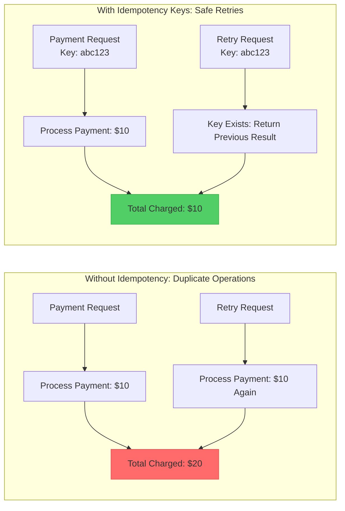
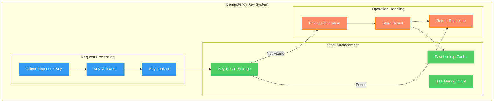
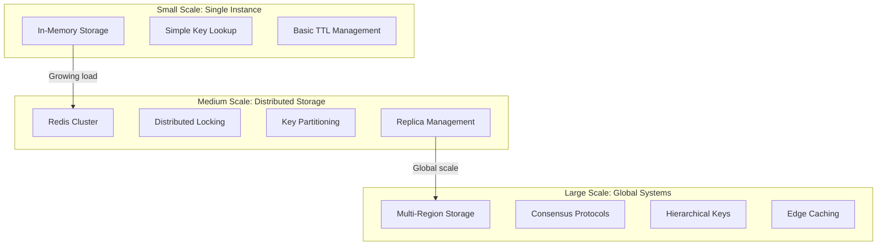
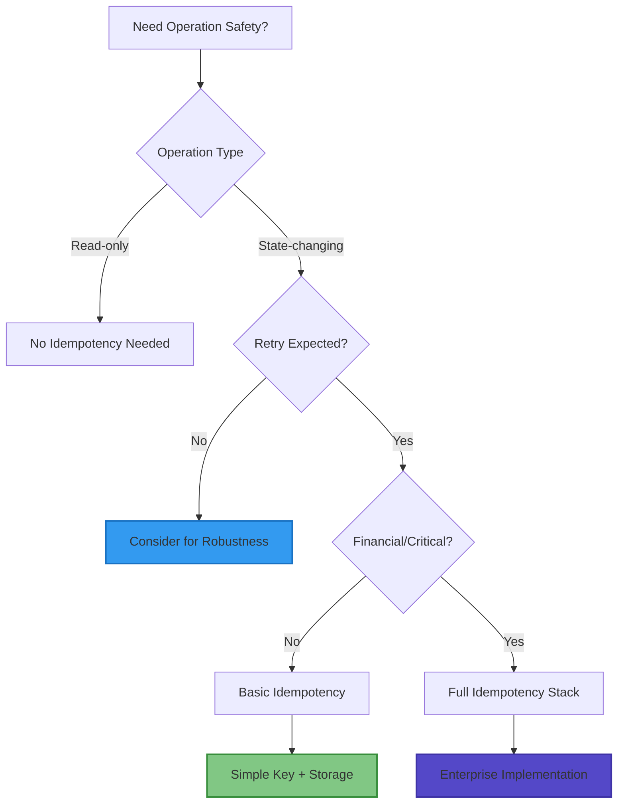

# Idempotency Keys

!!! success "🏆 Gold Standard Pattern"
    **Make operations retry-safe through intelligent deduplication** • Stripe, AWS, Square proven at massive scale
    
    The foundational safety pattern that prevents duplicate operations by using unique keys to track and deduplicate requests, enabling safe retries and robust error recovery.
    
    **Key Success Metrics:**
    - Stripe: Zero duplicate charges across billions of payment requests using idempotency keys
    - AWS: Safe resource creation retries across millions of API calls per second
    - Square: Guaranteed exactly-once payment processing for millions of daily transactions

## Essential Question

**How do we ensure operations can be safely retried multiple times without causing duplicate side effects or data corruption?**

## When to Use / When NOT to Use

### ✅ Use When

| Scenario | Example | Impact |
|----------|---------|--------|
| Financial operations | Payment processing, fund transfers | Prevents duplicate charges and financial errors |
| Resource creation | Creating users, orders, infrastructure | Avoids duplicate resources during retries |
| External API calls | Third-party integrations, webhooks | Safe retry behavior with external systems |
| Critical business operations | Order placement, inventory updates | Ensures data consistency and accuracy |

### ❌ DON'T Use When

| Scenario | Why | Alternative |
|----------|-----|-------------|
| Read-only operations | GET requests are naturally idempotent | Standard caching and retry logic |
| Simple increment operations | Counters that should accumulate | Event sourcing or atomic operations |
| High-frequency analytics | Metrics collection where duplication is acceptable | Deduplication in processing pipeline |
| Internal operations only | No external dependencies or retries | Transactional guarantees |

## Level 1: Intuition (5 min) {#intuition}

### The Story
Imagine you're at a coffee shop and your credit card payment fails due to a network glitch. You tap your card again - but what if the first payment actually went through? Without idempotency, you'd be charged twice. With idempotency keys, the system recognizes "I've already processed this exact transaction" and simply returns the result of the first payment, preventing double charges. This is exactly how financial systems work - every payment request includes a unique key that ensures it can only succeed once.

### Visual Metaphor


### Core Insight
> **Key Takeaway:** Unique operation keys transform dangerous duplicate operations into safe, predictable responses.

### In One Sentence
Idempotency keys ensure that performing the same operation multiple times with the same key produces the same result as performing it once, preventing duplicate side effects.

## Level 2: Foundation (10 min) {#foundation}

### The Problem Space

<div class="failure-vignette">
<h4>🚨 What Happens Without This Pattern</h4>

**GitHub, 2018**: A network timeout during a repository creation API call led to duplicate repositories being created when clients automatically retried. Without idempotency keys, retry logic created thousands of duplicate repos with similar names.

**Impact**: Data corruption, confused users, manual cleanup required for thousands of affected repositories
</div>

### How It Works

#### Architecture Overview


#### Key Components

| Component | Purpose | Responsibility |
|-----------|---------|----------------|
| Key Generator | Create unique identifiers | UUIDs, hashes, or client-provided tokens |
| Key Validator | Ensure key format correctness | Length, format, character validation |
| Storage Layer | Persist operation results | Fast lookup with TTL management |
| Concurrency Handler | Manage simultaneous requests | Prevent race conditions with same key |

### Basic Example

```python
import uuid
import time
import json
from typing import Dict, Any, Optional
from dataclasses import dataclass
from enum import Enum

class OperationStatus(Enum):
    PENDING = "pending"
    SUCCESS = "success"
    FAILED = "failed"

@dataclass
class IdempotencyRecord:
    key: str
    status: OperationStatus
    result: Optional[Dict[str, Any]]
    created_at: float
    ttl_seconds: int = 86400  # 24 hours default
    
    def is_expired(self) -> bool:
        return time.time() > (self.created_at + self.ttl_seconds)

class IdempotencyManager:
    def __init__(self):
        # In production, this would be Redis or a database
        self.storage: Dict[str, IdempotencyRecord] = {}
        
    def generate_key(self, operation_data: Dict[str, Any]) -> str:
        """Generate deterministic key from operation data"""
        # For client-provided keys, validate instead
        sorted_data = json.dumps(operation_data, sort_keys=True)
        return str(uuid.uuid5(uuid.NAMESPACE_OID, sorted_data))
        
    def validate_key(self, key: str) -> bool:
        """Validate idempotency key format"""
        if not key or len(key) < 10 or len(key) > 255:
            return False
        # Add more validation as needed
        return True
        
    def get_operation_result(self, key: str) -> Optional[IdempotencyRecord]:
        """Retrieve existing operation result"""
        if key not in self.storage:
            return None
            
        record = self.storage[key]
        if record.is_expired():
            del self.storage[key]
            return None
            
        return record
        
    def store_operation_result(self, 
                             key: str, 
                             status: OperationStatus,
                             result: Optional[Dict[str, Any]] = None) -> None:
        """Store operation result with idempotency key"""
        self.storage[key] = IdempotencyRecord(
            key=key,
            status=status,
            result=result,
            created_at=time.time()
        )

class IdempotentOperation:
    def __init__(self, idempotency_manager: IdempotencyManager):
        self.idempotency = idempotency_manager
        
    def execute_payment(self, payment_data: Dict[str, Any], idempotency_key: str) -> Dict[str, Any]:
        """Execute payment with idempotency protection"""
        
        # Validate the key
        if not self.idempotency.validate_key(idempotency_key):
            return {"error": "Invalid idempotency key", "status": 400}
            
        # Check if operation already executed
        existing = self.idempotency.get_operation_result(idempotency_key)
        if existing:
            if existing.status == OperationStatus.SUCCESS:
                return existing.result
            elif existing.status == OperationStatus.FAILED:
                return existing.result  # Return the same error
            # If PENDING, continue to process (handle concurrent requests)
            
        try:
            # Mark as pending
            self.idempotency.store_operation_result(
                idempotency_key, 
                OperationStatus.PENDING
            )
            
            # Process the payment
            result = self.process_payment(payment_data)
            
            # Store successful result
            self.idempotency.store_operation_result(
                idempotency_key,
                OperationStatus.SUCCESS,
                result
            )
            
            return result
            
        except Exception as e:
            # Store failure result
            error_result = {"error": str(e), "status": 500}
            self.idempotency.store_operation_result(
                idempotency_key,
                OperationStatus.FAILED,
                error_result
            )
            
            return error_result
            
    def process_payment(self, payment_data: Dict[str, Any]) -> Dict[str, Any]:
        """Simulate payment processing"""
        # In reality, this would call payment processor
        return {
            "transaction_id": str(uuid.uuid4()),
            "amount": payment_data["amount"],
            "status": "completed",
            "timestamp": time.time()
        }
```

## Level 3: Deep Dive (15 min) {#deep-dive}

### Implementation Details

#### Key Generation Strategies
```mermaid
graph TB
    subgraph "Key Generation Approaches"
        subgraph "Client-Provided"
            C1[UUID v4 (Random)]
            C2[Timestamp + Random]
            C3[Request Hash]
        end
        
        subgraph "Server-Generated" 
            S1[Deterministic Hash]
            S2[Content-based UUID]
            S3[Composite Key]
        end
        
        subgraph "Hybrid Approach"
            H1[Client UUID + Server Validation]
            H2[Hash Client Data + Timestamp]
        end
    end
    
    classDef client fill:#339af0,stroke:#1971c2,color:#fff
    classDef server fill:#51cf66,stroke:#37b24d,color:#fff
    classDef hybrid fill:#ff8c69,stroke:#fd7e14,color:#fff
    
    class C1,C2,C3 client
    class S1,S2,S3 server
    class H1,H2 hybrid
```

#### Critical Design Decisions

| Decision | Options | Trade-off | Recommendation |
|----------|---------|-----------|----------------|
| **Key Source** | Client-provided<br>Server-generated<br>Hybrid | Client: Simple, potential conflicts<br>Server: Complex, guaranteed unique<br>Hybrid: Balanced | **Client-provided with server validation** |
| **Storage Backend** | Memory<br>Database<br>Redis | Memory: Fast, not persistent<br>Database: Persistent, slower<br>Redis: Fast, persistent, scalable | **Redis for production systems** |
| **Key TTL** | 1 hour<br>24 hours<br>7 days | 1h: Lower storage, may lose retries<br>24h: Balanced<br>7d: High storage cost | **24-72 hours based on use case** |
| **Concurrency Handling** | Optimistic<br>Pessimistic<br>Cooperative | Optimistic: Fast, potential conflicts<br>Pessimistic: Safe, slower<br>Cooperative: Balanced | **Pessimistic for financial operations** |

### Common Pitfalls

<div class="decision-box">
<h4>⚠️ Avoid These Mistakes</h4>

1. **Insufficient Key Entropy**: Short keys cause collisions → Use UUIDs or high-entropy generation
2. **No TTL Management**: Storage grows infinitely → Implement appropriate cleanup policies
3. **Race Conditions**: Concurrent requests with same key cause issues → Use database locks or atomic operations
4. **Storing Large Responses**: Key storage becomes expensive → Store references or summaries for large results
5. **No Partial Failure Handling**: System state inconsistent after partial failures → Design for atomic operations or compensation
</div>

### Production Considerations

#### Idempotency Key Patterns by Operation Type

| Operation Type | Key Pattern | TTL | Storage | Concurrency Strategy |
|---------------|-------------|-----|---------|---------------------|
| **Payment Processing** | Client UUID | 72 hours | Redis + DB backup | Pessimistic locking |
| **Resource Creation** | Content hash | 24 hours | Database | Optimistic with retry |
| **API Webhooks** | Event ID + timestamp | 7 days | Redis | Cooperative processing |
| **File Uploads** | File hash + metadata | 1 hour | Memory + Redis | Pessimistic locking |
| **Order Processing** | Order data hash | 48 hours | Database | Database transactions |

#### Advanced Implementation with Redis
```python
import redis
import json
import uuid
import time
from typing import Dict, Any, Optional, Tuple

class RedisIdempotencyManager:
    def __init__(self, redis_client: redis.Redis):
        self.redis = redis_client
        self.default_ttl = 86400  # 24 hours
        
    def execute_with_idempotency(self,
                               key: str,
                               operation_func: callable,
                               operation_args: Tuple,
                               ttl: int = None) -> Tuple[Dict[str, Any], bool]:
        """Execute operation with idempotency protection"""
        
        ttl = ttl or self.default_ttl
        lock_key = f"lock:{key}"
        result_key = f"result:{key}"
        
        # Try to acquire distributed lock
        lock_acquired = self.redis.set(
            lock_key, 
            "locked", 
            nx=True,  # Only set if not exists
            ex=300    # Lock expires in 5 minutes
        )
        
        if not lock_acquired:
            # Another instance is processing, wait and check result
            time.sleep(0.1)
            existing_result = self.redis.get(result_key)
            if existing_result:
                return json.loads(existing_result), False  # Not processed by us
            else:
                # Still processing or failed
                raise Exception("Operation still processing or failed")
        
        try:
            # Check if result already exists (race condition protection)
            existing_result = self.redis.get(result_key)
            if existing_result:
                return json.loads(existing_result), False
                
            # Execute the operation
            result = operation_func(*operation_args)
            
            # Store result with TTL
            self.redis.setex(
                result_key,
                ttl,
                json.dumps(result)
            )
            
            return result, True  # We processed it
            
        finally:
            # Release the lock
            self.redis.delete(lock_key)
            
    def cleanup_expired_keys(self, batch_size: int = 1000) -> int:
        """Clean up expired idempotency keys"""
        cursor = 0
        deleted_count = 0
        
        while True:
            cursor, keys = self.redis.scan(
                cursor=cursor,
                match="result:*",
                count=batch_size
            )
            
            if keys:
                # Check TTL and delete expired keys
                for key in keys:
                    ttl = self.redis.ttl(key)
                    if ttl == -1:  # No expiry set, set one
                        self.redis.expire(key, self.default_ttl)
                    elif ttl == -2:  # Key doesn't exist
                        deleted_count += 1
                        
            if cursor == 0:
                break
                
        return deleted_count
```

## Level 4: Expert (20 min) {#expert}

### Advanced Techniques

#### 1. Distributed Idempotency with Consensus
```python
class DistributedIdempotencyManager:
    def __init__(self, nodes: List[str]):
        self.nodes = nodes
        self.quorum_size = len(nodes) // 2 + 1
        
    async def distributed_execute(self, 
                                key: str, 
                                operation: callable) -> Dict[str, Any]:
        """Execute with distributed consensus on idempotency"""
        
        # Phase 1: Check existing results across nodes
        existing_results = await self.check_existing_across_nodes(key)
        
        if len(existing_results) >= self.quorum_size:
            # Quorum agrees on existing result
            return self.resolve_consensus(existing_results)
            
        # Phase 2: Attempt to acquire distributed lock
        lock_acquired = await self.acquire_distributed_lock(key)
        
        if not lock_acquired:
            # Another node is processing, wait for result
            return await self.wait_for_result(key)
            
        try:
            # Execute operation
            result = await operation()
            
            # Phase 3: Replicate result to quorum
            await self.replicate_result(key, result)
            
            return result
            
        finally:
            await self.release_distributed_lock(key)
```

#### 2. Hierarchical Idempotency Keys
```python
class HierarchicalIdempotencyManager:
    """Handle complex operations with nested idempotency requirements"""
    
    def __init__(self, storage):
        self.storage = storage
        
    def create_hierarchical_key(self, 
                               parent_operation: str,
                               sub_operation: str, 
                               operation_data: Dict[str, Any]) -> str:
        """Create nested idempotency key"""
        data_hash = hashlib.sha256(
            json.dumps(operation_data, sort_keys=True).encode()
        ).hexdigest()[:16]
        
        return f"{parent_operation}:{sub_operation}:{data_hash}"
        
    async def execute_complex_operation(self, 
                                      parent_key: str,
                                      sub_operations: List[Dict[str, Any]]) -> Dict[str, Any]:
        """Execute complex operation with sub-operation idempotency"""
        
        results = {}
        
        for sub_op in sub_operations:
            sub_key = self.create_hierarchical_key(
                parent_key, 
                sub_op['name'], 
                sub_op['data']
            )
            
            # Each sub-operation is individually idempotent
            result = await self.execute_with_idempotency(
                sub_key, 
                sub_op['function'], 
                sub_op['args']
            )
            
            results[sub_op['name']] = result
            
        return results
```

#### 3. Conditional Idempotency
```python
class ConditionalIdempotencyManager:
    """Handle operations with conditional execution requirements"""
    
    def __init__(self, storage):
        self.storage = storage
        
    async def execute_if_changed(self,
                               key: str,
                               operation: callable,
                               condition_data: Dict[str, Any],
                               operation_data: Dict[str, Any]) -> Dict[str, Any]:
        """Execute only if conditions have changed since last execution"""
        
        # Create condition-aware key
        condition_hash = hashlib.sha256(
            json.dumps(condition_data, sort_keys=True).encode()
        ).hexdigest()
        
        conditional_key = f"{key}:condition:{condition_hash}"
        
        # Check if operation with these conditions already executed
        existing = await self.storage.get(conditional_key)
        if existing:
            return existing
            
        # Execute operation
        result = await operation(operation_data)
        
        # Store result with conditional key
        await self.storage.set(conditional_key, result, ttl=86400)
        
        return result
```

### Scaling Considerations



### Monitoring & Observability

#### Key Metrics to Track

| Metric | Alert Threshold | Dashboard Panel | Purpose |
|--------|----------------|-----------------|---------|
| **Key Collision Rate** | >0.1% per million requests | Time series with collision types | Validate key generation quality |
| **Cache Hit Rate** | <80% for existing operations | Hit/miss ratio by operation type | Measure idempotency effectiveness |
| **Key Storage Size** | >10GB or >1M keys | Storage growth trending | Capacity planning |
| **Lock Contention** | >100ms average lock wait | Lock wait time distribution | Performance optimization |

#### Advanced Monitoring Implementation
```python
class IdempotencyMetrics:
    def __init__(self, metrics_client):
        self.metrics = metrics_client
        
    def record_key_operation(self, 
                           operation_type: str,
                           key: str, 
                           was_duplicate: bool,
                           processing_time_ms: float):
        
        self.metrics.increment(
            'idempotency.operations',
            tags={
                'operation_type': operation_type,
                'duplicate': str(was_duplicate)
            }
        )
        
        self.metrics.histogram(
            'idempotency.processing_time',
            processing_time_ms,
            tags={'operation_type': operation_type}
        )
        
    def record_key_collision(self, key_pattern: str):
        """Record potential key collision for analysis"""
        self.metrics.increment(
            'idempotency.collisions',
            tags={'key_pattern': key_pattern}
        )
        
    def record_storage_metrics(self, 
                             total_keys: int,
                             total_size_bytes: int,
                             avg_ttl_hours: float):
        
        self.metrics.gauge('idempotency.total_keys', total_keys)
        self.metrics.gauge('idempotency.storage_size_bytes', total_size_bytes)
        self.metrics.gauge('idempotency.avg_ttl_hours', avg_ttl_hours)
```

## Level 5: Mastery (30 min) {#mastery}

### Real-World Case Studies

#### Case Study 1: Stripe's Payment Idempotency

<div class="truth-box">
<h4>💡 Production Insights from Stripe</h4>

**Challenge**: Handle billions of payment requests without duplicate charges during network failures and retries

**Implementation**:
- Client-provided UUIDs with server validation
- 24-hour TTL for payment operations
- Database storage with Redis caching layer
- Hierarchical keys for complex multi-step payments

**Results**:
- **Zero duplicate charges**: Across billions of payment requests
- **99.99% success rate**: For retry scenarios with idempotency keys  
- **<5ms overhead**: Added latency for idempotency check
- **95% client adoption**: Of idempotency keys in payment API calls

**Lessons Learned**: Client education about idempotency key usage is as important as technical implementation
</div>

#### Case Study 2: AWS Resource Creation APIs

<div class="truth-box">
<h4>💡 Production Insights from AWS</h4>

**Challenge**: Ensure safe retries for resource creation across hundreds of AWS services

**Implementation**:
- ClientRequestToken parameter for all creation APIs
- Service-specific key validation and storage
- Integration with CloudFormation for stack-level idempotency
- Cross-region replication for global key consistency

**Results**:
- **Millions of safe retries**: Daily across all AWS services
- **<0.01% duplicate resources**: Created due to implementation errors
- **15-minute standard TTL**: Balances storage cost with retry window
- **Universal adoption**: Across all AWS resource creation APIs

**Lessons Learned**: Consistent implementation across services requires strong architectural governance and tooling
</div>

### Pattern Evolution

#### Historical Development


#### Future Directions

| Trend | Impact on Pattern | Adaptation Strategy |
|-------|------------------|-------------------|
| **Serverless Computing** | Function-level idempotency needs | Event source integration with built-in deduplication |
| **Edge Computing** | Regional idempotency requirements | Hierarchical keys with regional prefixes |
| **Blockchain Integration** | Immutable operation records | Blockchain-backed idempotency verification |
| **AI/ML Operations** | Model inference idempotency | Content-based keys for deterministic results |

### Pattern Combinations

#### Works Well With

| Pattern | Combination Benefit | Integration Point |
|---------|-------------------|------------------|
| **Retry with Backoff** | Safe automatic retry behavior | Include idempotency key in all retries |
| **Circuit Breaker** | Prevents unnecessary idempotency checks | Skip key lookup when circuit is open |
| **Event Sourcing** | Immutable event deduplication | Event ID as natural idempotency key |
| **Saga Pattern** | Safe compensation actions | Step-level idempotency within sagas |
| **API Gateway** | Centralized key validation | Gateway-level key generation and validation |

#### Enterprise Integration Example
```python
class EnterpriseIdempotencyStack:
    def __init__(self):
        self.idempotency = RedisIdempotencyManager(redis_client)
        self.circuit_breaker = CircuitBreaker()
        self.retry_handler = RetryHandler()
        self.event_sourcing = EventStore()
        
    async def execute_business_operation(self, 
                                       operation_request: BusinessRequest) -> BusinessResult:
        
        # Generate or extract idempotency key
        idempotency_key = operation_request.idempotency_key or \
                         self.generate_deterministic_key(operation_request)
        
        # Execute with full resilience stack
        return await self.retry_handler.execute_with_retry(
            lambda: self.idempotency.execute_with_idempotency(
                idempotency_key,
                self.process_with_circuit_protection,
                (operation_request,)
            )
        )
        
    async def process_with_circuit_protection(self, request: BusinessRequest) -> BusinessResult:
        if self.circuit_breaker.is_open():
            return self.create_fallback_response(request)
            
        try:
            # Process business operation
            result = await self.business_logic.process(request)
            
            # Store event for audit trail
            await self.event_sourcing.store_event(
                event_type="operation_completed",
                event_data={"request": request, "result": result},
                idempotency_key=request.idempotency_key
            )
            
            self.circuit_breaker.record_success()
            return result
            
        except Exception as e:
            self.circuit_breaker.record_failure()
            raise
```

## Quick Reference

### Decision Matrix



### Comparison with Alternatives

| Aspect | Idempotency Keys | Database Transactions | Event Sourcing | Message Deduplication |
|--------|------------------|----------------------|-----------------|----------------------|
| **Scope** | API/Application level | Database level | System-wide | Message level |
| **Performance** | Medium (key lookup) | High (ACID overhead) | Medium (event store) | Low (message check) |
| **Complexity** | Medium | Low | High | Low |
| **Retry Safety** | Excellent | Good | Excellent | Good |
| **Cross-System** | Excellent | Poor | Excellent | Limited |
| **When to use** | API operations | Single DB transactions | Complex workflows | Message processing |

### Implementation Checklist

**Pre-Implementation**
- [ ] Identified all state-changing operations requiring idempotency
- [ ] Designed key generation strategy (client vs server generated)
- [ ] Chosen appropriate storage backend (Redis, database, etc.)
- [ ] Planned key lifecycle management and TTL policies

**Implementation**
- [ ] Implemented key validation and error handling
- [ ] Added concurrency protection for same-key requests
- [ ] Created monitoring for key usage patterns and collisions
- [ ] Integrated with existing retry and circuit breaker patterns

**Post-Implementation**
- [ ] Validated idempotency behavior through failure testing
- [ ] Tuned TTL and storage parameters based on usage patterns  
- [ ] Established key cleanup and storage management processes
- [ ] Documented API usage guidelines for development teams

### Related Resources

<div class="grid cards" markdown>

- :material-book-open-variant:{ .lg .middle } **Related Patterns**
    
    ---
    
    - [Retry with Backoff](../resilience/retry-backoff.md) - Safe retry implementation
    - [Event Sourcing](./event-sourcing.md) - Immutable event deduplication
    - [Saga Pattern](./saga.md) - Step-level idempotency
    - [API Gateway](../communication/api-gateway.md) - Centralized key handling

- :material-flask:{ .lg .middle } **Fundamental Laws**
    
    ---
    
    - [State Management Law](../laws/state-management.md) - Managing operation state
    - [Asynchronous Reality Law](../laws/asynchronous-reality.md) - Timing and concurrency
    - [Correlated Failure Law](../laws/correlated-failure.md) - Preventing duplicate failures

- :material-pillar:{ .lg .middle } **Foundational Pillars**
    
    ---
    
    - [State Pillar](../pillars/state.md) - Managing operation state consistency
    - [Truth Pillar](../pillars/truth.md) - Single source of truth for operations
    - [Control Pillar](../pillars/control.md) - Controlling operation execution

- :material-tools:{ .lg .middle } **Implementation Guides**
    
    ---
    
    - Stripe API Idempotency Implementation
    - Redis-based Idempotency Setup Guide
    - Key Generation Best Practices

</div>