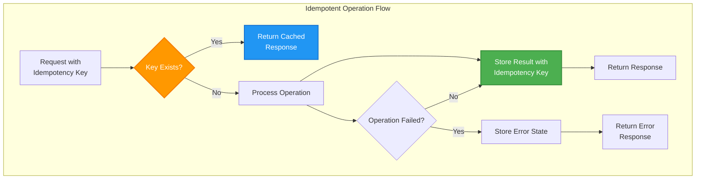

## The Complete Blueprint

Idempotency is the **retry safety mechanism** that transforms potentially dangerous duplicate operations into safe, predictable outcomes. This pattern ensures that **performing an operation multiple times produces the same result as performing it once**, enabling robust retry logic, network failure recovery, and reliable distributed system behavior. In a world where networks fail, timeouts occur, and systems restart unexpectedly, idempotency provides the foundation for building resilient operations that can be safely retried without corrupting system state.

<details>
<summary>📄 View Complete Idempotency Implementation (14 lines)</summary>



</details>

This blueprint demonstrates **idempotency key management** for operation deduplication, **result caching** for consistent responses, and **state preservation** that handles both successful operations and failure scenarios safely.

### What You'll Master

- **Idempotency Key Design**: Implement robust key generation strategies using UUIDs, deterministic hashing, and client-provided tokens for operation deduplication
- **State Management**: Design systems that safely handle partial failures, ensuring operations can be retried without data corruption or inconsistent state
- **Result Caching**: Build efficient storage mechanisms for operation outcomes that provide fast lookup and appropriate TTL management
- **Distributed Coordination**: Handle idempotency across multiple services and databases using distributed locking and consensus protocols
- **Performance Optimization**: Balance safety with performance through intelligent caching strategies, async processing, and selective idempotency application

# Idempotency

!!! info "Pattern Overview"
    **Category**: data-management  
    **Complexity**: Medium  
    **Use Cases**: distributed systems, API design, payment processing

## Problem

Network failures and retries can cause duplicate operations, leading to incorrect system state. APIs and distributed operations must handle retries safely without unintended side effects.

## Solution

Idempotency ensures operations produce the same result when executed multiple times. This is achieved through idempotency keys, deduplication, and state checking mechanisms.

## Implementation

```python
## Example implementation
class IdempotencyManager:
    def __init__(self):
        pass
    
    def execute(self):
        # Implementation details
        pass
```

## Trade-offs

**Pros:**
- Provides safe retry semantics
- Enables consistent system state
- Improves network fault tolerance

**Cons:**
- Increases additional storage requirements
- Requires implementation complexity
- May impact performance overhead

## When to Use

- When you need payment systems
- For systems that require distributed APIs
- In scenarios with retry-prone operations

## Related Patterns

- [Pattern 1](../related-pattern-1.md) - Complementary pattern
- [Pattern 2](../related-pattern-2.md) - Alternative approach
- [Pattern 3](../related-pattern-3.md) - Building block pattern

## References

- [External Resource 1](#)
- [External Resource 2](#)
- [Case Study Example](../../architects-handbook/case-studies/example.md)
