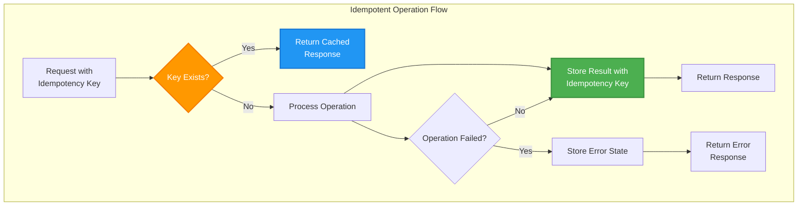

## The Complete Blueprint

Idempotency is the **retry safety mechanism** that transforms potentially dangerous duplicate operations into safe, predictable outcomes. This pattern ensures that **performing an operation multiple times produces the same result as performing it once**, enabling robust retry logic, network failure recovery, and reliable distributed system behavior. In a world where networks fail, timeouts occur, and systems restart unexpectedly, idempotency provides the foundation for building resilient operations that can be safely retried without corrupting system state.

<details>
<summary>📄 View Complete Idempotency Implementation (14 lines)</summary>



</details>

This blueprint demonstrates **idempotency key management** for operation deduplication, **result caching** for consistent responses, and **state preservation** that handles both successful operations and failure scenarios safely.

### What You'll Master

- **Idempotency Key Design**: Implement robust key generation strategies using UUIDs, deterministic hashing, and client-provided tokens for operation deduplication
- **State Management**: Design systems that safely handle partial failures, ensuring operations can be retried without data corruption or inconsistent state
- **Result Caching**: Build efficient storage mechanisms for operation outcomes that provide fast lookup and appropriate TTL management
- **Distributed Coordination**: Handle idempotency across multiple services and databases using distributed locking and consensus protocols
- **Performance Optimization**: Balance safety with performance through intelligent caching strategies, async processing, and selective idempotency application

# Idempotency

!!! info "Pattern Overview"
    **Category**: data-management  
    **Complexity**: Medium  
    **Use Cases**: distributed systems, API design, payment processing

## Problem

Network failures and retries can cause duplicate operations, leading to incorrect system state. APIs and distributed operations must handle retries safely without unintended side effects.

## Solution

Idempotency ensures operations produce the same result when executed multiple times. This is achieved through idempotency keys, deduplication, and state checking mechanisms.

## Implementation

### Core Implementation

```python
import hashlib
import json
from datetime import datetime, timedelta
from typing import Optional, Dict, Any
import redis
import uuid

class IdempotencyManager:
    """Production-grade idempotency manager for distributed operations"""
    
    def __init__(self, redis_client: redis.Redis, ttl_seconds: int = 3600):
        self.redis = redis_client
        self.ttl = ttl_seconds
    
    def generate_key(self, operation: str, parameters: Dict[str, Any], user_id: str = None) -> str:
        """Generate deterministic idempotency key from operation parameters"""
        key_data = {
            'operation': operation,
            'parameters': parameters,
            'user_id': user_id or 'anonymous'
        }
        
        # Create deterministic hash
        key_string = json.dumps(key_data, sort_keys=True)
        key_hash = hashlib.sha256(key_string.encode()).hexdigest()[:16]
        
        return f"idem:{operation}:{key_hash}"
    
    def execute(self, idempotency_key: str, operation_func, *args, **kwargs) -> Any:
        """Execute operation with idempotency guarantees"""
        
        # Check if operation already completed
        cached_result = self.redis.get(idempotency_key)
        if cached_result:
            result = json.loads(cached_result)
            if result['status'] == 'success':
                return result['data']
            elif result['status'] == 'error':
                raise Exception(result['error'])
        
        # Set processing marker to prevent concurrent execution
        processing_key = f"{idempotency_key}:processing"
        if not self.redis.set(processing_key, "1", ex=300, nx=True):
            # Another process is handling this request
            raise Exception("Operation already in progress")
        
        try:
            # Execute the operation
            result = operation_func(*args, **kwargs)
            
            # Store successful result
            self.redis.setex(
                idempotency_key, 
                self.ttl,
                json.dumps({
                    'status': 'success', 
                    'data': result,
                    'timestamp': datetime.utcnow().isoformat()
                })
            )
            
            return result
            
        except Exception as e:
            # Store error result
            self.redis.setex(
                idempotency_key,
                self.ttl, 
                json.dumps({
                    'status': 'error',
                    'error': str(e),
                    'timestamp': datetime.utcnow().isoformat()
                })
            )
            raise
        
        finally:
            # Remove processing marker
            self.redis.delete(processing_key)

# Payment processing example with idempotency
class PaymentProcessor:
    def __init__(self, idempotency_manager: IdempotencyManager):
        self.idem = idempotency_manager
    
    def process_payment(self, payment_request: Dict[str, Any]) -> Dict[str, Any]:
        """Process payment with automatic idempotency"""
        
        # Generate idempotency key from payment details
        idem_key = self.idem.generate_key(
            operation='process_payment',
            parameters={
                'amount': payment_request['amount'],
                'currency': payment_request['currency'], 
                'merchant_id': payment_request['merchant_id'],
                'payment_method': payment_request['payment_method']
            },
            user_id=payment_request.get('user_id')
        )
        
        def execute_payment():
            # Simulate payment processing
            transaction_id = str(uuid.uuid4())
            
            # Actual payment processing logic here
            # This would integrate with payment gateways, update balances, etc.
            
            return {
                'transaction_id': transaction_id,
                'amount': payment_request['amount'],
                'status': 'completed',
                'timestamp': datetime.utcnow().isoformat()
            }
        
        return self.idem.execute(idem_key, execute_payment)
```

### Database-Level Idempotency

```sql
-- Idempotent payment processing with database constraints
CREATE TABLE payments (
    idempotency_key VARCHAR(64) PRIMARY KEY,
    transaction_id UUID NOT NULL DEFAULT gen_random_uuid(),
    user_id UUID NOT NULL,
    amount DECIMAL(10,2) NOT NULL,
    currency CHAR(3) NOT NULL,
    status VARCHAR(20) NOT NULL DEFAULT 'pending',
    created_at TIMESTAMP DEFAULT CURRENT_TIMESTAMP,
    updated_at TIMESTAMP DEFAULT CURRENT_TIMESTAMP
);

-- Idempotent insert operation
INSERT INTO payments (idempotency_key, user_id, amount, currency, status)
VALUES ($1, $2, $3, $4, 'completed')
ON CONFLICT (idempotency_key) 
DO UPDATE SET 
    updated_at = CURRENT_TIMESTAMP
RETURNING transaction_id, status, created_at;
```

## Trade-offs

**Pros:**
- Provides safe retry semantics
- Enables consistent system state
- Improves network fault tolerance

**Cons:**
- Increases additional storage requirements
- Requires implementation complexity
- May impact performance overhead

## When to Use

- When you need payment systems
- For systems that require distributed APIs
- In scenarios with retry-prone operations

## Related Patterns

- [Outbox Pattern](outbox.md) - Ensures transactional consistency when publishing events, leveraging idempotency for safe retry
- [Saga Pattern](../coordination/saga.md) - Uses idempotent operations to safely retry individual saga steps during distributed transactions
- [Circuit Breaker](../resilience/circuit-breaker.md) - Combines with idempotency to provide safe retry logic when services recover from failures
- [At-Least-Once Delivery](eventual-consistency.md) - Relies on idempotent consumers to handle message duplication gracefully

## Real-World Examples

### Stripe Payment Processing
Stripe's API requires idempotency keys for all state-changing operations:
- Payment requests use client-generated UUIDs as idempotency keys
- Duplicate requests within 24 hours return cached responses
- Prevents double-charging even during network failures

### AWS API Design
AWS services use idempotency tokens for operations like:
- EC2 instance creation (ClientToken parameter)
- CloudFormation stack operations 
- Lambda function updates with VersionId

## References

- [Stripe API Idempotency Documentation](https://stripe.com/docs/api/idempotent_requests)
- [AWS API Idempotency Best Practices](https://docs.aws.amazon.com/AWSEC2/latest/APIReference/Run_Instance_Idempotency.html)
- [REST API Idempotency Patterns (RFC 7231)](https://tools.ietf.org/html/rfc7231#section-4.2.2)
