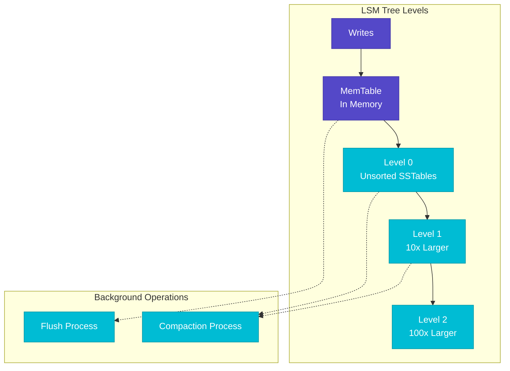
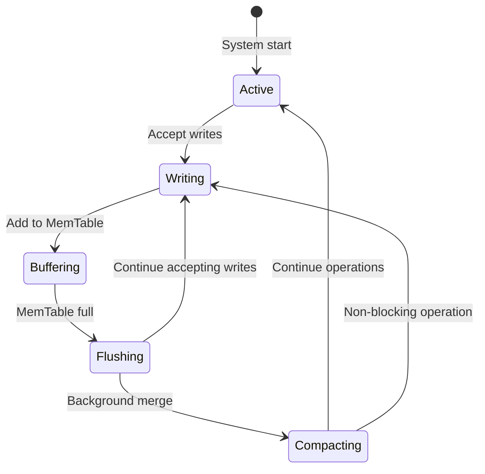
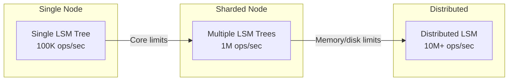
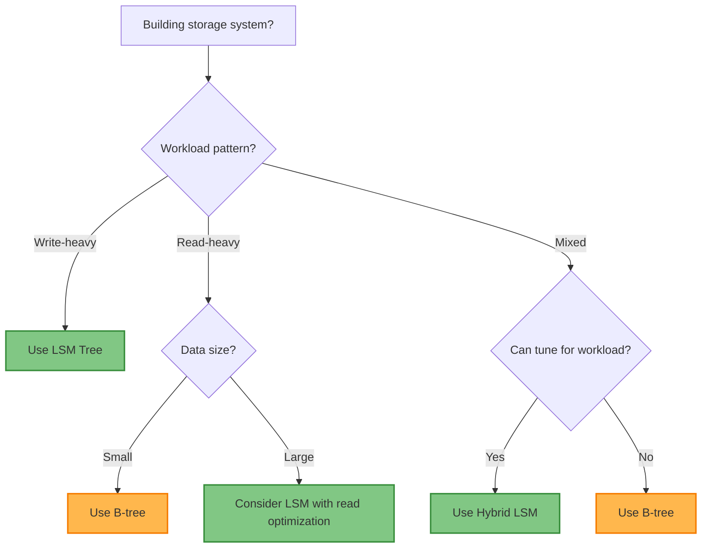

# LSM Tree (Log-Structured Merge Tree)

!!! info "🥈 Silver Tier Pattern"
    **Write-Optimized Storage Specialist** • For database engine builders
    
    LSM trees are fundamental to modern write-heavy storage systems but require deep storage engine expertise. Critical for database implementers, valuable for understanding modern database internals.
    
    **Best For:** Database/storage engine development, write-heavy systems, time-series storage

## Essential Question

**How can we optimize write performance by converting random writes to sequential writes?**

## When to Use / When NOT to Use

### ✅ Use When

| Scenario | Example | Impact |
|----------|---------|--------|
| Building write-heavy databases | Time-series databases | 10-100x write throughput improvement |
| Log processing systems | Event stream storage | Sequential I/O matches write patterns |
| Key-value storage engines | Embedded databases | Efficient storage with good compression |
| SSD-optimized systems | Modern storage hardware | Minimizes write amplification |

### ❌ DON'T Use When

| Scenario | Why | Alternative |
|----------|-----|-------------|
| Application-level development | Database handles storage | Use existing LSM-based databases |
| Read-heavy workloads | Read amplification penalty | B-tree based storage engines |
| Small datasets | Memory complexity overhead | In-memory structures |
| Consistent read latency needed | Variable read performance | Traditional RDBMS engines |

## Level 1: Intuition (5 min) {#intuition}

### The Story
Imagine organizing papers on your desk. Instead of filing each paper immediately (random writes), you stack them in order on your desk (MemTable), then periodically file entire stacks into organized folders (SSTables). This batching makes the overall process much faster.

### Visual Metaphor


### Core Insight
> **Key Takeaway:** Buffer writes in memory and batch them to disk sequentially - trading read complexity for write performance.

### In One Sentence
LSM trees achieve high write throughput by buffering writes in memory, flushing to sorted disk files, and periodically merging files to maintain query performance.

## Level 2: Foundation (10 min) {#foundation}

### The Problem Space

<div class="failure-vignette">
<h4>🚨 What Happens Without This Pattern</h4>

**Time-Series DB Co, 2018**: Used B-tree storage for IoT sensor data, achieving only 1K writes/sec due to random I/O patterns and constant tree rebalancing.

**Impact**: Couldn't handle sensor data volume, 99.9% CPU on I/O waits, required 50x hardware scaling
</div>

### How It Works

#### Architecture Overview


#### Key Components

| Component | Purpose | Responsibility |
|-----------|---------|----------------|
| **MemTable** | Buffer writes in memory | Fast writes, sorted structure |
| **WAL** | Ensure durability | Crash recovery for MemTable |
| **SSTables** | Immutable sorted files | Persistent storage |
| **Compaction** | Merge and cleanup | Maintain read performance |

### Basic Example

```python
class SimpleLSM:
    def __init__(self):
        self.memtable = {}  # In practice: skip list or B-tree
        self.wal = WriteAheadLog()
        self.sstables = []
        self.memtable_limit = 1024 * 1024  # 1MB
    
    def put(self, key, value):
        # Write to WAL for durability
        self.wal.append(f"PUT {key} {value}")
        
        # Add to MemTable
        self.memtable[key] = value
        
        # Check if flush needed
        if self.memtable_size() > self.memtable_limit:
            self.flush_memtable()
    
    def get(self, key):
        # Check MemTable first (newest data)
        if key in self.memtable:
            return self.memtable[key]
        
        # Check SSTables from newest to oldest
        for sstable in reversed(self.sstables):
            value = sstable.get(key)
            if value is not None:
                return value
        
        return None  # Not found
    
    def flush_memtable(self):
        # Create new SSTable from MemTable
        sstable = SSTable.from_dict(self.memtable)
        self.sstables.append(sstable)
        self.memtable.clear()
```

## Level 3: Deep Dive (15 min) {#deep-dive}

### Implementation Details

#### State Management


#### Critical Design Decisions

| Decision | Options | Trade-off | Recommendation |
|----------|---------|-----------|----------------|
| **MemTable Structure** | Skip List vs B-tree | Skip List: Concurrent, complex<br>B-tree: Simple, locks | Skip list for production |
| **Compaction Strategy** | Size-tiered vs Leveled | Size-tiered: Write-optimized<br>Leveled: Read-optimized | Match workload characteristics |
| **Level Multiplier** | 2x vs 10x | 2x: More levels, less space<br>10x: Fewer levels, more space | 10x for most workloads |

### Common Pitfalls

<div class="decision-box">
<h4>⚠️ Avoid These Mistakes</h4>

1. **Write stalls**: Compaction can't keep up with writes → Monitor compaction lag and tune thread counts
2. **Tombstone accumulation**: Deleted keys consume space → Implement proper tombstone compaction
3. **Read amplification explosion**: Too many levels → Balance write throughput vs read performance
</div>

### Production Considerations

#### Performance Characteristics

| Metric | Typical Range | Optimization Target |
|--------|---------------|-------------------|
| Write Throughput | 10K-1M ops/sec | Maximize sequential I/O |
| Read Latency | 1-10ms | Minimize level checks with bloom filters |
| Write Amplification | 2-10x | Tune compaction frequency |
| Space Amplification | 1.1-2x | Choose appropriate compaction strategy |

## Level 4: Expert (20 min) {#expert}

### Advanced Techniques

#### Optimization Strategies

1. **Tiered + Leveled Hybrid**
   - When to apply: Mixed read/write workloads
   - Impact: Balance write throughput with read performance
   - Trade-off: Increased compaction complexity

2. **Partitioned Compaction**
   - When to apply: Very large datasets with hot/cold data
   - Impact: Reduce compaction overhead on cold data
   - Trade-off: More complex space management

### Scaling Considerations



### Monitoring & Observability

#### Key Metrics to Track

| Metric | Alert Threshold | Dashboard Panel |
|--------|----------------|-----------------|
| **Write Stall Rate** | >1% of operations | Histogram of stall durations |
| **Compaction Lag** | >500MB backlog | Queue depth over time |
| **Read Amplification** | >10 file checks/read | Average files checked per read |
| **Space Amplification** | >3x logical size | Disk usage vs logical data size |

## Level 5: Mastery (30 min) {#mastery}

### Real-World Case Studies

#### Case Study 1: RocksDB at Facebook

<div class="truth-box">
<h4>💡 Production Insights from RocksDB</h4>

**Challenge**: Scale write-heavy social media workloads across thousands of services

**Implementation**: Pluggable compaction strategies, column families, and extensive tuning options

**Results**: 
- **Write Throughput**: 1M+ operations/second per instance
- **Read Performance**: Sub-millisecond p99 with proper tuning
- **Resource Efficiency**: 10x better write throughput than B-tree alternatives

**Lessons Learned**: LSM tuning is critical - default parameters rarely optimal; bloom filters essential for read performance; compaction strategy must match workload
</div>

### Pattern Evolution

#### Migration from Legacy


#### Future Directions

| Trend | Impact on Pattern | Adaptation Strategy |
|-------|------------------|-------------------|
| **NVMe/Persistent Memory** | Faster random I/O | Reduce batching, more frequent flushes |
| **Computational Storage** | Processing near data | Push compaction to storage devices |
| **Cloud Object Storage** | Infinite capacity | Adapt compaction for object store semantics |

### Pattern Combinations

#### Works Well With

| Pattern | Combination Benefit | Integration Point |
|---------|-------------------|------------------|
| **Write-Ahead Log** | Durability for MemTable | WAL provides crash recovery |
| **Bloom Filters** | Read optimization | Filter SSTables before disk access |
| **Consistent Hashing** | Distributed LSM trees | Partition keys across LSM instances |

## Quick Reference

### Decision Matrix



### Comparison with Alternatives

| Aspect | LSM Tree | B-tree | Hash Table | Log Only |
|--------|----------|--------|------------|----------|
| **Write Performance** | Excellent | Good | Excellent | Excellent |
| **Read Performance** | Variable | Consistent | Excellent | Poor |
| **Range Queries** | Good | Excellent | Poor | Poor |
| **Storage Efficiency** | Good | Fair | Fair | Poor |
| **Use Case** | Write-heavy | Balanced | Point lookups | Append-only |

### Implementation Checklist

**Pre-Implementation**
- [ ] Analyzed write/read patterns and requirements
- [ ] Selected appropriate compaction strategy
- [ ] Designed MemTable structure for concurrency needs
- [ ] Planned bloom filter and caching strategies

**Implementation**
- [ ] Built MemTable with efficient concurrent structure
- [ ] Implemented WAL for durability guarantees
- [ ] Created SSTable format with index and bloom filters
- [ ] Added background compaction with proper throttling

**Post-Implementation**
- [ ] Tuned level sizes and compaction triggers for workload
- [ ] Implemented comprehensive monitoring and alerting
- [ ] Load tested with realistic data patterns
- [ ] Documented operational procedures and tuning guides

### Related Resources

<div class="grid cards" markdown>

- :material-book-open-variant:{ .lg .middle } **Related Patterns**
    
    ---
    
    - [Write-Ahead Log](../data-management/write-ahead-log.md) - Essential for LSM durability
    - [Bloom Filter](../data-management/bloom-filter.md) - Critical for read optimization
    - [Consistent Hashing](../data-management/consistent-hashing.md) - Distributed LSM trees

- :material-flask:{ .lg .middle } **Fundamental Laws**
    
    ---
    
    - [Law 4: Multi-dimensional Optimization](../../part1-axioms/law4-optimization/) - Write vs read performance trade-offs
    - [Law 7: Economic Reality](../../part1-axioms/law7-economics/) - Hardware cost optimization

- :material-pillar:{ .lg .middle } **Foundational Pillars**
    
    ---
    
    - [State Distribution](../../part2-pillars/state/) - Efficient state storage
    - [Work Distribution](../../part2-pillars/work/) - Background compaction processes

- :material-tools:{ .lg .middle } **Implementation Guides**
    
    ---
    
    - [LSM Tuning Guide](../../excellence/guides/lsm-tuning.md)
    - [Storage Engine Design](../../excellence/guides/storage-engines.md)
    - [Performance Monitoring](../../excellence/guides/storage-monitoring.md)

</div>