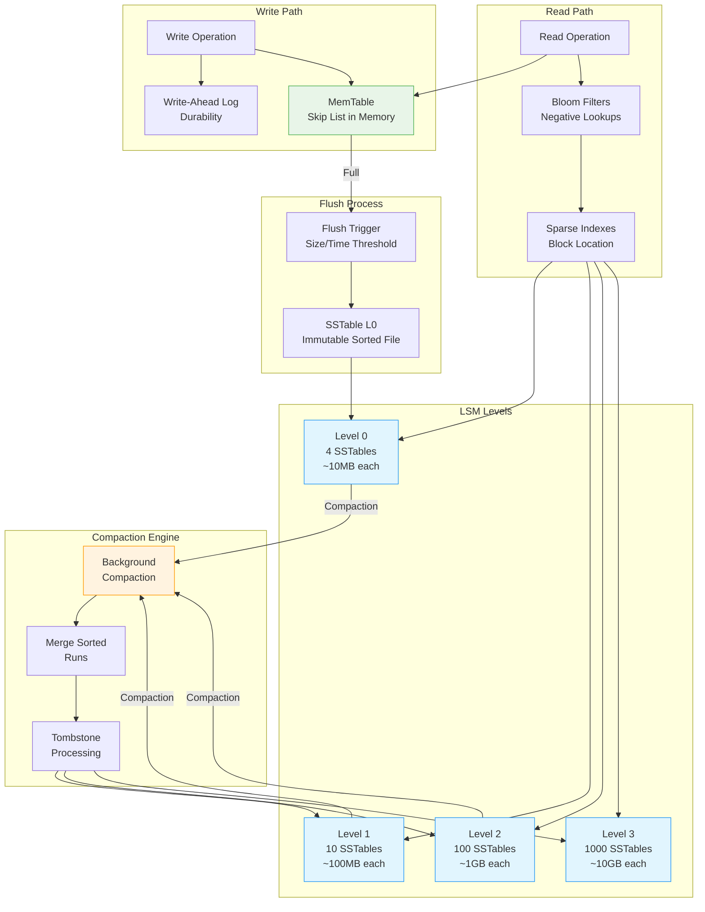

## The Complete Blueprint

LSM Tree (Log-Structured Merge Tree) is a write-optimized storage engine architecture that transforms random write operations into sequential writes by buffering data in memory and periodically flushing sorted runs to disk-based immutable files called SSTables. This pattern solves the fundamental I/O performance challenge where random disk writes are orders of magnitude slower than sequential writes, making it ideal for write-heavy workloads. The LSM tree operates through a multi-level hierarchy: writes first go to a memory-resident MemTable (typically implemented as a skip list), which provides fast insertion and maintains sorted order. When the MemTable reaches capacity, it's flushed to disk as an immutable SSTable file. Background compaction processes periodically merge multiple SSTables from lower levels into fewer, larger SSTables at higher levels, maintaining data organization and enabling efficient reads through bloom filters and sparse indexes. This architecture powers many modern databases including RocksDB, Cassandra, and HBase, trading read complexity for exceptional write throughput and efficient use of sequential I/O patterns.

### What You'll Master

By implementing LSM trees, you'll achieve **write throughput optimization** that converts expensive random I/O into efficient sequential writes, **storage efficiency** through natural data compression and deduplication during compaction, **scalable architecture** that handles massive write workloads by distributing I/O over time through background processes, **modern database internals understanding** that underlies systems like RocksDB and Cassandra, and **performance tuning expertise** in balancing write amplification, read amplification, and space amplification through compaction strategies. You'll master the fundamental tradeoffs between write performance and read complexity while building storage engines that excel in write-heavy scenarios.

# LSM Tree (Log-Structured Merge Tree)

!!! info "🥈 Silver Tier Pattern"
    **Write-Optimized Storage Specialist** • For database engine builders
    
    LSM trees are fundamental to modern write-heavy storage systems but require deep storage engine expertise. Critical for database implementers, valuable for understanding modern database internals.
    
    **Best For:** Database/storage engine development, write-heavy systems, time-series storage

## Essential Question

**How can we optimize write performance by converting random writes to sequential writes?**

## When to Use / When NOT to Use

### ✅ Use When

| Scenario | Example | Impact |
|----------|---------|--------|
| Building write-heavy databases | Time-series databases | 10-100x write throughput improvement |
| Log processing systems | Event stream storage | Sequential I/O matches write patterns |
| Key-value storage engines | Embedded databases | Efficient storage with good compression |
| SSD-optimized systems | Modern storage hardware | Minimizes write amplification |

### ❌ DON'T Use When

| Scenario | Why | Alternative |
|----------|-----|-------------|
| Application-level development | Database handles storage | Use existing LSM-based databases |
| Read-heavy workloads | Read amplification penalty | B-tree based storage engines |
| Small datasets | Memory complexity overhead | In-memory structures |
| Consistent read latency needed | Variable read performance | Traditional RDBMS engines |

### The Story
Imagine organizing papers on your desk. Instead of filing each paper immediately (random writes), you stack them in order on your desk (MemTable), then periodically file entire stacks into organized folders (SSTables). This batching makes the overall process much faster.

### Visual Metaphor

📄 View mermaid code (7 lines)

**System Flow:** Input → Processing → Output

### Core Insight
> **Key Takeaway:** Buffer writes in memory and batch them to disk sequentially - trading read complexity for write performance.

### In One Sentence
LSM trees achieve high write throughput by buffering writes in memory, flushing to sorted disk files, and periodically merging files to maintain query performance.

### The Problem Space

<h4>🚨 What Happens Without This Pattern</h4>

**Time-Series DB Co, 2018**: Used B-tree storage for IoT sensor data, achieving only 1K writes/sec due to random I/O patterns and constant tree rebalancing.

**Impact**: Couldn't handle sensor data volume, 99.9% CPU on I/O waits, required 50x hardware scaling

#### Architecture Overview
#### Key Components

| Component | Purpose | Responsibility |
|-----------|---------|----------------|
| **MemTable** | Buffer writes in memory | Fast writes, sorted structure |
| **WAL** | Ensure durability | Crash recovery for MemTable |
| **SSTables** | Immutable sorted files | Persistent storage |
| **Compaction** | Merge and cleanup | Maintain read performance |

### Decision Matrix

| Factor | Score (1-5) | Reasoning |
|--------|-------------|-----------|
| **Complexity** | 4 | Complex internal structure with MemTables, SSTables, compaction strategies, and WAL coordination |
| **Performance Impact** | 4 | Excellent write performance but read amplification; performance varies significantly with workload patterns |
| **Operational Overhead** | 4 | Requires tuning compaction strategies, monitoring write amplification, and understanding storage internals |
| **Team Expertise Required** | 4 | Deep knowledge of storage engines, I/O patterns, and database internals required for effective use |
| **Scalability** | 4 | Scales well for write-heavy workloads but read performance degrades without proper compaction management |

**Overall Recommendation**: ⚠️ **USE WITH EXPERTISE** - Essential for database engine builders and write-heavy storage systems, but requires deep storage expertise and careful operational management.

### Basic Example

**Process Overview:** See production implementations for details

📄 View implementation code

class SimpleLSM:
    def __init__(self):
        self.memtable = {}  # In practice: skip list or B-tree
        self.wal = WriteAheadLog()
        self.sstables = []
        self.memtable_limit = 1024 * 1024  # 1MB
    
    def put(self, key, value):
        # Write to WAL for durability
        self.wal.append(f"PUT {key} {value}")
        
        # Add to MemTable
        self.memtable[key] = value
        
        # Check if flush needed
        if self.memtable_size() > self.memtable_limit:
            self.flush_memtable()
    
    def get(self, key):
        # Check MemTable first (newest data)
        if key in self.memtable:
            return self.memtable[key]
        
        # Check SSTables from newest to oldest
        for sstable in reversed(self.sstables):
            value = sstable.get(key)
            if value is not None:
                return value
        
        return None  # Not found
    
    def flush_memtable(self):
        # Create new SSTable from MemTable
        sstable = SSTable.from_dict(self.memtable)
        self.sstables.append(sstable)
        self.memtable.clear()

### Implementation

**Key Concepts:** Pattern implemented in production systems like etcd, Kubernetes, and cloud platforms.

#### State Management

📄 View mermaid code (10 lines)

**Process Overview:** See production implementations for details

#### Critical Design Decisions

| Decision | Options | Trade-off | Recommendation |
|----------|---------|-----------|----------------|
| **MemTable Structure** | Skip List vs B-tree | Skip List: Concurrent, complex B-tree: Simple, locks | Skip list for production |
| **Compaction Strategy** | Size-tiered vs Leveled | Size-tiered: Write-optimized Leveled: Read-optimized | Match workload characteristics |
| **Level Multiplier** | 2x vs 10x | 2x: More levels, less space 10x: Fewer levels, more space | 10x for most workloads |

### Common Pitfalls

<h4>⚠️ Avoid These Mistakes</h4>

**Process Steps:**
- Initialize system
- Process requests
- Handle responses
- Manage failures

