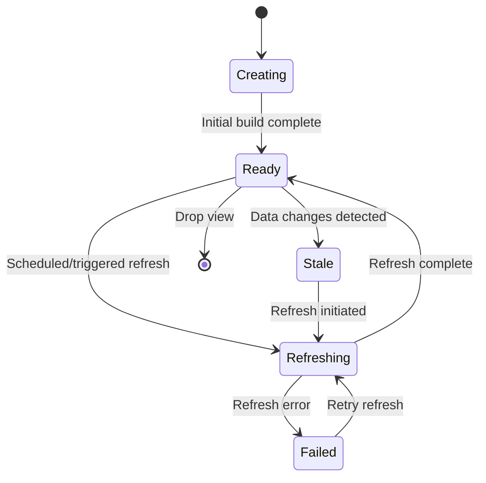
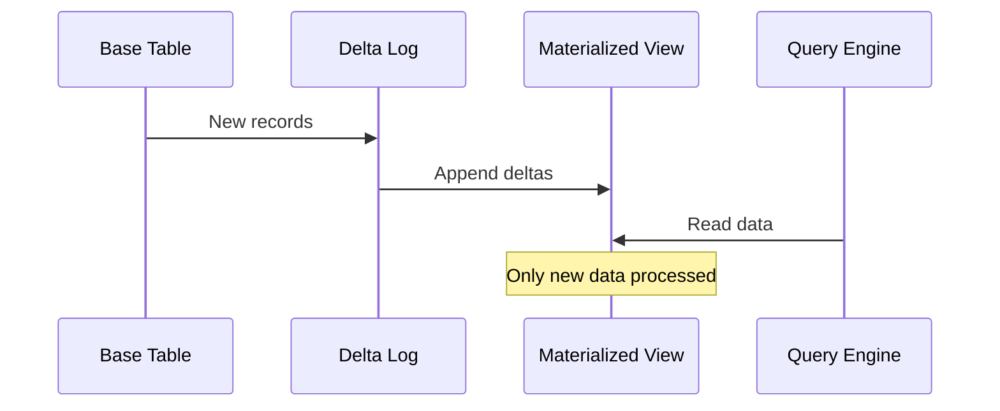

# Materialized View Pattern

!!! success "🏆 Gold Standard Pattern"
    **Query Performance at Data Warehouse Scale** • BigQuery, Redshift, Snowflake proven
    
    When queries take minutes on petabytes of data, materialized views turn them into milliseconds. From BigQuery processing 110TB/second to Snowflake's zero-maintenance views, this pattern powers modern analytics.
    
    **Key Success Metrics:**
    - Google BigQuery: 110TB/second with pre-computed results
    - Amazon Redshift: Exabyte-scale queries optimized automatically
    - Snowflake: 7,800+ customers with instant analytics

## Essential Question

**How do we eliminate expensive query computation by pre-calculating and storing results for instant access?**

## When to Use / When NOT to Use

### ✅ Use When

| Scenario | Example | Impact |
|----------|---------|--------|
| Complex analytics queries | Sales dashboard with 20+ table joins | 30-second queries become 50ms |
| Read-heavy workloads | Product catalog with millions of searches | 1000x improvement in read throughput |
| Expensive aggregations | Real-time metrics across petabytes | Enable interactive analytics |
| Reporting systems | Monthly/quarterly business reports | Consistent sub-second response |

### ❌ DON'T Use When

| Scenario | Why | Alternative |
|----------|-----|-------------|
| Frequently changing data | Constant refresh overhead negates benefits | Real-time computation with caching |
| Simple single-table queries | Overhead exceeds benefits | Regular indexes and query optimization |
| Storage costs exceed savings | View storage more expensive than compute | Query optimization and better indexes |
| Real-time data requirements | Refresh lag unacceptable | Streaming aggregation patterns |

## Level 1: Intuition (5 min) {#intuition}

### The Story

Imagine a coffee shop that serves complex drinks. Instead of making each latte from scratch (grinding beans, steaming milk), they prepare the common components ahead of time. When you order, they just combine pre-made elements. Materialized views work the same way - pre-compute expensive query results so users get instant responses.

### Visual Metaphor

### Core Insight

> **Key Takeaway:** Trading storage space and refresh complexity for dramatically faster query performance.

### In One Sentence

Materialized views pre-compute expensive query results and store them physically, turning complex analytics from minutes to milliseconds.

## Level 2: Foundation (10 min) {#foundation}

### The Problem Space

<div class="failure-vignette">
<h4>🚨 What Happens Without This Pattern</h4>

**E-commerce Giant, 2021**: During Black Friday, their analytics dashboard became unusable. Each sales report took 45 seconds to load as it performed live aggregations across 500 million orders. Executives couldn't make real-time decisions during their biggest sales day.

**Impact**: Lost opportunity to optimize pricing and inventory during peak sales, estimated $50M in missed revenue optimization.
</div>

### How It Works

#### Architecture Overview

#### Key Components

| Component | Purpose | Responsibility |
|-----------|---------|----------------|
| **Materialized View** | Store pre-computed results | Fast query serving |
| **Refresh Process** | Keep data current | Incremental or full updates |
| **Query Optimizer** | Route queries intelligently | Decide when to use MV vs base tables |
| **Storage Manager** | Manage view storage | Handle compression and indexing |

### Basic Example

## Level 3: Deep Dive (15 min) {#deep-dive}

### Implementation Details

#### State Management

<details>
<summary>📄 View mermaid code (10 lines)</summary>



</details>

#### Critical Design Decisions

| Decision | Options | Trade-off | Recommendation |
|----------|---------|-----------|----------------|
| **Refresh Strategy** | Full vs Incremental | Full: Simple, expensive<br>Incremental: Complex, efficient | Incremental for large datasets |
| **Refresh Timing** | Scheduled vs Event-driven | Scheduled: Predictable<br>Event: Responsive | Event-driven for critical data |
| **Storage Format** | Row vs Columnar | Row: OLTP optimized<br>Columnar: Analytics optimized | Columnar for analytics workloads |

### Common Pitfalls

<div class="decision-box">
<h4>⚠️ Avoid These Mistakes</h4>

1. **Over-materialization**: Creating views for every query → Focus on expensive, frequent queries
2. **Stale Data Tolerance**: Not defining acceptable staleness → Set clear SLAs for data freshness
3. **Cascade Dependencies**: Views depending on other views → Limit dependency depth to 2-3 levels
</div>

### Production Considerations

#### Performance Characteristics

| Metric | Typical Range | Optimization Target |
|--------|---------------|--------------------|
| Query Speed Improvement | 10-1000x faster | >100x for complex analytics |
| Storage Overhead | 20-200% of base data | <50% with compression |
| Refresh Time | Minutes to hours | <10% of query frequency |
| Data Staleness | Seconds to hours | Match business requirements |

## Level 4: Expert (20 min) {#expert}

### Advanced Techniques

#### Optimization Strategies

1. **Hierarchical Views**
   - When to apply: Multi-granularity analytics (daily → monthly → yearly)
   - Impact: 90% reduction in refresh time for higher-level aggregations
   - Trade-off: Increased complexity in dependency management

2. **Partial Materialization**
   - When to apply: Only frequently accessed data portions need speed
   - Impact: 60% storage savings while maintaining 80% performance gains
   - Trade-off: Query planning complexity increases

### Scaling Considerations

### Monitoring & Observability

#### Key Metrics to Track

| Metric | Alert Threshold | Dashboard Panel |
|--------|----------------|------------------|
| Refresh Latency | >2x normal time | Time series with refresh duration |
| View Staleness | >Business SLA | Gauge showing data age |
| Query Hit Rate | <80% queries using MV | Ratio of MV vs base table queries |
| Storage Growth | >10% per month | Trend chart of storage utilization |

## Level 5: Mastery (30 min) {#mastery}

### Real-World Case Studies

#### Case Study 1: Netflix Analytics at Scale

<div class="truth-box">
<h4>💡 Production Insights from Netflix</h4>

**Challenge**: Enable real-time decision making on 300+ billion viewing events for content recommendation tuning

**Implementation**: Multi-layered materialized views with stream processing - raw events → hourly views → daily aggregates → ML feature stores

**Results**: 
- **Query Performance**: 1000x improvement (45 minutes → 2.7 seconds)
- **Storage Efficiency**: 10:1 compression ratio through smart aggregation
- **Business Impact**: $2B+ annual revenue from improved recommendations

**Lessons Learned**: Layer views by access pattern, not just time granularity. Most queries need recent data with historical context.
</div>

### Pattern Evolution

#### Migration from Regular Views

<details>
<summary>📄 View mermaid code (8 lines)</summary>


</details>

#### Future Directions

| Trend | Impact on Pattern | Adaptation Strategy |
|-------|------------------|--------------------|
| Real-time Analytics | Sub-second staleness requirements | Stream-native materialized views |
| Machine Learning | Views as feature stores | Automated feature engineering in MVs |
| Cloud-native | Serverless refresh patterns | Event-driven, auto-scaling refresh |

### Pattern Combinations

#### Works Well With

| Pattern | Combination Benefit | Integration Point |
|---------|-------------------|------------------|
| **Event Sourcing** | Natural incremental refresh | Event streams drive MV updates |
| **CQRS** | Separate read models via MVs | MVs serve as optimized read stores |
| **Data Lake** | Raw data → processed views | MVs provide structured access to lake data |

## Quick Reference

### Decision Matrix

### Comparison with Alternatives

| Aspect | Materialized View | Query Cache | Real-time Aggregation |
|--------|------------------|-------------|----------------------|
| Performance | ✅ Consistent fast | 🔴 Cache misses slow | ✅ Always current |
| Storage Cost | 🔴 High | ✅ Low | 🟡 Medium |
| Data Freshness | 🟡 Depends on refresh | 🔴 Varies widely | ✅ Real-time |
| Complexity | 🟡 Medium | ✅ Low | 🔴 High |
| When to use | Analytics, reports | Simple queries | Real-time dashboards |

### Implementation Checklist

**Pre-Implementation**
- [ ] Identified top 10 slowest, most frequent queries
- [ ] Estimated storage requirements (target: <2x base data)
- [ ] Defined acceptable staleness SLAs
- [ ] Planned refresh schedule and strategy

**Implementation**
- [ ] Created materialized views for high-impact queries
- [ ] Configured appropriate refresh mechanism
- [ ] Set up monitoring for refresh success/failure
- [ ] Implemented query optimizer integration

**Post-Implementation**
- [ ] Monitoring query performance improvements (target: >10x)
- [ ] Tracking storage costs vs performance gains
- [ ] Measuring materialized view hit rates (target: >80%)
- [ ] Regular review of view usage and optimization

### Related Resources

<div class="grid cards" markdown>

- :material-book-open-variant:{ .lg .middle } **Related Patterns**
    
    ---
    
    - [Event Sourcing](../../pattern-library/data-management/event-sourcing.md) - Natural source for incremental refresh
    - [CQRS](../../pattern-library/data-management/cqrs.md) - MVs as optimized read models
    - [Data Lake](../../pattern-library/data-management/data-lake.md) - Raw data to structured views

- :material-flask:{ .lg .middle } **Fundamental Laws**
    
    ---
    
    - [Law 4: Multidimensional Optimization](../../core-principles/laws/multidimensional-optimization/) - Space vs time trade-offs
    - [Law 7: Economic Reality](../../core-principles/laws/economic-reality/) - Cost optimization

- :material-pillar:{ .lg .middle } **Foundational Pillars**
    
    ---
    
    - [State Distribution](../../core-principles/pillars/state-distribution/) - Distributed view management
    - [Work Distribution](../../core-principles/pillars/work-distribution/) - Query workload optimization

- :material-tools:{ .lg .middle } **Implementation Guides**
    
    ---
    
    - [View Design Guide](../../excellence/guides/materialized-view-design.md)
    - [Refresh Strategy Guide](../../excellence/guides/mv-refresh-strategies.md)
    - [Performance Tuning](../../excellence/guides/mv-performance-tuning.md)

</div>

---

*Next: [Event Sourcing](../../pattern-library/data-management/event-sourcing.md) - Storing state as a sequence of events*
<details>
<summary>📄 View sql code (10 lines)</summary>

```sql
-- Drop and recreate
CREATE MATERIALIZED VIEW sales_summary AS
SELECT 
    date_trunc('day', order_date) as day,
    product_category,
    SUM(amount) as total_sales,
    COUNT(*) as order_count,
    AVG(amount) as avg_order_value
FROM orders
GROUP BY 1, 2;
```

</details>

### 2. Incremental Refresh
<details>
<summary>📄 View mermaid code (10 lines)</summary>



</details>

### 3. Real-time Materialization

| Technology | Approach | Latency | Use Case |
|------------|----------|---------|----------|
| **Kafka + ksqlDB** | Stream processing | < 1 second | Real-time dashboards |
| **Spark Streaming** | Micro-batches | 1-10 seconds | Near real-time analytics |
| **DBT** | Scheduled SQL | Minutes-Hours | Daily reporting |
| **Materialize** | Incremental compute | Milliseconds | Streaming analytics |

## Performance Impact

<div class="axiom-box">
<h4>📊 Real-World Performance Gains</h4>

| Query Type | Without MV | With MV | Improvement |
|------------|------------|---------|-------------|
| Daily sales summary | 45 seconds | 50ms | 900x |
| Customer 360 view | 12 seconds | 100ms | 120x |
| Product recommendations | 8 seconds | 25ms | 320x |
| Dashboard load | 30 seconds | 200ms | 150x |

**Uber Case Study**: Reduced driver analytics queries from 2 minutes to 500ms using materialized views
</div>

## Cost-Benefit Analysis

## Common Pitfalls

<div class="failure-vignette">
<h4>💥 The Stale Data Disaster</h4>

**What Happened**: E-commerce company showed wrong inventory counts
**Root Cause**: Materialized view refresh failed silently for 3 days
**Impact**: $2M in oversold inventory
**Solution**: 
- Staleness monitoring with alerts
- Fallback to base tables on staleness
- Health checks on refresh jobs
</div>

## When to Materialize

```mermaid
graph TD
    Start[Query Analysis] --> Expensive{Query Cost > 5s?}
    
    Expensive -->|No| Skip[Don't Materialize]
    Expensive -->|Yes| Frequency{Run > 100x/day?}
    


