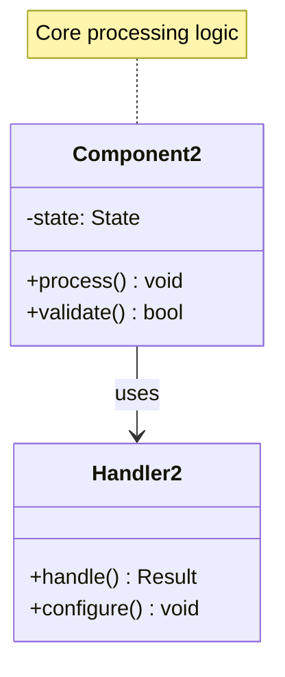

# Merkle Trees Pattern

!!! success "🏆 Gold Standard Pattern"
    **Cryptographic Data Verification Champion** • Git, Bitcoin, DynamoDB proven at massive scale
    
    The fundamental pattern for efficient data integrity and synchronization. Merkle trees enable quick verification of large datasets and efficient difference detection between distributed systems.
    
    **Key Success Metrics:**
    - Git: Powers version control for millions of repositories
    - Bitcoin: Secures trillions in cryptocurrency value
    - DynamoDB: Enables petabyte-scale data synchronization

## Essential Question

**How can we efficiently verify data integrity and detect changes in large datasets?**

## When to Use / When NOT to Use

### ✅ Use When

| Scenario | Example | Impact |
|----------|---------|--------|
| Large data verification | Blockchain transaction verification | O(log n) vs O(n) verification time |
| Distributed synchronization | Database replica consistency | Detect changes without full comparison |
| Version control systems | Git repository synchronization | Efficient diff and merge operations |
| Certificate transparency | SSL certificate auditing | Tamper-evident public logs |

### ❌ DON'T Use When

| Scenario | Why | Alternative |
|----------|-----|-------------|
| Small datasets (<1MB) | Overhead exceeds benefits | Simple checksums |
| Frequently changing data | Constant tree rebuilding | Event logs or deltas |
| No integrity requirements | Cryptographic overhead unnecessary | Direct comparison |
| Memory-constrained systems | Tree storage overhead | Bloom filters for approximation |

## Level 1: Intuition (5 min) {#intuition}

### The Story
Imagine a library with millions of books. Instead of checking every book for changes, you create a summary system: group books by shelf, create a summary for each shelf, then create a summary of all shelf summaries. Any change bubbles up through the hierarchy, making detection instant.

### Visual Metaphor
### Core Insight
> **Key Takeaway:** Build hierarchical summaries where any change propagates upward - detect massive changes with minimal computation.

### In One Sentence
Merkle trees create hierarchical hash structures where data changes bubble up through tree levels, enabling efficient verification and synchronization of large datasets.

## Level 2: Foundation (10 min) {#foundation}

### The Problem Space

<h4>🚨 What Happens Without This Pattern</h4>

**Distributed Storage Co, 2020**: Used full file comparison for 10TB replica synchronization, taking 6 hours and consuming massive bandwidth for detecting 1MB of changes.

**Impact**: $100K monthly bandwidth costs, 6-hour sync windows, system downtime during sync

### How It Works

#### Architecture Overview
#### Key Components

| Component | Purpose | Responsibility |
|-----------|---------|----------------|
| **Leaf Nodes** | Hash individual data blocks | Create base layer of tree |
| **Internal Nodes** | Combine child hashes | Build hierarchical structure |
| **Root Hash** | Single tree fingerprint | Enable quick comparison |
| **Merkle Proofs** | Verify specific data | Provide O(log n) verification |

### Basic Example

📄 View implementation code

import hashlib

class MerkleTree:
    def __init__(self, data_blocks):
        self.leaves = [self.hash_data(block) for block in data_blocks]
        self.root = self.build_tree(self.leaves)
    
    def hash_data(self, data):
        return hashlib.sha256(data.encode()).hexdigest()
    
    def build_tree(self, nodes):
        if len(nodes) == 1:
            return nodes[0]
        
        next_level = []
        for i in range(0, len(nodes), 2):
            left = nodes[i]
            right = nodes[i + 1] if i + 1 < len(nodes) else left
            combined = self.hash_data(left + right)
            next_level.append(combined)
        
        return self.build_tree(next_level)
    
    def verify_data(self, data_block, proof, root_hash):
        current_hash = self.hash_data(data_block)
        for sibling_hash, is_left in proof:
            if is_left:
                current_hash = self.hash_data(sibling_hash + current_hash)
            else:
                current_hash = self.hash_data(current_hash + sibling_hash)
        return current_hash == root_hash

## Level 3: Deep Dive (15 min) {#deep-dive}

### Implementation Details

#### State Management

📄 View mermaid code (10 lines)

#### Critical Design Decisions

| Decision | Options | Trade-off | Recommendation |
|----------|---------|-----------|----------------|
| **Tree Degree** | Binary vs N-ary | Binary: Simple, balanced N-ary: Fewer levels, complex | Binary for general use |
| **Hash Function** | SHA-256 vs Blake2 | SHA-256: Standard, proven Blake2: Faster, newer | SHA-256 for compatibility |
| **Update Strategy** | Full rebuild vs Incremental | Full: Simple, expensive Incremental: Complex, efficient | Incremental for dynamic data |

### Common Pitfalls

<h4>⚠️ Avoid These Mistakes</h4>

1. **Weak hash functions**: Using MD5/SHA-1 creates collision vulnerabilities → Use SHA-256 or stronger
2. **Undefined node ordering**: Ambiguous tree construction → Define canonical ordering rules
3. **Missing proof validation**: Accepting proofs without verification → Always validate proof paths

### Production Considerations

#### Performance Characteristics

| Metric | Typical Range | Optimization Target |
|--------|---------------|-------------------|
| Tree Construction | O(n) time | Parallelize leaf hashing |
| Proof Generation | O(log n) time | Cache internal nodes |
| Proof Verification | O(log n) time | Optimize hash computation |
| Storage Overhead | 2x original data | Use sparse trees for sparse data |

## Level 4: Expert (20 min) {#expert}

### Advanced Techniques

#### Optimization Strategies

1. **Incremental Updates**
   - When to apply: Frequently changing datasets with localized modifications
   - Impact: O(log n) update time vs O(n) full rebuild
   - Trade-off: Complex bookkeeping for path tracking

2. **Sparse Merkle Trees**
   - When to apply: Key-value stores with sparse keyspace
   - Impact: Handle arbitrary keys efficiently
   - Trade-off: Larger proof sizes due to default empty nodes

### Scaling Considerations

### Monitoring & Observability

#### Key Metrics to Track

| Metric | Alert Threshold | Dashboard Panel |
|--------|----------------|-----------------|
| **Tree Height** | >32 levels | Log chart showing balance |
| **Proof Generation Time** | p95 > 10ms | Latency distribution |
| **Verification Failure Rate** | >0.1% | Error rate with failure types |
| **Tree Rebuild Frequency** | >10% nodes/minute | Change rate monitoring |

## Level 5: Mastery (30 min) {#mastery}

### Real-World Case Studies

#### Case Study 1: Git's Object Model

<h4>💡 Production Insights from Git</h4>

**Challenge**: Efficiently sync repositories and detect changes across millions of files

**Implementation**: Content-addressed storage with Merkle tree structure for commits, trees, and blobs

**Results**: 
- **Sync Efficiency**: Only transfer changed objects, not entire repo
- **Integrity**: Cryptographic verification of entire history
- **Performance**: O(log n) change detection across massive repositories

**Lessons Learned**: Content addressing with Merkle trees enables both integrity and efficiency; tree structure mirrors filesystem hierarchy for intuitive navigation

### Pattern Evolution

#### Migration from Legacy

📄 View mermaid code (7 lines)

#### Future Directions

| Trend | Impact on Pattern | Adaptation Strategy |
|-------|------------------|-------------------|
| **Post-Quantum Cryptography** | Hash function vulnerabilities | Migrate to quantum-resistant hashes |
| **Zero-Knowledge Proofs** | Private verification | Integrate ZK proof systems |
| **Hardware Acceleration** | Faster hash computation | Leverage specialized crypto chips |

### Pattern Combinations

#### Works Well With

| Pattern | Combination Benefit | Integration Point |
|---------|-------------------|------------------|
| **Content-Addressed Storage** | Natural hash-based addressing | Merkle nodes as content addresses |
| **Consensus Protocols** | Tamper-evident state | Merkle root as state fingerprint |
| **Bloom Filters** | Efficient pre-filtering | Check membership before proof generation |

## Quick Reference

### Decision Matrix

### Comparison with Alternatives

| Aspect | Merkle Trees | Hash Lists | Checksums | Bloom Filters |
|--------|-------------|------------|-----------|---------------|
| **Verification Time** | O(log n) | O(n) | O(1) | O(k) |
| **Storage Overhead** | 2x | 1x | Minimal | Minimal |
| **Change Detection** | Efficient | Inefficient | Binary | Probabilistic |
| **Tamper Evidence** | Strong | Moderate | Weak | None |
| **Use Case** | Large datasets | Simple lists | Single files | Pre-filtering |

### Implementation Checklist

**Pre-Implementation**
- [ ] Selected appropriate hash function (SHA-256+)
- [ ] Defined canonical ordering for tree construction
- [ ] Planned caching strategy for internal nodes
- [ ] Designed proof format and validation logic

**Implementation**
- [ ] Built efficient tree construction algorithm
- [ ] Implemented incremental update mechanism
- [ ] Added proof generation and verification
- [ ] Created serialization format for storage/transmission

**Post-Implementation**
- [ ] Benchmarked performance with target data sizes
- [ ] Tested security properties and attack resistance
- [ ] Monitored tree balance and performance metrics
- [ ] Documented operational procedures for tree management

### Related Resources

- :material-book-open-variant:{ .lg .middle } **Related Patterns**
    
    ---
    
    - [Bloom Filter](../data-management/bloom-filter.md) - Complementary verification structure
    - [Consistent Hashing](../data-management/consistent-hashing.md) - Hash-based distribution
    - [Event Sourcing](../data-management/event-sourcing.md) - Verifiable event logs

- :material-flask:{ .lg .middle } **Fundamental Laws**
    
    ---
    
    - [Law 4: Multi-dimensional Optimization](../../core-principles/laws/multidimensional-optimization.md) - Verification efficiency trade-offs
    - [Law 5: Distributed Knowledge](../../core-principles/laws/distributed-knowledge.md) - Cryptographic certainty

- :material-pillar:{ .lg .middle } **Foundational Pillars**
    
    ---
    
    - [State Distribution](../../core-principles/pillars/state-distribution.md) - Distributed data integrity
    - [Truth Distribution](../../core-principles/pillars/truth-distribution.md) - Consensus on data validity

- :material-tools:{ .lg .middle } **Implementation Guides**
    
    ---
    
    - [Cryptographic Best Practices](../../architects-handbook/implementation-playbooks/guides/crypto-practices.md)
    - [Tree Structure Optimization](../../architects-handbook/implementation-playbooks/guides/tree-optimization.md)
    - [Proof System Design](../../architects-handbook/implementation-playbooks/guides/proof-systems.md)

