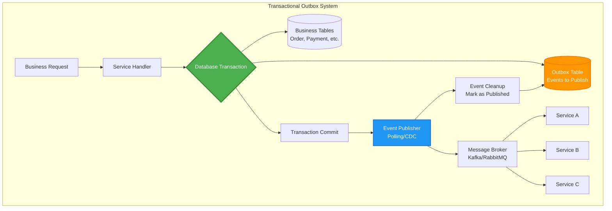

## The Complete Blueprint

The Outbox Pattern is the **reliability guarantor** for event-driven architectures, solving the infamous dual-write problem by ensuring that database changes and event publishing happen atomically or not at all. This pattern transforms **unreliable event publishing** into **guaranteed delivery** by treating events as data that gets committed alongside business changes within the same transaction boundary. It's the foundation that enables microservices to communicate reliably without the complexity and performance penalties of distributed transactions.

📄 View Complete Outbox Architecture (17 lines)

This blueprint showcases **atomic dual-writes** within transaction boundaries, **reliable event publishing** through outbox polling or Change Data Capture, and **exactly-once delivery semantics** that maintain data consistency across distributed services.

### What You'll Master

- **Transactional Event Storage**: Design outbox table schemas that capture business events atomically within the same transaction as data changes
- **Event Publishing Strategies**: Implement robust polling or CDC-based publishers that reliably deliver events with proper error handling and retry logic
- **Exactly-Once Semantics**: Build idempotent event processing systems that handle duplicates gracefully and ensure consistent state across services
- **Performance Optimization**: Optimize outbox throughput through batch processing, efficient polling strategies, and intelligent cleanup mechanisms
- **Failure Recovery**: Design comprehensive failure handling including publisher restarts, broker failures, and consumer crash scenarios

# Outbox Pattern

!!! info "🥈 Silver Tier Pattern"
    **Transactional messaging that solves the dual-write problem** • Specialized solution for event-driven systems
    
    Elegant solution to the dual-write problem but requires careful implementation with polling or CDC. Consider managed solutions when available.
    
    **Best For:** Event-driven microservices, CQRS implementations, saga coordination, systems requiring guaranteed event delivery

## Essential Question

**How do we guarantee that database changes and event publishing happen together or not at all?**

## When to Use / When NOT to Use

### ✅ Use When

| Scenario | Example | Impact |
|----------|---------|--------|
| Event-driven architecture | Order processing with notifications | Prevents lost events |
| CQRS implementation | Command updates with view projections | Ensures view consistency |
| Saga orchestration | Distributed transaction coordination | Reliable saga steps |
| Audit requirements | Financial transactions with logging | Complete audit trail |

### ❌ DON'T Use When

| Scenario | Why | Alternative |
|----------|-----|-------------|
| Simple CRUD operations | No events needed | Direct database updates |
| Real-time event needs | Eventual consistency not acceptable | Synchronous messaging |
| Single service | No distributed coordination | Local transactions |
| High write volume | Outbox becomes bottleneck | Event sourcing |

## Level 1: Intuition (5 min) {#intuition}

### The Story

The outbox pattern is like a restaurant's order system. When you place an order, the waiter doesn't immediately run to the kitchen and bar—that would be chaotic. Instead, they write down your complete order on one ticket, then the kitchen and bar fulfill items from that single, reliable source. If the waiter forgets to tell the kitchen about your appetizer, you'd be upset. The outbox ensures nothing gets forgotten.

### Visual Metaphor

### Core Insight

> **Key Takeaway:** Store the event as data, not a side effect—then publish it reliably later.

### In One Sentence

Outbox Pattern **solves the dual-write problem** by **storing events in the same transaction as data** to achieve **guaranteed event delivery**.

## Level 2: Foundation (10 min) {#foundation}

### The Problem Space

<h4>🚨 What Happens Without This Pattern</h4>

**E-commerce Platform, Black Friday 2020**: Order service saved purchases but failed to publish inventory events during traffic spikes.

**Impact**: 50,000 oversold items, $3.2M in fulfillment costs, 72 hours to reconcile inventory, and 15% customer churn.

### How It Works

#### Architecture Overview

#### Key Components

| Component | Purpose | Responsibility |
|-----------|---------|----------------|
| Outbox Table | Event storage | Store events within same transaction |
| Event Publisher | Event delivery | Poll outbox and publish events |
| Message Broker | Event distribution | Deliver events to consumers |
| Event Consumer | Event processing | Handle published events |

### Basic Example

## Level 3: Deep Dive (15 min) {#deep-dive}

### Implementation Details

#### State Management

#### Critical Design Decisions

| Decision | Options | Trade-off | Recommendation |
|----------|---------|-----------|----------------|
| **Publishing Method** | Polling CDC Triggers | Polling: Simple but latency CDC: Fast but complex Triggers: Immediate but fragile | CDC for high volume |
| **Event Schema** | JSON Avro Protobuf | JSON: Simple but verbose Avro: Compact but complex Protobuf: Fast but tooling | JSON for flexibility |
| **Cleanup Strategy** | Delete Archive TTL | Delete: Simple Archive: Audit trail TTL: Automatic | Archive for compliance |

### Common Pitfalls

<h4>⚠️ Avoid These Mistakes</h4>

1. **Outbox Table Growth**: Regular cleanup needed → Implement archiving strategy
2. **Duplicate Events**: Publisher failures cause retries → Use idempotent consumers  
3. **Event Ordering**: Single publisher can bottleneck → Partition by aggregate ID

### Production Considerations

#### Performance Characteristics

| Metric | Polling | CDC | Database Triggers |
|--------|---------|-----|------------------|
| Latency | 1-10 seconds | 100-500ms | 1-100ms |
| Throughput | 1K events/sec | 10K+ events/sec | 5K events/sec |
| Complexity | Low | High | Medium |
| Reliability | High | Medium | Low |

## Level 4: Expert (20 min) {#expert}

### Advanced Techniques

#### Optimization Strategies

1. **Event Batching**
   - When to apply: High event volume scenarios
   - Impact: 10x throughput improvement with batched publishing
   - Trade-off: Increased latency for individual events

2. **Partitioned Outbox**
   - When to apply: Very high throughput requirements
   - Impact: Parallel processing and better scalability
   - Trade-off: Added complexity in partition management

### Scaling Considerations

### Monitoring & Observability

#### Key Metrics to Track

| Metric | Alert Threshold | Dashboard Panel |
|--------|----------------|-----------------|
| Outbox lag | > 60 seconds | Event processing delay |
| Failed events | > 1% failure rate | Error tracking |
| Outbox size | > 1M pending events | Backlog monitoring |
| Publisher health | Any downtime | Publisher status |

## Level 5: Mastery (30 min) {#mastery}

### Real-World Case Studies

#### Case Study 1: Netflix Event Processing

<h4>💡 Production Insights from Netflix</h4>

**Challenge**: Reliable event publishing for billions of viewing events across microservices

**Implementation**:
- CDC-based outbox using Kafka Connect with Debezium
- Per-service outbox tables with automatic partitioning
- Schema registry for event evolution
- Dead letter queues for failed events

**Results**:
- 99.9% event delivery reliability across 1000+ services
- <500ms event publishing latency
- Zero data loss during major outages
- Handles 10B+ events daily

**Lessons Learned**: CDC outbox scales better than polling but requires sophisticated infrastructure

### Pattern Evolution

#### Migration from Legacy

📄 View mermaid code (7 lines)

#### Future Directions

| Trend | Impact on Pattern | Adaptation Strategy |
|-------|------------------|-------------------|
| Event Streaming | Native outbox support | Use platform-native solutions |
| Serverless | Stateless outbox needed | Cloud-managed outbox services |
| Multi-cloud | Cross-region reliability | Regional outbox replication |

### Pattern Combinations

#### Works Well With

| Pattern | Combination Benefit | Integration Point |
|---------|-------------------|------------------|
| Saga Pattern | Reliable step coordination | Each saga step uses outbox |
| CQRS | Consistent view updates | Command side uses outbox |
| Event Sourcing | Event persistence | Outbox for external events |

## Quick Reference

### Decision Matrix

### Comparison with Alternatives

| Aspect | Outbox Pattern | Two-Phase Commit | Event Sourcing |
|--------|----------------|------------------|----------------|
| Consistency | Eventual | Strong | Strong |
| Performance | Good | Poor | Excellent |
| Complexity | Medium | High | High |
| Scalability | Good | Poor | Excellent |
| When to use | Event reliability | ACID across services | Event-first design |

### Implementation Checklist

**Pre-Implementation**
- [ ] Identified events requiring reliability guarantees
- [ ] Chosen publisher mechanism (polling vs CDC)
- [ ] Designed outbox table schema
- [ ] Planned event cleanup strategy

**Implementation**
- [ ] Outbox table created with proper indexing
- [ ] Event publisher deployed with monitoring
- [ ] Idempotent event consumers implemented
- [ ] Error handling and retry logic added

**Post-Implementation**
- [ ] Event ordering verified for consumers
- [ ] Performance tested under load
- [ ] Monitoring dashboards configured
- [ ] Cleanup processes automated

### Related Resources

- :material-book-open-variant:{ .lg .middle } **Related Patterns**
    
    ---
    
    - [Saga Pattern](../data-management/saga.md) - Uses outbox for step coordination
    - [CQRS](../data-management/cqrs.md) - Outbox for command events
    - [Event Sourcing](../data-management/event-sourcing.md) - Alternative approach

- :material-flask:{ .lg .middle } **Fundamental Laws**
    
    ---
    
    - [Law 1: Correlated Failure](../../core-principles/laws/correlated-failure.md) - Dual-write failure scenarios
    - [Law 4: Multidimensional Optimization](../../core-principles/laws/multidimensional-optimization.md) - Consistency vs performance

- :material-pillar:{ .lg .middle } **Foundational Pillars**
    
    ---
    
    - [Pillar 2: State Distribution](../../core-principles/pillars/state-distribution.md) - Consistent state management
    - [Pillar 3: Truth Distribution](../../core-principles/pillars/truth-distribution.md) - Single source of truth

- :material-tools:{ .lg .middle } **Implementation Guides**
    
    ---
    
    - <!-- TODO: Add Outbox Setup Guide from Architects Handbook -->
    - <!-- TODO: Add CDC Configuration from Architects Handbook -->
    - <!-- TODO: Add Event Schema Design from Architects Handbook -->

---

