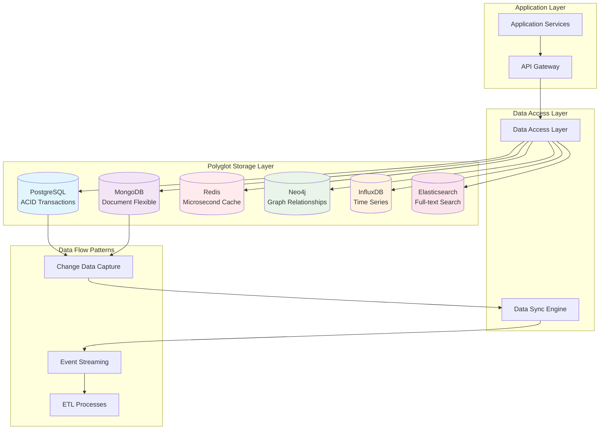
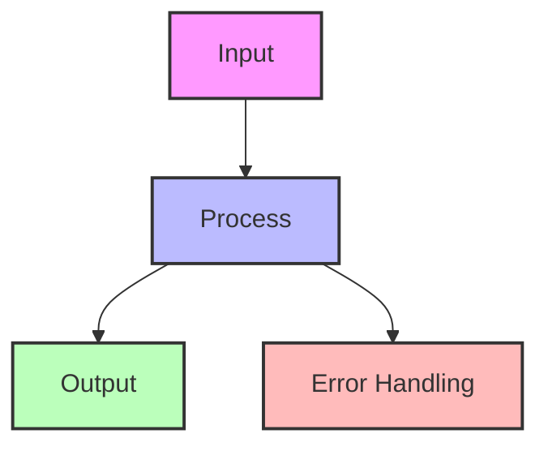

## The Complete Blueprint

Polyglot persistence is the strategic pattern of using multiple, specialized data storage technologies within a single system, where each database type is optimized for specific data patterns and access requirements. Rather than forcing all data through a single database paradigm, this approach recognizes that modern applications have diverse data needs—from ACID-compliant transactions to flexible document storage, from high-speed caching to complex graph relationships. The pattern enables teams to leverage the strengths of different database technologies (relational, document, key-value, graph, time-series) while managing the inherent complexity of operating multiple systems. Each database handles what it does best: PostgreSQL for transactional consistency, MongoDB for flexible schemas, Redis for microsecond caching, Neo4j for relationship traversal, and InfluxDB for time-series analytics. Success requires careful coordination of data flows, consistency models, and operational complexity across your storage ecosystem.



### What You'll Master

By implementing polyglot persistence, you'll achieve **specialized data optimization** where each storage system handles its ideal workload, **horizontal scaling flexibility** by choosing the right database for each access pattern, **technology evolution support** that allows adopting new storage technologies without full rewrites, **performance optimization** through database-specific strengths, and **operational resilience** where failures in one storage system don't cascade across your entire data layer. You'll master the art of data system composition while managing the complexity of multiple storage technologies in production.

## Essential Question
## When to Use / When NOT to Use

### When to Use

| Scenario | Why It Fits | Alternative If Not |
|----------|-------------|-------------------|
| High availability required | Pattern provides resilience | Consider simpler approach |
| Scalability is critical | Handles load distribution | Monolithic might suffice |
| Distributed coordination needed | Manages complexity | Centralized coordination |

### When NOT to Use

| Scenario | Why to Avoid | Better Alternative |
|----------|--------------|-------------------|
| Simple applications | Unnecessary complexity | Direct implementation |
| Low traffic systems | Overhead not justified | Basic architecture |
| Limited resources | High operational cost | Simpler patterns |
**How do we ensure data consistency and reliability with polyglot persistence?**


# Polyglot Persistence

**Choose the right database for each job - One size doesn't fit all**

> *"The era of one-size-fits-all database architecture is over. Modern applications need specialized databases for specialized tasks."* - Werner Vogels, Amazon CTO

---

## Level 1: Intuition

### The Toolbox Analogy

Imagine building a house with only a hammer:
- **Nails**: Perfect! ✅
- **Screws**: Awkward... 🤔
- **Glass**: Disaster! ❌

Similarly, using one database for all data:
- **Relational data**: RDBMS perfect! ✅
- **Document storage**: RDBMS awkward... 🤔
- **Graph traversal**: RDBMS disaster! ❌

### Visual Overview


---

## Level 2: Foundation

### Database Categories and Use Cases

| Database Type | Best For | Not Good For | Examples |
|--------------|----------|--------------|-----------|
| **Relational (SQL)** | ACID transactions, Complex queries | Unstructured data, Massive scale | PostgreSQL, MySQL |
| **Document** | Flexible schemas, JSON data | Complex relationships | MongoDB, CouchDB |
| **Key-Value** | Caching, Sessions | Complex queries | Redis, DynamoDB |
| **Column-Family** | Time-series, Write-heavy | ACID transactions | Cassandra, HBase |
| **Graph** | Relationships, Networks | Bulk analytics | Neo4j, Neptune |
| **Search** | Full-text search, Faceted search | Primary storage | Elasticsearch, Solr |
| **Time-Series** | Metrics, IoT data | General purpose | InfluxDB, TimescaleDB |


### Common Polyglot Architectures




---

## Interactive Decision Support Tools

### Data Storage Decision Tree


### Database Selection Calculator

| Factor | Your Requirements | Best Fit Score |
|--------|------------------|----------------|
| **Data Model** | | |
| Structured with relations | ___ (0-10) | RDBMS: +3, Graph: +1 |
| Flexible/nested documents | ___ (0-10) | Document: +3, RDBMS: -1 |
| Key-value pairs | ___ (0-10) | KV Store: +3, Cache: +2 |
| Graph/network relationships | ___ (0-10) | Graph: +3, RDBMS: -2 |
| **Query Patterns** | | |
| Complex joins/aggregations | ___ (0-10) | RDBMS: +3, Document: -1 |
| Simple lookups by ID | ___ (0-10) | KV Store: +3, Cache: +3 |
| Full-text search | ___ (0-10) | Search Engine: +3 |
| Graph traversals | ___ (0-10) | Graph: +3, RDBMS: -2 |
| **Consistency** | | |
| Strong ACID | ___ (0-10) | RDBMS: +3, NewSQL: +2 |
| Eventual is OK | ___ (0-10) | NoSQL: +2, Cache: +1 |
| **Scale Requirements** | | |
| Horizontal scale | ___ (0-10) | NoSQL: +3, NewSQL: +2 |
| Vertical scale OK | ___ (0-10) | RDBMS: +2 |
| **Performance** | | |
| Sub-millisecond reads | ___ (0-10) | Cache: +3, KV Store: +2 |
| High write throughput | ___ (0-10) | Column-Family: +3, Time-Series: +2 |


### Migration Strategy Selector


### Cost Comparison Matrix

| Database Type | Storage Cost | Compute Cost | Operational Complexity | Total TCO |
|--------------|--------------|--------------|----------------------|-----------|
| **Single RDBMS** | $$ | $$$ | Low | $$ |
| **Document Store** | $ | $$ | Medium | $$ |
| **Key-Value** | $ | $ | Low | $ |
| **Graph Database** | $$$ | $$$ | High | $$$$ |
| **Polyglot Mix** | $$ | $$ | High | $$$ |


**Cost Formulas:**
```
Single DB TCO = Storage + Compute + (Ops × 1)
Polyglot TCO = ∑(Storage[i] + Compute[i]) + (Ops × N × 1.5)

Where N = number of different databases
```

### 🎴 Quick Reference Cards

#### Database Selection Cheat Sheet

<div>

**RELATIONAL (PostgreSQL, MySQL)** ✅
- ACID transactions critical
- Complex queries with joins
- Well-defined schema
- Avoid: Massive scale, flexible schema

**DOCUMENT (MongoDB, DynamoDB)** ✅
- Flexible, evolving schema
- Nested data structures
- Horizontal scaling needed
- Avoid: Complex relationships, ACID

**KEY-VALUE (Redis, Memcached)** ✅
- Simple lookups by key
- Caching layer
- Session storage
- Avoid: Complex queries, relationships

**GRAPH (Neo4j, Neptune)** ✅
- Relationship-heavy data
- Social networks
- Recommendation engines
- Avoid: Simple CRUD, bulk analytics

**COLUMN-FAMILY (Cassandra, HBase)** ✅
- Time-series data
- Write-heavy workloads
- Multi-datacenter
- Avoid: ACID needs, complex queries

</div>

##
## Decision Matrix

### Quick Decision Table

| Factor | Low Complexity | Medium Complexity | High Complexity |
|--------|----------------|-------------------|-----------------|
| Team Size | < 5 developers | 5-20 developers | > 20 developers |
| Traffic | < 1K req/s | 1K-100K req/s | > 100K req/s |
| Data Volume | < 1GB | 1GB-1TB | > 1TB |
| **Recommendation** | ❌ Avoid | ⚠️ Consider | ✅ Implement |

## Implementation Patterns

<div>

**Common Polyglot Patterns:**

1. **CQRS Pattern**
   - Write to: RDBMS (consistency)
   - Read from: Elasticsearch (search) + Redis (cache)

2. **Event Sourcing**
   - Events: Kafka/EventStore
   - Projections: Specialized databases per view

3. **Microservices**
   - Each service owns its database
   - API Gateway aggregates

4. **Lambda Architecture**
   - Batch layer: HDFS/S3
   - Speed layer: Cassandra
   - Serving layer: HBase

</div>

### Anti-Patterns to Avoid

<div>

**⚠️ Common Mistakes:**

1. **Distributed Transactions** - Trying to maintain ACID across databases
2. **Over-Engineering** - Using 10 databases for a simple app
3. **No Data Governance** - Losing track of data ownership
4. **Sync Nightmares** - Complex ETL between too many stores
5. **Operational Overhead** - Underestimating management cost
6. **Inconsistent Security** - Different auth per database

</div>

---

## Level 3: Deep Dive

### Real-World Polyglot Architecture: Netflix


### Data Synchronization Strategies

#### 1. Dual Writes Pattern

#### 2. Change Data Capture (CDC)

#### 3. Event Sourcing Approach


### Consistency Management

#### Saga Pattern for Polyglot Transactions

---

## Level 4: Expert Implementation

### Production-Ready Polyglot Architecture


---

## Level 5: Mastery

### Advanced Patterns

#### 1. Smart Query Routing

#### 2. Automated Data Placement

Based on access patterns, automatically move data to optimal stores:
- Hot data → Redis
- Search-heavy → Elasticsearch  
- Relational queries → PostgreSQL
- Time-series → InfluxDB

### Future Directions

1. **AI-Driven Database Selection**
   - ML models predict optimal database for each data type
   - Automatic migration based on usage patterns
   - Cost optimization through intelligent placement

2. **Unified Query Languages**
   - GraphQL federation across polyglot stores
   - SQL interface to NoSQL databases
   - Universal query optimization

3. **Serverless Polyglot**
   - Pay-per-query pricing
   - Automatic scaling per database
   - Zero-ops polyglot persistence

---

## Quick Implementation Guide

### Starting Your Polyglot Journey

1. **Identify Data Patterns**
   ```
   - List all data types in your application
   - Analyze query patterns for each
   - Identify consistency requirements
   - Calculate data volumes and growth
   ```

2. **Choose Initial Databases**
   ```
   Start simple:
   - Primary: PostgreSQL (ACID, familiar)
   - Cache: Redis (performance)
   - Search: Elasticsearch (if needed)
   ```

3. **Plan Migration Strategy**
   ```
   - Start with read-only data
   - Implement dual writes
   - Gradually migrate services
   - Monitor consistency
   ```

4. **Operational Readiness**
   ```
   - Set up monitoring for each database
   - Create runbooks for common issues
   - Plan backup strategies
   - Document data flows
   ```

### Common Pitfalls to Avoid

| Pitfall | Impact | Solution |
|---------|--------|----------|
| **Too Many Databases** | Operational nightmare | Start with 2-3, add as needed |
| **No Clear Ownership** | Data inconsistency | One service, one database |
| **Complex Joins** | Performance issues | Denormalize or use CQRS |
| **Ignored Backups** | Data loss risk | Automate backups for all stores |
| **Missing Monitoring** | Blind to issues | Monitor each database separately |


---

## 🎓 Key Takeaways

1. **Right tool for the right job** - Each database excels at specific tasks
2. **Start simple** - Don't over-engineer, evolve your architecture
3. **Consistency is hard** - Plan for eventual consistency
4. **Operations multiply** - Each database needs monitoring, backups, updates
5. **Data governance matters** - Clear ownership and data flow documentation

---

## 📚 Related Patterns

- [CQRS](../data-management/cqrs.md) - Separate read and write models
- [Event Sourcing](../data-management/event-sourcing.md) - Event-driven polyglot sync
- [Saga Pattern](../data-management/saga.md) - Distributed transactions
- [Database per Service](../architecture/backends-for-frontends.md) - Microservices data isolation

---

*"The question is not whether to use polyglot persistence, but when and how to adopt it effectively."*

---

**Previous**: [← Outbox Pattern](../data-management/outbox.md) | **Next**: Priority Queue → (Coming Soon)

