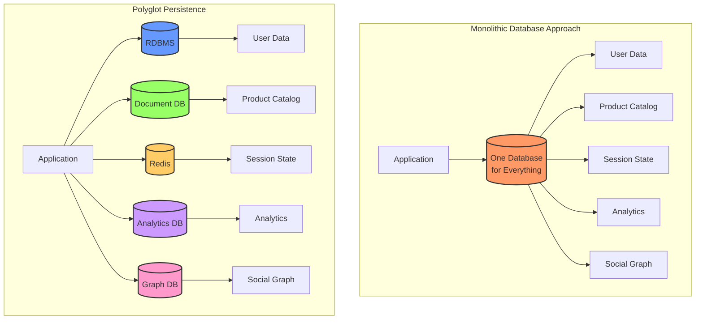
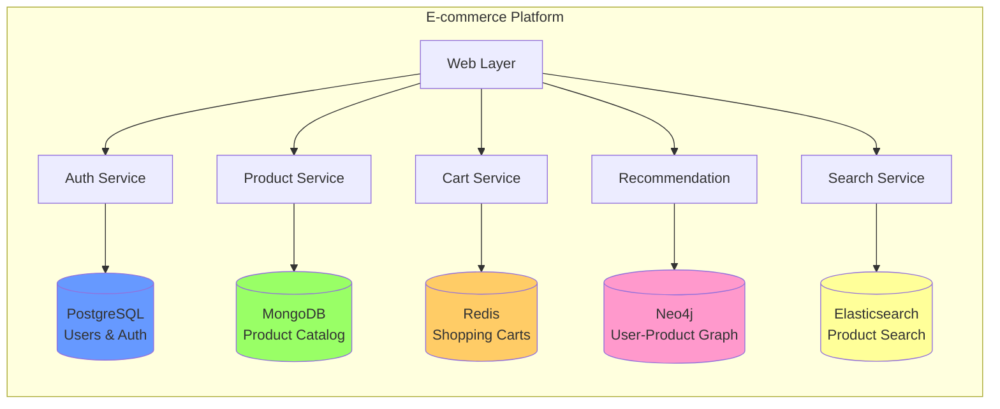
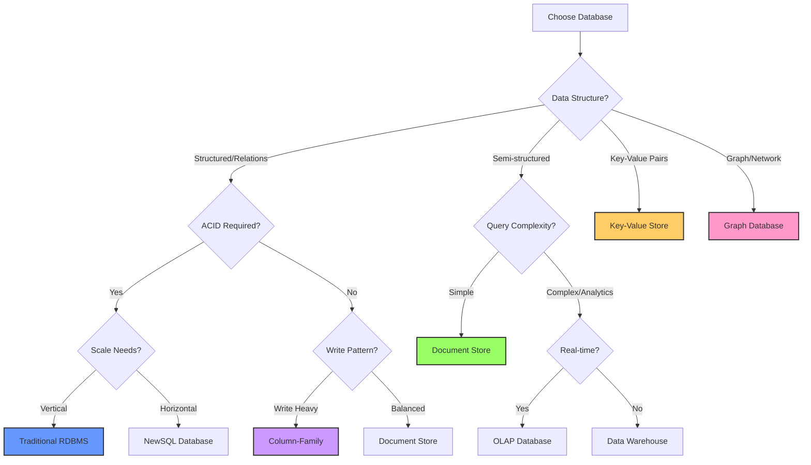
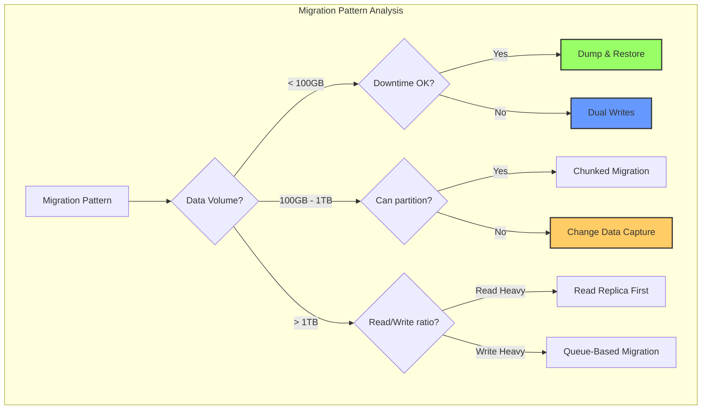
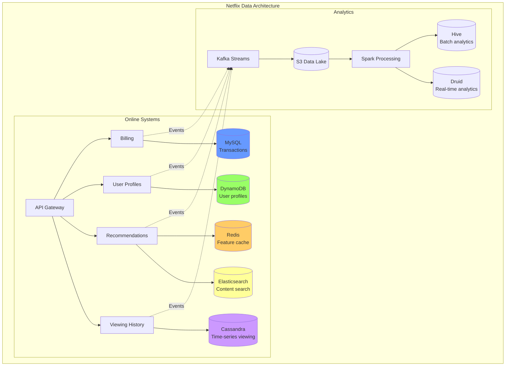
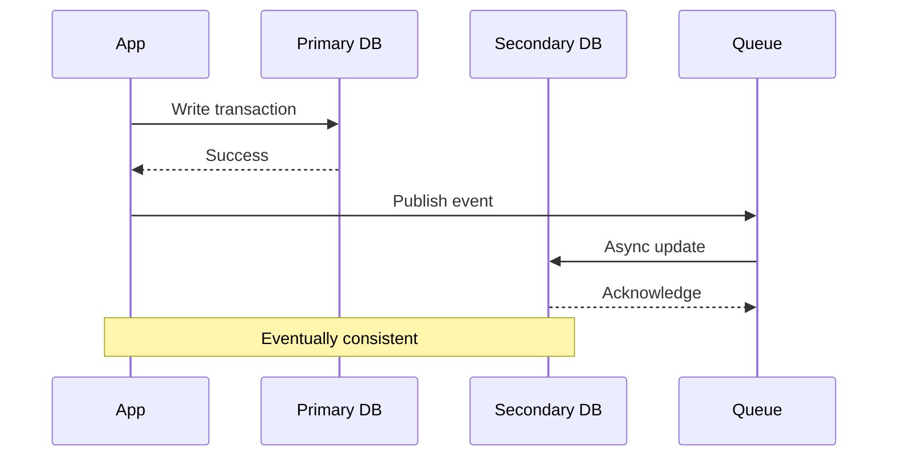
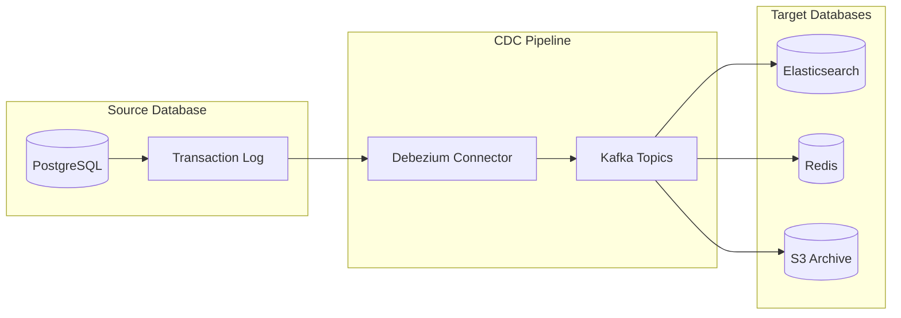
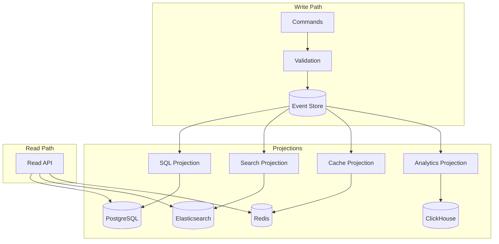
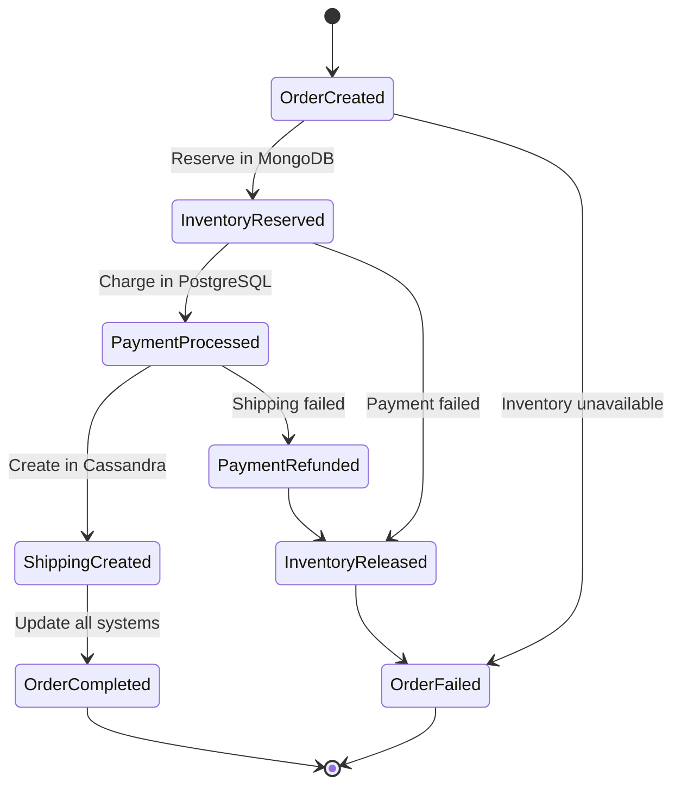
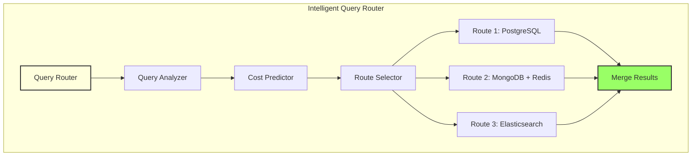

# Polyglot Persistence

**Choose the right database for each job - One size doesn't fit all**

> *"The era of one-size-fits-all database architecture is over. Modern applications need specialized databases for specialized tasks."* - Werner Vogels, Amazon CTO

---

## Level 1: Intuition

### The Toolbox Analogy

Imagine building a house with only a hammer:
- **Nails**: Perfect! ✅
- **Screws**: Awkward... 🤔
- **Glass**: Disaster! ❌

Similarly, using one database for all data:
- **Relational data**: RDBMS perfect! ✅
- **Document storage**: RDBMS awkward... 🤔
- **Graph traversal**: RDBMS disaster! ❌

### Visual Overview



---

## Level 2: Foundation

### Database Categories and Use Cases

| Database Type | Best For | Not Good For | Examples |
|--------------|----------|--------------|-----------|
| **Relational (SQL)** | ACID transactions, Complex queries | Unstructured data, Massive scale | PostgreSQL, MySQL |
| **Document** | Flexible schemas, JSON data | Complex relationships | MongoDB, CouchDB |
| **Key-Value** | Caching, Sessions | Complex queries | Redis, DynamoDB |
| **Column-Family** | Time-series, Write-heavy | ACID transactions | Cassandra, HBase |
| **Graph** | Relationships, Networks | Bulk analytics | Neo4j, Neptune |
| **Search** | Full-text search, Faceted search | Primary storage | Elasticsearch, Solr |
| **Time-Series** | Metrics, IoT data | General purpose | InfluxDB, TimescaleDB |


### Common Polyglot Architectures



---

## Interactive Decision Support Tools

### Data Storage Decision Tree



### Database Selection Calculator

| Factor | Your Requirements | Best Fit Score |
|--------|------------------|----------------|
| **Data Model** | | |
| Structured with relations | ___ (0-10) | RDBMS: +3, Graph: +1 |
| Flexible/nested documents | ___ (0-10) | Document: +3, RDBMS: -1 |
| Key-value pairs | ___ (0-10) | KV Store: +3, Cache: +2 |
| Graph/network relationships | ___ (0-10) | Graph: +3, RDBMS: -2 |
| **Query Patterns** | | |
| Complex joins/aggregations | ___ (0-10) | RDBMS: +3, Document: -1 |
| Simple lookups by ID | ___ (0-10) | KV Store: +3, Cache: +3 |
| Full-text search | ___ (0-10) | Search Engine: +3 |
| Graph traversals | ___ (0-10) | Graph: +3, RDBMS: -2 |
| **Consistency** | | |
| Strong ACID | ___ (0-10) | RDBMS: +3, NewSQL: +2 |
| Eventual is OK | ___ (0-10) | NoSQL: +2, Cache: +1 |
| **Scale Requirements** | | |
| Horizontal scale | ___ (0-10) | NoSQL: +3, NewSQL: +2 |
| Vertical scale OK | ___ (0-10) | RDBMS: +2 |
| **Performance** | | |
| Sub-millisecond reads | ___ (0-10) | Cache: +3, KV Store: +2 |
| High write throughput | ___ (0-10) | Column-Family: +3, Time-Series: +2 |


### Migration Strategy Selector



### Cost Comparison Matrix

| Database Type | Storage Cost | Compute Cost | Operational Complexity | Total TCO |
|--------------|--------------|--------------|----------------------|-----------|
| **Single RDBMS** | $$ | $$$ | Low | $$ |
| **Document Store** | $ | $$ | Medium | $$ |
| **Key-Value** | $ | $ | Low | $ |
| **Graph Database** | $$$ | $$$ | High | $$$$ |
| **Polyglot Mix** | $$ | $$ | High | $$$ |


**Cost Formulas:**
```
Single DB TCO = Storage + Compute + (Ops × 1)
Polyglot TCO = ∑(Storage[i] + Compute[i]) + (Ops × N × 1.5)

Where N = number of different databases
```

### 🎴 Quick Reference Cards

#### Database Selection Cheat Sheet

<div>

**RELATIONAL (PostgreSQL, MySQL)** ✅
- ACID transactions critical
- Complex queries with joins
- Well-defined schema
- Avoid: Massive scale, flexible schema

**DOCUMENT (MongoDB, DynamoDB)** ✅
- Flexible, evolving schema
- Nested data structures
- Horizontal scaling needed
- Avoid: Complex relationships, ACID

**KEY-VALUE (Redis, Memcached)** ✅
- Simple lookups by key
- Caching layer
- Session storage
- Avoid: Complex queries, relationships

**GRAPH (Neo4j, Neptune)** ✅
- Relationship-heavy data
- Social networks
- Recommendation engines
- Avoid: Simple CRUD, bulk analytics

**COLUMN-FAMILY (Cassandra, HBase)** ✅
- Time-series data
- Write-heavy workloads
- Multi-datacenter
- Avoid: ACID needs, complex queries

</div>

#### Implementation Patterns

<div>

**Common Polyglot Patterns:**

1. **CQRS Pattern**
   - Write to: RDBMS (consistency)
   - Read from: Elasticsearch (search) + Redis (cache)

2. **Event Sourcing**
   - Events: Kafka/EventStore
   - Projections: Specialized databases per view

3. **Microservices**
   - Each service owns its database
   - API Gateway aggregates

4. **Lambda Architecture**
   - Batch layer: HDFS/S3
   - Speed layer: Cassandra
   - Serving layer: HBase

</div>

#### Anti-Patterns to Avoid

<div>

**⚠️ Common Mistakes:**

1. **Distributed Transactions** - Trying to maintain ACID across databases
2. **Over-Engineering** - Using 10 databases for a simple app
3. **No Data Governance** - Losing track of data ownership
4. **Sync Nightmares** - Complex ETL between too many stores
5. **Operational Overhead** - Underestimating management cost
6. **Inconsistent Security** - Different auth per database

</div>

---

## Level 3: Deep Dive

### Real-World Polyglot Architecture: Netflix



### Data Synchronization Strategies

#### 1. Dual Writes Pattern



#### 2. Change Data Capture (CDC)



#### 3. Event Sourcing Approach



### Consistency Management

#### Saga Pattern for Polyglot Transactions



---

## Level 4: Expert Implementation

### Production-Ready Polyglot Architecture

```python
# Example: E-commerce platform with polyglot persistence

from abc import ABC, abstractmethod
from typing import Dict, List, Any, Optional
import asyncio
from dataclasses import dataclass
from enum import Enum

class DatabaseType(Enum):
    POSTGRESQL = "postgresql"
    MONGODB = "mongodb"
    REDIS = "redis"
    ELASTICSEARCH = "elasticsearch"
    NEO4J = "neo4j"

@dataclass
class DataStore:
    """Configuration for a data store"""
    db_type: DatabaseType
    connection_string: str
    pool_size: int = 10
    timeout: int = 30

class Repository(ABC):
    """Base repository interface"""
    
    @abstractmethod
    async def create(self, entity: Dict[str, Any]) -> str:
        pass
    
    @abstractmethod
    async def read(self, id: str) -> Optional[Dict[str, Any]]:
        pass
    
    @abstractmethod
    async def update(self, id: str, entity: Dict[str, Any]) -> bool:
        pass
    
    @abstractmethod
    async def delete(self, id: str) -> bool:
        pass

class PolyglotDataLayer:
    """Manages multiple databases with consistent interface"""
    
    def __init__(self):
        self.stores: Dict[str, DataStore] = {}
        self.repositories: Dict[str, Repository] = {}
        self.query_router = QueryRouter()
        self.consistency_manager = ConsistencyManager()
        
    def register_store(self, name: str, store: DataStore):
        """Register a new data store"""
        self.stores[name] = store
        self.repositories[name] = self._create_repository(store)
        
    def _create_repository(self, store: DataStore) -> Repository:
        """Factory method for creating appropriate repository"""
        if store.db_type == DatabaseType.POSTGRESQL:
            return PostgreSQLRepository(store)
        elif store.db_type == DatabaseType.MONGODB:
            return MongoDBRepository(store)
        elif store.db_type == DatabaseType.REDIS:
            return RedisRepository(store)
        elif store.db_type == DatabaseType.ELASTICSEARCH:
            return ElasticsearchRepository(store)
        elif store.db_type == DatabaseType.NEO4J:
            return Neo4jRepository(store)
        else:
            raise ValueError(f"Unsupported database type: {store.db_type}")

class QueryRouter:
    """Routes queries to appropriate databases based on data type"""
    
    def __init__(self):
        self.routing_rules = {
            "user": "postgresql",
            "product": "mongodb",
            "session": "redis",
            "search": "elasticsearch",
            "recommendation": "neo4j"
        }
    
    def get_store_for_entity(self, entity_type: str) -> str:
        """Determine which store handles this entity type"""
        return self.routing_rules.get(entity_type, "postgresql")

class ConsistencyManager:
    """Manages consistency across multiple databases"""
    
    def __init__(self):
        self.saga_coordinator = SagaCoordinator()
        self.event_bus = EventBus()
        
    async def execute_transaction(self, operations: List[Dict[str, Any]]):
        """Execute distributed transaction using saga pattern"""
        saga = Saga()
        
        for op in operations:
            saga.add_step(
                action=op["action"],
                compensation=op["compensation"]
            )
        
        return await self.saga_coordinator.execute(saga)

class DataSyncService:
    """Synchronizes data between different stores"""
    
    def __init__(self, primary_store: str, secondary_stores: List[str]):
        self.primary = primary_store
        self.secondaries = secondary_stores
        self.cdc_enabled = True
        
    async def sync_write(self, entity_type: str, entity: Dict[str, Any]):
        """Write to primary and async to secondaries"""
# Write to primary
        primary_result = await self._write_primary(entity_type, entity)
        
# Async write to secondaries
        if self.cdc_enabled:
            await self._cdc_replicate(entity_type, entity)
        else:
            await self._dual_write(entity_type, entity)
        
        return primary_result
    
    async def _cdc_replicate(self, entity_type: str, entity: Dict[str, Any]):
        """Use CDC for replication"""
        event = {
            "type": "entity_changed",
            "entity_type": entity_type,
            "entity": entity,
            "timestamp": datetime.utcnow().isoformat()
        }
        await self.event_bus.publish(event)

# Example: Product service using multiple databases
class ProductService:
    """Service managing products across multiple stores"""
    
    def __init__(self, data_layer: PolyglotDataLayer):
        self.data_layer = data_layer
        
    async def create_product(self, product: Dict[str, Any]) -> str:
        """Create product with all related data"""
        
# Store core product data in MongoDB
        product_id = await self.data_layer.repositories["mongodb"].create({
            "collection": "products",
            "document": product
        })
        
# Index for search in Elasticsearch
        await self.data_layer.repositories["elasticsearch"].create({
            "index": "products",
            "id": product_id,
            "document": {
                "name": product["name"],
                "description": product["description"],
                "categories": product["categories"],
                "price": product["price"]
            }
        })
        
# Cache frequently accessed fields in Redis
        await self.data_layer.repositories["redis"].create({
            "key": f"product:{product_id}:summary",
            "value": {
                "name": product["name"],
                "price": product["price"],
                "in_stock": product["inventory"] > 0
            },
            "ttl": 3600  # 1 hour
        })
        
# Create nodes for recommendation graph
        await self.data_layer.repositories["neo4j"].create({
            "label": "Product",
            "properties": {
                "id": product_id,
                "name": product["name"],
                "categories": product["categories"]
            }
        })
        
        return product_id
    
    async def search_products(self, query: str, filters: Dict[str, Any]) -> List[Dict]:
        """Search products using Elasticsearch"""
        
# Perform search
        results = await self.data_layer.repositories["elasticsearch"].search({
            "index": "products",
            "query": {
                "bool": {
                    "must": [
                        {"match": {"name": query}}
                    ],
                    "filter": self._build_filters(filters)
                }
            }
        })
        
# Enrich with cached data
        enriched_results = []
        for hit in results["hits"]:
            product_id = hit["_id"]
            
# Try cache first
            cached = await self.data_layer.repositories["redis"].read(
                f"product:{product_id}:summary"
            )
            
            if cached:
                enriched_results.append(cached)
            else:
# Fallback to source database
                full_product = await self.data_layer.repositories["mongodb"].read(
                    product_id
                )
                enriched_results.append(full_product)
                
# Update cache
                await self._update_cache(product_id, full_product)
        
        return enriched_results
    
    async def get_recommendations(self, user_id: str, limit: int = 10) -> List[Dict]:
        """Get product recommendations using graph database"""
        
# Query Neo4j for recommendations
        query = """
        MATCH (u:User {id: $user_id})-[:PURCHASED]->(p:Product)
        -[:IN_CATEGORY]->(c:Category)<-[:IN_CATEGORY]-(rec:Product)
        WHERE NOT (u)-[:PURCHASED]->(rec)
        RETURN rec, COUNT(*) as score
        ORDER BY score DESC
        LIMIT $limit
        """
        
        recommendations = await self.data_layer.repositories["neo4j"].query(
            query,
            {"user_id": user_id, "limit": limit}
        )
        
# Enrich with full product data
        products = []
        for rec in recommendations:
            product_id = rec["rec"]["id"]
            product = await self.get_product(product_id)
            product["recommendation_score"] = rec["score"]
            products.append(product)
        
        return products
```

### Monitoring and Operations

```yaml
# Polyglot monitoring configuration
monitoring:
  databases:
    postgresql:
      metrics:
        - connection_pool_size
        - query_latency_p99
        - transaction_rollback_rate
        - replication_lag
      alerts:
        - connection_pool_exhausted
        - slow_queries > 1s
        - replication_lag > 30s
    
    mongodb:
      metrics:
        - operation_latency
        - document_size_avg
        - index_hit_ratio
        - oplog_window
      alerts:
        - index_miss_rate > 10%
        - oplog_window < 1h
    
    redis:
      metrics:
        - memory_usage
        - eviction_rate
        - hit_ratio
        - command_latency
      alerts:
        - memory_usage > 80%
        - hit_ratio < 90%
    
    elasticsearch:
      metrics:
        - indexing_rate
        - search_latency
        - heap_usage
        - shard_status
      alerts:
        - heap_usage > 85%
        - unassigned_shards > 0
    
    neo4j:
      metrics:
        - transaction_rate
        - cypher_query_time
        - store_size
        - page_cache_hit_ratio
      alerts:
        - page_cache_hit_ratio < 90%
        - store_size > 80%

  consistency:
    checks:
      - name: user_count_consistency
        query_postgresql: "SELECT COUNT(*) FROM users"
        query_elasticsearch: "GET users/_count"
        tolerance: 0.01  # 1% difference allowed
        
      - name: product_sync_lag
        source: mongodb.products
        target: elasticsearch.products
        max_lag_seconds: 60
```

---

## Level 5: Mastery

### Advanced Patterns

#### 1. Smart Query Routing



#### 2. Automated Data Placement

Based on access patterns, automatically move data to optimal stores:
- Hot data → Redis
- Search-heavy → Elasticsearch  
- Relational queries → PostgreSQL
- Time-series → InfluxDB

### Future Directions

1. **AI-Driven Database Selection**
   - ML models predict optimal database for each data type
   - Automatic migration based on usage patterns
   - Cost optimization through intelligent placement

2. **Unified Query Languages**
   - GraphQL federation across polyglot stores
   - SQL interface to NoSQL databases
   - Universal query optimization

3. **Serverless Polyglot**
   - Pay-per-query pricing
   - Automatic scaling per database
   - Zero-ops polyglot persistence

---

## Quick Implementation Guide

### Starting Your Polyglot Journey

1. **Identify Data Patterns**
   ```
   - List all data types in your application
   - Analyze query patterns for each
   - Identify consistency requirements
   - Calculate data volumes and growth
   ```

2. **Choose Initial Databases**
   ```
   Start simple:
   - Primary: PostgreSQL (ACID, familiar)
   - Cache: Redis (performance)
   - Search: Elasticsearch (if needed)
   ```

3. **Plan Migration Strategy**
   ```
   - Start with read-only data
   - Implement dual writes
   - Gradually migrate services
   - Monitor consistency
   ```

4. **Operational Readiness**
   ```
   - Set up monitoring for each database
   - Create runbooks for common issues
   - Plan backup strategies
   - Document data flows
   ```

### Common Pitfalls to Avoid

| Pitfall | Impact | Solution |
|---------|--------|----------|
| **Too Many Databases** | Operational nightmare | Start with 2-3, add as needed |
| **No Clear Ownership** | Data inconsistency | One service, one database |
| **Complex Joins** | Performance issues | Denormalize or use CQRS |
| **Ignored Backups** | Data loss risk | Automate backups for all stores |
| **Missing Monitoring** | Blind to issues | Monitor each database separately |


---

## 🎓 Key Takeaways

1. **Right tool for the right job** - Each database excels at specific tasks
2. **Start simple** - Don't over-engineer, evolve your architecture
3. **Consistency is hard** - Plan for eventual consistency
4. **Operations multiply** - Each database needs monitoring, backups, updates
5. **Data governance matters** - Clear ownership and data flow documentation

---

## 📚 Related Patterns

- [CQRS](cqrs.md) - Separate read and write models
- [Event Sourcing](event-sourcing.md) - Event-driven polyglot sync
- [Saga Pattern](saga.md) - Distributed transactions
- [Database per Service](microservices.md) - Microservices data isolation

---

*"The question is not whether to use polyglot persistence, but when and how to adopt it effectively."*

---

**Previous**: [← Outbox Pattern](outbox.md) | **Next**: Priority Queue → (Coming Soon)