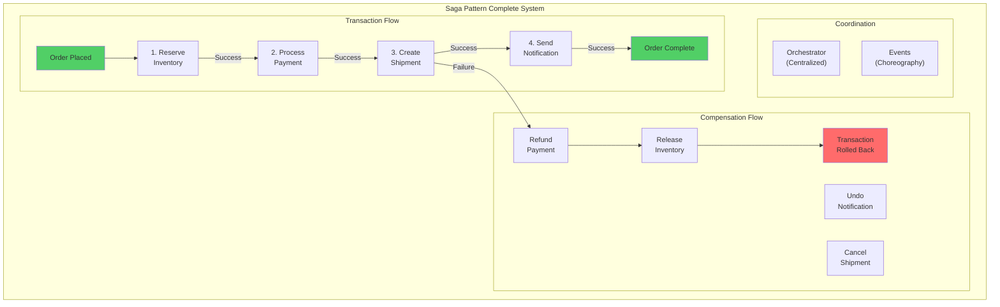
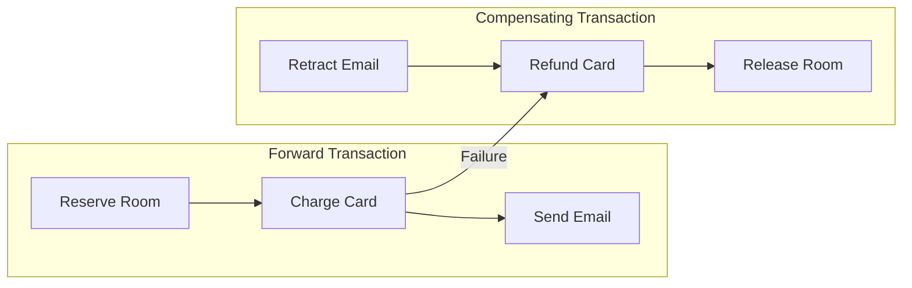
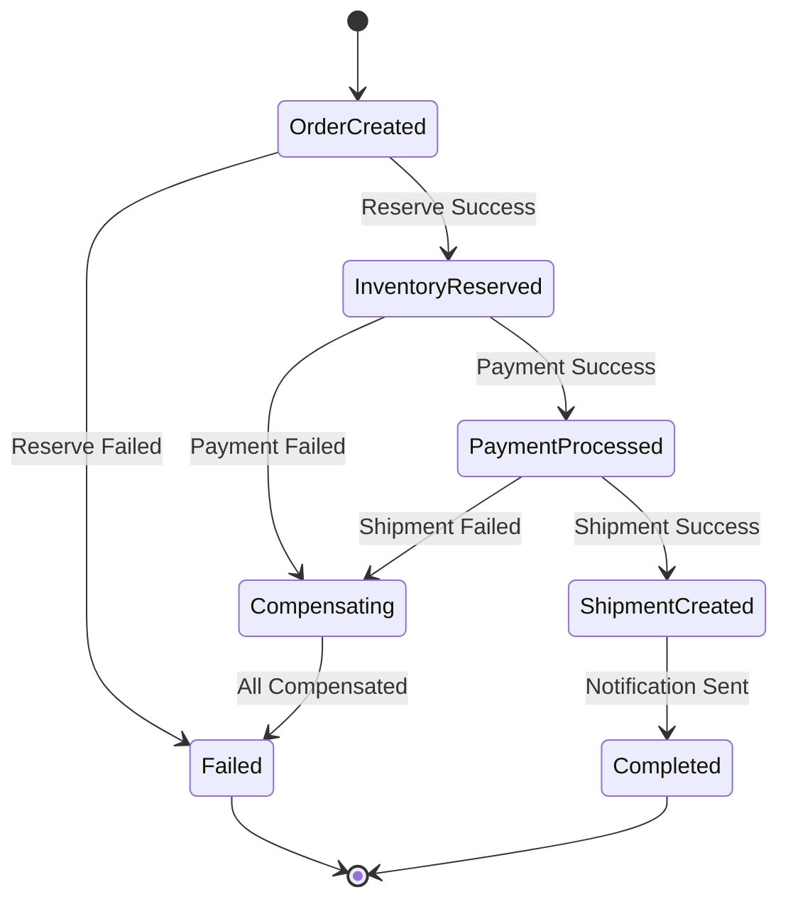

## Fundamental Law Connections

### Compensation Correlation (Law 1)
Saga compensations can create correlated failures:
- **Cascade Rollbacks**: One compensation failure affects entire saga
- **Resource Contention**: Multiple compensations compete for same resources
- **Compensation Storms**: Mass rollbacks during system issues
- **Shared Dependencies**: Payment gateway used by multiple compensations
- **Mitigation**: Idempotent compensations, retry with backoff, compensation isolation

### Asynchronous Coordination (Law 2)
Sagas are inherently asynchronous with complex timing:
- **Transaction Duration**: Minutes to hours for complete saga
- **Eventual Consistency Window**: Inconsistent state during execution
- **Timeout Management**: Each step needs appropriate timeouts
- **Message Ordering**: Out-of-order events in choreography
- **Clock Synchronization**: Distributed timeout coordination

### Emergent Complexity (Law 4)
- **Partial State Explosion**: 2^n possible states for n steps
- **Circular Dependencies**: Compensation A needs B, B needs A
- **Deadlock Scenarios**: Competing sagas lock resources
- **Orphaned Transactions**: Lost messages leave hanging state

### State Distribution (Law 5)
- **Transaction Context**: State scattered across services
- **Orchestrator State**: Central state in orchestration pattern
- **Event Log**: Choreography state in event stream
- **Consistency Challenges**: No global view of transaction

### Compensation Costs (Law 7)
- **Business Costs**: Refund fees, shipping cancellations
- **Technical Costs**: Additional API calls, storage for state
- **Time Costs**: Compensation can take longer than forward path
- **Opportunity Costs**: Resources locked during saga execution

## Case Studies with Law Applications

### Uber Trip Booking
**Laws Demonstrated**:
- **Law 1**: Driver assignment rollback can cascade to payment
- **Law 2**: Multi-minute saga for driver matching and route planning
- **Law 7**: Cancellation fees as compensation cost

**Key Insights**:
- Choreography for driver matching flexibility
- Compensation includes driver notification
- Partial completion allowed (trip without receipt)

### Amazon Order Processing
**Laws Demonstrated**:
- **Law 1**: Inventory reservation rollback affects multiple orders
- **Law 4**: Complex state with pre-orders and backorders
- **Law 5**: Order state distributed across 50+ services

**Key Insights**:
- Orchestration for complex order workflows
- Compensations prioritized by customer tier
- Some compensations deferred to off-peak

### Booking.com Reservation
**Laws Demonstrated**:
- **Law 2**: 30-second timeout for hotel confirmation
- **Law 7**: Hotel cancellation penalties as compensation cost
- **Law 1**: Payment and hotel systems correlation

**Key Insights**:
- Hybrid orchestration/choreography approach
- Provisional bookings to handle slow confirmations
- Compensation strategies vary by cancellation policy

## The Complete Blueprint

The Saga pattern manages distributed transactions across multiple services by breaking them into a sequence of local transactions, where each service performs its own local transaction and publishes events to trigger the next step. Unlike traditional two-phase commit which locks resources and doesn't scale, sagas maintain eventual consistency through a choreographed or orchestrated sequence of operations with explicit compensation logic for rollback scenarios. When a step in the saga fails, compensating transactions are executed in reverse order to undo the changes made by preceding steps, ensuring the system returns to a consistent state. This pattern is essential for complex business transactions that span multiple services - like an e-commerce order that involves inventory, payment, shipping, and notification services - where each step must complete successfully or the entire transaction must be rolled back. Sagas excel in microservices architectures where you need transactional guarantees without the coupling and performance penalties of distributed locks.



### What You'll Master

!!! success "By understanding the Saga pattern, you'll be able to:"
    - **Manage distributed transactions** - Coordinate multi-service operations without distributed locks
    - **Implement compensations** - Design rollback strategies for complex business flows
    - **Choose coordination styles** - Select between orchestration and choreography approaches
    - **Maintain consistency** - Achieve eventual consistency across service boundaries
    - **Handle partial failures** - Gracefully recover from failures at any step
    - **Scale transactions** - Process high-volume transactions without blocking

# Saga Pattern

## Core Concepts

### Orchestration vs Choreography

| Aspect | Orchestration | Choreography |
|--------|--------------|--------------|
| **Control** | Centralized orchestrator | Distributed via events |
| **Coupling** | Services coupled to orchestrator | Services loosely coupled |
| **Complexity** | Simple flow logic | Complex event chains |
| **Debugging** | Easy to trace | Harder to follow |
| **Scaling** | Orchestrator can bottleneck | Naturally distributed |

### Compensation Strategies



## Implementation Patterns

### Orchestrated Saga

```python
class OrderSagaOrchestrator:
    def __init__(self):
        self.steps = [
            (self.reserve_inventory, self.release_inventory),
            (self.process_payment, self.refund_payment),
            (self.create_shipment, self.cancel_shipment),
            (self.send_notification, self.retract_notification)
        ]
    
    async def execute(self, order):
        completed_steps = []
        
        try:
            for step, compensate in self.steps:
                result = await step(order)
                completed_steps.append((compensate, result))
                
        except Exception as e:
            # Compensate in reverse order
            for compensate, result in reversed(completed_steps):
                await compensate(result)
            raise SagaFailedException(f"Failed at step {len(completed_steps)}")
```

### Choreographed Saga

```python
class InventoryService:
    async def handle_order_created(self, event):
        try:
            await self.reserve_inventory(event.order_id, event.items)
            await self.publish("InventoryReserved", {
                "order_id": event.order_id,
                "reservation_id": reservation_id
            })
        except InsufficientInventory:
            await self.publish("InventoryReservationFailed", {
                "order_id": event.order_id,
                "reason": "Insufficient inventory"
            })

class PaymentService:
    async def handle_inventory_reserved(self, event):
        try:
            await self.process_payment(event.order_id)
            await self.publish("PaymentProcessed", {
                "order_id": event.order_id,
                "transaction_id": transaction_id
            })
        except PaymentFailed:
            # Trigger compensation
            await self.publish("PaymentFailed", {
                "order_id": event.order_id,
                "reservation_id": event.reservation_id
            })
```

## Failure Handling

### State Machine Approach



## Production Considerations

### Idempotency Requirements

Each step must be idempotent to handle:
- Retries after network failures
- Duplicate events in choreography
- Reprocessing after crashes

### Timeout Management

```yaml
saga_timeouts:
  reserve_inventory: 5s
  process_payment: 30s
  create_shipment: 10s
  send_notification: 2s
  total_saga: 60s
```

### Monitoring & Observability

Key metrics to track:
- Saga completion rate
- Average completion time
- Compensation trigger rate
- Step failure distribution

## Common Patterns

### Pivot Transaction

Some operations can't be compensated (e.g., sending email). Place these at the end:

```
Compensatable → Compensatable → Pivot → Retriable Only
```

### Semantic Lock

Reserve resources with expiration to prevent indefinite locks:

```python
await inventory.reserve(
    order_id=order.id,
    items=order.items,
    expires_in=timedelta(minutes=15)
)
```

## Real-World Examples

| Company | Use Case | Scale | Approach |
|---------|----------|-------|----------|
| **Uber** | Trip booking | 20M trips/day | Choreographed |
| **Amazon** | Order processing | 300+ orders/sec | Orchestrated |
| **Booking.com** | Hotel reservation | 1.5M bookings/day | Hybrid |
| **Airbnb** | Booking flow | 2M+ nights/day | Choreographed |

## Anti-Patterns to Avoid

1. **Synchronous Chains** - Don't chain synchronous calls
2. **Missing Timeouts** - Always set saga timeout
3. **Non-idempotent Steps** - Ensure all operations are idempotent
4. **Implicit Compensations** - Make rollback logic explicit
5. **Circular Dependencies** - Avoid circular event chains

!!! experiment "💡 Quick Thought Experiment: Dependency Elimination Strategy"
    **Apply the 5-step framework to eliminate distributed transaction dependencies:**
    
    1. **INVENTORY**: Map all atomic operations spanning multiple services (payment + inventory + shipping + notifications)
    2. **PRIORITIZE**: Rank by business criticality × failure complexity (order processing = highest, user preferences = lowest)
    3. **ISOLATE**: Decompose into autonomous steps with explicit compensations, timeout handling, and retry logic
    4. **MIGRATE**: Implement choreographed sagas for loose coupling, orchestrated sagas for complex workflows
    5. **MONITOR**: Track saga completion rates, compensation frequency, step failure patterns, end-to-end latency
    
    **Success Metric**: Achieve transactional independence - when one service is down, other services continue processing with graceful degradation

## Related Patterns

- [Event Sourcing](./event-sourcing.md) - Store saga state as events
- [Outbox Pattern](./outbox.md) - Ensure event publication
- [Two-Phase Commit](../coordination/two-phase-commit.md) - Alternative approach
- [Circuit Breaker](../resilience/circuit-breaker.md) - Protect saga steps
- [Retry Pattern](../resilience/retry-backoff.md) - Handle transient failures

## See Also

- [Eventual Consistency](/pattern-library/data-management/eventual-consistency)
- [Event Streaming](/pattern-library/architecture/event-streaming)
- [Rate Limiting Pattern](/pattern-library/scaling/rate-limiting)