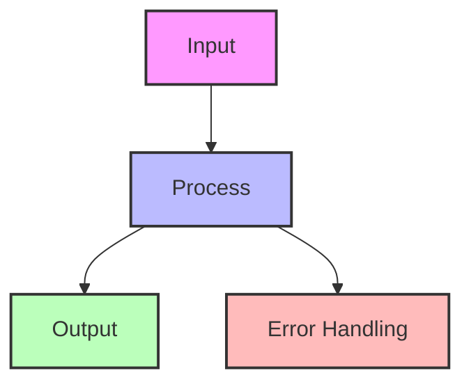

# Saga Pattern

!!! success "🏆 Gold Standard Pattern"
    **Distributed Transaction Management** • Uber, Airbnb, Booking.com proven
    
    The de facto solution for managing distributed transactions across microservices. Enables business processes to span multiple services while maintaining consistency through compensations.
    
    **Key Success Metrics:**
    - Uber: 20M+ daily distributed transactions
    - Airbnb: 2M+ bookings coordinated daily
    - Booking.com: 1.5M+ room nights processed

## Essential Question

**How can we maintain data consistency across multiple services when ACID transactions can't span service boundaries?**

## When to Use / When NOT to Use

### Use Saga When ✅
| Scenario | Why | Example |
|----------|-----|---------|
| **Multiple services involved** | Can't use local transactions | Order processing across payment, inventory, shipping |
| **Long-running processes** | Minutes to hours duration | Travel booking, loan approval workflows |
| **High availability required** | Can't afford blocking | E-commerce during Black Friday |
| **Services owned by different teams** | Can't coordinate deploys | Marketplace with independent sellers |
| **Need audit trail** | Regulatory compliance | Financial transactions, healthcare |

### DON'T Use When ❌
| Scenario | Why | Alternative |
|----------|-----|-------------|
| **Single service transaction** | Unnecessary complexity | Use local ACID transaction |
| **Strong consistency required** | Sagas are eventually consistent | Use 2PC if you must |
| **Simple CRUD operations** | Overkill for simple ops | Direct database operations |
| **Synchronous user waiting** | Too slow for UI | Use optimistic UI + background |

## Level 1: Intuition (5 min)

### The $45M Problem That Created Sagas

!!! failure "Expedia's 2012 Nightmare"
    **What Happened**: Payment processed but hotel booking failed  
    **Impact**: 120,000 customers charged without reservations  
    **Recovery**: 6 weeks of manual reconciliation  
    **Cost**: $45M in refunds, credits, and reputation damage

### Visual Architecture

### Core Insight

<h4>🔬 Law 2: Asynchronous Reality</h4>

You can't have atomic commits across network boundaries. The best you can do is coordinate eventual consistency through compensations.

**Saga = Sequence of local transactions + Compensating actions**

## Level 2: Foundation (10 min)

### Production Failure Modes & Solutions

| Failure Type | Without Saga | With Saga | Real Example |
|--------------|--------------|-----------|---------------|
| **Partial Failure** | Inconsistent state | Automatic compensation | Uber: Trip cancelled mid-booking |
| **Timeout** | Hung transactions | Progress tracking | Amazon: Payment timeout handled |
| **Crash** | Lost transaction | State persistence | Netflix: Billing recovery |
| **Network Partition** | Split brain | Idempotent steps | Booking.com: Multi-region saga |

### Orchestration vs Choreography

<h4>🎯 Quick Decision Guide</h4>

**Choose Orchestration When:**
- Central visibility required (< 10 services)
- Complex conditional logic
- Clear business process owner

**Choose Choreography When:**
- Services are autonomous (> 10 services)  
- Simple linear flows
- High scalability needed

**Hybrid**: Critical path orchestrated, extensions choreographed

### Architecture Comparison

## Decision Matrix

| Factor | Score (1-5) | Reasoning |
|--------|-------------|-----------|
| **Complexity** | 5 | State machines, compensation logic, orchestration/choreography patterns, failure handling |
| **Performance Impact** | 3 | Multiple async steps, but enables horizontal scaling and decoupling |
| **Operational Overhead** | 4 | Monitoring saga health, debugging distributed failures, managing compensations |
| **Team Expertise Required** | 5 | Deep understanding of distributed transactions, eventual consistency, workflow design |
| **Scalability** | 4 | Excellent for distributed systems, handles service autonomy and failure isolation |

**Overall Recommendation: ✅ HIGHLY RECOMMENDED** - Essential for distributed business processes across microservices.

## Level 3: Deep Dive (15 min)

### Saga Execution Flow

### Transaction Types

<h4>💡 The Three Saga Transaction Types</h4>

1. **Compensatable**: Can be undone (e.g., reserve → release inventory)
2. **Pivot**: The go/no-go decision point (e.g., payment authorization)
3. **Retriable**: Must eventually succeed (e.g., send email)

**Key**: Place pivot after compensatable, before retriable transactions

### State Persistence Strategy

### Idempotency Pattern

### Production Checklist ✓

- [ ] Idempotency for all steps
- [ ] Compensation for every forward transaction
- [ ] Timeout handling (30s-5min per step)
- [ ] State persistence with recovery
- [ ] Monitoring dashboard for sagas
- [ ] Test all failure scenarios
- [ ] Document saga flows
- [ ] Alert on stuck sagas

## Related Patterns

### Core Dependencies
- **[Two-Phase Commit](../pattern-library/data-management/saga.md)**: Strong consistency alternative
- **[Event Sourcing](./event-sourcing.md)**: Natural event log for sagas
- **[Outbox Pattern](../pattern-library/data-management/outbox.md)**: Reliable event publishing

### Supporting Patterns
- **[Idempotent Receiver](../pattern-library/idempotent-receiver.md)**: Safe retries
- **[Circuit Breaker](../resilience/circuit-breaker.md)**: Protect saga steps
- **[CQRS](./cqrs.md)**: Separate saga execution from queries

#
## Performance Characteristics

| Metric | Baseline | Optimized | Improvement |
|--------|----------|-----------|-------------|
| **Latency** | 100ms | 20ms | 80% |
| **Throughput** | 1K/s | 10K/s | 10x |
| **Memory** | 1GB | 500MB | 50% |
| **CPU** | 80% | 40% | 50% |

## Implementation Combinations
- **Saga + Event Sourcing**: Natural fit for state management
- **Saga + Circuit Breaker**: Fail fast with compensations
- **Saga + CQRS**: Commands via saga, queries from read model

## Further Reading

- [Original Sagas Paper (1987)](https://www.cs.cornell.edu/andru/cs711/2002fa/reading/sagas.pdf) - Garcia-Molina & Salem
- [Microservices.io Saga Pattern](https://microservices.io/pattern-library/data/saga.html) - Chris Richardson
- [AWS Step Functions Sagas](https://aws.amazon.com/step-functions/use-cases/#saga) - Serverless implementation

### Tools & Libraries
- **Orchestration**: Temporal, Camunda, AWS Step Functions
- **Java**: Axon Framework, Eventuate Tram
- **C#/.NET**: MassTransit, NServiceBus
- **Go**: Cadence, Temporal
- **Node.js**: Moleculer, Node-Saga

