# Saga Pattern

!!! success "🏆 Gold Standard Pattern"
    **Distributed Transaction Management** • Uber, Airbnb, Booking.com proven
    
    The de facto solution for managing distributed transactions across microservices. Enables business processes to span multiple services while maintaining consistency through compensations.
    
    **Key Success Metrics:**
    - Uber: 20M+ daily distributed transactions
    - Airbnb: 2M+ bookings coordinated daily
    - Booking.com: 1.5M+ room nights processed

## Essential Question

**How can we maintain data consistency across multiple services when ACID transactions can't span service boundaries?**

## When to Use / When NOT to Use

### Use Saga When ✅
| Scenario | Why | Example |
|----------|-----|---------|
| **Multiple services involved** | Can't use local transactions | Order processing across payment, inventory, shipping |
| **Long-running processes** | Minutes to hours duration | Travel booking, loan approval workflows |
| **High availability required** | Can't afford blocking | E-commerce during Black Friday |
| **Services owned by different teams** | Can't coordinate deploys | Marketplace with independent sellers |
| **Need audit trail** | Regulatory compliance | Financial transactions, healthcare |

### DON'T Use When ❌
| Scenario | Why | Alternative |
|----------|-----|-------------|
| **Single service transaction** | Unnecessary complexity | Use local ACID transaction |
| **Strong consistency required** | Sagas are eventually consistent | Use 2PC if you must |
| **Simple CRUD operations** | Overkill for simple ops | Direct database operations |
| **Synchronous user waiting** | Too slow for UI | Use optimistic UI + background |

## Level 1: Intuition (5 min)

### The $45M Problem That Created Sagas

!!! failure "Expedia's 2012 Nightmare"
    **What Happened**: Payment processed but hotel booking failed  
    **Impact**: 120,000 customers charged without reservations  
    **Recovery**: 6 weeks of manual reconciliation  
    **Cost**: $45M in refunds, credits, and reputation damage

### Visual Architecture

```mermaid
graph LR
    subgraph "ACID Transaction (Can't Scale)"
        A[BEGIN] --> B[Book Flight]
        B --> C[Book Hotel]
        C --> D[Book Car]
        D --> E[Charge Card]
        E --> F[COMMIT/ROLLBACK]
    end
    
    subgraph "Saga Pattern (Scales Infinitely)"
        S1[Book Flight ✓] -->|Success| S2[Book Hotel ✓]
        S2 -->|Success| S3[Book Car ✗]
        S3 -->|Failure| C1[Cancel Hotel]
        C1 -->|Compensate| C2[Cancel Flight]
    end
```



### Core Insight

<div class="axiom-box">
<h4>🔬 Law 2: Asynchronous Reality</h4>

You can't have atomic commits across network boundaries. The best you can do is coordinate eventual consistency through compensations.

**Saga = Sequence of local transactions + Compensating actions**
</div>

## Level 2: Foundation (10 min)

### Production Failure Modes & Solutions

| Failure Type | Without Saga | With Saga | Real Example |
|--------------|--------------|-----------|---------------|
| **Partial Failure** | Inconsistent state | Automatic compensation | Uber: Trip cancelled mid-booking |
| **Timeout** | Hung transactions | Progress tracking | Amazon: Payment timeout handled |
| **Crash** | Lost transaction | State persistence | Netflix: Billing recovery |
| **Network Partition** | Split brain | Idempotent steps | Booking.com: Multi-region saga |

### Orchestration vs Choreography

<div class="decision-box">
<h4>🎯 Quick Decision Guide</h4>

**Choose Orchestration When:**
- Central visibility required (< 10 services)
- Complex conditional logic
- Clear business process owner

**Choose Choreography When:**
- Services are autonomous (> 10 services)  
- Simple linear flows
- High scalability needed

**Hybrid**: Critical path orchestrated, extensions choreographed
</div>

### Architecture Comparison


## Level 3: Deep Dive (15 min)

### Saga Execution Flow


### Transaction Types

<div class="truth-box">
<h4>💡 The Three Saga Transaction Types</h4>

1. **Compensatable**: Can be undone (e.g., reserve → release inventory)
2. **Pivot**: The go/no-go decision point (e.g., payment authorization)
3. **Retriable**: Must eventually succeed (e.g., send email)

**Key**: Place pivot after compensatable, before retriable transactions
</div>

### State Persistence Strategy

```sql
-- Production schema from Uber
CREATE TABLE trip_sagas (
    saga_id UUID PRIMARY KEY,
    trip_id UUID NOT NULL,
    status VARCHAR(50) NOT NULL, -- RUNNING, COMPLETED, COMPENSATING, FAILED
    current_step INTEGER NOT NULL,
    saga_data JSONB NOT NULL,
    created_at TIMESTAMP DEFAULT NOW(),
    expires_at TIMESTAMP NOT NULL,
    
    INDEX idx_status_expires (status, expires_at) WHERE status = 'RUNNING'
);

CREATE TABLE saga_execution_log (
    saga_id UUID NOT NULL,
    step_name VARCHAR(100) NOT NULL,
    status VARCHAR(50) NOT NULL,
    idempotency_key VARCHAR(255) UNIQUE,
    request_payload JSONB,
    response_payload JSONB,
    error_details JSONB,
    started_at TIMESTAMP DEFAULT NOW()
);
```

### Idempotent Operations

```python
class IdempotentPaymentService:
    """Production pattern from Stripe - 100M+ payments/day"""
    
    async def charge(self, request: PaymentRequest) -> PaymentResult:
        idempotency_key = f"{request.trip_id}:{request.step}:{request.amount}"
        
        # Check cache first (Redis, 100ms timeout)
        cached = await self.cache.get(idempotency_key)
        if cached:
            return PaymentResult.from_cache(cached)
        
        # Acquire distributed lock
        lock = await self.lock_manager.acquire(
            key=f"payment_lock:{idempotency_key}",
            ttl=30
        )
        
        if not lock:
            await asyncio.sleep(0.1)
            return await self.charge(request)  # Retry
        
        try:
            # Process payment
            result = await self._process_with_stripe(request)
            
            # Store result atomically
            await self.db.save_payment(idempotency_key, result)
            await self.cache.set(idempotency_key, result, ttl=3600)
            
            return result
        finally:
            await lock.release()
```

## Level 4: Expert (20 min)

### Advanced Patterns

| Pattern | When to Use | Implementation |
|---------|-------------|----------------|
| **Parallel Saga** | Independent steps | Execute services concurrently |
| **Composite Saga** | Reusable workflows | Nest sagas within sagas |
| **Routing Slip** | Dynamic flow | Saga carries execution plan |
| **Saga Versioning** | Live updates | Support multiple saga versions |

### Production Metrics

```yaml
# Critical saga metrics
metrics:
  saga_duration:
    description: Total execution time
    alert: p99 > 30s
    
  saga_success_rate:
    description: Percentage successful
    alert: < 95%
    
  compensation_rate:
    description: Sagas requiring rollback
    alert: > 10%
    
  stuck_sagas:
    description: Not progressing
    alert: > 10
```

### Common Pitfalls & Solutions

| Pitfall | Impact | Solution |
|---------|--------|----------|
| **Non-idempotent steps** | Double charges | Use idempotency keys |
| **Missing compensations** | Inconsistent state | Test all failure paths |
| **Infinite retries** | Resource exhaustion | Set max attempts + timeout |
| **Lost saga state** | Abandoned transactions | Durable state + recovery |

## Level 5: Mastery (30 min)

### Case Study: Uber's Trip Booking


**Architecture Decisions**:
- Orchestration for trip creation (consistency critical)
- Choreography for real-time updates (scalability critical)
- Geographic sharding of orchestrators
- Optimistic driver locking

**Results**: <500ms latency, 99.7% success, 2.3% compensations

### Economic Analysis

```python
def calculate_saga_roi(transactions_per_day, services, failure_rate):
    """ROI for implementing Saga pattern"""
    
    # Without saga: manual resolution costs
    manual_cost = transactions_per_day * failure_rate * 10  # $10/incident
    
    # With saga: automated recovery
    saga_cost = transactions_per_day * failure_rate * 0.1 * 0.1  # 90% auto-recovery
    
    monthly_savings = (manual_cost - saga_cost) * 30
    implementation_cost = services * 8000
    
    return {
        'monthly_savings': monthly_savings,
        'payback_months': implementation_cost / monthly_savings,
        'break_even': services >= 3 and failure_rate > 0.01
    }
```

## Quick Reference

### Decision Matrix


### Configuration Template

```yaml
# Production saga configuration
saga:
  orchestrator:
    type: "centralized"
    persistence: "postgresql"
    state_timeout: 30m
  
  execution:
    max_retries: 3
    retry_delay: "exponential"
    parallel_steps: true
    max_concurrent: 100
  
  compensation:
    strategy: "immediate"
    timeout: 5m
    max_attempts: 3
  
  monitoring:
    stuck_check_interval: 1m
    trace_sampling: 0.1
```

### Production Checklist ✓

- [ ] Idempotency for all steps
- [ ] Compensation for every forward transaction
- [ ] Timeout handling (30s-5min per step)
- [ ] State persistence with recovery
- [ ] Monitoring dashboard for sagas
- [ ] Test all failure scenarios
- [ ] Document saga flows
- [ ] Alert on stuck sagas

## Related Patterns

### Core Dependencies
- **[Two-Phase Commit](../patterns/archive/two-phase-commit.md)**: Strong consistency alternative
- **[Event Sourcing](./event-sourcing.md)**: Natural event log for sagas
- **[Outbox Pattern](../patterns/outbox.md)**: Reliable event publishing

### Supporting Patterns
- **[Idempotent Receiver](../patterns/idempotent-receiver.md)**: Safe retries
- **[Circuit Breaker](../resilience/circuit-breaker.md)**: Protect saga steps
- **[CQRS](./cqrs.md)**: Separate saga execution from queries

### Implementation Combinations
- **Saga + Event Sourcing**: Natural fit for state management
- **Saga + Circuit Breaker**: Fail fast with compensations
- **Saga + CQRS**: Commands via saga, queries from read model

## Further Reading

- [Original Sagas Paper (1987)](https://www.cs.cornell.edu/andru/cs711/2002fa/reading/sagas.pdf) - Garcia-Molina & Salem
- [Microservices.io Saga Pattern](https://microservices.io/patterns/data/saga.html) - Chris Richardson
- [AWS Step Functions Sagas](https://aws.amazon.com/step-functions/use-cases/#saga) - Serverless implementation

### Tools & Libraries
- **Orchestration**: Temporal, Camunda, AWS Step Functions
- **Java**: Axon Framework, Eventuate Tram
- **C#/.NET**: MassTransit, NServiceBus
- **Go**: Cadence, Temporal
- **Node.js**: Moleculer, Node-Saga