# Saga Pattern

!!! success "🏆 Gold Standard Pattern"
    **Distributed Transaction Management** • Uber, Airbnb, Booking.com proven
    
    The de facto solution for managing distributed transactions across microservices. Enables business processes to span multiple services while maintaining consistency through compensations.
    
    **Key Success Metrics:**
    - Uber: 20M+ daily distributed transactions
    - Airbnb: 2M+ bookings coordinated daily
    - Booking.com: 1.5M+ room nights processed

## Essential Question

**How can we maintain data consistency across multiple services when ACID transactions can't span service boundaries?**

## When to Use / When NOT to Use

### Use Saga When ✅
| Scenario | Why | Example |
|----------|-----|---------|
| **Multiple services involved** | Can't use local transactions | Order processing across payment, inventory, shipping |
| **Long-running processes** | Minutes to hours duration | Travel booking, loan approval workflows |
| **High availability required** | Can't afford blocking | E-commerce during Black Friday |
| **Services owned by different teams** | Can't coordinate deploys | Marketplace with independent sellers |
| **Need audit trail** | Regulatory compliance | Financial transactions, healthcare |

### DON'T Use When ❌
| Scenario | Why | Alternative |
|----------|-----|-------------|
| **Single service transaction** | Unnecessary complexity | Use local ACID transaction |
| **Strong consistency required** | Sagas are eventually consistent | Use 2PC if you must |
| **Simple CRUD operations** | Overkill for simple ops | Direct database operations |
| **Synchronous user waiting** | Too slow for UI | Use optimistic UI + background |

## Level 1: Intuition (5 min)

### The $45M Problem That Created Sagas

!!! failure "Expedia's 2012 Nightmare"
    **What Happened**: Payment processed but hotel booking failed  
    **Impact**: 120,000 customers charged without reservations  
    **Recovery**: 6 weeks of manual reconciliation  
    **Cost**: $45M in refunds, credits, and reputation damage

### Visual Architecture

```mermaid
graph TB
    subgraph "Local Transaction Problem"
        A1[Service A: Debit Account] --> B1[Service B: Book Flight]
        B1 --> C1[Service C: Reserve Hotel]
        C1 --> D1[Service D: Send Confirmation]
        
        B1 -.-> X1[❌ Flight Booking Fails]
        X1 -.-> Y1[💰 $500 Charged, No Booking]
        
        style X1 fill:#ffebee,stroke:#d32f2f
        style Y1 fill:#ffebee,stroke:#d32f2f
    end
    
    subgraph "Saga Solution"
        A2["T1: Debit Account<br/>💡 +Compensate: Credit"]
        B2["T2: Book Flight<br/>💡 +Compensate: Cancel"]
        C2["T3: Reserve Hotel<br/>💡 +Compensate: Release"]
        D2["T4: Send Confirmation<br/>💡 Retriable"]
        
        A2 --> B2
        B2 --> C2
        C2 --> D2
        
        B2 -.-> F2[❌ Flight Fails]
        F2 -.-> G2[🔄 Compensate: Credit Account]
        G2 -.-> H2[✅ Consistent State]
        
        style A2 fill:#e8f5e8,stroke:#2e7d32
        style B2 fill:#e8f5e8,stroke:#2e7d32
        style C2 fill:#e8f5e8,stroke:#2e7d32
        style D2 fill:#e8f5e8,stroke:#2e7d32
        style F2 fill:#fff3e0,stroke:#f57c00
        style G2 fill:#e3f2fd,stroke:#1976d2
        style H2 fill:#e8f5e8,stroke:#2e7d32
    end
```



### Core Insight

<div class="axiom-box">
<h4>🔬 Law 2: Asynchronous Reality</h4>

You can't have atomic commits across network boundaries. The best you can do is coordinate eventual consistency through compensations.

**Saga = Sequence of local transactions + Compensating actions**
</div>

## Level 2: Foundation (10 min)

### Production Failure Modes & Solutions

| Failure Type | Without Saga | With Saga | Real Example |
|--------------|--------------|-----------|---------------|
| **Partial Failure** | Inconsistent state | Automatic compensation | Uber: Trip cancelled mid-booking |
| **Timeout** | Hung transactions | Progress tracking | Amazon: Payment timeout handled |
| **Crash** | Lost transaction | State persistence | Netflix: Billing recovery |
| **Network Partition** | Split brain | Idempotent steps | Booking.com: Multi-region saga |

### Orchestration vs Choreography

<div class="decision-box">
<h4>🎯 Quick Decision Guide</h4>

**Choose Orchestration When:**
- Central visibility required (< 10 services)
- Complex conditional logic
- Clear business process owner

**Choose Choreography When:**
- Services are autonomous (> 10 services)  
- Simple linear flows
- High scalability needed

**Hybrid**: Critical path orchestrated, extensions choreographed
</div>

### Orchestration vs Choreography Deep Comparison


### Architecture Pattern Selection Matrix

| Criteria | Orchestration | Choreography | Hybrid | Best Choice |
|----------|---------------|--------------|--------|--------------|
| **Visibility & Monitoring** | ✅ Centralized view | ❌ Distributed state | ⚡ Critical path visible | **Complex workflows** |
| **Coupling** | ❌ Central dependency | ✅ Loose coupling | ⚡ Balanced | **Team autonomy** |
| **Failure Handling** | ✅ Central compensation | ❌ Complex rollback | ⚡ Hybrid approach | **Mission critical** |
| **Scalability** | ❌ Orchestrator bottleneck | ✅ No single point | ⚡ Scale by layer | **High throughput** |
| **Testing** | ✅ Single test harness | ❌ Integration complexity | ⚡ Layered testing | **QA efficiency** |
| **Change Management** | ❌ Central coordination | ✅ Independent deploys | ⚡ Isolated changes | **Rapid iteration** |
| **Team Size** | ✅ < 5 services/teams | ✅ > 10 services/teams | ⚡ 5-15 services | **Organizational fit** |

## Decision Matrix

| Factor | Score (1-5) | Reasoning |
|--------|-------------|-----------|
| **Complexity** | 5 | State machines, compensation logic, orchestration/choreography patterns, failure handling |
| **Performance Impact** | 3 | Multiple async steps, but enables horizontal scaling and decoupling |
| **Operational Overhead** | 4 | Monitoring saga health, debugging distributed failures, managing compensations |
| **Team Expertise Required** | 5 | Deep understanding of distributed transactions, eventual consistency, workflow design |
| **Scalability** | 4 | Excellent for distributed systems, handles service autonomy and failure isolation |

**Overall Recommendation: ✅ HIGHLY RECOMMENDED** - Essential for distributed business processes across microservices.

## Level 3: Deep Dive (15 min)

### Saga State Machine Deep Dive


### Distributed Transaction Coordination Flows


### Transaction Types

<div class="truth-box">
<h4>💡 The Three Saga Transaction Types</h4>

1. **Compensatable**: Can be undone (e.g., reserve → release inventory)
2. **Pivot**: The go/no-go decision point (e.g., payment authorization)
3. **Retriable**: Must eventually succeed (e.g., send email)

**Key**: Place pivot after compensatable, before retriable transactions
</div>

### State Persistence Strategy

### Compensation Flow Visualization

```mermaid
flowchart TD
    subgraph "Forward Execution Path"
        F1["T1: Charge Credit Card<br/>💳 $299 Charged<br/>✅ Success"]
        F2["T2: Reserve Flight Seat<br/>✈️ Seat 12A Reserved<br/>✅ Success"]
        F3["T3: Book Hotel Room<br/>🏨 Room 205 Booked<br/>❌ FAILURE"]
        F4["T4: Send Confirmation<br/>📧 Would Send Email<br/>⏸️ Never Reached"]
        
        F1 --> F2
        F2 --> F3
        F3 -.-> F4
        
        style F1 fill:#e8f5e8,stroke:#2e7d32
        style F2 fill:#e8f5e8,stroke:#2e7d32
        style F3 fill:#ffebee,stroke:#d32f2f
        style F4 fill:#f5f5f5,stroke:#9e9e9e,stroke-dasharray: 5 5
    end
    
    subgraph "Compensation Chain"
        C1["❌ Hotel Booking Failed<br/>Reason: No Availability"]
        C2["🔄 Compensate T2<br/>Cancel Flight Reservation<br/>✅ Seat 12A Released"]
        C3["🔄 Compensate T1<br/>Refund Credit Card<br/>✅ $299 Refunded"]
        C4["📧 Send Failure Notification<br/>✅ Customer Notified"]
        
        C1 --> C2
        C2 --> C3
        C3 --> C4
        
        style C1 fill:#ffebee,stroke:#d32f2f
        style C2 fill:#e3f2fd,stroke:#1976d2
        style C3 fill:#e3f2fd,stroke:#1976d2
        style C4 fill:#e8f5e8,stroke:#2e7d32
    end
    
    F3 --> C1
```



### Real-World Failure Scenario: Payment Processing Saga

```mermaid
flowchart LR
    subgraph "Uber Ride Booking Saga - Failure Case"
        U1["1. Validate Rider<br/>✅ Valid Account"]
        U2["2. Estimate Fare<br/>✅ $18.50"]
        U3["3. Find Driver<br/>✅ Driver Found"]
        U4["4. Pre-authorize Payment<br/>✅ $25 Reserved"]
        U5["5. Create Trip<br/>❌ Database Error"]
        U6["6. Notify Driver<br/>⏸️ Skipped"]
        
        UC1["💳 Release Pre-auth<br/>$25 Released"]
        UC2["🚗 Cancel Driver Request<br/>Driver Notified"]
        UC3["📱 Notify Rider<br/>Booking Failed"]
        
        U1 --> U2
        U2 --> U3
        U3 --> U4
        U4 --> U5
        U5 -.-> U6
        
        U5 --> UC1
        UC1 --> UC2
        UC2 --> UC3
        
        style U1 fill:#e8f5e8,stroke:#2e7d32
        style U2 fill:#e8f5e8,stroke:#2e7d32
        style U3 fill:#e8f5e8,stroke:#2e7d32
        style U4 fill:#e8f5e8,stroke:#2e7d32
        style U5 fill:#ffebee,stroke:#d32f2f
        style U6 fill:#f5f5f5,stroke:#9e9e9e
        style UC1 fill:#e3f2fd,stroke:#1976d2
        style UC2 fill:#e3f2fd,stroke:#1976d2
        style UC3 fill:#e8f5e8,stroke:#2e7d32
    end
```



### State Persistence Strategy


### Orchestration vs Choreography Decision Matrix

```mermaid
flowchart TD
    Start(["Need Distributed Transaction?"])
    
    Start --> Q1{"How many services?"}
    
    Q1 -->|"< 5 services"| Q2{"Complex business logic?"}
    Q1 -->|"5-15 services"| Q3{"Team autonomy important?"}
    Q1 -->|"15+ services"| Choreography
    
    Q2 -->|Yes| Q4{"Need central monitoring?"}
    Q2 -->|No| Q5{"Performance critical?"}
    
    Q3 -->|Yes| Hybrid
    Q3 -->|No| Q6{"Frequent changes?"}
    
    Q4 -->|Yes| Orchestration
    Q4 -->|No| Choreography
    
    Q5 -->|Yes| Choreography
    Q5 -->|No| Orchestration
    
    Q6 -->|Yes| Choreography
    Q6 -->|No| Orchestration
    
    Orchestration["🎭 Orchestration<br/>• Central coordinator<br/>• State machine<br/>• Easy monitoring<br/>• Single point control"]
    
    Choreography["💃 Choreography<br/>• Event-driven<br/>• Distributed state<br/>• High scalability<br/>• Service autonomy"]
    
    Hybrid["🎯 Hybrid Approach<br/>• Critical path: Orchestration<br/>• Extensions: Choreography<br/>• Best of both worlds"]
    
    style Orchestration fill:#e1f5fe,stroke:#0277bd
    style Choreography fill:#e8f5e8,stroke:#2e7d32
    style Hybrid fill:#fff3e0,stroke:#f57c00
```



### Performance vs Consistency Trade-off Visualization

```mermaid
quadrantChart
    title Saga Pattern Trade-offs
    x-axis Low Performance --> High Performance
    y-axis Weak Consistency --> Strong Consistency
    
    quadrant-1 High Performance + Strong Consistency
    quadrant-2 Low Performance + Strong Consistency
    quadrant-3 Low Performance + Weak Consistency
    quadrant-4 High Performance + Weak Consistency
    
    2PC: [0.2, 0.9]
    Orchestrated Saga: [0.6, 0.7]
    Choreographed Saga: [0.8, 0.5]
    Event Sourcing Saga: [0.7, 0.6]
    Temporal Saga: [0.5, 0.8]
    Local Transaction: [0.9, 0.95]
    No Transaction: [1.0, 0.1]
```

### Idempotency Pattern Implementation


### Real-World Example: Airbnb Booking Saga

```mermaid
flowchart TD
    subgraph "Airbnb Booking Saga Flow"
        A1["1. Validate Guest<br/>✅ Check ID, Reviews"]
        A2["2. Check Availability<br/>✅ Dates Available"]
        A3["3. Calculate Total<br/>✅ $450 (3 nights)"]
        A4["4. Pre-authorize Payment<br/>✅ Hold $450 on Card"]
        A5["5. Reserve Property<br/>🔄 PIVOT POINT"]
        A6["6. Generate Booking<br/>✅ Booking #BK789"]
        A7["7. Notify Host<br/>📱 Retriable"]
        A8["8. Send Confirmation<br/>📧 Retriable"]
        
        A1 --> A2
        A2 --> A3
        A3 --> A4
        A4 --> A5
        A5 --> A6
        A6 --> A7
        A7 --> A8
        
        subgraph "Compensation Flow"
            AC1["❌ Property Unavailable"]
            AC2["🔄 Release Payment Hold"]
            AC3["📧 Notify Guest"]
            AC4["💳 $0 Charged"]
            
            A5 --> AC1
            AC1 --> AC2
            AC2 --> AC3
            AC3 --> AC4
        end
        
        style A1 fill:#e8f5e8,stroke:#2e7d32
        style A2 fill:#e8f5e8,stroke:#2e7d32
        style A3 fill:#e8f5e8,stroke:#2e7d32
        style A4 fill:#e8f5e8,stroke:#2e7d32
        style A5 fill:#fff3e0,stroke:#f57c00,stroke-width:3px
        style A6 fill:#e8f5e8,stroke:#2e7d32
        style A7 fill:#e3f2fd,stroke:#1976d2
        style A8 fill:#e3f2fd,stroke:#1976d2
        style AC1 fill:#ffebee,stroke:#d32f2f
    end
```


### Production Checklist ✓

- [ ] Idempotency for all steps
- [ ] Compensation for every forward transaction
- [ ] Timeout handling (30s-5min per step)
- [ ] State persistence with recovery
- [ ] Monitoring dashboard for sagas
- [ ] Test all failure scenarios
- [ ] Document saga flows
- [ ] Alert on stuck sagas

## Related Patterns

### Core Dependencies
- **[Two-Phase Commit](....../pattern-library/data-management.md/saga.md)**: Strong consistency alternative
- **[Event Sourcing](./event-sourcing.md)**: Natural event log for sagas
- **[Outbox Pattern](....../pattern-library/data-management.md/outbox.md)**: Reliable event publishing

### Supporting Patterns
- **[Idempotent Receiver](....../pattern-library/idempotent-receiver.md)**: Safe retries
- **[Circuit Breaker](....../pattern-library/resilience.md/circuit-breaker.md)**: Protect saga steps
- **[CQRS](./cqrs.md)**: Separate saga execution from queries

#
## Performance Analysis & Trade-offs

### Orchestration vs Choreography Performance

| Metric | Orchestration | Choreography | Hybrid | Notes |
|--------|---------------|--------------|--------|---------|
| **Latency (P95)** | 250ms | 180ms | 200ms | Choreography wins - no coordinator hops |
| **Throughput** | 5K saga/s | 12K saga/s | 8K saga/s | Event-driven scales better |
| **Memory Usage** | 200MB/1K sagas | 50MB/1K sagas | 120MB/1K sagas | Distributed state uses less memory |
| **Network Calls** | 2N (round trips) | N (one-way) | 1.5N | Orchestration requires ACKs |
| **Failure Detection** | Immediate | 30s average | 15s average | Central coordinator faster |
| **Debugging Complexity** | Low | High | Medium | Single view vs distributed tracing |

### Saga Performance Optimization Techniques

```mermaid
flowchart LR
    subgraph "Optimization Strategies"
        O1["Parallel Execution<br/>🚀 40% faster<br/>Independent steps"]
        O2["Async Compensation<br/>⚡ 60% faster recovery<br/>Background rollback"]
        O3["State Compression<br/>💾 70% memory reduction<br/>Delta snapshots"]
        O4["Batch Operations<br/>📦 5x throughput<br/>Bulk processing"]
        
        style O1 fill:#e8f5e8,stroke:#2e7d32
        style O2 fill:#e3f2fd,stroke:#1976d2
        style O3 fill:#fff3e0,stroke:#f57c00
        style O4 fill:#f3e5f5,stroke:#7b1fa2
    end
    
    subgraph "Real Metrics - Uber Scale"
        U1["20M daily transactions<br/>P99: 500ms<br/>Success Rate: 99.95%"]
        U2["Peak: 50K saga/s<br/>Avg Compensation: 2%<br/>Recovery Time: < 30s"]
        
        style U1 fill:#e1f5fe,stroke:#0277bd
        style U2 fill:#e1f5fe,stroke:#0277bd
    end
```



### Consistency Guarantees Matrix

| Scenario | Local ACID | 2PC | Saga | Event Sourcing | Best Choice |
|----------|------------|-----|------|----------------|-------------|
| **Single Service** | ✅ Strong | ❌ Overkill | ❌ Overkill | ❌ Overkill | **Local ACID** |
| **2-3 Services** | ❌ N/A | ✅ Strong | ⚡ Eventual | ⚡ Eventual | **Depends on requirements** |
| **5+ Services** | ❌ N/A | ❌ Brittle | ✅ Eventual | ✅ Eventual | **Saga or Event Sourcing** |
| **High Availability** | ⚡ Limited | ❌ Blocking | ✅ Non-blocking | ✅ Non-blocking | **Saga** |
| **Audit Requirements** | ⚡ Limited | ⚡ Limited | ✅ Full trail | ✅ Complete log | **Event Sourcing** |
| **Financial Systems** | ✅ ACID | ✅ Strong | ⚠️ Careful design | ✅ Immutable log | **Depends on regulations** |

### Timeout and Retry Strategy Visualization

```mermaid
gantt
    title Saga Step Timeout Management
    dateFormat X
    axisFormat %Ss
    
    section Step 1 - Payment
    Normal Execution     :done, p1, 0, 5s
    Timeout Buffer       :active, p1-timeout, 5s, 30s
    
    section Step 2 - Inventory  
    Wait for Step 1      :p2-wait, 0, 5s
    Normal Execution     :done, p2, 5s, 12s
    Retry Attempt 1      :crit, p2-retry1, 12s, 17s
    Retry Attempt 2      :crit, p2-retry2, 17s, 22s
    Timeout Buffer       :active, p2-timeout, 22s, 35s
    
    section Step 3 - Shipping
    Wait for Step 2      :p3-wait, 0, 22s
    Failed - Start Comp  :crit, p3-fail, 22s, 25s
    
    section Compensation
    Compensate Step 2    :p3-comp2, 25s, 30s
    Compensate Step 1    :p3-comp1, 30s, 35s
```

### Saga Monitoring Dashboard Architecture


## Related Laws

This pattern directly addresses several fundamental distributed systems laws:

- **[Law 2: Asynchronous Reality](../....../core-principles/laws.md/asynchronous-reality/index.md)**: Sagas embrace the asynchronous nature of distributed systems by coordinating long-running processes through eventual consistency rather than blocking operations
- **[Law 3: Emergent Chaos](../....../core-principles/laws.md/emergent-chaos/index.md)**: The compensation mechanism in sagas handles the chaos that emerges when distributed transactions partially fail in unpredictable ways
- **[Law 4: Multidimensional Optimization](../....../core-principles/laws.md/multidimensional-optimization/index.md)**: Sagas represent the trade-off between consistency (eventual) and availability (high) in distributed transaction management
- **[Law 5: Distributed Knowledge](../....../core-principles/laws.md/distributed-knowledge/index.md)**: No single service has complete knowledge of the saga state, requiring coordination protocols to manage distributed transaction state

## Implementation Combinations
- **Saga + Event Sourcing**: Natural fit for state management
- **Saga + Circuit Breaker**: Fail fast with compensations
- **Saga + CQRS**: Commands via saga, queries from read model

## Further Reading

- [Original Sagas Paper (1987)](https://www.cs.cornell.edu/andru/cs711/2002fa/reading/sagas.pdf/index.md) - Garcia-Molina & Salem
- [Microservices.io Saga Pattern](https://microservices.io../pattern-library/data.md/saga.html/index.md) - Chris Richardson
- [AWS Step Functions Sagas](https://aws.amazon.com/step-functions/use-cases/#saga/index.md) - Serverless implementation

### Tools & Libraries
- **Orchestration**: Temporal, Camunda, AWS Step Functions
- **Java**: Axon Framework, Eventuate Tram
- **C#/.NET**: MassTransit, NServiceBus
- **Go**: Cadence, Temporal
- **Node.js**: Moleculer, Node-Saga

