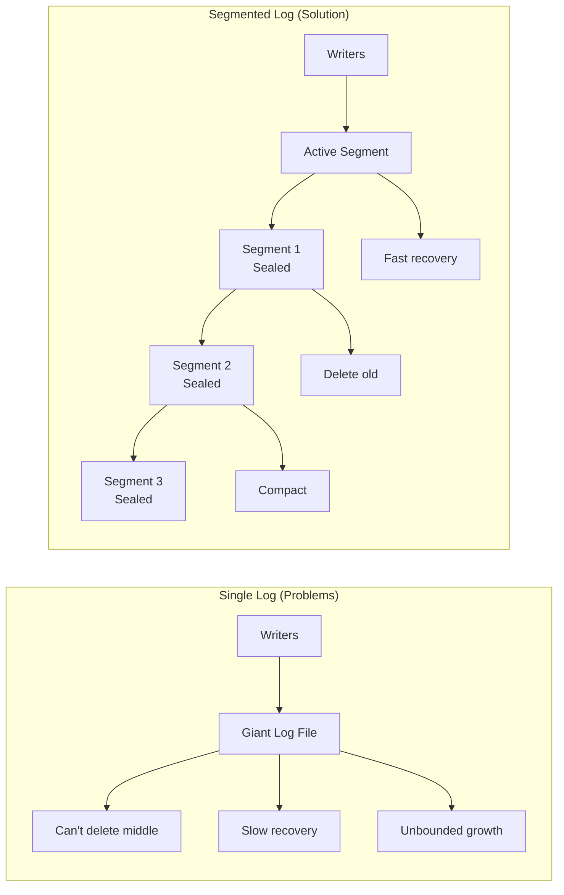
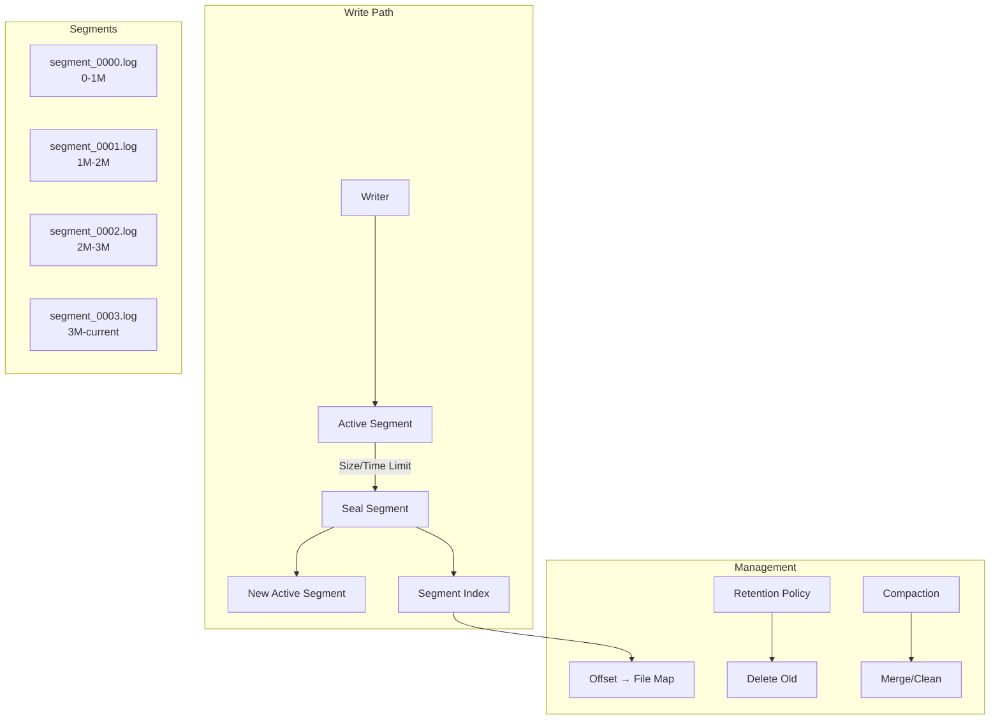
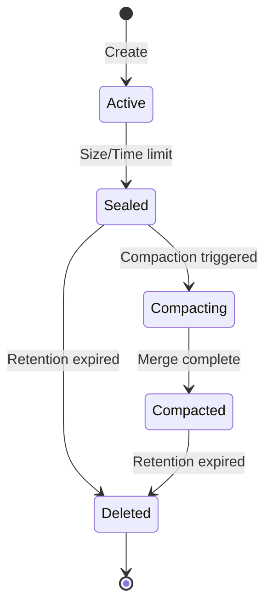
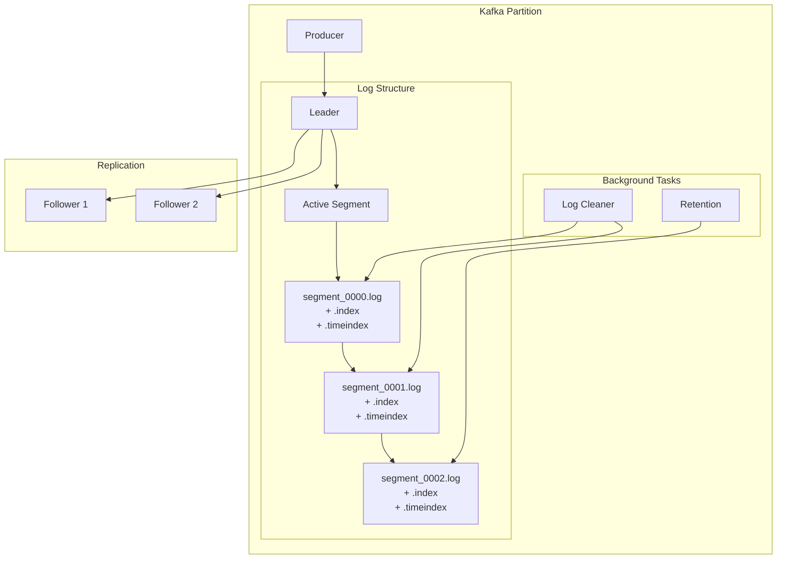
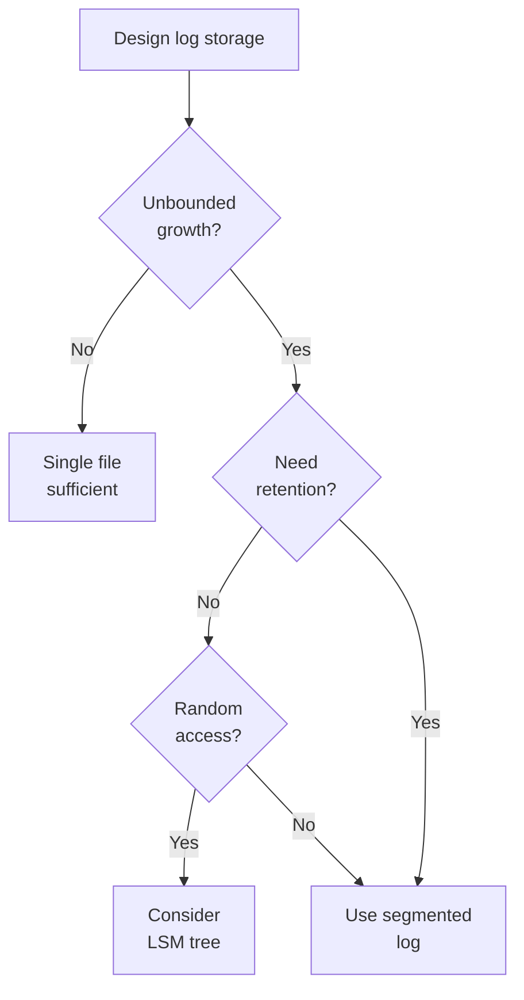

# Segmented Log Pattern

!!! info "🥈 Silver Tier Pattern"
    **Log Scalability Champion** • Kafka, RocksDB, Cassandra proven
    
    Essential pattern for managing continuously growing append-only logs. Enables efficient cleanup, parallel operations, and bounded recovery times by splitting logs into fixed-size segments.
    
    **Key Success Metrics:**
    - Kafka: 7 trillion messages/day across segments
    - RocksDB: Powers Meta's massive databases
    - Cassandra: Petabyte-scale with segment compaction

## Essential Question

**How do we manage infinitely growing append-only logs while enabling efficient cleanup, compaction, and bounded operations?**

## When to Use / When NOT to Use

### Use Segmented Log When ✅

| Scenario | Why | Example |
|----------|-----|---------|
| **Continuous growth** | Can't keep everything in one file | Message queues, event logs |
| **Retention policies** | Delete old data efficiently | "Keep 7 days" - delete old segments |
| **Log compaction needed** | Remove duplicates/tombstones | Key-value stores, Kafka |
| **Parallel operations** | Read/write different segments | Multi-threaded recovery |
| **Bounded recovery** | Limit replay scope | Database WAL recovery |

### DON'T Use When ❌

| Scenario | Why | Alternative |
|----------|-----|-------------|
| **Small logs** | Overhead not justified | Single file |
| **Random access needed** | Sequential segments | B-tree, LSM-tree |
| **Frequent updates** | Append-only design | Update-in-place storage |
| **Simple use case** | Complexity overhead | Basic file append |

## Level 1: Intuition (5 min)

### The Newspaper Archive Analogy

<div class="axiom-box">
<h4>🔬 Law 5: Distributed Knowledge</h4>

Segmented logs recognize that not all data has equal value over time. Recent data is hot, old data is cold, and infinite retention is impossible.

**Key Insight**: Breaking logs into time or size-based chunks enables independent lifecycle management.
</div>

### Visual Architecture



## Level 2: Foundation (10 min)

### Core Architecture



### Key Design Decisions

| Decision | Options | Trade-offs |
|----------|---------|------------|
| **Segment size** | Time-based vs Size-based | Predictability vs Uniformity |
| **Naming scheme** | Sequential vs Timestamp | Ordering vs Time correlation |
| **Index structure** | Memory vs Disk | Speed vs Durability |
| **Compaction strategy** | Online vs Offline | Availability vs Efficiency |

### Segment Lifecycle



## Level 3: Deep Dive (15 min)

### Implementation Example

```python
class SegmentedLog:
    def __init__(self, base_dir, segment_size=100*1024*1024):  # 100MB
        self.base_dir = base_dir
        self.segment_size = segment_size
        self.active_segment = None
        self.sealed_segments = []
        self.index = {}  # offset -> segment mapping
        self._recover()
    
    def append(self, record):
        # Ensure active segment exists
        if not self.active_segment or self.active_segment.size >= self.segment_size:
            self._roll_segment()
        
        # Append to active segment
        offset = self.active_segment.append(record)
        
        # Update index
        self.index[offset] = self.active_segment.id
        
        return offset
    
    def read(self, offset, count):
        # Find starting segment
        segment_id = self.index.get(offset)
        if not segment_id:
            raise ValueError(f"Invalid offset: {offset}")
        
        records = []
        current_segment = self._get_segment(segment_id)
        
        # Read across segments if needed
        while len(records) < count and current_segment:
            batch = current_segment.read_from(offset, count - len(records))
            records.extend(batch)
            
            if len(records) < count:
                current_segment = self._get_next_segment(current_segment)
                offset = current_segment.base_offset if current_segment else None
        
        return records
    
    def _roll_segment(self):
        # Seal current segment
        if self.active_segment:
            self.active_segment.seal()
            self.sealed_segments.append(self.active_segment)
        
        # Create new active segment
        next_id = len(self.sealed_segments)
        base_offset = self.active_segment.next_offset if self.active_segment else 0
        
        self.active_segment = Segment(
            id=next_id,
            base_offset=base_offset,
            file_path=f"{self.base_dir}/segment_{next_id:04d}.log"
        )

class Segment:
    def __init__(self, id, base_offset, file_path):
        self.id = id
        self.base_offset = base_offset
        self.file_path = file_path
        self.file = open(file_path, 'ab+')
        self.size = 0
        self.next_offset = base_offset
        self.index = []  # (offset, position) pairs
    
    def append(self, record):
        # Write record
        position = self.file.tell()
        serialized = self._serialize(record)
        self.file.write(serialized)
        self.file.flush()
        
        # Update metadata
        offset = self.next_offset
        self.index.append((offset, position))
        self.size += len(serialized)
        self.next_offset += 1
        
        return offset
```

### Compaction Strategies

<div class="decision-box">
<h4>🎯 Compaction Approaches</h4>

**Log Compaction** (Kafka-style)
- Keep only latest value per key
- Good for: Key-value stores, config

**Time-based Compaction**
- Merge segments within time window
- Good for: Time-series data

**Size-based Compaction**
- Merge small segments
- Good for: Write-heavy workloads

**Tiered Compaction**
- Different strategies by age
- Good for: Mixed workloads
</div>

### Production Patterns

```yaml
# Kafka-style configuration
log:
  segment:
    bytes: 1073741824  # 1GB
    ms: 604800000      # 7 days
    
  retention:
    bytes: -1          # No limit
    ms: 604800000      # 7 days
    check_interval_ms: 300000
    
  compaction:
    enabled: true
    min_cleanable_ratio: 0.5
    threads: 1
    
  index:
    interval_bytes: 4096
    size_max_bytes: 10485760
```

## Level 4: Expert (20 min)

### Advanced Techniques

| Technique | Purpose | Implementation |
|-----------|---------|----------------|
| **Memory-mapped segments** | Fast random access | mmap() sealed segments |
| **Parallel compaction** | Reduce downtime | Background thread pool |
| **Compression** | Reduce storage | Compress sealed segments |
| **Encryption** | Security | Encrypt at rest |
| **Cloud tiering** | Cost optimization | Old segments to S3 |

### Performance Optimization

```python
class OptimizedSegmentedLog:
    def __init__(self):
        self.write_buffer = []
        self.buffer_size = 0
        self.max_buffer = 1024 * 1024  # 1MB
        
    def append_batch(self, records):
        """Batched writes for better performance"""
        for record in records:
            self.write_buffer.append(record)
            self.buffer_size += len(record)
            
            if self.buffer_size >= self.max_buffer:
                self._flush_buffer()
        
        # Don't leave data in buffer
        if self.write_buffer:
            self._flush_buffer()
    
    def _flush_buffer(self):
        """Write entire buffer in one syscall"""
        if not self.write_buffer:
            return
            
        # Single write for entire batch
        batch_data = b''.join(self._serialize(r) for r in self.write_buffer)
        self.active_segment.file.write(batch_data)
        
        # Update indices
        for record in self.write_buffer:
            self._update_index(record)
        
        # Clear buffer
        self.write_buffer.clear()
        self.buffer_size = 0
```

### Monitoring & Operations

```python
class SegmentMetrics:
    def __init__(self):
        self.metrics = {
            'segments_created': Counter(),
            'segments_deleted': Counter(),
            'segments_compacted': Counter(),
            'active_segment_size': Gauge(),
            'total_segments': Gauge(),
            'oldest_segment_age': Gauge(),
        }
    
    def report_health(self):
        return {
            'fragmentation': self.calculate_fragmentation(),
            'compaction_backlog': self.get_compaction_candidates(),
            'retention_pressure': self.check_retention_pressure(),
            'write_amplification': self.calculate_write_amp()
        }
```

## Level 5: Mastery (30 min)

### Case Study: Apache Kafka's Segment Implementation



**Kafka's Design Decisions**:
- 1GB default segment size
- Separate index files for offset/timestamp lookup
- Memory-mapped index files
- Zero-copy transfer for reads
- Log compaction for keyed topics

**Results at Scale**:
- 7 trillion messages/day at LinkedIn
- Petabyte-scale storage
- Millisecond latency
- Automatic rebalancing

### Economic Analysis

```python
def segment_size_optimizer(
    write_rate_mb_per_sec,
    retention_days,
    recovery_time_sla_minutes
):
    """Calculate optimal segment size"""
    
    # Smaller segments = faster recovery but more files
    max_segment_for_recovery = (recovery_time_sla_minutes * 60) * 100  # 100MB/s read
    
    # Larger segments = fewer files but slower operations
    files_per_day = (write_rate_mb_per_sec * 86400) / segment_size_mb
    total_files = files_per_day * retention_days
    
    # Find balance
    optimal_size = min(
        max_segment_for_recovery,
        1024,  # 1GB max for manageability
        max(128, 86400 / 1000)  # At least 128MB, at most 1000 files/day
    )
    
    return {
        'optimal_segment_mb': optimal_size,
        'files_per_day': files_per_day,
        'recovery_time_minutes': optimal_size / 100 / 60
    }
```

## Quick Reference

### Decision Matrix



### Implementation Checklist ✓

- [ ] Define segment size strategy (time vs size)
- [ ] Implement segment rolling logic
- [ ] Create index for offset lookup
- [ ] Add retention policy enforcement
- [ ] Implement compaction (if needed)
- [ ] Set up monitoring for segments
- [ ] Plan recovery procedures
- [ ] Test segment deletion
- [ ] Document operational procedures

### Configuration Template

```yaml
segmented_log:
  segments:
    size_bytes: 1073741824      # 1GB
    time_ms: 86400000           # 24 hours
    index_interval: 4096        # Bytes between index entries
    
  retention:
    time_ms: 604800000          # 7 days
    size_bytes: 107374182400    # 100GB
    check_interval: 300000      # 5 minutes
    
  compaction:
    enabled: true
    strategy: "delete"          # or "compact"
    min_ratio: 0.5
    threads: 2
    
  performance:
    mmap_indices: true
    zero_copy: true
    compression: "lz4"          # For sealed segments
```

## Related Patterns

### Foundation Patterns
- **[Write-Ahead Log](./wal.md)**: Often implemented as segmented
- **[Append-Only Store](../patterns/append-only.md)**: Base concept
- **[Log Structured Storage](./lsm-tree.md)**: Uses segments internally

### Complementary Patterns
- **[Snapshot](../patterns/snapshot.md)**: Reduce recovery time
- **[Compaction](../patterns/compaction.md)**: Clean up segments
- **[Replication Log](../patterns/replication-log.md)**: Segment-based replication

### Applications
- **[Kafka](../case-studies/kafka.md)**: Canonical implementation
- **[RocksDB](../case-studies/rocksdb.md)**: LSM with segments
- **[Cassandra](../case-studies/cassandra.md)**: SSTables as segments

## Further Reading

- [Kafka Log Implementation](https://kafka.apache.org/documentation/#log)
- [The Log: What every software engineer should know](https://engineering.linkedin.com/distributed-systems/log-what-every-software-engineer-should-know-about-real-time-datas-unifying)
- [RocksDB Architecture](https://github.com/facebook/rocksdb/wiki/RocksDB-Overview)

### Implementation Resources
- [Building a Distributed Log](https://bravenewgeek.com/building-a-distributed-log-from-scratch-part-1-storage-mechanics/)
- [Segment Compaction Strategies](https://www.confluent.io/blog/log-compaction-highlights-in-the-apache-kafka-and-stream-processing-community/)
- [Storage Engine Design](https://www.databass.dev/)