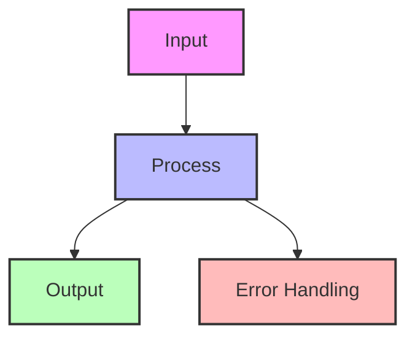

# Segmented Log Pattern

!!! info "🥈 Silver Tier Pattern"
    **Log Scalability Champion** • Kafka, RocksDB, Cassandra proven
    
    Essential pattern for managing continuously growing append-only logs. Enables efficient cleanup, parallel operations, and bounded recovery times by splitting logs into fixed-size segments.
    
    **Key Success Metrics:**
    - Kafka: 7 trillion messages/day across segments
    - RocksDB: Powers Meta's massive databases
    - Cassandra: Petabyte-scale with segment compaction

## Essential Question

**How do we manage infinitely growing append-only logs while enabling efficient cleanup, compaction, and bounded operations?**

## When to Use / When NOT to Use

### Use Segmented Log When ✅

| Scenario | Why | Example |
|----------|-----|---------|
| **Continuous growth** | Can't keep everything in one file | Message queues, event logs |
| **Retention policies** | Delete old data efficiently | "Keep 7 days" - delete old segments |
| **Log compaction needed** | Remove duplicates/tombstones | Key-value stores, Kafka |
| **Parallel operations** | Read/write different segments | Multi-threaded recovery |
| **Bounded recovery** | Limit replay scope | Database WAL recovery |

### DON'T Use When ❌

| Scenario | Why | Alternative |
|----------|-----|-------------|
| **Small logs** | Overhead not justified | Single file |
| **Random access needed** | Sequential segments | B-tree, LSM-tree |
| **Frequent updates** | Append-only design | Update-in-place storage |
| **Simple use case** | Complexity overhead | Basic file append |

## Level 1: Intuition (5 min)

### The Newspaper Archive Analogy

<h4>🔬 Law 5: Distributed Knowledge</h4>

Segmented logs recognize that not all data has equal value over time. Recent data is hot, old data is cold, and infinite retention is impossible.

**Key Insight**: Breaking logs into time or size-based chunks enables independent lifecycle management.

### Visual Architecture

## Level 2: Foundation (10 min)

### Core Architecture

### Key Design Decisions

| Decision | Options | Trade-offs |
|----------|---------|------------|
| **Segment size** | Time-based vs Size-based | Predictability vs Uniformity |
| **Naming scheme** | Sequential vs Timestamp | Ordering vs Time correlation |
| **Index structure** | Memory vs Disk | Speed vs Durability |
| **Compaction strategy** | Online vs Offline | Availability vs Efficiency |

### Segment Lifecycle

**Kafka's Design Decisions**:
- 1GB default segment size
- Separate index files for offset/timestamp lookup
- Memory-mapped index files
- Zero-copy transfer for reads
- Log compaction for keyed topics

**Results at Scale**:
- 7 trillion messages/day at LinkedIn
- Petabyte-scale storage
- Millisecond latency
- Automatic rebalancing

### Economic Analysis

## Quick Reference

### Decision Matrix

## Related Patterns

### Foundation Patterns
- **[Write-Ahead Log](./wal.md)**: Often implemented as segmented
- **[Append-Only Store](../../pattern-library/append-only.md)**: Base concept
- **[Log Structured Storage](./lsm-tree.md)**: Uses segments internally

### Complementary Patterns
- **[Snapshot](../../pattern-library/compaction.md)**: Clean up segments
- **[Replication Log](../../pattern-library/replication-log.md)**: Segment-based replication

### Applications
- **[Kafka](../architects-handbook/case-studies/kafka.md)**: Canonical implementation
- **[RocksDB](../architects-handbook/case-studies/rocksdb.md)**: LSM with segments
- **[Cassandra](../architects-handbook/case-studies/cassandra.md)**: SSTables as segments

## Further Reading

- [Kafka Log Implementation](https://kafka.apache.org/documentation/#log/index.md)
- [The Log: What every software engineer should know](https://engineering.linkedin.com/distributed-systems/log-what-every-software-engineer-should-know-about-real-time-datas-unifying/index.md)
- [RocksDB Architecture](https://github.com/facebook/rocksdb/wiki/RocksDB-Overview/index.md)

### Implementation Resources
- [Building a Distributed Log](https://bravenewgeek.com/building-a-distributed-log-from-scratch-part-1-storage-mechanics/index.md)
- [Segment Compaction Strategies](https://www.confluent.io/blog/log-compaction-highlights-in-the-apache-kafka-and-stream-processing-community/index.md)
- [Storage Engine Design](https://www.databass.dev/index.md)

