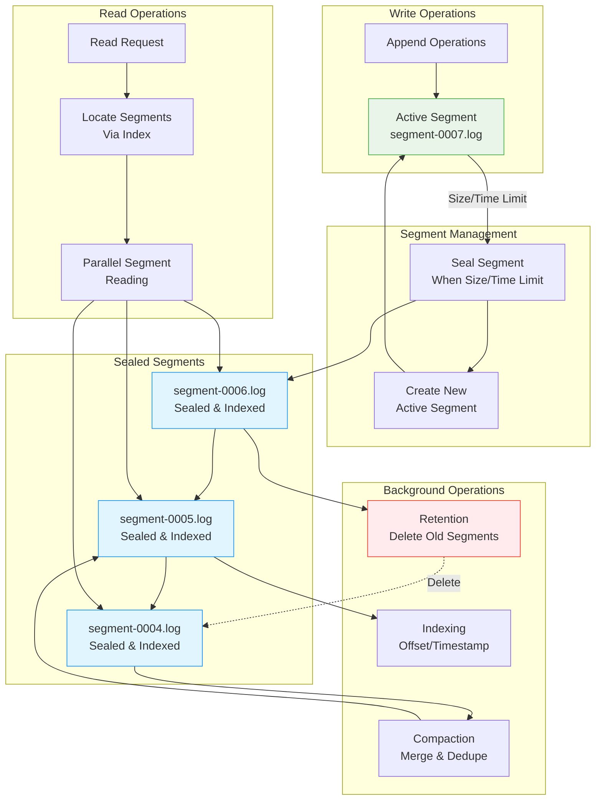
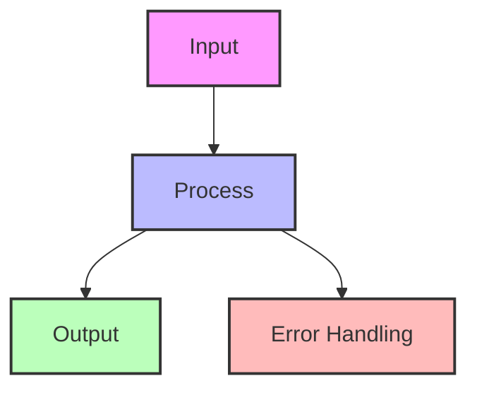

## The Complete Blueprint

Segmented log is a foundational pattern that partitions continuously growing append-only logs into fixed-size, manageable segments to enable efficient storage operations, data cleanup, and system recovery. Instead of maintaining one enormous log file that grows indefinitely, this pattern divides the log into discrete segments based on size thresholds (typically 1GB) or time boundaries, where each segment is an immutable, self-contained unit that can be independently compacted, replicated, or deleted. The pattern transforms the complex problem of managing infinite log growth into the simpler challenge of coordinating finite segment lifecycles. When a segment reaches its size limit, it's sealed and a new active segment begins accepting writes, while sealed segments can undergo background operations like compression, indexing, or retention-based deletion without affecting ongoing writes. This segmentation enables parallel processing where different threads can read from different segments simultaneously, bounded recovery times since replay only needs to scan a limited number of recent segments, and efficient cleanup where old segments are simply deleted rather than requiring complex in-place modifications.

### What You'll Master

By implementing segmented logs, you'll achieve **bounded log operations** where recovery time and storage overhead are predictable regardless of total system age, **parallel processing capabilities** that enable concurrent operations across different segments without blocking, **efficient data lifecycle management** through segment-based retention and compaction policies, **horizontal scalability** where segments can be distributed across different storage nodes, and **operational simplicity** where complex log management reduces to straightforward segment coordination. You'll master the art of transforming infinite growth problems into finite, manageable units while maintaining the append-only semantics that make logs so powerful for distributed systems.

# Segmented Log Pattern

!!! info "🥈 Silver Tier Pattern"
    **Log Scalability Champion** • Kafka, RocksDB, Cassandra proven
    
    Essential pattern for managing continuously growing append-only logs. Enables efficient cleanup, parallel operations, and bounded recovery times by splitting logs into fixed-size segments.
    
    **Key Success Metrics:**
    - Kafka: 7 trillion messages/day across segments
    - RocksDB: Powers Meta's massive databases
    - Cassandra: Petabyte-scale with segment compaction

## Essential Question

**How do we manage infinitely growing append-only logs while enabling efficient cleanup, compaction, and bounded operations?**

## When to Use / When NOT to Use

### Use Segmented Log When ✅

| Scenario | Why | Example |
|----------|-----|---------|
| **Continuous growth** | Can't keep everything in one file | Message queues, event logs |
| **Retention policies** | Delete old data efficiently | "Keep 7 days" - delete old segments |
| **Log compaction needed** | Remove duplicates/tombstones | Key-value stores, Kafka |
| **Parallel operations** | Read/write different segments | Multi-threaded recovery |
| **Bounded recovery** | Limit replay scope | Database WAL recovery |

### DON'T Use When ❌

| Scenario | Why | Alternative |
|----------|-----|-------------|
| **Small logs** | Overhead not justified | Single file |
| **Random access needed** | Sequential segments | B-tree, LSM-tree |
| **Frequent updates** | Append-only design | Update-in-place storage |
| **Simple use case** | Complexity overhead | Basic file append |

## Level 1: Intuition (5 min)

### The Newspaper Archive Analogy

<h4>🔬 Law 5: Distributed Knowledge</h4>

Segmented logs recognize that not all data has equal value over time. Recent data is hot, old data is cold, and infinite retention is impossible.

**Key Insight**: Breaking logs into time or size-based chunks enables independent lifecycle management.

### Visual Architecture

## Level 2: Foundation (10 min)

### Core Architecture

### Key Design Decisions

| Decision | Options | Trade-offs |
|----------|---------|------------|
| **Segment size** | Time-based vs Size-based | Predictability vs Uniformity |
| **Naming scheme** | Sequential vs Timestamp | Ordering vs Time correlation |
| **Index structure** | Memory vs Disk | Speed vs Durability |
| **Compaction strategy** | Online vs Offline | Availability vs Efficiency |

### Segment Lifecycle

**Kafka's Design Decisions**:
- 1GB default segment size
- Separate index files for offset/timestamp lookup
- Memory-mapped index files
- Zero-copy transfer for reads
- Log compaction for keyed topics

**Results at Scale**:
- 7 trillion messages/day at LinkedIn
- Petabyte-scale storage
- Millisecond latency
- Automatic rebalancing

### Economic Analysis

## Quick Reference

### Decision Matrix

## Related Patterns

### Foundation Patterns
- **[Write-Ahead Log](./wal.md)**: Often implemented as segmented
- **[Append-Only Store](../../pattern-library/append-only.md)**: Base concept
- **[Log Structured Storage](./lsm-tree.md)**: Uses segments internally

### Complementary Patterns
- **[Snapshot](../../pattern-library/compaction.md)**: Clean up segments
- **[Replication Log](../../pattern-library/replication-log.md)**: Segment-based replication

### Applications
- **<!-- TODO: Add Kafka from Architects Handbook -->**: Canonical implementation
- **<!-- TODO: Add RocksDB from Architects Handbook -->**: LSM with segments
- **<!-- TODO: Add Cassandra from Architects Handbook -->**: SSTables as segments

## Further Reading

- [Kafka Log Implementation](https://kafka.apache.org/documentation/#log.md)
- [The Log: What every software engineer should know](https://engineering.linkedin.com/distributed-systems/log-what-every-software-engineer-should-know-about-real-time-datas-unifying.md)
- [RocksDB Architecture](https://github.com/facebook/rocksdb/wiki/RocksDB-Overview.md)

### Implementation Resources
- [Building a Distributed Log](https://bravenewgeek.com/building-a-distributed-log-from-scratch-part-1-storage-mechanics.md)
- [Segment Compaction Strategies](https://www.confluent.io/blog/log-compaction-highlights-in-the-apache-kafka-and-stream-processing-community.md)
- [Storage Engine Design](https://www.databass.dev.md)

